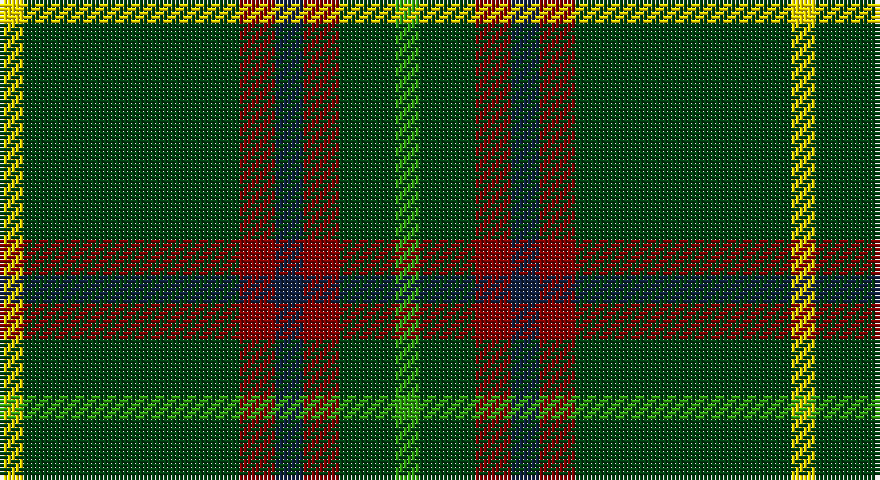

This page is one **sett** — a single exact thread-count. It belongs to the [tartan](/setts/g6dg14r9dt7r9dg54ly6/)
(the same proportion at any scale), whose colour order is pattern [GGRBRGY](/stripes/ggrbrgy/).

Sourced from weddslist.  It is a [7 stripe tartan](/stripes/stripes7/).

Original link http://www.weddslist.com/cgi-bin/tartans/pg.pl?source=sts

## Thread count
Y/6 DG54 DR9 DB7 DR9 DG14 G/6

One full sett is **198 threads**.

## Palette

Palette: <strong>custom</strong>
<table><thead><tr><th>Colour</th><th>Threads</th><th>Shade</th><th>Base</th><th>OKLCh</th></tr></thead><tbody><tr><td>Y/</td><td style="text-align:right;font-variant-numeric:tabular-nums">6</td><td><code style="background-color:#FFE000;">#FFE000</code> <small style="color:#888">#FFE000</small></td><td>Y <code style="background-color:#F2BF00;">#F2BF00</code></td><td><small style="color:#888">oklch(90.5% 0.188 99.1)</small></td></tr><tr><td>DG</td><td style="text-align:right;font-variant-numeric:tabular-nums">54</td><td><code style="background-color:#004010;">#004010</code> <small style="color:#888">#004010</small></td><td>G <code style="background-color:#006100;">#006100</code></td><td><small style="color:#888">oklch(32.3% 0.098 146.3)</small></td></tr><tr><td>DR</td><td style="text-align:right;font-variant-numeric:tabular-nums">9</td><td><code style="background-color:#800000;">#800000</code> <small style="color:#888">#800000</small></td><td>R <code style="background-color:#CC0000;">#CC0000</code></td><td><small style="color:#888">oklch(37.7% 0.155 29.2)</small></td></tr><tr><td>DB</td><td style="text-align:right;font-variant-numeric:tabular-nums">7</td><td><code style="background-color:#102040;">#102040</code> <small style="color:#888">#102040</small></td><td>B <code style="background-color:#2A418A;">#2A418A</code></td><td><small style="color:#888">oklch(24.9% 0.065 262.6)</small></td></tr><tr><td>DR</td><td style="text-align:right;font-variant-numeric:tabular-nums">9</td><td><code style="background-color:#800000;">#800000</code> <small style="color:#888">#800000</small></td><td>R <code style="background-color:#CC0000;">#CC0000</code></td><td><small style="color:#888">oklch(37.7% 0.155 29.2)</small></td></tr><tr><td>DG</td><td style="text-align:right;font-variant-numeric:tabular-nums">14</td><td><code style="background-color:#004010;">#004010</code> <small style="color:#888">#004010</small></td><td>G <code style="background-color:#006100;">#006100</code></td><td><small style="color:#888">oklch(32.3% 0.098 146.3)</small></td></tr><tr><td>G/</td><td style="text-align:right;font-variant-numeric:tabular-nums">6</td><td><code style="background-color:#30A010;">#30A010</code> <small style="color:#888">#30A010</small></td><td>G <code style="background-color:#006100;">#006100</code></td><td><small style="color:#888">oklch(61.9% 0.195 140.5)</small></td></tr></tbody></table>

# Sample pattern

## Nearest tartans

The nearest existing variants by ΔTartan distance, with this tartan at the top so the swatches line up against it.

ΔTartan

Tartan

Sett

—

<a href="/ttd/edit/#slug=g6dg14r9dt7r9dg54ly6">Tulloch Homes</a> <a class="nn-out" href="/variants/s7/g6dg14r9dt7r9dg54ly6/" title="open its dictionary page">↗</a>

1.08

<a href="/ttd/edit/#slug=g6gi14r9dt7r9gi54ly6&amp;base=g6dg14r9dt7r9dg54ly6">Tulloch Homes</a> <a class="nn-out" href="/variants/s7/g6gi14r9dt7r9gi54ly6/" title="open its dictionary page">↗</a>

1.11

<a href="/ttd/edit/#slug=r17db7lo8g58k6~x2&amp;base=g6dg14r9dt7r9dg54ly6">St Johns County Sheriff Office (Cor)</a> <a class="nn-out" href="/variants/s5/r17db7lo8g58k6~x2/" title="open its dictionary page">↗</a>

1.19

<a href="/ttd/edit/#slug=r3g20k20g20lo2g2lo2~x2&amp;base=g6dg14r9dt7r9dg54ly6">Paton (Personal)</a> <a class="nn-out" href="/variants/s7/r3g20k20g20lo2g2lo2~x2/" title="open its dictionary page">↗</a>

1.25

<a href="/ttd/edit/#slug=db2r1g10r1k6g12r2g1r1g3w2~x4&amp;base=g6dg14r9dt7r9dg54ly6">Ronald, Clan (Clan)</a> <a class="nn-out" href="/variants/s11/db2r1g10r1k6g12r2g1r1g3w2~x4/" title="open its dictionary page">↗</a>

1.27

<a href="/ttd/edit/#slug=g10db1w1db1ly1db6g8r1~x8&amp;base=g6dg14r9dt7r9dg54ly6">Marshall Field</a> <a class="nn-out" href="/variants/s8/g10db1w1db1ly1db6g8r1~x8/" title="open its dictionary page">↗</a>

1.37

<a href="/ttd/edit/#slug=dg3w1dg12r6dg3k3g2~x4&amp;base=g6dg14r9dt7r9dg54ly6">Arkansas</a> <a class="nn-out" href="/variants/s7/dg3w1dg12r6dg3k3g2~x4/" title="open its dictionary page">↗</a>

1.40

<a href="/ttd/edit/#slug=k3g2k3g18r2db2lo1~x4&amp;base=g6dg14r9dt7r9dg54ly6">Selvon-Bruce (Personal)</a> <a class="nn-out" href="/variants/s7/k3g2k3g18r2db2lo1~x4/" title="open its dictionary page">↗</a>

1.40

<a href="/ttd/edit/#slug=r17db7lo8dg58k6~x2&amp;base=g6dg14r9dt7r9dg54ly6">St Johns County's Sheriff's Office</a> <a class="nn-out" href="/variants/s5/r17db7lo8dg58k6~x2/" title="open its dictionary page">↗</a>

1.40

<a href="/ttd/edit/#slug=g28r2g28r7lb2r7lb2r7k5dp4lb2~x2&amp;base=g6dg14r9dt7r9dg54ly6">Hynde (Sir John)</a> <a class="nn-out" href="/variants/s11/g28r2g28r7lb2r7lb2r7k5dp4lb2~x2/" title="open its dictionary page">↗</a>

1.43

<a href="/ttd/edit/#slug=k3db10dg25ly2dg2ly3dg2ly2dg25db10w3~x2&amp;base=g6dg14r9dt7r9dg54ly6">William &amp; Mary GALA (Corporate)</a> <a class="nn-out" href="/variants/s11/k3db10dg25ly2dg2ly3dg2ly2dg25db10w3~x2/" title="open its dictionary page">↗</a>

## Neighbour map

Every grey dot is one of 14360 variants placed by the first two principal components of the ΔTartan feature space (44% of its variance). Red is this tartan; blue dots are its nearest — click one to open its page.

<svg viewBox="0 0 640 380" role="img" style="max-width:100%;height:auto;border:1px solid #e0e0e0;border-radius:4px;display:block" xmlns="http://www.w3.org/2000/svg"><image href="/nn/cloud.v1.png" width="640" height="380"/><a href="/variants/s7/g6gi14r9dt7r9gi54ly6/"><circle cx="356.4" cy="192.5" r="4" fill="#3465a4"><title>Tulloch Homes</title></circle></a><a href="/variants/s5/r17db7lo8g58k6~x2/"><circle cx="325.0" cy="200.8" r="4" fill="#3465a4"><title>St Johns County Sheriff Office (Cor)</title></circle></a><a href="/variants/s7/r3g20k20g20lo2g2lo2~x2/"><circle cx="347.3" cy="222.0" r="4" fill="#3465a4"><title>Paton (Personal)</title></circle></a><a href="/variants/s11/db2r1g10r1k6g12r2g1r1g3w2~x4/"><circle cx="323.1" cy="161.2" r="4" fill="#3465a4"><title>Ronald, Clan (Clan)</title></circle></a><a href="/variants/s8/g10db1w1db1ly1db6g8r1~x8/"><circle cx="325.8" cy="186.9" r="4" fill="#3465a4"><title>Marshall Field</title></circle></a><a href="/variants/s7/dg3w1dg12r6dg3k3g2~x4/"><circle cx="294.3" cy="191.2" r="4" fill="#3465a4"><title>Arkansas</title></circle></a><a href="/variants/s7/k3g2k3g18r2db2lo1~x4/"><circle cx="378.6" cy="155.1" r="4" fill="#3465a4"><title>Selvon-Bruce (Personal)</title></circle></a><a href="/variants/s5/r17db7lo8dg58k6~x2/"><circle cx="316.8" cy="198.3" r="4" fill="#3465a4"><title>St Johns County's Sheriff's Office</title></circle></a><a href="/variants/s11/g28r2g28r7lb2r7lb2r7k5dp4lb2~x2/"><circle cx="335.4" cy="153.9" r="4" fill="#3465a4"><title>Hynde (Sir John)</title></circle></a><a href="/variants/s11/k3db10dg25ly2dg2ly3dg2ly2dg25db10w3~x2/"><circle cx="323.1" cy="153.6" r="4" fill="#3465a4"><title>William &amp; Mary GALA (Corporate)</title></circle></a><circle cx="352.0" cy="194.1" r="5" fill="#c00000"/></svg>

ID: /variants/s7/g6dg14r9dt7r9dg54ly6/
