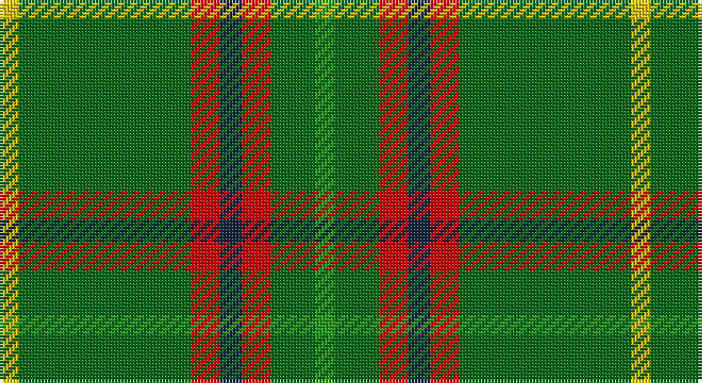

This page is one **sett** — a single exact thread-count. It belongs to the [tartan](/setts/g6gi14r9dt7r9gi54ly6/)
(the same proportion at any scale), whose colour order is pattern [GGRBRGY](/stripes/ggrbrgy/).

Sourced from register-of-tartans.  It is a [7 stripe tartan](/stripes/stripes7/).

Original link https://www.tartanregister.gov.uk/tartanDetails.aspx?ref=4154

2 attestations — the source records this cloth was collapsed from (oldest owns this page)

<ul>
<li>01/10/1998 — Tulloch Homes (register-of-tartans, <a href="https://www.tartanregister.gov.uk/tartanDetails.aspx?ref=4154">record</a>)</li>
<li>1998 — Tulloch Homes (Corporate) (tartans-authority, <a href="http://www.tartansauthority.com/tartan-ferret/display/2493/">record</a>)</li>
</ul>

## Register references

External register numbers recorded for this tartan.

- Scottish Register of Tartans: [4154](https://www.tartanregister.gov.uk/tartanDetails.aspx?ref=4154)
- Scottish Tartans Authority (ITI): 2493
- Scottish Tartans World Register: 2493

## Thread count
Y/6 G54 R9 DN7 R9 G14 Ga/6

One full sett is **198 threads**.

## Palette

Palette: <strong>Tartan Register</strong>
<table><thead><tr><th>Colour</th><th>Threads</th><th>Shade</th><th>Base</th><th>OKLCh</th></tr></thead><tbody><tr><td>Y/</td><td style="text-align:right;font-variant-numeric:tabular-nums">6</td><td><code style="background-color:#E8C000;">#E8C000</code> <small style="color:#888">#E8C000</small></td><td>Y <code style="background-color:#F2BF00;">#F2BF00</code></td><td><small style="color:#888">oklch(81.9% 0.168 93.7)</small></td></tr><tr><td>G</td><td style="text-align:right;font-variant-numeric:tabular-nums">54</td><td><code style="background-color:#006818;">#006818</code> <small style="color:#888">#006818</small></td><td>G <code style="background-color:#006100;">#006100</code></td><td><small style="color:#888">oklch(45.0% 0.142 145.0)</small></td></tr><tr><td>R</td><td style="text-align:right;font-variant-numeric:tabular-nums">9</td><td><code style="background-color:#C80000;">#C80000</code> <small style="color:#888">#C80000</small></td><td>R <code style="background-color:#CC0000;">#CC0000</code></td><td><small style="color:#888">oklch(52.3% 0.215 29.2)</small></td></tr><tr><td>DN</td><td style="text-align:right;font-variant-numeric:tabular-nums">7</td><td><code style="background-color:#14283C;">#14283C</code> <small style="color:#888">#14283C</small></td><td>B <code style="background-color:#2A418A;">#2A418A</code></td><td><small style="color:#888">oklch(27.1% 0.046 249.9)</small></td></tr><tr><td>R</td><td style="text-align:right;font-variant-numeric:tabular-nums">9</td><td><code style="background-color:#C80000;">#C80000</code> <small style="color:#888">#C80000</small></td><td>R <code style="background-color:#CC0000;">#CC0000</code></td><td><small style="color:#888">oklch(52.3% 0.215 29.2)</small></td></tr><tr><td>G</td><td style="text-align:right;font-variant-numeric:tabular-nums">14</td><td><code style="background-color:#006818;">#006818</code> <small style="color:#888">#006818</small></td><td>G <code style="background-color:#006100;">#006100</code></td><td><small style="color:#888">oklch(45.0% 0.142 145.0)</small></td></tr><tr><td>Ga/</td><td style="text-align:right;font-variant-numeric:tabular-nums">6</td><td><code style="background-color:#289C18;">#289C18</code> <small style="color:#888">#289C18</small></td><td>G <code style="background-color:#006100;">#006100</code></td><td><small style="color:#888">oklch(60.6% 0.191 141.6)</small></td></tr></tbody></table>

# Sample pattern

## Nearest tartans

The nearest existing variants by ΔTartan distance, with this tartan at the top so the swatches line up against it.

ΔTartan

Tartan

Sett

—

<a href="/ttd/edit/#slug=g6gi14r9dt7r9gi54ly6">Tulloch Homes</a> <a class="nn-out" href="/variants/s7/g6gi14r9dt7r9gi54ly6/" title="open its dictionary page">↗</a>

1.08

<a href="/ttd/edit/#slug=g6dg14r9dt7r9dg54ly6&amp;base=g6gi14r9dt7r9gi54ly6">Tulloch Homes</a> <a class="nn-out" href="/variants/s7/g6dg14r9dt7r9dg54ly6/" title="open its dictionary page">↗</a>

1.12

<a href="/ttd/edit/#slug=r17db7lo8g58k6~x2&amp;base=g6gi14r9dt7r9gi54ly6">St Johns County Sheriff Office (Cor)</a> <a class="nn-out" href="/variants/s5/r17db7lo8g58k6~x2/" title="open its dictionary page">↗</a>

1.19

<a href="/ttd/edit/#slug=w6g5r5g45k4lo24k4g5~x2&amp;base=g6gi14r9dt7r9gi54ly6">O'Neill (Name)</a> <a class="nn-out" href="/variants/s8/w6g5r5g45k4lo24k4g5~x2/" title="open its dictionary page">↗</a>

1.22

<a href="/ttd/edit/#slug=db1r3g11r2db5g11ly1~x2&amp;base=g6gi14r9dt7r9gi54ly6">MacKintosh, hunting</a> <a class="nn-out" href="/variants/s7/db1r3g11r2db5g11ly1~x2/" title="open its dictionary page">↗</a>

1.26

<a href="/ttd/edit/#slug=g55p7r24g12db4ly3db4~x2&amp;base=g6gi14r9dt7r9gi54ly6">Crieff, and Strathearn</a> <a class="nn-out" href="/variants/s7/g55p7r24g12db4ly3db4~x2/" title="open its dictionary page">↗</a>

1.40

<a href="/ttd/edit/#slug=k3g2k3g18r2db2lo1~x4&amp;base=g6gi14r9dt7r9gi54ly6">Selvon-Bruce (Personal)</a> <a class="nn-out" href="/variants/s7/k3g2k3g18r2db2lo1~x4/" title="open its dictionary page">↗</a>

1.41

<a href="/ttd/edit/#slug=dp5lo5dy13g41r3~x2&amp;base=g6gi14r9dt7r9gi54ly6">Clare (Prince George) (Personal)</a> <a class="nn-out" href="/variants/s5/dp5lo5dy13g41r3~x2/" title="open its dictionary page">↗</a>

1.41

<a href="/ttd/edit/#slug=w6g5r5g45k4o24k4g5~x2&amp;base=g6gi14r9dt7r9gi54ly6">O'Neill</a> <a class="nn-out" href="/variants/s8/w6g5r5g45k4o24k4g5~x2/" title="open its dictionary page">↗</a>

1.41

<a href="/ttd/edit/#slug=dt5lo5dy13g41r3~x2&amp;base=g6gi14r9dt7r9gi54ly6">Clare, Richard (Personal)</a> <a class="nn-out" href="/variants/s5/dt5lo5dy13g41r3~x2/" title="open its dictionary page">↗</a>

1.43

<a href="/ttd/edit/#slug=g12lo6loi16gi10w6gi8g12gi70lo9gi7&amp;base=g6gi14r9dt7r9gi54ly6">Rams Timeless</a> <a class="nn-out" href="/variants/s10/g12lo6loi16gi10w6gi8g12gi70lo9gi7/" title="open its dictionary page">↗</a>

## Neighbour map

Every grey dot is one of 14360 variants placed by the first two principal components of the ΔTartan feature space (44% of its variance). Red is this tartan; blue dots are its nearest — click one to open its page.

<svg viewBox="0 0 640 380" role="img" style="max-width:100%;height:auto;border:1px solid #e0e0e0;border-radius:4px;display:block" xmlns="http://www.w3.org/2000/svg"><image href="/nn/cloud.v1.png" width="640" height="380"/><a href="/variants/s7/g6dg14r9dt7r9dg54ly6/"><circle cx="352.0" cy="194.1" r="4" fill="#3465a4"><title>Tulloch Homes</title></circle></a><a href="/variants/s5/r17db7lo8g58k6~x2/"><circle cx="325.0" cy="200.8" r="4" fill="#3465a4"><title>St Johns County Sheriff Office (Cor)</title></circle></a><a href="/variants/s8/w6g5r5g45k4lo24k4g5~x2/"><circle cx="299.0" cy="167.7" r="4" fill="#3465a4"><title>O'Neill (Name)</title></circle></a><a href="/variants/s7/db1r3g11r2db5g11ly1~x2/"><circle cx="364.5" cy="217.9" r="4" fill="#3465a4"><title>MacKintosh, hunting</title></circle></a><a href="/variants/s7/g55p7r24g12db4ly3db4~x2/"><circle cx="357.8" cy="155.0" r="4" fill="#3465a4"><title>Crieff, and Strathearn</title></circle></a><a href="/variants/s7/k3g2k3g18r2db2lo1~x4/"><circle cx="378.6" cy="155.1" r="4" fill="#3465a4"><title>Selvon-Bruce (Personal)</title></circle></a><a href="/variants/s5/dp5lo5dy13g41r3~x2/"><circle cx="364.6" cy="191.0" r="4" fill="#3465a4"><title>Clare (Prince George) (Personal)</title></circle></a><a href="/variants/s8/w6g5r5g45k4o24k4g5~x2/"><circle cx="282.8" cy="159.7" r="4" fill="#3465a4"><title>O'Neill</title></circle></a><a href="/variants/s5/dt5lo5dy13g41r3~x2/"><circle cx="359.4" cy="196.9" r="4" fill="#3465a4"><title>Clare, Richard (Personal)</title></circle></a><a href="/variants/s10/g12lo6loi16gi10w6gi8g12gi70lo9gi7/"><circle cx="339.5" cy="166.0" r="4" fill="#3465a4"><title>Rams Timeless</title></circle></a><circle cx="356.4" cy="192.5" r="5" fill="#c00000"/></svg>

ID: /variants/s7/g6gi14r9dt7r9gi54ly6/
