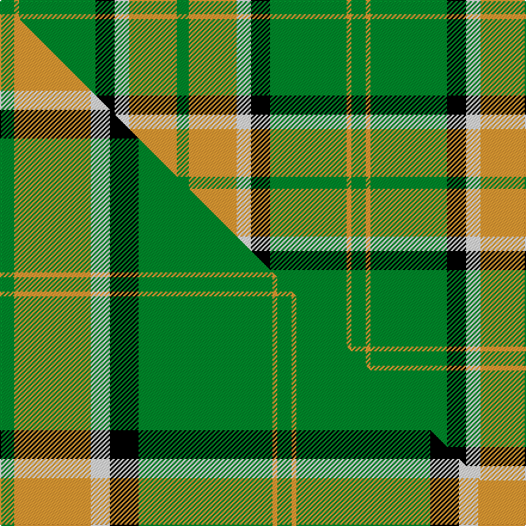

This is one **variant** — a specific cloth: this exact thread count and colourway, with its own
provenance below. It is one weaving of the [sett](/setts/g6lo2g32k8w6lo20g5/) (the scale-free proportion — the
same cloth at any scale or shade), whose colour order is pattern [GYGKWYG](/stripes/gygkwyg/).

Part of the [Pollock](/tartans/pollock-2/) tartan — the named design grouping this sett with its other cloths.

Sourced from tartans-authority.  It is a [7 stripe tartan](/stripes/stripes7/).

Original link [https://www.tartanregister.gov.uk/tartanDetails.aspx?ref=867](https://www.tartanregister.gov.uk/tartanDetails.aspx?ref=867)

Dataset <small>— provenance for this record, inherited from the source manifest</small>

<dl class="dataset-prov">
<dt>source</dt><dd><a href="/sources/tartans-authority/">Scottish Tartans Authority</a></dd>
<dt>data captured from</dt><dd><a href="https://github.com/thetartan/tartan-database/blob/master/data/tartans-authority/data.csv">https://github.com/thetartan/tartan-database/blob/master/data/tartans-authority/data.csv</a></dd>
<dt>data date</dt><dd>1980 <small>(this record)</small></dd>
<dt>licence</dt><dd><a href="https://creativecommons.org/licenses/by-nc-nd/4.0/">CC BY-NC-ND 4.0</a></dd>
</dl>

Capture chain <small>— the hands this data passed through, oldest first; each capture carries its own licence</small>

<ol class="capture-chain">
<li><a href="https://www.tartansauthority.com/">Scottish Tartans Authority</a> <small>the heritage body's archive — its tartan-ferret record browser is retired (links repaired to the SRT, above)</small></li>
<li><a href="https://github.com/thetartan/tartan-database">thetartan/tartan-database</a> <small>2016-2017</small> · <a href="https://creativecommons.org/licenses/by-nc-nd/4.0/">CC BY-NC-ND 4.0</a> <small>Levko Kravets's frozen compilation — the capture we vendored, and where its CC licence text came from</small></li>
<li>this dictionary <small>captured 2026-06-10 · commit 5bf86c7566</small> <small>each re-capture is a git commit to data/sources</small></li>
</ol>

## Register references

External register numbers recorded for this tartan.

- Scottish Tartans Authority (ITI): 867

## Thread count
G/12 LO4 G64 K16 W12 LO40 G/10

One full sett is **294 threads**.

## Palette
<table><thead><tr><th>Colour</th><th>Shade</th><th>OKLCh</th></tr></thead><tbody><tr><td>G</td><td><code style="background-color:#008B2A;">#008B2A</code> <small style="color:#888">#008B2A</small></td><td><small style="color:#888">oklch(55.4% 0.170 145.9)</small></td></tr><tr><td>K</td><td><code style="background-color:#000000;">#000000</code> <small style="color:#888">#000000</small></td><td><small style="color:#888">oklch(0.0% 0.000 0.0)</small></td></tr><tr><td>LO</td><td><code style="background-color:#FF9C34;">#FF9C34</code> <small style="color:#888">#FF9C34</small></td><td><small style="color:#888">oklch(77.9% 0.161 61.8)</small></td></tr><tr><td>W</td><td><code style="background-color:#F7F7F7;">#F7F7F7</code> <small style="color:#888">#F7F7F7</small></td><td><small style="color:#888">oklch(97.6% 0.000 89.9)</small></td></tr></tbody></table>

# Sample pattern

## Compared to the master

This cloth is one sett of its design; the master sett (the exemplar the design is anchored on) is below for comparison.

Its **ΔTartan distance** from the master is **0.41** — the same measure the nearest-tartans table ranks by (0 is identical; a re-scale of the same cloth is near 0, a recolour or a different proportion further).

<figure class="master-compare" style="margin:0">

this sett
master sett ★

<figcaption style="color:#888;font-size:smaller">One weave of this sett against the <a href="/setts/g3lo16w4k6g28lo1g3/">master sett ★</a>, split on the diagonal: a shared proportion runs seamlessly across it with only the shades shifting; a different proportion breaks on it.</figcaption>
</figure>

## Nearest tartan variants

The nearest existing variants by ΔTartan distance, with this cloth at the top so the swatches line up against it.

ΔTartan

Threads

Variant

Sett

—

294

<a href="/variants/s7/g6lo2g32k8w6lo20g5~x2/">Pollock (Name)</a>

<a href="/ttd/edit/#slug=g3lo16w4k6g28lo1g3~x4&amp;base=g6lo2g32k8w6lo20g5~x2" title="compare in the TTD">0.41</a>

464

<a href="/variants/s7/g3lo16w4k6g28lo1g3~x4/">Pollock</a>

<a href="/ttd/edit/#slug=g5k2g28k10o26db4g4~x2&amp;base=g6lo2g32k8w6lo20g5~x2" title="compare in the TTD">1.99</a>

298

<a href="/variants/s7/g5k2g28k10o26db4g4~x2/">John Telfar, Dunbar hunting</a>

<a href="/ttd/edit/#slug=w6g5r5g45k4o24k4g5~x2&amp;base=g6lo2g32k8w6lo20g5~x2" title="compare in the TTD">2.52</a>

370

<a href="/variants/s8/w6g5r5g45k4o24k4g5~x2/">O'Neill</a>

<a href="/ttd/edit/#slug=w12k3g50w3k13ly6~x2&amp;base=g6lo2g32k8w6lo20g5~x2" title="compare in the TTD">2.67</a>

312

<a href="/variants/s6/w12k3g50w3k13ly6~x2/">Limerick County Crest (Fashion)</a>

<a href="/ttd/edit/#slug=g3r16w4k6g28r1g3~x2&amp;base=g6lo2g32k8w6lo20g5~x2" title="compare in the TTD">2.79</a>

232

<a href="/variants/s7/g3r16w4k6g28r1g3~x2/">Pollock Clan Tartan</a>

<a href="/ttd/edit/#slug=w6g5r5g45k4ly24k4g5~x2&amp;base=g6lo2g32k8w6lo20g5~x2" title="compare in the TTD">2.88</a>

370

<a href="/variants/s8/w6g5r5g45k4ly24k4g5~x2/">O'Neill (Name)</a>

<a href="/ttd/edit/#slug=ly15n1ly2lo2ly2n1ly3k8n10ly3~x4&amp;base=g6lo2g32k8w6lo20g5~x2" title="compare in the TTD">2.93</a>

304

<a href="/variants/s10/ly15n1ly2lo2ly2n1ly3k8n10ly3~x4/">Annan Trade Tartan</a>

<a href="/ttd/edit/#slug=w12k3g50w3k13dy6~x2&amp;base=g6lo2g32k8w6lo20g5~x2" title="compare in the TTD">2.97</a>

312

<a href="/variants/s6/w12k3g50w3k13dy6~x2/">Limerick County, Crest Range</a>

<a href="/ttd/edit/#slug=y70k30w3g30k3y10&amp;base=g6lo2g32k8w6lo20g5~x2" title="compare in the TTD">3.12</a>

212

<a href="/variants/s6/y70k30w3g30k3y10/">Jacobite #2</a>

<a href="/ttd/edit/#slug=g7k3g53k3g8k3dr24g8ly18k3ly18k3~x2&amp;base=g6lo2g32k8w6lo20g5~x2" title="compare in the TTD">3.22</a>

584

<a href="/variants/s12/g7k3g53k3g8k3dr24g8ly18k3ly18k3~x2/">MacMillan - 1847 (Clan)</a>

## Neighbour map

Every grey dot is one of 13621 variants placed by the first two principal components of the ΔTartan feature space (42% of its variance). Red is this tartan; blue dots are its nearest — click one to open its page.

<svg viewBox="0 0 640 380" role="img" style="max-width:100%;height:auto;border:1px solid #e0e0e0;border-radius:4px;display:block" xmlns="http://www.w3.org/2000/svg"><image href="/nn/cloud.v1.png" width="640" height="380"/><a href="/variants/s7/g3lo16w4k6g28lo1g3~x4/"><circle cx="293.9" cy="138.7" r="4" fill="#3465a4"><title>Pollock</title></circle></a><a href="/variants/s7/g5k2g28k10o26db4g4~x2/"><circle cx="234.8" cy="177.3" r="4" fill="#3465a4"><title>John Telfar, Dunbar hunting</title></circle></a><a href="/variants/s8/w6g5r5g45k4o24k4g5~x2/"><circle cx="264.2" cy="150.2" r="4" fill="#3465a4"><title>O'Neill</title></circle></a><a href="/variants/s6/w12k3g50w3k13ly6~x2/"><circle cx="270.7" cy="154.2" r="4" fill="#3465a4"><title>Limerick County Crest (Fashion)</title></circle></a><a href="/variants/s7/g3r16w4k6g28r1g3~x2/"><circle cx="296.2" cy="133.9" r="4" fill="#3465a4"><title>Pollock Clan Tartan</title></circle></a><a href="/variants/s8/w6g5r5g45k4ly24k4g5~x2/"><circle cx="251.1" cy="150.0" r="4" fill="#3465a4"><title>O'Neill (Name)</title></circle></a><a href="/variants/s10/ly15n1ly2lo2ly2n1ly3k8n10ly3~x4/"><circle cx="239.3" cy="148.1" r="4" fill="#3465a4"><title>Annan Trade Tartan</title></circle></a><a href="/variants/s6/w12k3g50w3k13dy6~x2/"><circle cx="271.6" cy="153.9" r="4" fill="#3465a4"><title>Limerick County, Crest Range</title></circle></a><a href="/variants/s6/y70k30w3g30k3y10/"><circle cx="286.2" cy="154.1" r="4" fill="#3465a4"><title>Jacobite #2</title></circle></a><a href="/variants/s12/g7k3g53k3g8k3dr24g8ly18k3ly18k3~x2/"><circle cx="235.7" cy="130.4" r="4" fill="#3465a4"><title>MacMillan - 1847 (Clan)</title></circle></a><circle cx="257.4" cy="170.9" r="5" fill="#c00000"/><text x="320" y="376" text-anchor="middle" font-size="11" fill="#999">ground</text><text x="11" y="190" text-anchor="middle" font-size="11" fill="#999" transform="rotate(-90 11 190)">complexity</text></svg>

ID: /variants/s7/g6lo2g32k8w6lo20g5~x2/
