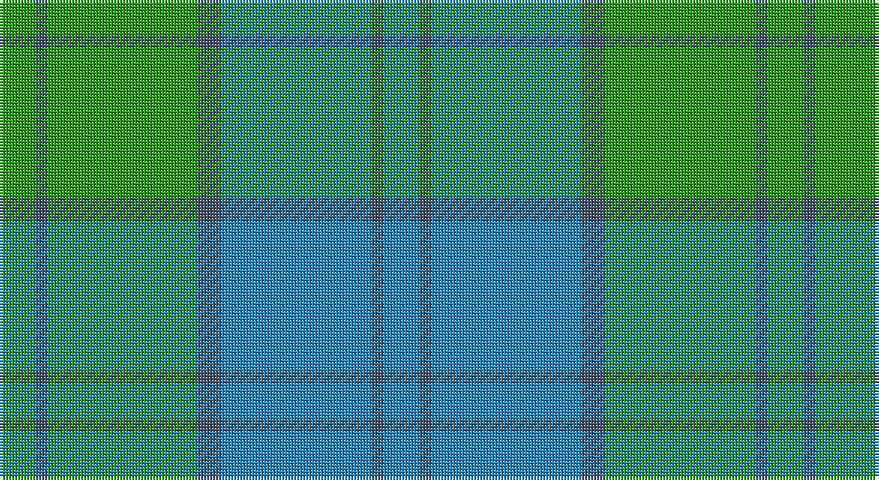

This page is one **sett** — a single exact thread-count. It belongs to the [tartan](/setts/g6n2g25n4t25n2t6/)
(the same proportion at any scale), whose colour order is pattern [BBBBGBG](/stripes/bbbbgbg/).

Part of the [Lennox Dress](/tartans/lennox-dress/) tartan — the named design grouping this sett with its other cloths.

Sourced from tartans-authority.  It is a [7 stripe tartan](/stripes/stripes7/).

Original link http://www.tartansauthority.com/tartan-ferret/display/8189/

## Also known as

This cloth is also recorded under:

- Lennox Dress #2
- Lennox Dress, Purple
- Lennox Dress, Red
- Lennox, dress

## Register references

External register numbers recorded for this tartan.

- Scottish Register of Tartans: [8189](https://www.tartanregister.gov.uk/tartanDetails?ref=8189)
- Scottish Tartans Authority (ITI): 8189

## Thread count
G/12 N4 G50 Na8 B50 Na4 B/12

One full sett is **256 threads**.

## Palette

Palette: <strong>Tartan Register</strong> <small style="color:#888">(2 of 3 colours)</small>
<table><thead><tr><th>Colour</th><th>Threads</th><th>Shade</th><th>Base</th><th>OKLCh</th></tr></thead><tbody><tr><td>G/</td><td style="text-align:right;font-variant-numeric:tabular-nums">12</td><td><code style="background-color:#289C18;">#289C18</code> <small style="color:#888">#289C18</small></td><td>G <code style="background-color:#006100;">#006100</code></td><td><small style="color:#888">oklch(60.6% 0.191 141.6)</small></td></tr><tr><td>N</td><td style="text-align:right;font-variant-numeric:tabular-nums">4</td><td><code style="background-color:#44546C;">#44546C</code> <small style="color:#888">#44546C</small></td><td>B <code style="background-color:#2A418A;">#2A418A</code></td><td><small style="color:#888">oklch(44.2% 0.045 258.3)</small></td></tr><tr><td>G</td><td style="text-align:right;font-variant-numeric:tabular-nums">50</td><td><code style="background-color:#289C18;">#289C18</code> <small style="color:#888">#289C18</small></td><td>G <code style="background-color:#006100;">#006100</code></td><td><small style="color:#888">oklch(60.6% 0.191 141.6)</small></td></tr><tr><td>Na</td><td style="text-align:right;font-variant-numeric:tabular-nums">8</td><td><code style="background-color:#44546C;">#44546C</code> <small style="color:#888">#44546C</small></td><td>B <code style="background-color:#2A418A;">#2A418A</code></td><td><small style="color:#888">oklch(44.2% 0.045 258.3)</small></td></tr><tr><td>B</td><td style="text-align:right;font-variant-numeric:tabular-nums">50</td><td><code style="background-color:#2888C4;">#2888C4</code> <small style="color:#888">#2888C4</small></td><td>B <code style="background-color:#2A418A;">#2A418A</code></td><td><small style="color:#888">oklch(60.1% 0.125 241.5)</small></td></tr><tr><td>Na</td><td style="text-align:right;font-variant-numeric:tabular-nums">4</td><td><code style="background-color:#44546C;">#44546C</code> <small style="color:#888">#44546C</small></td><td>B <code style="background-color:#2A418A;">#2A418A</code></td><td><small style="color:#888">oklch(44.2% 0.045 258.3)</small></td></tr><tr><td>B/</td><td style="text-align:right;font-variant-numeric:tabular-nums">12</td><td><code style="background-color:#2888C4;">#2888C4</code> <small style="color:#888">#2888C4</small></td><td>B <code style="background-color:#2A418A;">#2A418A</code></td><td><small style="color:#888">oklch(60.1% 0.125 241.5)</small></td></tr></tbody></table>

# Sample pattern

## Compared to the master

This cloth is one sett of its design; the master sett (the exemplar the design is anchored on) is below for comparison.

<figure style="margin:0"><figcaption style="color:#888;font-size:smaller">this sett</figcaption></figure>
<figure style="margin:0"><figcaption style="color:#888;font-size:smaller"><a href="/setts/r8dp2r24db5w26dy2w8/">master sett →</a></figcaption></figure>

## Nearest tartans

The nearest existing variants by ΔTartan distance, with this tartan at the top so the swatches line up against it.

ΔTartan

Tartan

Sett

—

<a href="/ttd/edit/#slug=g6n2g25n4t25n2t6~x2">Lennox Dress, Purple (Dance)</a> <a class="nn-out" href="/variants/s7/g6n2g25n4t25n2t6~x2/" title="open its dictionary page">↗</a>

1.48

<a href="/ttd/edit/#slug=t4w2g17t17lo2~x4&amp;base=g6n2g25n4t25n2t6~x2">Bermuda (1986)</a> <a class="nn-out" href="/variants/s5/t4w2g17t17lo2~x4/" title="open its dictionary page">↗</a>

1.48

<a href="/ttd/edit/#slug=t12dg2t2dg2t2dy8g8dy1~x2&amp;base=g6n2g25n4t25n2t6~x2">Universal Ancient</a> <a class="nn-out" href="/variants/s8/t12dg2t2dg2t2dy8g8dy1~x2/" title="open its dictionary page">↗</a>

1.50

<a href="/ttd/edit/#slug=g30k3g3k3g6b32g3b3~x2&amp;base=g6n2g25n4t25n2t6~x2">Holmes (Clan?)</a> <a class="nn-out" href="/variants/s8/g30k3g3k3g6b32g3b3~x2/" title="open its dictionary page">↗</a>

1.52

<a href="/ttd/edit/#slug=t3k3t21g49t21k3t3w3~x2&amp;base=g6n2g25n4t25n2t6~x2">Irvine of Drum</a> <a class="nn-out" href="/variants/s8/t3k3t21g49t21k3t3w3~x2/" title="open its dictionary page">↗</a>

1.52

<a href="/ttd/edit/#slug=b52g21b6g16k4g16~x2&amp;base=g6n2g25n4t25n2t6~x2">Milligan</a> <a class="nn-out" href="/variants/s6/b52g21b6g16k4g16~x2/" title="open its dictionary page">↗</a>

1.52

<a href="/ttd/edit/#slug=t12gi2t2gi2t2dy8g8dy1~x2&amp;base=g6n2g25n4t25n2t6~x2">Universal Ancient International Tartan</a> <a class="nn-out" href="/variants/s8/t12gi2t2gi2t2dy8g8dy1~x2/" title="open its dictionary page">↗</a>

1.52

<a href="/ttd/edit/#slug=db4g3db2g19t24g1t2~x2&amp;base=g6n2g25n4t25n2t6~x2">Unidentified 1</a> <a class="nn-out" href="/variants/s7/db4g3db2g19t24g1t2~x2/" title="open its dictionary page">↗</a>

1.64

<a href="/ttd/edit/#slug=g10db2g2db6t5db1t2~x2&amp;base=g6n2g25n4t25n2t6~x2">Unnamed, No 17</a> <a class="nn-out" href="/variants/s7/g10db2g2db6t5db1t2~x2/" title="open its dictionary page">↗</a>

1.69

<a href="/ttd/edit/#slug=lo2t2lo1t18y2t10y10t2y18ly1y2ly2~x2&amp;base=g6n2g25n4t25n2t6~x2">Yarmouth NS (District)</a> <a class="nn-out" href="/variants/s12/lo2t2lo1t18y2t10y10t2y18ly1y2ly2~x2/" title="open its dictionary page">↗</a>

1.70

<a href="/ttd/edit/#slug=t4dg26gi8t8gi8g3t2~x2&amp;base=g6n2g25n4t25n2t6~x2">Valley of the Green (The ) Canadian Tartan</a> <a class="nn-out" href="/variants/s7/t4dg26gi8t8gi8g3t2~x2/" title="open its dictionary page">↗</a>

## Neighbour map

Every grey dot is one of 14360 variants placed by the first two principal components of the ΔTartan feature space (44% of its variance). Red is this tartan; blue dots are its nearest — click one to open its page.

<svg viewBox="0 0 640 380" role="img" style="max-width:100%;height:auto;border:1px solid #e0e0e0;border-radius:4px;display:block" xmlns="http://www.w3.org/2000/svg"><image href="/nn/cloud.v1.png" width="640" height="380"/><a href="/variants/s5/t4w2g17t17lo2~x4/"><circle cx="334.7" cy="265.2" r="4" fill="#3465a4"><title>Bermuda (1986)</title></circle></a><a href="/variants/s8/t12dg2t2dg2t2dy8g8dy1~x2/"><circle cx="254.5" cy="219.5" r="4" fill="#3465a4"><title>Universal Ancient</title></circle></a><a href="/variants/s8/g30k3g3k3g6b32g3b3~x2/"><circle cx="293.5" cy="194.1" r="4" fill="#3465a4"><title>Holmes (Clan?)</title></circle></a><a href="/variants/s8/t3k3t21g49t21k3t3w3~x2/"><circle cx="367.3" cy="200.9" r="4" fill="#3465a4"><title>Irvine of Drum</title></circle></a><a href="/variants/s6/b52g21b6g16k4g16~x2/"><circle cx="353.2" cy="248.5" r="4" fill="#3465a4"><title>Milligan</title></circle></a><a href="/variants/s8/t12gi2t2gi2t2dy8g8dy1~x2/"><circle cx="264.9" cy="222.1" r="4" fill="#3465a4"><title>Universal Ancient International Tartan</title></circle></a><a href="/variants/s7/db4g3db2g19t24g1t2~x2/"><circle cx="386.4" cy="207.2" r="4" fill="#3465a4"><title>Unidentified 1</title></circle></a><a href="/variants/s7/g10db2g2db6t5db1t2~x2/"><circle cx="276.6" cy="259.0" r="4" fill="#3465a4"><title>Unnamed, No 17</title></circle></a><a href="/variants/s12/lo2t2lo1t18y2t10y10t2y18ly1y2ly2~x2/"><circle cx="342.3" cy="176.0" r="4" fill="#3465a4"><title>Yarmouth NS (District)</title></circle></a><a href="/variants/s7/t4dg26gi8t8gi8g3t2~x2/"><circle cx="278.7" cy="224.7" r="4" fill="#3465a4"><title>Valley of the Green (The ) Canadian Tartan</title></circle></a><circle cx="314.4" cy="223.3" r="5" fill="#c00000"/></svg>

ID: /variants/s7/g6n2g25n4t25n2t6~x2/
