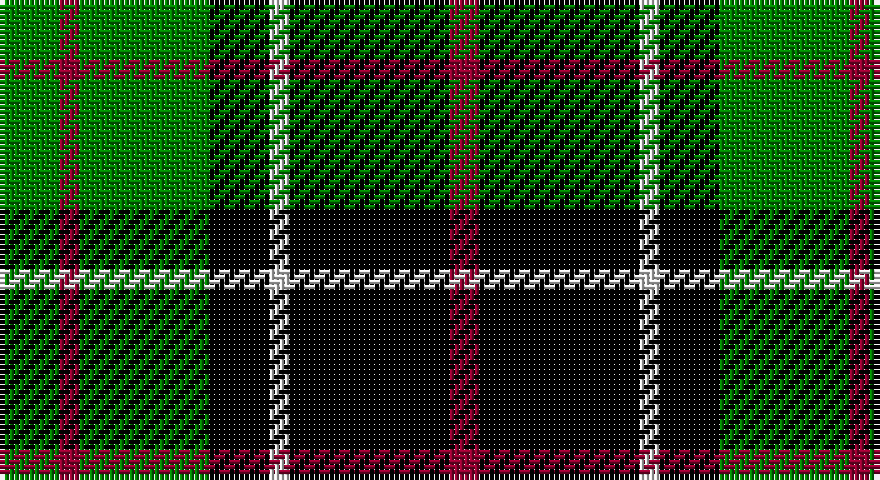

This page is one **sett** — a single exact thread-count. It belongs to the [tartan](/setts/g6r2g13k6w2k16r3/)
(the same proportion at any scale), whose colour order is pattern [GRGKWKR](/stripes/grgkwkr/).

Part of the [Sinclair Hunting](/tartans/sinclair-hunting/) tartan — the named design grouping this sett with its other cloths.

Sourced from weddslist.  It is a [7 stripe tartan](/stripes/stripes7/).

Original link http://www.weddslist.com/cgi-bin/tartans/pg.pl?source=sts

## Also known as

This cloth is also recorded under:

- Sinclair Htg
- Sinclair, hunting

## Thread count
G/12 DR4 G26 K12 LN4 K32 DR/6

One full sett is **174 threads**.

## Palette

Palette: <strong>Tartan Register</strong> <small style="color:#888">(2 of 4 colours)</small>
<table><thead><tr><th>Colour</th><th>Threads</th><th>Shade</th><th>Base</th><th>OKLCh</th></tr></thead><tbody><tr><td>G/</td><td style="text-align:right;font-variant-numeric:tabular-nums">12</td><td><code style="background-color:#008000;">#008000</code> <small style="color:#888">#008000</small></td><td>G <code style="background-color:#006100;">#006100</code></td><td><small style="color:#888">oklch(52.0% 0.177 142.5)</small></td></tr><tr><td>DR</td><td style="text-align:right;font-variant-numeric:tabular-nums">4</td><td><code style="background-color:#900030;">#900030</code> <small style="color:#888">#900030</small></td><td>R <code style="background-color:#CC0000;">#CC0000</code></td><td><small style="color:#888">oklch(41.6% 0.166 13.6)</small></td></tr><tr><td>G</td><td style="text-align:right;font-variant-numeric:tabular-nums">26</td><td><code style="background-color:#008000;">#008000</code> <small style="color:#888">#008000</small></td><td>G <code style="background-color:#006100;">#006100</code></td><td><small style="color:#888">oklch(52.0% 0.177 142.5)</small></td></tr><tr><td>K</td><td style="text-align:right;font-variant-numeric:tabular-nums">12</td><td><code style="background-color:#000000;">#000000</code> <small style="color:#888">#000000</small></td><td>K <code style="background-color:#000000;">#000000</code></td><td><small style="color:#888">oklch(0.0% 0.000 0.0)</small></td></tr><tr><td>LN</td><td style="text-align:right;font-variant-numeric:tabular-nums">4</td><td><code style="background-color:#E0E0E0;">#E0E0E0</code> <small style="color:#888">#E0E0E0</small></td><td>W <code style="background-color:#F7F7F7;">#F7F7F7</code></td><td><small style="color:#888">oklch(90.7% 0.000 89.9)</small></td></tr><tr><td>K</td><td style="text-align:right;font-variant-numeric:tabular-nums">32</td><td><code style="background-color:#000000;">#000000</code> <small style="color:#888">#000000</small></td><td>K <code style="background-color:#000000;">#000000</code></td><td><small style="color:#888">oklch(0.0% 0.000 0.0)</small></td></tr><tr><td>DR/</td><td style="text-align:right;font-variant-numeric:tabular-nums">6</td><td><code style="background-color:#900030;">#900030</code> <small style="color:#888">#900030</small></td><td>R <code style="background-color:#CC0000;">#CC0000</code></td><td><small style="color:#888">oklch(41.6% 0.166 13.6)</small></td></tr></tbody></table>

# Sample pattern

## Compared to the master

This cloth is one sett of its design; the master sett (the exemplar the design is anchored on) is below for comparison.

<figure style="margin:0"><figcaption style="color:#888;font-size:smaller">this sett</figcaption></figure>
<figure style="margin:0"><figcaption style="color:#888;font-size:smaller"><a href="/setts/dg6r2dg13k6w2k16r3/">master sett →</a></figcaption></figure>

## Nearest tartans

The nearest existing variants by ΔTartan distance, with this tartan at the top so the swatches line up against it.

ΔTartan

Tartan

Sett

—

<a href="/ttd/edit/#slug=g6r2g13k6w2k16r3~x2">Sinclair, hunting</a> <a class="nn-out" href="/variants/s7/g6r2g13k6w2k16r3~x2/" title="open its dictionary page">↗</a>

0.88

<a href="/ttd/edit/#slug=k8b5g44k40r6&amp;base=g6r2g13k6w2k16r3~x2">Douglas, Black</a> <a class="nn-out" href="/variants/s5/k8b5g44k40r6/" title="open its dictionary page">↗</a>

0.92

<a href="/ttd/edit/#slug=g8r3g30k8w3k36w8~x2&amp;base=g6r2g13k6w2k16r3~x2">Cleghorn (Personal)</a> <a class="nn-out" href="/variants/s7/g8r3g30k8w3k36w8~x2/" title="open its dictionary page">↗</a>

1.04

<a href="/ttd/edit/#slug=k7g7k1g7k7t1p7k1~x4&amp;base=g6r2g13k6w2k16r3~x2">Wilson's, No 108</a> <a class="nn-out" href="/variants/s8/k7g7k1g7k7t1p7k1~x4/" title="open its dictionary page">↗</a>

1.06

<a href="/ttd/edit/#slug=k2g7t1k6r4g2~x4&amp;base=g6r2g13k6w2k16r3~x2">Walker, James</a> <a class="nn-out" href="/variants/s6/k2g7t1k6r4g2~x4/" title="open its dictionary page">↗</a>

1.07

<a href="/ttd/edit/#slug=k2g9t1k6b4g2~x2&amp;base=g6r2g13k6w2k16r3~x2">Unnamed 3</a> <a class="nn-out" href="/variants/s6/k2g9t1k6b4g2~x2/" title="open its dictionary page">↗</a>

1.07

<a href="/ttd/edit/#slug=g21ly2g4k16p14k3~x2&amp;base=g6r2g13k6w2k16r3~x2">Wilson's, No 160</a> <a class="nn-out" href="/variants/s6/g21ly2g4k16p14k3~x2/" title="open its dictionary page">↗</a>

1.08

<a href="/ttd/edit/#slug=g18t2g4k14p12k3~x2&amp;base=g6r2g13k6w2k16r3~x2">Wilson's, No 150 &quot;Coburg&quot;</a> <a class="nn-out" href="/variants/s6/g18t2g4k14p12k3~x2/" title="open its dictionary page">↗</a>

1.10

<a href="/ttd/edit/#slug=g8k2t1g4k6db6k1~x2&amp;base=g6r2g13k6w2k16r3~x2">MacCallum</a> <a class="nn-out" href="/variants/s7/g8k2t1g4k6db6k1~x2/" title="open its dictionary page">↗</a>

1.11

<a href="/ttd/edit/#slug=k7r3k24g28ly3~x2&amp;base=g6r2g13k6w2k16r3~x2">Robert Gordon University</a> <a class="nn-out" href="/variants/s5/k7r3k24g28ly3~x2/" title="open its dictionary page">↗</a>

1.13

<a href="/ttd/edit/#slug=g21w2g4k17p14k3~x2&amp;base=g6r2g13k6w2k16r3~x2">Wilson's No 158</a> <a class="nn-out" href="/variants/s6/g21w2g4k17p14k3~x2/" title="open its dictionary page">↗</a>

## Neighbour map

Every grey dot is one of 14360 variants placed by the first two principal components of the ΔTartan feature space (44% of its variance). Red is this tartan; blue dots are its nearest — click one to open its page.

<svg viewBox="0 0 640 380" role="img" style="max-width:100%;height:auto;border:1px solid #e0e0e0;border-radius:4px;display:block" xmlns="http://www.w3.org/2000/svg"><image href="/nn/cloud.v1.png" width="640" height="380"/><a href="/variants/s5/k8b5g44k40r6/"><circle cx="237.4" cy="223.9" r="4" fill="#3465a4"><title>Douglas, Black</title></circle></a><a href="/variants/s7/g8r3g30k8w3k36w8~x2/"><circle cx="222.7" cy="185.7" r="4" fill="#3465a4"><title>Cleghorn (Personal)</title></circle></a><a href="/variants/s8/k7g7k1g7k7t1p7k1~x4/"><circle cx="163.6" cy="229.8" r="4" fill="#3465a4"><title>Wilson's, No 108</title></circle></a><a href="/variants/s6/k2g7t1k6r4g2~x4/"><circle cx="157.6" cy="237.9" r="4" fill="#3465a4"><title>Walker, James</title></circle></a><a href="/variants/s6/k2g9t1k6b4g2~x2/"><circle cx="189.6" cy="223.1" r="4" fill="#3465a4"><title>Unnamed 3</title></circle></a><a href="/variants/s6/g21ly2g4k16p14k3~x2/"><circle cx="184.7" cy="209.8" r="4" fill="#3465a4"><title>Wilson's, No 160</title></circle></a><a href="/variants/s6/g18t2g4k14p12k3~x2/"><circle cx="176.7" cy="221.4" r="4" fill="#3465a4"><title>Wilson's, No 150 &quot;Coburg&quot;</title></circle></a><a href="/variants/s7/g8k2t1g4k6db6k1~x2/"><circle cx="171.2" cy="232.3" r="4" fill="#3465a4"><title>MacCallum</title></circle></a><a href="/variants/s5/k7r3k24g28ly3~x2/"><circle cx="232.8" cy="215.8" r="4" fill="#3465a4"><title>Robert Gordon University</title></circle></a><a href="/variants/s6/g21w2g4k17p14k3~x2/"><circle cx="181.7" cy="209.5" r="4" fill="#3465a4"><title>Wilson's No 158</title></circle></a><circle cx="202.9" cy="217.0" r="5" fill="#c00000"/></svg>

ID: /variants/s7/g6r2g13k6w2k16r3~x2/
