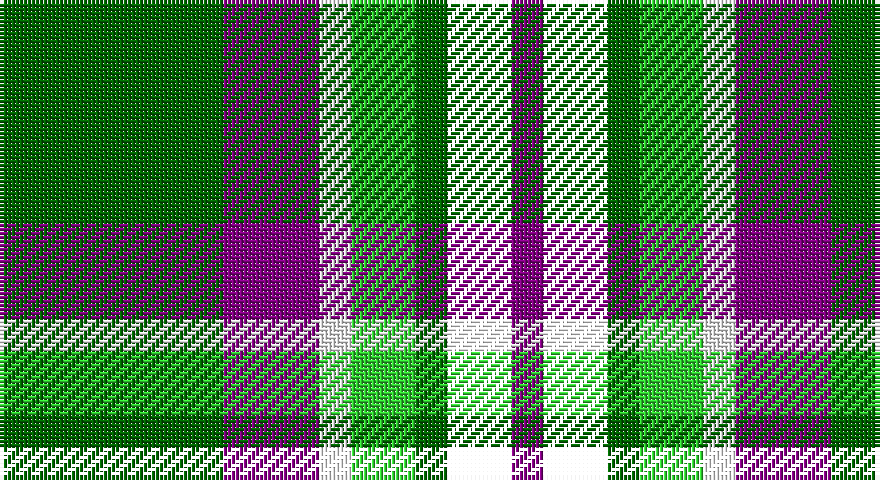

This page is one **sett** — a single exact thread-count. It belongs to the [tartan](/setts/g7p3w1lg2g1k2p1/)
(the same proportion at any scale), whose colour order is pattern [BKGYWBG](/stripes/bkgywbg/).

Part of the [Lindley-Highfield](/tartans/lindley-highfield/) tartan — the named design grouping this sett with its other cloths.

Sourced from house-of-tartan.  It is a [7 stripe tartan](/stripes/stripes7/).

Original link http://www.house-of-tartan.scotland.net/house/TartanViewjs.asp?colr=Def&tnam=10002

## Provenance

Earliest known date: 13 February 2009 'Lindley-Highfield of Ballumbie Castle' is a tartan of the family of the Lindley-Highfields of Ballumbie Castle, sometime Barons of Cartsburn. The colours of this particular tartan are taken from the armorial bearings of the Head of the Family of Lindley-Highfield of Ballumbie Castle.

## Thread count
G/56 P24 W8 Ga16 G8 LP16 P/8

One full sett is **208 threads**.

## Palette

Palette: <strong>Tartan Register</strong> <small style="color:#888">(2 of 4 colours)</small>
<table><thead><tr><th>Colour</th><th>Threads</th><th>Shade</th><th>Base</th><th>OKLCh</th></tr></thead><tbody><tr><td>G/</td><td style="text-align:right;font-variant-numeric:tabular-nums">56</td><td><code style="background-color:#006400;">#006400</code> <small style="color:#888">#006400</small></td><td>G <code style="background-color:#006100;">#006100</code></td><td><small style="color:#888">oklch(43.6% 0.148 142.5)</small></td></tr><tr><td>P</td><td style="text-align:right;font-variant-numeric:tabular-nums">24</td><td><code style="background-color:#800080;">#800080</code> <small style="color:#888">#800080</small></td><td>B <code style="background-color:#2A418A;">#2A418A</code></td><td><small style="color:#888">oklch(42.1% 0.193 328.4)</small></td></tr><tr><td>W</td><td style="text-align:right;font-variant-numeric:tabular-nums">8</td><td><code style="background-color:#FFFFFF;">#FFFFFF</code> <small style="color:#888">#FFFFFF</small></td><td>W <code style="background-color:#F7F7F7;">#F7F7F7</code></td><td><small style="color:#888">oklch(100.0% 0.000 89.9)</small></td></tr><tr><td>Ga</td><td style="text-align:right;font-variant-numeric:tabular-nums">16</td><td><code style="background-color:#32CD32;">#32CD32</code> <small style="color:#888">#32CD32</small></td><td>Y <code style="background-color:#F2BF00;">#F2BF00</code></td><td><small style="color:#888">oklch(74.2% 0.229 142.8)</small></td></tr><tr><td>G</td><td style="text-align:right;font-variant-numeric:tabular-nums">8</td><td><code style="background-color:#006400;">#006400</code> <small style="color:#888">#006400</small></td><td>G <code style="background-color:#006100;">#006100</code></td><td><small style="color:#888">oklch(43.6% 0.148 142.5)</small></td></tr><tr><td></td><td style="text-align:right;font-variant-numeric:tabular-nums">16</td><td><code style="background-color:;"></code> <small style="color:#888"></small></td><td> <code style="background-color:;"></code></td><td><small style="color:#888"></small></td></tr><tr><td>P/</td><td style="text-align:right;font-variant-numeric:tabular-nums">8</td><td><code style="background-color:#800080;">#800080</code> <small style="color:#888">#800080</small></td><td>B <code style="background-color:#2A418A;">#2A418A</code></td><td><small style="color:#888">oklch(42.1% 0.193 328.4)</small></td></tr></tbody></table>

# Sample pattern

## Compared to the master

This cloth is one sett of its design; the master sett (the exemplar the design is anchored on) is below for comparison.

<figure style="margin:0"><figcaption style="color:#888;font-size:smaller">this sett</figcaption></figure>
<figure style="margin:0"><figcaption style="color:#888;font-size:smaller"><a href="/setts/dg7dp3w1g2dg1r2dp1/">master sett →</a></figcaption></figure>

## Nearest tartans

The nearest existing variants by ΔTartan distance, with this tartan at the top so the swatches line up against it.

ΔTartan

Tartan

Sett

—

<a href="/ttd/edit/#slug=g7p3w1lg2g1k2p1~x8">Lindley-Highfield Name Tartan</a> <a class="nn-out" href="/variants/s7/g7p3w1lg2g1k2p1~x8/" title="open its dictionary page">↗</a>

0.89

<a href="/ttd/edit/#slug=db4dg8k8db4ly3dg21k3lb4k3lb4~x2&amp;base=g7p3w1lg2g1k2p1~x8">Wellecomme, Bernard (Personal)</a> <a class="nn-out" href="/variants/s10/db4dg8k8db4ly3dg21k3lb4k3lb4~x2/" title="open its dictionary page">↗</a>

0.89

<a href="/ttd/edit/#slug=g7p3w1lg2g1lp2p1~x8&amp;base=g7p3w1lg2g1k2p1~x8">Lindley-Highfield of Ballumbie Castle</a> <a class="nn-out" href="/variants/s7/g7p3w1lg2g1lp2p1~x8/" title="open its dictionary page">↗</a>

0.90

<a href="/ttd/edit/#slug=w8k16g32dt3lo5w5~x2&amp;base=g7p3w1lg2g1k2p1~x8">Mellor (Name)</a> <a class="nn-out" href="/variants/s6/w8k16g32dt3lo5w5~x2/" title="open its dictionary page">↗</a>

0.94

<a href="/ttd/edit/#slug=w16dg2k5r2k10dg11ly2dg11k2~x2&amp;base=g7p3w1lg2g1k2p1~x8">Unidentified #46</a> <a class="nn-out" href="/variants/s9/w16dg2k5r2k10dg11ly2dg11k2~x2/" title="open its dictionary page">↗</a>

0.95

<a href="/ttd/edit/#slug=k20w4r4gi20w5gi2g2~x2&amp;base=g7p3w1lg2g1k2p1~x8">Hackett (Personal)</a> <a class="nn-out" href="/variants/s7/k20w4r4gi20w5gi2g2~x2/" title="open its dictionary page">↗</a>

1.04

<a href="/ttd/edit/#slug=g24k4g6r4g6k19db22w5~x2&amp;base=g7p3w1lg2g1k2p1~x8">MacRae, Ancient hunting</a> <a class="nn-out" href="/variants/s8/g24k4g6r4g6k19db22w5~x2/" title="open its dictionary page">↗</a>

1.07

<a href="/ttd/edit/#slug=k6ly2g18w3g13k3ly4k3db18w3~x2&amp;base=g7p3w1lg2g1k2p1~x8">Corstorphine Trial A</a> <a class="nn-out" href="/variants/s10/k6ly2g18w3g13k3ly4k3db18w3~x2/" title="open its dictionary page">↗</a>

1.12

<a href="/ttd/edit/#slug=w16g2k5r2k10g11ly2g11k2~x2&amp;base=g7p3w1lg2g1k2p1~x8">Unnamed 9</a> <a class="nn-out" href="/variants/s9/w16g2k5r2k10g11ly2g11k2~x2/" title="open its dictionary page">↗</a>

1.12

<a href="/ttd/edit/#slug=dg8gi6dg48w31o42g6o8&amp;base=g7p3w1lg2g1k2p1~x8">Bannockbane, Green</a> <a class="nn-out" href="/variants/s7/dg8gi6dg48w31o42g6o8/" title="open its dictionary page">↗</a>

1.16

<a href="/ttd/edit/#slug=g8w1g1r1g4k4db8k1db1k1~x2&amp;base=g7p3w1lg2g1k2p1~x8">Allon/Allan</a> <a class="nn-out" href="/variants/s10/g8w1g1r1g4k4db8k1db1k1~x2/" title="open its dictionary page">↗</a>

## Neighbour map

Every grey dot is one of 14360 variants placed by the first two principal components of the ΔTartan feature space (44% of its variance). Red is this tartan; blue dots are its nearest — click one to open its page.

<svg viewBox="0 0 640 380" role="img" style="max-width:100%;height:auto;border:1px solid #e0e0e0;border-radius:4px;display:block" xmlns="http://www.w3.org/2000/svg"><image href="/nn/cloud.v1.png" width="640" height="380"/><a href="/variants/s10/db4dg8k8db4ly3dg21k3lb4k3lb4~x2/"><circle cx="162.9" cy="180.8" r="4" fill="#3465a4"><title>Wellecomme, Bernard (Personal)</title></circle></a><a href="/variants/s7/g7p3w1lg2g1lp2p1~x8/"><circle cx="169.8" cy="188.1" r="4" fill="#3465a4"><title>Lindley-Highfield of Ballumbie Castle</title></circle></a><a href="/variants/s6/w8k16g32dt3lo5w5~x2/"><circle cx="186.7" cy="179.4" r="4" fill="#3465a4"><title>Mellor (Name)</title></circle></a><a href="/variants/s9/w16dg2k5r2k10dg11ly2dg11k2~x2/"><circle cx="124.2" cy="177.3" r="4" fill="#3465a4"><title>Unidentified #46</title></circle></a><a href="/variants/s7/k20w4r4gi20w5gi2g2~x2/"><circle cx="152.9" cy="167.0" r="4" fill="#3465a4"><title>Hackett (Personal)</title></circle></a><a href="/variants/s8/g24k4g6r4g6k19db22w5~x2/"><circle cx="118.6" cy="204.2" r="4" fill="#3465a4"><title>MacRae, Ancient hunting</title></circle></a><a href="/variants/s10/k6ly2g18w3g13k3ly4k3db18w3~x2/"><circle cx="147.6" cy="169.4" r="4" fill="#3465a4"><title>Corstorphine Trial A</title></circle></a><a href="/variants/s9/w16g2k5r2k10g11ly2g11k2~x2/"><circle cx="112.4" cy="173.9" r="4" fill="#3465a4"><title>Unnamed 9</title></circle></a><a href="/variants/s7/dg8gi6dg48w31o42g6o8/"><circle cx="142.4" cy="185.0" r="4" fill="#3465a4"><title>Bannockbane, Green</title></circle></a><a href="/variants/s10/g8w1g1r1g4k4db8k1db1k1~x2/"><circle cx="168.0" cy="173.2" r="4" fill="#3465a4"><title>Allon/Allan</title></circle></a><circle cx="162.6" cy="190.2" r="5" fill="#c00000"/></svg>

ID: /variants/s7/g7p3w1lg2g1k2p1~x8/
