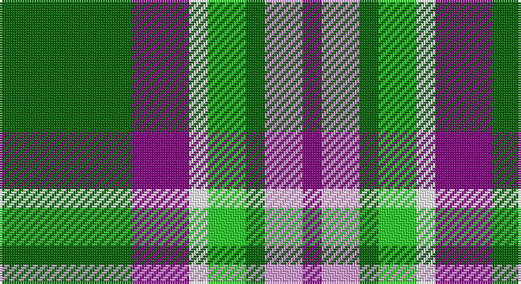

This page is one **sett** — a single exact thread-count. It belongs to the [tartan](/setts/g7p3w1lg2g1lp2p1/)
(the same proportion at any scale), whose colour order is pattern [BWGYWBG](/stripes/bwgywbg/).

Sourced from register-of-tartans.  It is a [7 stripe tartan](/stripes/stripes7/).

Original link https://www.tartanregister.gov.uk/tartanDetails.aspx?ref=10002

## Register references

External register numbers recorded for this tartan.

- Scottish Register of Tartans: [10002](https://www.tartanregister.gov.uk/tartanDetails.aspx?ref=10002)

## Thread count
G/56 P24 W8 Ga16 G8 LP16 P/8

One full sett is **208 threads**.

## Palette

Palette: <strong>Tartan Register</strong> <small style="color:#888">(2 of 5 colours)</small>
<table><thead><tr><th>Colour</th><th>Threads</th><th>Shade</th><th>Base</th><th>OKLCh</th></tr></thead><tbody><tr><td>G/</td><td style="text-align:right;font-variant-numeric:tabular-nums">56</td><td><code style="background-color:#006400;">#006400</code> <small style="color:#888">#006400</small></td><td>G <code style="background-color:#006100;">#006100</code></td><td><small style="color:#888">oklch(43.6% 0.148 142.5)</small></td></tr><tr><td>P</td><td style="text-align:right;font-variant-numeric:tabular-nums">24</td><td><code style="background-color:#800080;">#800080</code> <small style="color:#888">#800080</small></td><td>B <code style="background-color:#2A418A;">#2A418A</code></td><td><small style="color:#888">oklch(42.1% 0.193 328.4)</small></td></tr><tr><td>W</td><td style="text-align:right;font-variant-numeric:tabular-nums">8</td><td><code style="background-color:#FFFFFF;">#FFFFFF</code> <small style="color:#888">#FFFFFF</small></td><td>W <code style="background-color:#F7F7F7;">#F7F7F7</code></td><td><small style="color:#888">oklch(100.0% 0.000 89.9)</small></td></tr><tr><td>Ga</td><td style="text-align:right;font-variant-numeric:tabular-nums">16</td><td><code style="background-color:#32CD32;">#32CD32</code> <small style="color:#888">#32CD32</small></td><td>Y <code style="background-color:#F2BF00;">#F2BF00</code></td><td><small style="color:#888">oklch(74.2% 0.229 142.8)</small></td></tr><tr><td>G</td><td style="text-align:right;font-variant-numeric:tabular-nums">8</td><td><code style="background-color:#006400;">#006400</code> <small style="color:#888">#006400</small></td><td>G <code style="background-color:#006100;">#006100</code></td><td><small style="color:#888">oklch(43.6% 0.148 142.5)</small></td></tr><tr><td>LP</td><td style="text-align:right;font-variant-numeric:tabular-nums">16</td><td><code style="background-color:#DDA0DD;">#DDA0DD</code> <small style="color:#888">#DDA0DD</small></td><td>W <code style="background-color:#F7F7F7;">#F7F7F7</code></td><td><small style="color:#888">oklch(78.3% 0.108 326.5)</small></td></tr><tr><td>P/</td><td style="text-align:right;font-variant-numeric:tabular-nums">8</td><td><code style="background-color:#800080;">#800080</code> <small style="color:#888">#800080</small></td><td>B <code style="background-color:#2A418A;">#2A418A</code></td><td><small style="color:#888">oklch(42.1% 0.193 328.4)</small></td></tr></tbody></table>

# Sample pattern

## Nearest tartans

The nearest existing variants by ΔTartan distance, with this tartan at the top so the swatches line up against it.

ΔTartan

Tartan

Sett

—

<a href="/ttd/edit/#slug=g7p3w1lg2g1lp2p1~x8">Lindley-Highfield of Ballumbie Castle</a> <a class="nn-out" href="/variants/s7/g7p3w1lg2g1lp2p1~x8/" title="open its dictionary page">↗</a>

0.83

<a href="/ttd/edit/#slug=dg4g3dg24w15lo21gi3lo4~x2&amp;base=g7p3w1lg2g1lp2p1~x8">Bannockbane Dark Green</a> <a class="nn-out" href="/variants/s7/dg4g3dg24w15lo21gi3lo4~x2/" title="open its dictionary page">↗</a>

0.89

<a href="/ttd/edit/#slug=g7p3w1lg2g1k2p1~x8&amp;base=g7p3w1lg2g1lp2p1~x8">Lindley-Highfield Name Tartan</a> <a class="nn-out" href="/variants/s7/g7p3w1lg2g1k2p1~x8/" title="open its dictionary page">↗</a>

1.01

<a href="/ttd/edit/#slug=g15ly3r3dp8w2~x6&amp;base=g7p3w1lg2g1lp2p1~x8">ChuMac (Personal)</a> <a class="nn-out" href="/variants/s5/g15ly3r3dp8w2~x6/" title="open its dictionary page">↗</a>

1.01

<a href="/ttd/edit/#slug=dg8gi6dg48w31o42g6o8&amp;base=g7p3w1lg2g1lp2p1~x8">Bannockbane, Green</a> <a class="nn-out" href="/variants/s7/dg8gi6dg48w31o42g6o8/" title="open its dictionary page">↗</a>

1.04

<a href="/ttd/edit/#slug=g1w1g6db5w6r1g1lo1~x4&amp;base=g7p3w1lg2g1lp2p1~x8">Vermont Dress</a> <a class="nn-out" href="/variants/s8/g1w1g6db5w6r1g1lo1~x4/" title="open its dictionary page">↗</a>

1.11

<a href="/ttd/edit/#slug=db3g11w11r2g7db22ly2db2~x2&amp;base=g7p3w1lg2g1lp2p1~x8">Bahamas</a> <a class="nn-out" href="/variants/s8/db3g11w11r2g7db22ly2db2~x2/" title="open its dictionary page">↗</a>

1.13

<a href="/ttd/edit/#slug=w8k16g32dt3lo5w5~x2&amp;base=g7p3w1lg2g1lp2p1~x8">Mellor (Name)</a> <a class="nn-out" href="/variants/s6/w8k16g32dt3lo5w5~x2/" title="open its dictionary page">↗</a>

1.14

<a href="/ttd/edit/#slug=w16dg2k5r2k10dg11ly2dg11k2~x2&amp;base=g7p3w1lg2g1lp2p1~x8">Unidentified #46</a> <a class="nn-out" href="/variants/s9/w16dg2k5r2k10dg11ly2dg11k2~x2/" title="open its dictionary page">↗</a>

1.15

<a href="/ttd/edit/#slug=r4t28k6lb12k12lo3~x2&amp;base=g7p3w1lg2g1lp2p1~x8">MacTavish Dress</a> <a class="nn-out" href="/variants/s6/r4t28k6lb12k12lo3~x2/" title="open its dictionary page">↗</a>

1.16

<a href="/ttd/edit/#slug=g36lb4g8k29r24w7~x2&amp;base=g7p3w1lg2g1lp2p1~x8">Entre Rios Province (Provisional</a> <a class="nn-out" href="/variants/s6/g36lb4g8k29r24w7~x2/" title="open its dictionary page">↗</a>

## Neighbour map

Every grey dot is one of 14360 variants placed by the first two principal components of the ΔTartan feature space (44% of its variance). Red is this tartan; blue dots are its nearest — click one to open its page.

<svg viewBox="0 0 640 380" role="img" style="max-width:100%;height:auto;border:1px solid #e0e0e0;border-radius:4px;display:block" xmlns="http://www.w3.org/2000/svg"><image href="/nn/cloud.v1.png" width="640" height="380"/><a href="/variants/s7/dg4g3dg24w15lo21gi3lo4~x2/"><circle cx="144.3" cy="185.4" r="4" fill="#3465a4"><title>Bannockbane Dark Green</title></circle></a><a href="/variants/s7/g7p3w1lg2g1k2p1~x8/"><circle cx="162.6" cy="190.2" r="4" fill="#3465a4"><title>Lindley-Highfield Name Tartan</title></circle></a><a href="/variants/s5/g15ly3r3dp8w2~x6/"><circle cx="205.2" cy="211.4" r="4" fill="#3465a4"><title>ChuMac (Personal)</title></circle></a><a href="/variants/s7/dg8gi6dg48w31o42g6o8/"><circle cx="142.4" cy="185.0" r="4" fill="#3465a4"><title>Bannockbane, Green</title></circle></a><a href="/variants/s8/g1w1g6db5w6r1g1lo1~x4/"><circle cx="110.5" cy="181.1" r="4" fill="#3465a4"><title>Vermont Dress</title></circle></a><a href="/variants/s8/db3g11w11r2g7db22ly2db2~x2/"><circle cx="191.6" cy="167.1" r="4" fill="#3465a4"><title>Bahamas</title></circle></a><a href="/variants/s6/w8k16g32dt3lo5w5~x2/"><circle cx="186.7" cy="179.4" r="4" fill="#3465a4"><title>Mellor (Name)</title></circle></a><a href="/variants/s9/w16dg2k5r2k10dg11ly2dg11k2~x2/"><circle cx="124.2" cy="177.3" r="4" fill="#3465a4"><title>Unidentified #46</title></circle></a><a href="/variants/s6/r4t28k6lb12k12lo3~x2/"><circle cx="167.8" cy="188.3" r="4" fill="#3465a4"><title>MacTavish Dress</title></circle></a><a href="/variants/s6/g36lb4g8k29r24w7~x2/"><circle cx="144.0" cy="194.7" r="4" fill="#3465a4"><title>Entre Rios Province (Provisional</title></circle></a><circle cx="169.8" cy="188.1" r="5" fill="#c00000"/></svg>

ID: /variants/s7/g7p3w1lg2g1lp2p1~x8/
