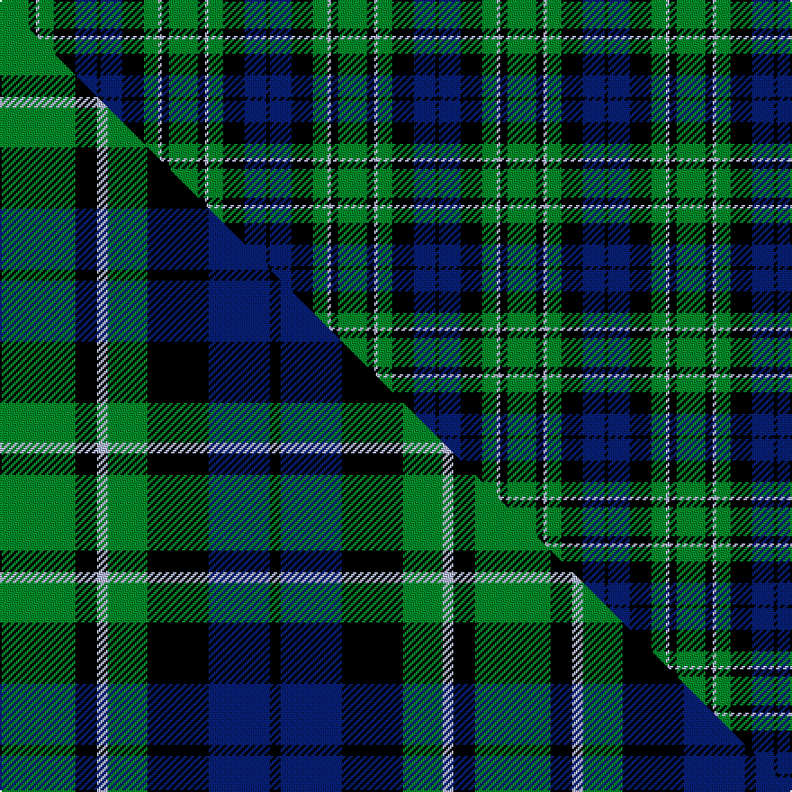

This page is one **sett** — a single exact thread-count. It belongs to the [tartan](/setts/g8k2lb1g4k6db6k1/)
(the same proportion at any scale), whose colour order is pattern [GKWGKBK](/stripes/gkwgkbk/).

Part of the [MacCallum](/tartans/maccallum/) tartan — the named design grouping this sett with its other cloths.

Sourced from weddslist.  It is a [7 stripe tartan](/stripes/stripes7/).

Original link http://www.weddslist.com/cgi-bin/tartans/pg.pl?source=sts

## Provenance

Earliest known date: 1893 D. W. Stewart wrote, "It is believed that the family (MacCallum), having lost trace of the old sett 50 or 60 years ago (i.e. 1832 - 1843), had the modern design prepared from the recollection of old people in Argyllshire; but the recovery of the original design shows that considerable deviation had been made." 'Old and Rare Scottish Tartans' recorded just 45 tartans, specially woven in silk, of particular interest or antiquity. Copies of the book are now valuable collectors items.

4 attestations — the source records this cloth was collapsed from (oldest owns this page)

<ul>
<li>undated — MacCallum (weddslist, <a href="http://www.weddslist.com/cgi-bin/tartans/pg.pl?source=sts">record</a>) </li>
<li>undated — MacCallum (weddslist, <a href="http://www.weddslist.com/cgi-bin/tartans/pg.pl?source=tinsel">record</a>) </li>
<li>undated — MacCallum (weddslist, <a href="http://www.weddslist.com/cgi-bin/tartans/pg.pl?source=x">record</a>) </li>
<li>undated — MacCallum Clan Tartan (house-of-tartan, <a href="http://www.house-of-tartan.scotland.net/house/TartanViewjs.asp?colr=Def&tnam=767">record</a>) </li>
</ul>

## Thread count
G/16 K4 LB2 G8 K12 DB12 K/2

One full sett is **94 threads**.

## Palette
<table><thead><tr><th>Colour</th><th>Shade</th><th>OKLCh</th></tr></thead><tbody><tr><td>DB</td><td><code style="background-color:#082077;">#082077</code> <small style="color:#888">#082077</small></td><td><small style="color:#888">oklch(30.0% 0.149 265.1)</small></td></tr><tr><td>LB</td><td><code style="background-color:#B5BBDE;">#B5BBDE</code> <small style="color:#888">#B5BBDE</small></td><td><small style="color:#888">oklch(79.9% 0.050 277.6)</small></td></tr><tr><td>G</td><td><code style="background-color:#008B2A;">#008B2A</code> <small style="color:#888">#008B2A</small></td><td><small style="color:#888">oklch(55.4% 0.170 145.9)</small></td></tr><tr><td>K</td><td><code style="background-color:#000000;">#000000</code> <small style="color:#888">#000000</small></td><td><small style="color:#888">oklch(0.0% 0.000 0.0)</small></td></tr></tbody></table>

# Sample pattern

## Compared to the master

This cloth is one sett of its design; the master sett (the exemplar the design is anchored on) is below for comparison.

Its **ΔTartan distance** from the master is **0.30** — the same measure the nearest-tartans table ranks by (0 is identical; a re-scale of the same cloth is near 0, a recolour or a different proportion further).

<figure class="master-compare" style="margin:0">

this sett
master sett ★

<figcaption style="color:#888;font-size:smaller">One weave of this sett against the <a href="/setts/g21k6lb3g11k17db17k3/">master sett ★</a>, split on the diagonal: a shared proportion runs seamlessly across it with only the shades shifting; a different proportion breaks on it.</figcaption>
</figure>

## Nearest variants

The nearest existing variants by ΔTartan distance, with this cloth at the top so the swatches line up against it.

ΔTartan

Threads

Variant

Sett

—

94

<a href="/variants/s7/g8k2lb1g4k6db6k1~x2/">MacCallum</a>

<a href="/ttd/edit/#slug=g21k6lb3g11k17db17k3~x2&amp;base=g8k2lb1g4k6db6k1~x2" title="compare in the TTD">0.14</a>

264

<a href="/variants/s7/g21k6lb3g11k17db17k3~x2/">MacCallum</a>

<a href="/ttd/edit/#slug=g8k2w1g4k6db6k1~x2&amp;base=g8k2lb1g4k6db6k1~x2" title="compare in the TTD">0.30</a>

94

<a href="/variants/s7/g8k2w1g4k6db6k1~x2/">MacCallum</a>

<a href="/ttd/edit/#slug=k12g12k2g12k12db12lb3~x2&amp;base=g8k2lb1g4k6db6k1~x2" title="compare in the TTD">1.07</a>

230

<a href="/variants/s7/k12g12k2g12k12db12lb3~x2/">MacIntyre</a>

<a href="/ttd/edit/#slug=k8g8k1g8k8b8w2~x2&amp;base=g8k2lb1g4k6db6k1~x2" title="compare in the TTD">1.13</a>

152

<a href="/variants/s7/k8g8k1g8k8b8w2~x2/">Unnamed, No 31</a>

<a href="/ttd/edit/#slug=g18lb2g4k14db12k3~x2&amp;base=g8k2lb1g4k6db6k1~x2" title="compare in the TTD">1.25</a>

170

<a href="/variants/s6/g18lb2g4k14db12k3~x2/">Graham of Menteith</a>

<a href="/ttd/edit/#slug=g8lb1g1k6db6k1~x4&amp;base=g8k2lb1g4k6db6k1~x2" title="compare in the TTD">1.27</a>

148

<a href="/variants/s6/g8lb1g1k6db6k1~x4/">Graham of Menteith</a>

<a href="/ttd/edit/#slug=g52lb7g9k35db35k7&amp;base=g8k2lb1g4k6db6k1~x2" title="compare in the TTD">1.35</a>

231

<a href="/variants/s6/g52lb7g9k35db35k7/">Redland</a>

<a href="/ttd/edit/#slug=g9lb1g6k7db7k1~x4&amp;base=g8k2lb1g4k6db6k1~x2" title="compare in the TTD">1.38</a>

208

<a href="/variants/s6/g9lb1g6k7db7k1~x4/">Menteith</a>

<a href="/ttd/edit/#slug=db10k6lb1g6k1~x2&amp;base=g8k2lb1g4k6db6k1~x2" title="compare in the TTD">1.45</a>

74

<a href="/variants/s5/db10k6lb1g6k1~x2/">Unidentified No 115</a>

<a href="/ttd/edit/#slug=g21w2g4k17db14k3&amp;base=g8k2lb1g4k6db6k1~x2" title="compare in the TTD">1.67</a>

98

<a href="/variants/s6/g21w2g4k17db14k3/">Graham W</a>

## Neighbour map

Every grey dot is one of 13620 variants placed by the first two principal components of the ΔTartan feature space (42% of its variance). Red is this tartan; blue dots are its nearest — click one to open its page.

<svg viewBox="0 0 640 380" role="img" style="max-width:100%;height:auto;border:1px solid #e0e0e0;border-radius:4px;display:block" xmlns="http://www.w3.org/2000/svg"><image href="/nn/cloud.v1.png" width="640" height="380"/><a href="/variants/s7/g21k6lb3g11k17db17k3~x2/"><circle cx="142.6" cy="224.9" r="4" fill="#3465a4"><title>MacCallum</title></circle></a><a href="/variants/s7/g8k2w1g4k6db6k1~x2/"><circle cx="153.1" cy="215.6" r="4" fill="#3465a4"><title>MacCallum</title></circle></a><a href="/variants/s7/k12g12k2g12k12db12lb3~x2/"><circle cx="119.9" cy="247.4" r="4" fill="#3465a4"><title>MacIntyre</title></circle></a><a href="/variants/s7/k8g8k1g8k8b8w2~x2/"><circle cx="121.1" cy="233.0" r="4" fill="#3465a4"><title>Unnamed, No 31</title></circle></a><a href="/variants/s6/g18lb2g4k14db12k3~x2/"><circle cx="165.3" cy="214.9" r="4" fill="#3465a4"><title>Graham of Menteith</title></circle></a><a href="/variants/s6/g8lb1g1k6db6k1~x4/"><circle cx="156.8" cy="213.5" r="4" fill="#3465a4"><title>Graham of Menteith</title></circle></a><a href="/variants/s6/g52lb7g9k35db35k7/"><circle cx="161.4" cy="219.3" r="4" fill="#3465a4"><title>Redland</title></circle></a><a href="/variants/s6/g9lb1g6k7db7k1~x4/"><circle cx="187.6" cy="225.7" r="4" fill="#3465a4"><title>Menteith</title></circle></a><a href="/variants/s5/db10k6lb1g6k1~x2/"><circle cx="133.4" cy="202.9" r="4" fill="#3465a4"><title>Unidentified No 115</title></circle></a><a href="/variants/s6/g21w2g4k17db14k3/"><circle cx="169.2" cy="204.3" r="4" fill="#3465a4"><title>Graham W</title></circle></a><circle cx="156.8" cy="216.7" r="5" fill="#c00000"/><text x="320" y="376" text-anchor="middle" font-size="11" fill="#999">ground</text><text x="11" y="190" text-anchor="middle" font-size="11" fill="#999" transform="rotate(-90 11 190)">complexity</text></svg>

ID: /variants/s7/g8k2lb1g4k6db6k1~x2/
