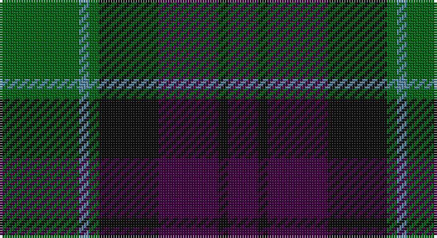

This page is one **sett** — a single exact thread-count. It belongs to the [tartan](/setts/g8t1g1k6dp6k1dp3/)
(the same proportion at any scale), whose colour order is pattern [BKBKGBG](/stripes/bkbkgbg/).

Sourced from register-of-tartans.  It is a [7 stripe tartan](/stripes/stripes7/).

Original link https://www.tartanregister.gov.uk/tartanDetails.aspx?ref=4425

## Also known as

This cloth is also recorded under:

- Unnamed 19th Century Plaid

## Register references

External register numbers recorded for this tartan.

- Scottish Register of Tartans: [4425](https://www.tartanregister.gov.uk/tartanDetails.aspx?ref=4425)
- Scottish Tartans Authority (ITI): 6911

## Thread count
G/32 B4 G4 K24 DP24 K4 DP/12

One full sett is **164 threads**.

## Palette

Palette: <strong>Tartan Register</strong>
<table><thead><tr><th>Colour</th><th>Threads</th><th>Shade</th><th>Base</th><th>OKLCh</th></tr></thead><tbody><tr><td>G/</td><td style="text-align:right;font-variant-numeric:tabular-nums">32</td><td><code style="background-color:#006818;">#006818</code> <small style="color:#888">#006818</small></td><td>G <code style="background-color:#006100;">#006100</code></td><td><small style="color:#888">oklch(45.0% 0.142 145.0)</small></td></tr><tr><td>B</td><td style="text-align:right;font-variant-numeric:tabular-nums">4</td><td><code style="background-color:#5C8CA8;">#5C8CA8</code> <small style="color:#888">#5C8CA8</small></td><td>B <code style="background-color:#2A418A;">#2A418A</code></td><td><small style="color:#888">oklch(61.7% 0.067 235.0)</small></td></tr><tr><td>G</td><td style="text-align:right;font-variant-numeric:tabular-nums">4</td><td><code style="background-color:#006818;">#006818</code> <small style="color:#888">#006818</small></td><td>G <code style="background-color:#006100;">#006100</code></td><td><small style="color:#888">oklch(45.0% 0.142 145.0)</small></td></tr><tr><td>K</td><td style="text-align:right;font-variant-numeric:tabular-nums">24</td><td><code style="background-color:#101010;">#101010</code> <small style="color:#888">#101010</small></td><td>K <code style="background-color:#000000;">#000000</code></td><td><small style="color:#888">oklch(17.3% 0.000 89.9)</small></td></tr><tr><td>DP</td><td style="text-align:right;font-variant-numeric:tabular-nums">24</td><td><code style="background-color:#440044;">#440044</code> <small style="color:#888">#440044</small></td><td>B <code style="background-color:#2A418A;">#2A418A</code></td><td><small style="color:#888">oklch(27.1% 0.125 328.4)</small></td></tr><tr><td>K</td><td style="text-align:right;font-variant-numeric:tabular-nums">4</td><td><code style="background-color:#101010;">#101010</code> <small style="color:#888">#101010</small></td><td>K <code style="background-color:#000000;">#000000</code></td><td><small style="color:#888">oklch(17.3% 0.000 89.9)</small></td></tr><tr><td>DP/</td><td style="text-align:right;font-variant-numeric:tabular-nums">12</td><td><code style="background-color:#440044;">#440044</code> <small style="color:#888">#440044</small></td><td>B <code style="background-color:#2A418A;">#2A418A</code></td><td><small style="color:#888">oklch(27.1% 0.125 328.4)</small></td></tr></tbody></table>

# Sample pattern

## Nearest tartans

The nearest existing variants by ΔTartan distance, with this tartan at the top so the swatches line up against it.

ΔTartan

Tartan

Sett

—

<a href="/ttd/edit/#slug=g8t1g1k6dp6k1dp3~x4">Unnamed 19th Century Plaid</a> <a class="nn-out" href="/variants/s7/g8t1g1k6dp6k1dp3~x4/" title="open its dictionary page">↗</a>

0.66

<a href="/ttd/edit/#slug=k4g25k24r3db24g4~x2&amp;base=g8t1g1k6dp6k1dp3~x4">Ferguson of Balquhidder #2</a> <a class="nn-out" href="/variants/s6/k4g25k24r3db24g4~x2/" title="open its dictionary page">↗</a>

0.69

<a href="/ttd/edit/#slug=k3dg17ly2k18dp17dg3~x2&amp;base=g8t1g1k6dp6k1dp3~x4">Wilson's No.100</a> <a class="nn-out" href="/variants/s6/k3dg17ly2k18dp17dg3~x2/" title="open its dictionary page">↗</a>

0.72

<a href="/ttd/edit/#slug=db6k2db18k18g18k3r2~x2&amp;base=g8t1g1k6dp6k1dp3~x4">Renfrew</a> <a class="nn-out" href="/variants/s7/db6k2db18k18g18k3r2~x2/" title="open its dictionary page">↗</a>

0.74

<a href="/ttd/edit/#slug=k2g10k9db9r1k1db2~x2&amp;base=g8t1g1k6dp6k1dp3~x4">Reid and Taylor</a> <a class="nn-out" href="/variants/s7/k2g10k9db9r1k1db2~x2/" title="open its dictionary page">↗</a>

0.75

<a href="/ttd/edit/#slug=k3db14r2k14g14k3~x2&amp;base=g8t1g1k6dp6k1dp3~x4">Gallamore</a> <a class="nn-out" href="/variants/s6/k3db14r2k14g14k3~x2/" title="open its dictionary page">↗</a>

0.79

<a href="/ttd/edit/#slug=k7g22k22db6r2db15r2~x2&amp;base=g8t1g1k6dp6k1dp3~x4">National Galleries of Scotland</a> <a class="nn-out" href="/variants/s7/k7g22k22db6r2db15r2~x2/" title="open its dictionary page">↗</a>

0.80

<a href="/ttd/edit/#slug=r4k4db24k24g24k2r3~x2&amp;base=g8t1g1k6dp6k1dp3~x4">Black Watch (Coarse Kilt)</a> <a class="nn-out" href="/variants/s7/r4k4db24k24g24k2r3~x2/" title="open its dictionary page">↗</a>

0.83

<a href="/ttd/edit/#slug=db12r2db4r4k15db4g4db2g12~x2&amp;base=g8t1g1k6dp6k1dp3~x4">Alexander Hunting (Name)</a> <a class="nn-out" href="/variants/s9/db12r2db4r4k15db4g4db2g12~x2/" title="open its dictionary page">↗</a>

0.83

<a href="/ttd/edit/#slug=r9db11k3db3k3db3k20g20k3~x2&amp;base=g8t1g1k6dp6k1dp3~x4">Urquhart - 1810 ((Clan)</a> <a class="nn-out" href="/variants/s9/r9db11k3db3k3db3k20g20k3~x2/" title="open its dictionary page">↗</a>

0.84

<a href="/ttd/edit/#slug=db4k3db16k14g14r3g3~x2&amp;base=g8t1g1k6dp6k1dp3~x4">Inneryne (Personal)</a> <a class="nn-out" href="/variants/s7/db4k3db16k14g14r3g3~x2/" title="open its dictionary page">↗</a>

## Neighbour map

Every grey dot is one of 14360 variants placed by the first two principal components of the ΔTartan feature space (44% of its variance). Red is this tartan; blue dots are its nearest — click one to open its page.

<svg viewBox="0 0 640 380" role="img" style="max-width:100%;height:auto;border:1px solid #e0e0e0;border-radius:4px;display:block" xmlns="http://www.w3.org/2000/svg"><image href="/nn/cloud.v1.png" width="640" height="380"/><a href="/variants/s6/k4g25k24r3db24g4~x2/"><circle cx="204.5" cy="249.5" r="4" fill="#3465a4"><title>Ferguson of Balquhidder #2</title></circle></a><a href="/variants/s6/k3dg17ly2k18dp17dg3~x2/"><circle cx="204.3" cy="240.5" r="4" fill="#3465a4"><title>Wilson's No.100</title></circle></a><a href="/variants/s7/db6k2db18k18g18k3r2~x2/"><circle cx="219.4" cy="240.0" r="4" fill="#3465a4"><title>Renfrew</title></circle></a><a href="/variants/s7/k2g10k9db9r1k1db2~x2/"><circle cx="221.4" cy="232.8" r="4" fill="#3465a4"><title>Reid and Taylor</title></circle></a><a href="/variants/s6/k3db14r2k14g14k3~x2/"><circle cx="214.3" cy="261.9" r="4" fill="#3465a4"><title>Gallamore</title></circle></a><a href="/variants/s7/k7g22k22db6r2db15r2~x2/"><circle cx="218.5" cy="230.5" r="4" fill="#3465a4"><title>National Galleries of Scotland</title></circle></a><a href="/variants/s7/r4k4db24k24g24k2r3~x2/"><circle cx="220.5" cy="219.1" r="4" fill="#3465a4"><title>Black Watch (Coarse Kilt)</title></circle></a><a href="/variants/s9/db12r2db4r4k15db4g4db2g12~x2/"><circle cx="184.9" cy="230.8" r="4" fill="#3465a4"><title>Alexander Hunting (Name)</title></circle></a><a href="/variants/s9/r9db11k3db3k3db3k20g20k3~x2/"><circle cx="195.0" cy="226.0" r="4" fill="#3465a4"><title>Urquhart - 1810 ((Clan)</title></circle></a><a href="/variants/s7/db4k3db16k14g14r3g3~x2/"><circle cx="179.7" cy="260.9" r="4" fill="#3465a4"><title>Inneryne (Personal)</title></circle></a><circle cx="203.2" cy="242.9" r="5" fill="#c00000"/></svg>

ID: /variants/s7/g8t1g1k6dp6k1dp3~x4/
