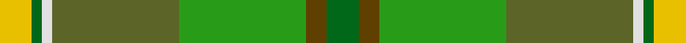
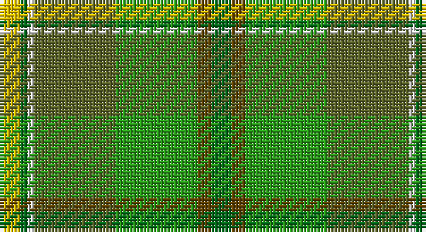

This page is one **sett** — a single exact thread-count. It belongs to the [tartan](/setts/gi3dy2g12y12w1gi1ly3/)
(the same proportion at any scale), whose colour order is pattern [GGGGWGY](/stripes/ggggwgy/).

Sourced from house-of-tartan.  It is a [7 stripe tartan](/stripes/stripes7/).

Original link http://www.house-of-tartan.scotland.net/house/TartanViewjs.asp?colr=Def&tnam=908

## Provenance

Earliest known date: 1987 The Lords Kilmarnock are descended from both the Hays (the Earls of Errol), and the Stewarts and the design incorporates elements from the Hay-Leith tartan (the red section) and the Hunting Stewart (the green section) with minor alterations to each. The representation here follows the count registered with Lord Lyon on 7th March 1956. The Boyd family are closely associated with the town of Kilmarnock in the South West of the Scottish Lowlands.

## Thread count
Y/6 G2 LN2 Gb24 Ga24 T4 G/6

One full sett is **124 threads**.

## Palette

Palette: <strong>Tartan Register</strong>
<table><thead><tr><th>Colour</th><th>Threads</th><th>Shade</th><th>Base</th><th>OKLCh</th></tr></thead><tbody><tr><td>Y/</td><td style="text-align:right;font-variant-numeric:tabular-nums">6</td><td><code style="background-color:#E8C000;">#E8C000</code> <small style="color:#888">#E8C000</small></td><td>Y <code style="background-color:#F2BF00;">#F2BF00</code></td><td><small style="color:#888">oklch(81.9% 0.168 93.7)</small></td></tr><tr><td>G</td><td style="text-align:right;font-variant-numeric:tabular-nums">2</td><td><code style="background-color:#006818;">#006818</code> <small style="color:#888">#006818</small></td><td>G <code style="background-color:#006100;">#006100</code></td><td><small style="color:#888">oklch(45.0% 0.142 145.0)</small></td></tr><tr><td>LN</td><td style="text-align:right;font-variant-numeric:tabular-nums">2</td><td><code style="background-color:#E0E0E0;">#E0E0E0</code> <small style="color:#888">#E0E0E0</small></td><td>W <code style="background-color:#F7F7F7;">#F7F7F7</code></td><td><small style="color:#888">oklch(90.7% 0.000 89.9)</small></td></tr><tr><td>Gb</td><td style="text-align:right;font-variant-numeric:tabular-nums">24</td><td><code style="background-color:#5C6428;">#5C6428</code> <small style="color:#888">#5C6428</small></td><td>G <code style="background-color:#006100;">#006100</code></td><td><small style="color:#888">oklch(48.3% 0.084 116.0)</small></td></tr><tr><td>Ga</td><td style="text-align:right;font-variant-numeric:tabular-nums">24</td><td><code style="background-color:#289C18;">#289C18</code> <small style="color:#888">#289C18</small></td><td>G <code style="background-color:#006100;">#006100</code></td><td><small style="color:#888">oklch(60.6% 0.191 141.6)</small></td></tr><tr><td>T</td><td style="text-align:right;font-variant-numeric:tabular-nums">4</td><td><code style="background-color:#604000;">#604000</code> <small style="color:#888">#604000</small></td><td>G <code style="background-color:#006100;">#006100</code></td><td><small style="color:#888">oklch(39.8% 0.083 76.8)</small></td></tr><tr><td>G/</td><td style="text-align:right;font-variant-numeric:tabular-nums">6</td><td><code style="background-color:#006818;">#006818</code> <small style="color:#888">#006818</small></td><td>G <code style="background-color:#006100;">#006100</code></td><td><small style="color:#888">oklch(45.0% 0.142 145.0)</small></td></tr></tbody></table>

# Sample pattern

## Nearest tartans

The nearest existing variants by ΔTartan distance, with this tartan at the top so the swatches line up against it.

ΔTartan

Tartan

Sett

—

<a href="/ttd/edit/#slug=gi3dy2g12y12w1gi1ly3~x2">Braemar House Corporate Tartan</a> <a class="nn-out" href="/variants/s7/gi3dy2g12y12w1gi1ly3~x2/" title="open its dictionary page">↗</a>

0.86

<a href="/ttd/edit/#slug=g3o2gi12y12w1g1ly3~x2&amp;base=gi3dy2g12y12w1gi1ly3~x2">Braemar House</a> <a class="nn-out" href="/variants/s7/g3o2gi12y12w1g1ly3~x2/" title="open its dictionary page">↗</a>

1.55

<a href="/ttd/edit/#slug=o4g3o30y12g5lgi4g3lgi14lg2lgi2lg10ly3~x2&amp;base=gi3dy2g12y12w1gi1ly3~x2">Shrek</a> <a class="nn-out" href="/variants/s12/o4g3o30y12g5lgi4g3lgi14lg2lgi2lg10ly3~x2/" title="open its dictionary page">↗</a>

1.60

<a href="/ttd/edit/#slug=gi2lo1gi12lb6g12r1~x4&amp;base=gi3dy2g12y12w1gi1ly3~x2">City of Vancouver (Commemorative)</a> <a class="nn-out" href="/variants/s6/gi2lo1gi12lb6g12r1~x4/" title="open its dictionary page">↗</a>

1.65

<a href="/ttd/edit/#slug=g29k4gi6lo4gi28loi28k1lb5~x2&amp;base=gi3dy2g12y12w1gi1ly3~x2">Keogh (Name?)</a> <a class="nn-out" href="/variants/s8/g29k4gi6lo4gi28loi28k1lb5~x2/" title="open its dictionary page">↗</a>

1.70

<a href="/ttd/edit/#slug=lo9g18t9r1w1db1~x4&amp;base=gi3dy2g12y12w1gi1ly3~x2">T.H.E. C.O.G. USA (Corporate)</a> <a class="nn-out" href="/variants/s6/lo9g18t9r1w1db1~x4/" title="open its dictionary page">↗</a>

1.74

<a href="/ttd/edit/#slug=dg70ly6lr28g56lr5g11lr5g11r12&amp;base=gi3dy2g12y12w1gi1ly3~x2">Dalwhinnie</a> <a class="nn-out" href="/variants/s9/dg70ly6lr28g56lr5g11lr5g11r12/" title="open its dictionary page">↗</a>

1.76

<a href="/ttd/edit/#slug=r2dy1dg9y1dy2y6g2y1~x4&amp;base=gi3dy2g12y12w1gi1ly3~x2">Tomass</a> <a class="nn-out" href="/variants/s8/r2dy1dg9y1dy2y6g2y1~x4/" title="open its dictionary page">↗</a>

1.83

<a href="/ttd/edit/#slug=k3g30y20o6y3o3y3dt20r2~x2&amp;base=gi3dy2g12y12w1gi1ly3~x2">Glens of Corbie (Corporate)</a> <a class="nn-out" href="/variants/s9/k3g30y20o6y3o3y3dt20r2~x2/" title="open its dictionary page">↗</a>

1.94

<a href="/ttd/edit/#slug=gi16k6gi16g32k2dy7ly2dy7ly2dy7b13&amp;base=gi3dy2g12y12w1gi1ly3~x2">Wagga Wagga (District)</a> <a class="nn-out" href="/variants/s11/gi16k6gi16g32k2dy7ly2dy7ly2dy7b13/" title="open its dictionary page">↗</a>

1.96

<a href="/ttd/edit/#slug=dg3y2g12o11w1dg1ly3~x2&amp;base=gi3dy2g12y12w1gi1ly3~x2">Braemar House</a> <a class="nn-out" href="/variants/s7/dg3y2g12o11w1dg1ly3~x2/" title="open its dictionary page">↗</a>

## Neighbour map

Every grey dot is one of 14360 variants placed by the first two principal components of the ΔTartan feature space (44% of its variance). Red is this tartan; blue dots are its nearest — click one to open its page.

<svg viewBox="0 0 640 380" role="img" style="max-width:100%;height:auto;border:1px solid #e0e0e0;border-radius:4px;display:block" xmlns="http://www.w3.org/2000/svg"><image href="/nn/cloud.v1.png" width="640" height="380"/><a href="/variants/s7/g3o2gi12y12w1g1ly3~x2/"><circle cx="224.4" cy="198.9" r="4" fill="#3465a4"><title>Braemar House</title></circle></a><a href="/variants/s12/o4g3o30y12g5lgi4g3lgi14lg2lgi2lg10ly3~x2/"><circle cx="202.4" cy="145.4" r="4" fill="#3465a4"><title>Shrek</title></circle></a><a href="/variants/s6/gi2lo1gi12lb6g12r1~x4/"><circle cx="246.1" cy="215.0" r="4" fill="#3465a4"><title>City of Vancouver (Commemorative)</title></circle></a><a href="/variants/s8/g29k4gi6lo4gi28loi28k1lb5~x2/"><circle cx="194.5" cy="140.9" r="4" fill="#3465a4"><title>Keogh (Name?)</title></circle></a><a href="/variants/s6/lo9g18t9r1w1db1~x4/"><circle cx="268.5" cy="172.2" r="4" fill="#3465a4"><title>T.H.E. C.O.G. USA (Corporate)</title></circle></a><a href="/variants/s9/dg70ly6lr28g56lr5g11lr5g11r12/"><circle cx="221.8" cy="170.8" r="4" fill="#3465a4"><title>Dalwhinnie</title></circle></a><a href="/variants/s8/r2dy1dg9y1dy2y6g2y1~x4/"><circle cx="234.2" cy="221.0" r="4" fill="#3465a4"><title>Tomass</title></circle></a><a href="/variants/s9/k3g30y20o6y3o3y3dt20r2~x2/"><circle cx="214.5" cy="178.8" r="4" fill="#3465a4"><title>Glens of Corbie (Corporate)</title></circle></a><a href="/variants/s11/gi16k6gi16g32k2dy7ly2dy7ly2dy7b13/"><circle cx="138.0" cy="156.1" r="4" fill="#3465a4"><title>Wagga Wagga (District)</title></circle></a><a href="/variants/s7/dg3y2g12o11w1dg1ly3~x2/"><circle cx="158.3" cy="158.9" r="4" fill="#3465a4"><title>Braemar House</title></circle></a><circle cx="205.9" cy="188.8" r="5" fill="#c00000"/></svg>

ID: /variants/s7/gi3dy2g12y12w1gi1ly3~x2/
