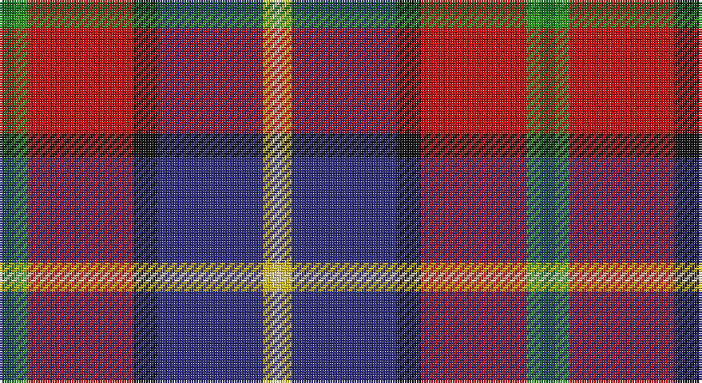

This page is one **sett** — a single exact thread-count. It belongs to the [tartan](/setts/gi3g3r22k5db22ly2w2/)
(the same proportion at any scale), whose colour order is pattern [GGRKBYW](/stripes/ggrkbyw/).

Sourced from tartans-authority.  It is a [7 stripe tartan](/stripes/stripes7/).

Original link http://www.tartansauthority.com/tartan-ferret/display/2375/

## Register references

External register numbers recorded for this tartan.

- Scottish Tartans Authority (ITI): 2375

## Thread count
Ga/6 G6 R44 K10 DB44 Y4 LR/4

One full sett is **226 threads**.

## Palette

Palette: <strong>Tartan Register</strong> <small style="color:#888">(6 of 7 colours)</small>
<table><thead><tr><th>Colour</th><th>Threads</th><th>Shade</th><th>Base</th><th>OKLCh</th></tr></thead><tbody><tr><td>Ga/</td><td style="text-align:right;font-variant-numeric:tabular-nums">6</td><td><code style="background-color:#006818;">#006818</code> <small style="color:#888">#006818</small></td><td>G <code style="background-color:#006100;">#006100</code></td><td><small style="color:#888">oklch(45.0% 0.142 145.0)</small></td></tr><tr><td>G</td><td style="text-align:right;font-variant-numeric:tabular-nums">6</td><td><code style="background-color:#289C18;">#289C18</code> <small style="color:#888">#289C18</small></td><td>G <code style="background-color:#006100;">#006100</code></td><td><small style="color:#888">oklch(60.6% 0.191 141.6)</small></td></tr><tr><td>R</td><td style="text-align:right;font-variant-numeric:tabular-nums">44</td><td><code style="background-color:#C80000;">#C80000</code> <small style="color:#888">#C80000</small></td><td>R <code style="background-color:#CC0000;">#CC0000</code></td><td><small style="color:#888">oklch(52.3% 0.215 29.2)</small></td></tr><tr><td>K</td><td style="text-align:right;font-variant-numeric:tabular-nums">10</td><td><code style="background-color:#101010;">#101010</code> <small style="color:#888">#101010</small></td><td>K <code style="background-color:#000000;">#000000</code></td><td><small style="color:#888">oklch(17.3% 0.000 89.9)</small></td></tr><tr><td>DB</td><td style="text-align:right;font-variant-numeric:tabular-nums">44</td><td><code style="background-color:#2C2C80;">#2C2C80</code> <small style="color:#888">#2C2C80</small></td><td>B <code style="background-color:#2A418A;">#2A418A</code></td><td><small style="color:#888">oklch(35.0% 0.138 276.6)</small></td></tr><tr><td>Y</td><td style="text-align:right;font-variant-numeric:tabular-nums">4</td><td><code style="background-color:#E8C000;">#E8C000</code> <small style="color:#888">#E8C000</small></td><td>Y <code style="background-color:#F2BF00;">#F2BF00</code></td><td><small style="color:#888">oklch(81.9% 0.168 93.7)</small></td></tr><tr><td>LR/</td><td style="text-align:right;font-variant-numeric:tabular-nums">4</td><td><code style="background-color:#F0D0B4;">#F0D0B4</code> <small style="color:#888">#F0D0B4</small></td><td>W <code style="background-color:#F7F7F7;">#F7F7F7</code></td><td><small style="color:#888">oklch(87.7% 0.052 63.3)</small></td></tr></tbody></table>

# Sample pattern

## Nearest tartans

The nearest existing variants by ΔTartan distance, with this tartan at the top so the swatches line up against it.

ΔTartan

Tartan

Sett

—

<a href="/ttd/edit/#slug=gi3g3r22k5db22ly2w2~x2">MacLeod Soc. of Scotland, (Comm)</a> <a class="nn-out" href="/variants/s7/gi3g3r22k5db22ly2w2~x2/" title="open its dictionary page">↗</a>

0.99

<a href="/ttd/edit/#slug=gi3g3r22k5db22ly2~x2&amp;base=gi3g3r22k5db22ly2w2~x2">MacLeod Society of Scotland</a> <a class="nn-out" href="/variants/s6/gi3g3r22k5db22ly2~x2/" title="open its dictionary page">↗</a>

1.13

<a href="/ttd/edit/#slug=w3g2r21k26db18k2db3ly3~x2&amp;base=gi3g3r22k5db22ly2w2~x2">Loch Etive</a> <a class="nn-out" href="/variants/s8/w3g2r21k26db18k2db3ly3~x2/" title="open its dictionary page">↗</a>

1.16

<a href="/ttd/edit/#slug=k4db12lb3db4g8lo2r24db4r4~x2&amp;base=gi3g3r22k5db22ly2w2~x2">MacCreary (Personal)</a> <a class="nn-out" href="/variants/s9/k4db12lb3db4g8lo2r24db4r4~x2/" title="open its dictionary page">↗</a>

1.19

<a href="/ttd/edit/#slug=ly3db3k2db18k26r21g2lb3~x2&amp;base=gi3g3r22k5db22ly2w2~x2">Loch Etive</a> <a class="nn-out" href="/variants/s8/ly3db3k2db18k26r21g2lb3~x2/" title="open its dictionary page">↗</a>

1.19

<a href="/ttd/edit/#slug=r3n2r25o12k25w2lb2~x2&amp;base=gi3g3r22k5db22ly2w2~x2">Bombeiros Voluntarios De Galicia (Co</a> <a class="nn-out" href="/variants/s7/r3n2r25o12k25w2lb2~x2/" title="open its dictionary page">↗</a>

1.22

<a href="/ttd/edit/#slug=db4ly3db22o6w2k6w2r26k3r4~x2&amp;base=gi3g3r22k5db22ly2w2~x2">Asman Red (Personal)</a> <a class="nn-out" href="/variants/s10/db4ly3db22o6w2k6w2r26k3r4~x2/" title="open its dictionary page">↗</a>

1.23

<a href="/ttd/edit/#slug=k7dbi4r31db3ly2db27lb4~x2&amp;base=gi3g3r22k5db22ly2w2~x2">Wishart Dress (Clan)</a> <a class="nn-out" href="/variants/s7/k7dbi4r31db3ly2db27lb4~x2/" title="open its dictionary page">↗</a>

1.25

<a href="/ttd/edit/#slug=k3g1r1db6n2db1n1db1r10w1~x4&amp;base=gi3g3r22k5db22ly2w2~x2">Crieff Primary School</a> <a class="nn-out" href="/variants/s10/k3g1r1db6n2db1n1db1r10w1~x4/" title="open its dictionary page">↗</a>

1.27

<a href="/ttd/edit/#slug=r24w3ly4dg18dp18y3t4~x2&amp;base=gi3g3r22k5db22ly2w2~x2">Walter (Personal)</a> <a class="nn-out" href="/variants/s7/r24w3ly4dg18dp18y3t4~x2/" title="open its dictionary page">↗</a>

1.28

<a href="/ttd/edit/#slug=r24w3ly4dg18p18dy3t4~x2&amp;base=gi3g3r22k5db22ly2w2~x2">Walter</a> <a class="nn-out" href="/variants/s7/r24w3ly4dg18p18dy3t4~x2/" title="open its dictionary page">↗</a>

## Neighbour map

Every grey dot is one of 14360 variants placed by the first two principal components of the ΔTartan feature space (44% of its variance). Red is this tartan; blue dots are its nearest — click one to open its page.

<svg viewBox="0 0 640 380" role="img" style="max-width:100%;height:auto;border:1px solid #e0e0e0;border-radius:4px;display:block" xmlns="http://www.w3.org/2000/svg"><image href="/nn/cloud.v1.png" width="640" height="380"/><a href="/variants/s6/gi3g3r22k5db22ly2~x2/"><circle cx="187.6" cy="158.5" r="4" fill="#3465a4"><title>MacLeod Society of Scotland</title></circle></a><a href="/variants/s8/w3g2r21k26db18k2db3ly3~x2/"><circle cx="152.9" cy="133.1" r="4" fill="#3465a4"><title>Loch Etive</title></circle></a><a href="/variants/s9/k4db12lb3db4g8lo2r24db4r4~x2/"><circle cx="182.0" cy="135.7" r="4" fill="#3465a4"><title>MacCreary (Personal)</title></circle></a><a href="/variants/s8/ly3db3k2db18k26r21g2lb3~x2/"><circle cx="157.9" cy="136.8" r="4" fill="#3465a4"><title>Loch Etive</title></circle></a><a href="/variants/s7/r3n2r25o12k25w2lb2~x2/"><circle cx="185.7" cy="136.1" r="4" fill="#3465a4"><title>Bombeiros Voluntarios De Galicia (Co</title></circle></a><a href="/variants/s10/db4ly3db22o6w2k6w2r26k3r4~x2/"><circle cx="168.4" cy="112.1" r="4" fill="#3465a4"><title>Asman Red (Personal)</title></circle></a><a href="/variants/s7/k7dbi4r31db3ly2db27lb4~x2/"><circle cx="199.4" cy="127.5" r="4" fill="#3465a4"><title>Wishart Dress (Clan)</title></circle></a><a href="/variants/s10/k3g1r1db6n2db1n1db1r10w1~x4/"><circle cx="178.8" cy="129.4" r="4" fill="#3465a4"><title>Crieff Primary School</title></circle></a><a href="/variants/s7/r24w3ly4dg18dp18y3t4~x2/"><circle cx="93.4" cy="150.9" r="4" fill="#3465a4"><title>Walter (Personal)</title></circle></a><a href="/variants/s7/r24w3ly4dg18p18dy3t4~x2/"><circle cx="94.7" cy="152.0" r="4" fill="#3465a4"><title>Walter</title></circle></a><circle cx="155.9" cy="126.1" r="5" fill="#c00000"/></svg>

ID: /variants/s7/gi3g3r22k5db22ly2w2~x2/
