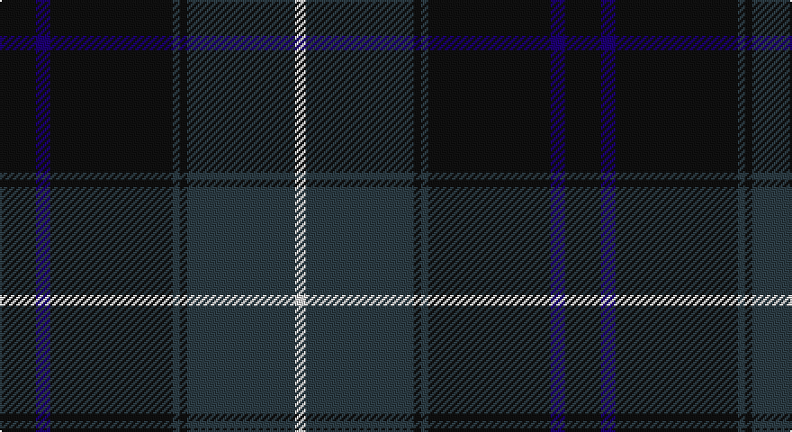

This page is one **sett** — a single exact thread-count. It belongs to the [tartan](/setts/k10db4k34dt2k2dt30w3/)
(the same proportion at any scale), whose colour order is pattern [KBKBKBW](/stripes/kbkbkbw/).

Sourced from tartans-authority.  It is a [7 stripe tartan](/stripes/stripes7/).

Original link http://www.tartansauthority.com/tartan-ferret/display/7343/

## Provenance

Earliest known date: pre 2009 The Patriot tartan has been especially designed for those proud of their Scots connections. The colours in the design are navy blue, black, royal blue and white. The influence for the design comes from the Douglas tartan, in homage to one of Scotland's greatest patriots, Sir James (Black) Douglas.

## Also known as

This cloth is also recorded under:

- Patriot, The

3 attestations — the source records this cloth was collapsed from (oldest owns this page)

<ul>
<li>Sept 2007 — Patriot, The (Fashion) (tartans-authority, <a href="http://www.tartansauthority.com/tartan-ferret/display/7343/">record</a>)</li>
<li>undated — Patriot, The (register-of-tartans, <a href="https://www.tartanregister.gov.uk/tartanDetails.aspx?ref=5459">record</a>)</li>
<li>undated — Patriot Weavers Tartan (house-of-tartan, <a href="http://www.house-of-tartan.scotland.net/house/TartanViewjs.asp?colr=Def&tnam=7343">record</a>)</li>
</ul>

## Register references

External register numbers recorded for this tartan.

- Scottish Register of Tartans: [5459](https://www.tartanregister.gov.uk/tartanDetails.aspx?ref=5459)
- Scottish Tartans Authority (ITI): 7343

## Thread count
K/20 DB8 K68 DN4 K4 DN60 LN/6

One full sett is **314 threads**.

## Palette

Palette: <strong>Tartan Register</strong> <small style="color:#888">(3 of 4 colours)</small>
<table><thead><tr><th>Colour</th><th>Threads</th><th>Shade</th><th>Base</th><th>OKLCh</th></tr></thead><tbody><tr><td>K/</td><td style="text-align:right;font-variant-numeric:tabular-nums">20</td><td><code style="background-color:#101010;">#101010</code> <small style="color:#888">#101010</small></td><td>K <code style="background-color:#000000;">#000000</code></td><td><small style="color:#888">oklch(17.3% 0.000 89.9)</small></td></tr><tr><td>DB</td><td style="text-align:right;font-variant-numeric:tabular-nums">8</td><td><code style="background-color:#1C0070;">#1C0070</code> <small style="color:#888">#1C0070</small></td><td>B <code style="background-color:#2A418A;">#2A418A</code></td><td><small style="color:#888">oklch(26.3% 0.162 277.1)</small></td></tr><tr><td>K</td><td style="text-align:right;font-variant-numeric:tabular-nums">68</td><td><code style="background-color:#101010;">#101010</code> <small style="color:#888">#101010</small></td><td>K <code style="background-color:#000000;">#000000</code></td><td><small style="color:#888">oklch(17.3% 0.000 89.9)</small></td></tr><tr><td>DN</td><td style="text-align:right;font-variant-numeric:tabular-nums">4</td><td><code style="background-color:#2C3C44;">#2C3C44</code> <small style="color:#888">#2C3C44</small></td><td>B <code style="background-color:#2A418A;">#2A418A</code></td><td><small style="color:#888">oklch(34.6% 0.025 230.0)</small></td></tr><tr><td>K</td><td style="text-align:right;font-variant-numeric:tabular-nums">4</td><td><code style="background-color:#101010;">#101010</code> <small style="color:#888">#101010</small></td><td>K <code style="background-color:#000000;">#000000</code></td><td><small style="color:#888">oklch(17.3% 0.000 89.9)</small></td></tr><tr><td>DN</td><td style="text-align:right;font-variant-numeric:tabular-nums">60</td><td><code style="background-color:#2C3C44;">#2C3C44</code> <small style="color:#888">#2C3C44</small></td><td>B <code style="background-color:#2A418A;">#2A418A</code></td><td><small style="color:#888">oklch(34.6% 0.025 230.0)</small></td></tr><tr><td>LN/</td><td style="text-align:right;font-variant-numeric:tabular-nums">6</td><td><code style="background-color:#E0E0E0;">#E0E0E0</code> <small style="color:#888">#E0E0E0</small></td><td>W <code style="background-color:#F7F7F7;">#F7F7F7</code></td><td><small style="color:#888">oklch(90.7% 0.000 89.9)</small></td></tr></tbody></table>

# Sample pattern

## Nearest tartans

The nearest existing variants by ΔTartan distance, with this tartan at the top so the swatches line up against it.

ΔTartan

Tartan

Sett

—

<a href="/ttd/edit/#slug=k10db4k34dt2k2dt30w3~x2">Patriot, The (Fashion)</a> <a class="nn-out" href="/variants/s7/k10db4k34dt2k2dt30w3~x2/" title="open its dictionary page">↗</a>

0.87

<a href="/ttd/edit/#slug=k20r1dg3k8dg2k2dg20w2~x2&amp;base=k10db4k34dt2k2dt30w3~x2">Scottish Chieftain (Universal)</a> <a class="nn-out" href="/variants/s8/k20r1dg3k8dg2k2dg20w2~x2/" title="open its dictionary page">↗</a>

1.11

<a href="/ttd/edit/#slug=k4r1k4r1dg14n1dg1~x4&amp;base=k10db4k34dt2k2dt30w3~x2">Pinehurst Resort</a> <a class="nn-out" href="/variants/s7/k4r1k4r1dg14n1dg1~x4/" title="open its dictionary page">↗</a>

1.11

<a href="/ttd/edit/#slug=k4r2k12db12k1lo2~x2&amp;base=k10db4k34dt2k2dt30w3~x2">Robert Gordon University</a> <a class="nn-out" href="/variants/s6/k4r2k12db12k1lo2~x2/" title="open its dictionary page">↗</a>

1.21

<a href="/ttd/edit/#slug=r4dg3k2dg38db30k3db3k3~x2&amp;base=k10db4k34dt2k2dt30w3~x2">Peter of Lee</a> <a class="nn-out" href="/variants/s8/r4dg3k2dg38db30k3db3k3~x2/" title="open its dictionary page">↗</a>

1.23

<a href="/ttd/edit/#slug=k28r1k2r1k8db24dg2db3~x2&amp;base=k10db4k34dt2k2dt30w3~x2">Home or Hume (Vestiarium Scoticum)</a> <a class="nn-out" href="/variants/s8/k28r1k2r1k8db24dg2db3~x2/" title="open its dictionary page">↗</a>

1.25

<a href="/ttd/edit/#slug=k4db36k4db4k34b3k3w4~x2&amp;base=k10db4k34dt2k2dt30w3~x2">Slanj Dress (Corporate)</a> <a class="nn-out" href="/variants/s8/k4db36k4db4k34b3k3w4~x2/" title="open its dictionary page">↗</a>

1.25

<a href="/ttd/edit/#slug=dg28r12dg4k20lo2k3lo2k3dg7~x2&amp;base=k10db4k34dt2k2dt30w3~x2">Cork, County (District)</a> <a class="nn-out" href="/variants/s9/dg28r12dg4k20lo2k3lo2k3dg7~x2/" title="open its dictionary page">↗</a>

1.25

<a href="/ttd/edit/#slug=r4dt4k2dt31k10ly3dt5k11dt6k3~x2&amp;base=k10db4k34dt2k2dt30w3~x2">MacArthur Fox Green (Personal)</a> <a class="nn-out" href="/variants/s10/r4dt4k2dt31k10ly3dt5k11dt6k3~x2/" title="open its dictionary page">↗</a>

1.25

<a href="/ttd/edit/#slug=m4dg9w2dg24dt37r3~x2&amp;base=k10db4k34dt2k2dt30w3~x2">Hardie (Name)</a> <a class="nn-out" href="/variants/s6/m4dg9w2dg24dt37r3~x2/" title="open its dictionary page">↗</a>

1.27

<a href="/ttd/edit/#slug=k32b2k6b2k13n30w2~x2&amp;base=k10db4k34dt2k2dt30w3~x2">Mountain Rescue Association Honor Guard</a> <a class="nn-out" href="/variants/s7/k32b2k6b2k13n30w2~x2/" title="open its dictionary page">↗</a>

## Neighbour map

Every grey dot is one of 14360 variants placed by the first two principal components of the ΔTartan feature space (44% of its variance). Red is this tartan; blue dots are its nearest — click one to open its page.

<svg viewBox="0 0 640 380" role="img" style="max-width:100%;height:auto;border:1px solid #e0e0e0;border-radius:4px;display:block" xmlns="http://www.w3.org/2000/svg"><image href="/nn/cloud.v1.png" width="640" height="380"/><a href="/variants/s8/k20r1dg3k8dg2k2dg20w2~x2/"><circle cx="393.0" cy="206.1" r="4" fill="#3465a4"><title>Scottish Chieftain (Universal)</title></circle></a><a href="/variants/s7/k4r1k4r1dg14n1dg1~x4/"><circle cx="393.1" cy="207.8" r="4" fill="#3465a4"><title>Pinehurst Resort</title></circle></a><a href="/variants/s6/k4r2k12db12k1lo2~x2/"><circle cx="338.6" cy="238.5" r="4" fill="#3465a4"><title>Robert Gordon University</title></circle></a><a href="/variants/s8/r4dg3k2dg38db30k3db3k3~x2/"><circle cx="358.6" cy="191.4" r="4" fill="#3465a4"><title>Peter of Lee</title></circle></a><a href="/variants/s8/k28r1k2r1k8db24dg2db3~x2/"><circle cx="424.2" cy="178.3" r="4" fill="#3465a4"><title>Home or Hume (Vestiarium Scoticum)</title></circle></a><a href="/variants/s8/k4db36k4db4k34b3k3w4~x2/"><circle cx="348.3" cy="203.3" r="4" fill="#3465a4"><title>Slanj Dress (Corporate)</title></circle></a><a href="/variants/s9/dg28r12dg4k20lo2k3lo2k3dg7~x2/"><circle cx="318.9" cy="203.7" r="4" fill="#3465a4"><title>Cork, County (District)</title></circle></a><a href="/variants/s10/r4dt4k2dt31k10ly3dt5k11dt6k3~x2/"><circle cx="375.6" cy="190.5" r="4" fill="#3465a4"><title>MacArthur Fox Green (Personal)</title></circle></a><a href="/variants/s6/m4dg9w2dg24dt37r3~x2/"><circle cx="333.8" cy="201.4" r="4" fill="#3465a4"><title>Hardie (Name)</title></circle></a><a href="/variants/s7/k32b2k6b2k13n30w2~x2/"><circle cx="376.9" cy="203.3" r="4" fill="#3465a4"><title>Mountain Rescue Association Honor Guard</title></circle></a><circle cx="388.5" cy="211.4" r="5" fill="#c00000"/></svg>

ID: /variants/s7/k10db4k34dt2k2dt30w3~x2/
