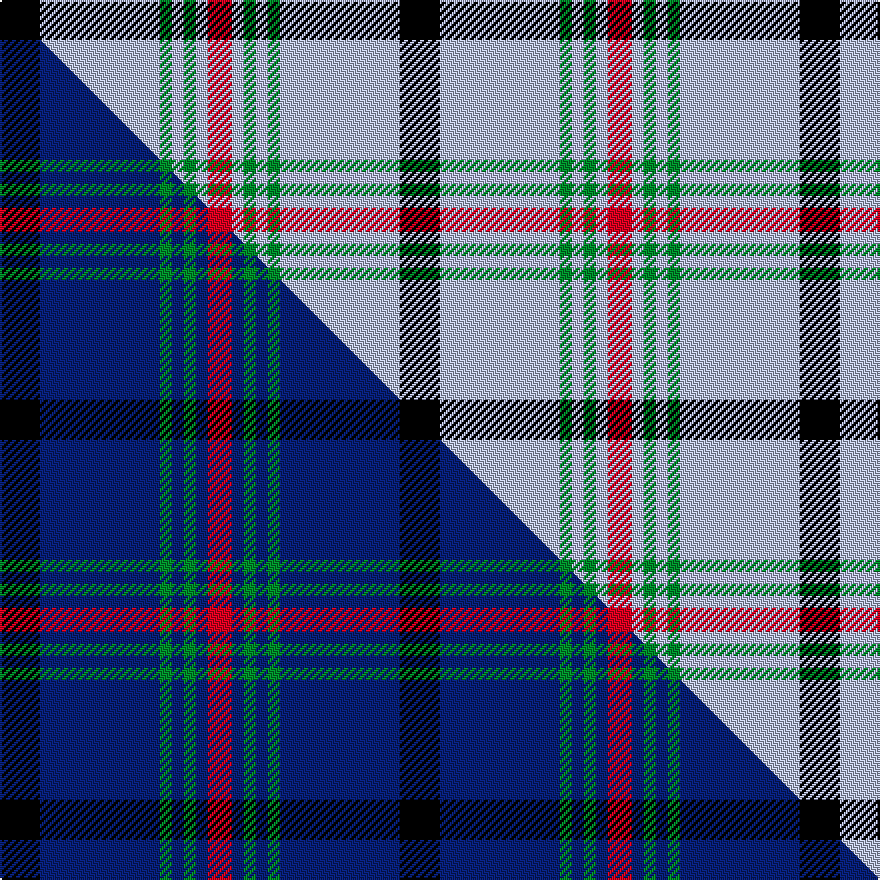

This page is one **sett** — a single exact thread-count. It belongs to the [tartan](/setts/k10lb30g3lb3g3lb3r6/)
(the same proportion at any scale), whose colour order is pattern [KWGWGWR](/stripes/kwgwgwr/).

Part of the [Kinding](/tartans/kinding/) tartan — the named design grouping this sett with its other cloths.

Sourced from tartans-authority.  It is a [7 stripe tartan](/stripes/stripes7/).

Original link http://www.tartansauthority.com/tartan-ferret/display/10091/

## Register references

External register numbers recorded for this tartan.

- Scottish Tartans Authority (ITI): 10091

## Thread count
K/20 LB60 G6 LB6 G6 LB6 R/12

One full sett is **200 threads**.

## Palette
<table><thead><tr><th>Colour</th><th>Shade</th><th>OKLCh</th></tr></thead><tbody><tr><td>LB</td><td><code style="background-color:#B5BBDE;">#B5BBDE</code> <small style="color:#888">#B5BBDE</small></td><td><small style="color:#888">oklch(79.9% 0.050 277.6)</small></td></tr><tr><td>G</td><td><code style="background-color:#008B2A;">#008B2A</code> <small style="color:#888">#008B2A</small></td><td><small style="color:#888">oklch(55.4% 0.170 145.9)</small></td></tr><tr><td>K</td><td><code style="background-color:#000000;">#000000</code> <small style="color:#888">#000000</small></td><td><small style="color:#888">oklch(0.0% 0.000 0.0)</small></td></tr><tr><td>R</td><td><code style="background-color:#D60020;">#D60020</code> <small style="color:#888">#D60020</small></td><td><small style="color:#888">oklch(55.2% 0.224 25.5)</small></td></tr></tbody></table>

# Sample pattern

## Compared to the master

This cloth is one sett of its design; the master sett (the exemplar the design is anchored on) is below for comparison.

Its **ΔTartan distance** from the master is **2.82** — the same measure the nearest-tartans table ranks by (0 is identical; a re-scale of the same cloth is near 0, a recolour or a different proportion further).

<figure class="master-compare" style="margin:0">

this sett
master sett ★

<figcaption style="color:#888;font-size:smaller">One weave of this sett against the <a href="/setts/k10db30g3db3g3db3r6/">master sett ★</a>, split on the diagonal: a shared proportion runs seamlessly across it with only the shades shifting; a different proportion breaks on it.</figcaption>
</figure>

## Nearest tartan variants

The nearest existing variants by ΔTartan distance, with this cloth at the top so the swatches line up against it.

ΔTartan

Threads

Variant

Sett

—

200

<a href="/variants/s7/k10lb30g3lb3g3lb3r6~x2/">Kinding (Personal)</a>

<a href="/ttd/edit/#slug=k3lb2g13w2lb24dr3~x4&amp;base=k10lb30g3lb3g3lb3r6~x2" title="compare in the TTD">2.29</a>

352

<a href="/variants/s6/k3lb2g13w2lb24dr3~x4/">Vance (Name?)</a>

<a href="/ttd/edit/#slug=lb12y2lb1k5lb4k2~x4&amp;base=k10lb30g3lb3g3lb3r6~x2" title="compare in the TTD">2.32</a>

152

<a href="/variants/s6/lb12y2lb1k5lb4k2~x4/">Rea</a>

<a href="/ttd/edit/#slug=r3g2k9lb2k2lb24y2lb2y1~x4&amp;base=k10lb30g3lb3g3lb3r6~x2" title="compare in the TTD">2.65</a>

360

<a href="/variants/s9/r3g2k9lb2k2lb24y2lb2y1~x4/">Bell of the Borders (Name)</a>

<a href="/ttd/edit/#slug=r3dg2k9lb2k2lb24y2lb2y1~x2&amp;base=k10lb30g3lb3g3lb3r6~x2" title="compare in the TTD">2.65</a>

180

<a href="/variants/s9/r3dg2k9lb2k2lb24y2lb2y1~x2/">Bell Family Tartan</a>

<a href="/ttd/edit/#slug=db32k2db4k2db8ly29w2k2&amp;base=k10lb30g3lb3g3lb3r6~x2" title="compare in the TTD">2.75</a>

128

<a href="/variants/s8/db32k2db4k2db8ly29w2k2/">Southern Lakes</a>

<a href="/ttd/edit/#slug=k3lb10dy5lb29k10r6k2~x2&amp;base=k10lb30g3lb3g3lb3r6~x2" title="compare in the TTD">2.87</a>

250

<a href="/variants/s7/k3lb10dy5lb29k10r6k2~x2/">Perkins 2015</a>

## Neighbour map

Every grey dot is one of 13620 variants placed by the first two principal components of the ΔTartan feature space (42% of its variance). Red is this tartan; blue dots are its nearest — click one to open its page.

<svg viewBox="0 0 640 380" role="img" style="max-width:100%;height:auto;border:1px solid #e0e0e0;border-radius:4px;display:block" xmlns="http://www.w3.org/2000/svg"><image href="/nn/cloud.v1.png" width="640" height="380"/><a href="/variants/s6/k3lb2g13w2lb24dr3~x4/"><circle cx="260.7" cy="164.5" r="4" fill="#3465a4"><title>Vance (Name?)</title></circle></a><a href="/variants/s6/lb12y2lb1k5lb4k2~x4/"><circle cx="331.0" cy="194.3" r="4" fill="#3465a4"><title>Rea</title></circle></a><a href="/variants/s9/r3g2k9lb2k2lb24y2lb2y1~x4/"><circle cx="281.6" cy="88.2" r="4" fill="#3465a4"><title>Bell of the Borders (Name)</title></circle></a><a href="/variants/s9/r3dg2k9lb2k2lb24y2lb2y1~x2/"><circle cx="281.5" cy="87.7" r="4" fill="#3465a4"><title>Bell Family Tartan</title></circle></a><a href="/variants/s8/db32k2db4k2db8ly29w2k2/"><circle cx="274.9" cy="136.1" r="4" fill="#3465a4"><title>Southern Lakes</title></circle></a><a href="/variants/s7/k3lb10dy5lb29k10r6k2~x2/"><circle cx="264.4" cy="150.7" r="4" fill="#3465a4"><title>Perkins 2015</title></circle></a><circle cx="283.3" cy="157.6" r="5" fill="#c00000"/><text x="320" y="376" text-anchor="middle" font-size="11" fill="#999">ground</text><text x="11" y="190" text-anchor="middle" font-size="11" fill="#999" transform="rotate(-90 11 190)">complexity</text></svg>

ID: /variants/s7/k10lb30g3lb3g3lb3r6~x2/
