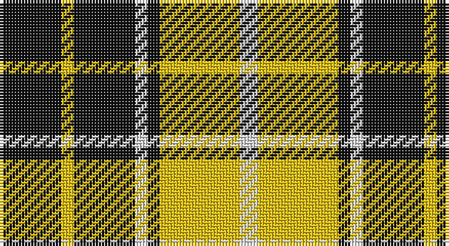

This page is one **sett** — a single exact thread-count. It belongs to the [tartan](/setts/k10ly2k10w2k2ly13w3/)
(the same proportion at any scale), whose colour order is pattern [KYKWKYW](/stripes/kykwkyw/).

Sourced from register-of-tartans.  It is a [7 stripe tartan](/stripes/stripes7/).

Original link https://www.tartanregister.gov.uk/tartanDetails.aspx?ref=3145

2 attestations — the source records this cloth was collapsed from (oldest owns this page)

<ul>
<li>01/01/2002 — Nooten-Boom (Personal) (register-of-tartans, <a href="https://www.tartanregister.gov.uk/tartanDetails.aspx?ref=3145">record</a>)</li>
<li>2002 — Nooten-Boom (Personal) (tartans-authority, <a href="http://www.tartansauthority.com/tartan-ferret/display/4021/">record</a>)</li>
</ul>

## Register references

External register numbers recorded for this tartan.

- Scottish Register of Tartans: [3145](https://www.tartanregister.gov.uk/tartanDetails.aspx?ref=3145)
- Scottish Tartans Authority (ITI): 4021
- Scottish Tartans World Register: 3070

## Thread count
K/20 Y4 K20 LN4 K4 Y26 LN/6

One full sett is **142 threads**.

## Palette

Palette: <strong>Tartan Register</strong>
<table><thead><tr><th>Colour</th><th>Threads</th><th>Shade</th><th>Base</th><th>OKLCh</th></tr></thead><tbody><tr><td>K/</td><td style="text-align:right;font-variant-numeric:tabular-nums">20</td><td><code style="background-color:#101010;">#101010</code> <small style="color:#888">#101010</small></td><td>K <code style="background-color:#000000;">#000000</code></td><td><small style="color:#888">oklch(17.3% 0.000 89.9)</small></td></tr><tr><td>Y</td><td style="text-align:right;font-variant-numeric:tabular-nums">4</td><td><code style="background-color:#E8C000;">#E8C000</code> <small style="color:#888">#E8C000</small></td><td>Y <code style="background-color:#F2BF00;">#F2BF00</code></td><td><small style="color:#888">oklch(81.9% 0.168 93.7)</small></td></tr><tr><td>K</td><td style="text-align:right;font-variant-numeric:tabular-nums">20</td><td><code style="background-color:#101010;">#101010</code> <small style="color:#888">#101010</small></td><td>K <code style="background-color:#000000;">#000000</code></td><td><small style="color:#888">oklch(17.3% 0.000 89.9)</small></td></tr><tr><td>LN</td><td style="text-align:right;font-variant-numeric:tabular-nums">4</td><td><code style="background-color:#E0E0E0;">#E0E0E0</code> <small style="color:#888">#E0E0E0</small></td><td>W <code style="background-color:#F7F7F7;">#F7F7F7</code></td><td><small style="color:#888">oklch(90.7% 0.000 89.9)</small></td></tr><tr><td>K</td><td style="text-align:right;font-variant-numeric:tabular-nums">4</td><td><code style="background-color:#101010;">#101010</code> <small style="color:#888">#101010</small></td><td>K <code style="background-color:#000000;">#000000</code></td><td><small style="color:#888">oklch(17.3% 0.000 89.9)</small></td></tr><tr><td>Y</td><td style="text-align:right;font-variant-numeric:tabular-nums">26</td><td><code style="background-color:#E8C000;">#E8C000</code> <small style="color:#888">#E8C000</small></td><td>Y <code style="background-color:#F2BF00;">#F2BF00</code></td><td><small style="color:#888">oklch(81.9% 0.168 93.7)</small></td></tr><tr><td>LN/</td><td style="text-align:right;font-variant-numeric:tabular-nums">6</td><td><code style="background-color:#E0E0E0;">#E0E0E0</code> <small style="color:#888">#E0E0E0</small></td><td>W <code style="background-color:#F7F7F7;">#F7F7F7</code></td><td><small style="color:#888">oklch(90.7% 0.000 89.9)</small></td></tr></tbody></table>

# Sample pattern

## Nearest tartans

The nearest existing variants by ΔTartan distance, with this tartan at the top so the swatches line up against it.

ΔTartan

Tartan

Sett

—

<a href="/ttd/edit/#slug=k10ly2k10w2k2ly13w3~x2">Nooten-Boom (Personal)</a> <a class="nn-out" href="/variants/s7/k10ly2k10w2k2ly13w3~x2/" title="open its dictionary page">↗</a>

0.94

<a href="/ttd/edit/#slug=k6ly1k6ly9r1ly2~x2&amp;base=k10ly2k10w2k2ly13w3~x2">MacLeod #3</a> <a class="nn-out" href="/variants/s6/k6ly1k6ly9r1ly2~x2/" title="open its dictionary page">↗</a>

1.07

<a href="/ttd/edit/#slug=k4ly1k4ly6r1~x4&amp;base=k10ly2k10w2k2ly13w3~x2">MacLeod Dress Clan Tartan</a> <a class="nn-out" href="/variants/s5/k4ly1k4ly6r1~x4/" title="open its dictionary page">↗</a>

1.21

<a href="/ttd/edit/#slug=k4ly32k16r3k16ly4~x2&amp;base=k10ly2k10w2k2ly13w3~x2">Unnamed C21st - Fashion</a> <a class="nn-out" href="/variants/s6/k4ly32k16r3k16ly4~x2/" title="open its dictionary page">↗</a>

1.25

<a href="/ttd/edit/#slug=r8ly6k11ly6k11ly30r3~x2&amp;base=k10ly2k10w2k2ly13w3~x2">Blackberry (Fashion)</a> <a class="nn-out" href="/variants/s7/r8ly6k11ly6k11ly30r3~x2/" title="open its dictionary page">↗</a>

1.27

<a href="/ttd/edit/#slug=w7k6lo15k16k8w3~x2&amp;base=k10ly2k10w2k2ly13w3~x2">Longford County, Crest Range</a> <a class="nn-out" href="/variants/s6/w7k6lo15k16k8w3~x2/" title="open its dictionary page">↗</a>

1.34

<a href="/ttd/edit/#slug=k9r9k25w30k5w5r7&amp;base=k10ly2k10w2k2ly13w3~x2">Rocket Dog (Fashion)</a> <a class="nn-out" href="/variants/s7/k9r9k25w30k5w5r7/" title="open its dictionary page">↗</a>

1.34

<a href="/ttd/edit/#slug=dg14o5dg14w5k2o5k2w9~x4&amp;base=k10ly2k10w2k2ly13w3~x2">Unnamed (Hip Flask)</a> <a class="nn-out" href="/variants/s8/dg14o5dg14w5k2o5k2w9~x4/" title="open its dictionary page">↗</a>

1.37

<a href="/ttd/edit/#slug=w1ly6k6ly1~x8&amp;base=k10ly2k10w2k2ly13w3~x2">Barclay Dress Clan Tartan</a> <a class="nn-out" href="/variants/s4/w1ly6k6ly1~x8/" title="open its dictionary page">↗</a>

1.38

<a href="/ttd/edit/#slug=k8ly1k8ly12r1~x4&amp;base=k10ly2k10w2k2ly13w3~x2">MacLeod of Lewis (Vestiarium Scoticum)</a> <a class="nn-out" href="/variants/s5/k8ly1k8ly12r1~x4/" title="open its dictionary page">↗</a>

1.41

<a href="/ttd/edit/#slug=w1ly6k6ly1~x2&amp;base=k10ly2k10w2k2ly13w3~x2">Barclay Dress</a> <a class="nn-out" href="/variants/s4/w1ly6k6ly1~x2/" title="open its dictionary page">↗</a>

## Neighbour map

Every grey dot is one of 14360 variants placed by the first two principal components of the ΔTartan feature space (44% of its variance). Red is this tartan; blue dots are its nearest — click one to open its page.

<svg viewBox="0 0 640 380" role="img" style="max-width:100%;height:auto;border:1px solid #e0e0e0;border-radius:4px;display:block" xmlns="http://www.w3.org/2000/svg"><image href="/nn/cloud.v1.png" width="640" height="380"/><a href="/variants/s6/k6ly1k6ly9r1ly2~x2/"><circle cx="255.3" cy="217.7" r="4" fill="#3465a4"><title>MacLeod #3</title></circle></a><a href="/variants/s5/k4ly1k4ly6r1~x4/"><circle cx="233.8" cy="251.7" r="4" fill="#3465a4"><title>MacLeod Dress Clan Tartan</title></circle></a><a href="/variants/s6/k4ly32k16r3k16ly4~x2/"><circle cx="266.6" cy="199.1" r="4" fill="#3465a4"><title>Unnamed C21st - Fashion</title></circle></a><a href="/variants/s7/r8ly6k11ly6k11ly30r3~x2/"><circle cx="276.4" cy="198.9" r="4" fill="#3465a4"><title>Blackberry (Fashion)</title></circle></a><a href="/variants/s6/w7k6lo15k16k8w3~x2/"><circle cx="217.3" cy="262.4" r="4" fill="#3465a4"><title>Longford County, Crest Range</title></circle></a><a href="/variants/s7/k9r9k25w30k5w5r7/"><circle cx="188.1" cy="215.6" r="4" fill="#3465a4"><title>Rocket Dog (Fashion)</title></circle></a><a href="/variants/s8/dg14o5dg14w5k2o5k2w9~x4/"><circle cx="188.6" cy="213.0" r="4" fill="#3465a4"><title>Unnamed (Hip Flask)</title></circle></a><a href="/variants/s4/w1ly6k6ly1~x8/"><circle cx="240.6" cy="245.8" r="4" fill="#3465a4"><title>Barclay Dress Clan Tartan</title></circle></a><a href="/variants/s5/k8ly1k8ly12r1~x4/"><circle cx="296.0" cy="220.8" r="4" fill="#3465a4"><title>MacLeod of Lewis (Vestiarium Scoticum)</title></circle></a><a href="/variants/s4/w1ly6k6ly1~x2/"><circle cx="233.8" cy="250.5" r="4" fill="#3465a4"><title>Barclay Dress</title></circle></a><circle cx="234.8" cy="220.3" r="5" fill="#c00000"/></svg>

ID: /variants/s7/k10ly2k10w2k2ly13w3~x2/
