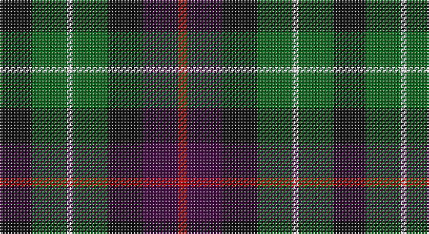

This page is one **sett** — a single exact thread-count. It belongs to the [tartan](/setts/k11g12w2g12k12dp12r3/)
(the same proportion at any scale), whose colour order is pattern [KGWGKBR](/stripes/kgwgkbr/).

Sourced from register-of-tartans.  It is a [7 stripe tartan](/stripes/stripes7/).

Original link https://www.tartanregister.gov.uk/tartanDetails.aspx?ref=845

## Register references

External register numbers recorded for this tartan.

- Scottish Register of Tartans: [845](https://www.tartanregister.gov.uk/tartanDetails.aspx?ref=845)
- Scottish Tartans Authority (ITI): 1115
- Scottish Tartans World Register: 1115

## Thread count
K/22 G24 LN4 G24 K24 DP24 R/6

One full sett is **228 threads**.

## Palette

Palette: <strong>Tartan Register</strong>
<table><thead><tr><th>Colour</th><th>Threads</th><th>Shade</th><th>Base</th><th>OKLCh</th></tr></thead><tbody><tr><td>K/</td><td style="text-align:right;font-variant-numeric:tabular-nums">22</td><td><code style="background-color:#101010;">#101010</code> <small style="color:#888">#101010</small></td><td>K <code style="background-color:#000000;">#000000</code></td><td><small style="color:#888">oklch(17.3% 0.000 89.9)</small></td></tr><tr><td>G</td><td style="text-align:right;font-variant-numeric:tabular-nums">24</td><td><code style="background-color:#006818;">#006818</code> <small style="color:#888">#006818</small></td><td>G <code style="background-color:#006100;">#006100</code></td><td><small style="color:#888">oklch(45.0% 0.142 145.0)</small></td></tr><tr><td>LN</td><td style="text-align:right;font-variant-numeric:tabular-nums">4</td><td><code style="background-color:#E0E0E0;">#E0E0E0</code> <small style="color:#888">#E0E0E0</small></td><td>W <code style="background-color:#F7F7F7;">#F7F7F7</code></td><td><small style="color:#888">oklch(90.7% 0.000 89.9)</small></td></tr><tr><td>G</td><td style="text-align:right;font-variant-numeric:tabular-nums">24</td><td><code style="background-color:#006818;">#006818</code> <small style="color:#888">#006818</small></td><td>G <code style="background-color:#006100;">#006100</code></td><td><small style="color:#888">oklch(45.0% 0.142 145.0)</small></td></tr><tr><td>K</td><td style="text-align:right;font-variant-numeric:tabular-nums">24</td><td><code style="background-color:#101010;">#101010</code> <small style="color:#888">#101010</small></td><td>K <code style="background-color:#000000;">#000000</code></td><td><small style="color:#888">oklch(17.3% 0.000 89.9)</small></td></tr><tr><td>DP</td><td style="text-align:right;font-variant-numeric:tabular-nums">24</td><td><code style="background-color:#440044;">#440044</code> <small style="color:#888">#440044</small></td><td>B <code style="background-color:#2A418A;">#2A418A</code></td><td><small style="color:#888">oklch(27.1% 0.125 328.4)</small></td></tr><tr><td>R/</td><td style="text-align:right;font-variant-numeric:tabular-nums">6</td><td><code style="background-color:#C80000;">#C80000</code> <small style="color:#888">#C80000</small></td><td>R <code style="background-color:#CC0000;">#CC0000</code></td><td><small style="color:#888">oklch(52.3% 0.215 29.2)</small></td></tr></tbody></table>

# Sample pattern

## Nearest tartans

The nearest existing variants by ΔTartan distance, with this tartan at the top so the swatches line up against it.

ΔTartan

Tartan

Sett

—

<a href="/ttd/edit/#slug=k11g12w2g12k12dp12r3~x2">Cunningham / Wilson's No 120</a> <a class="nn-out" href="/variants/s7/k11g12w2g12k12dp12r3~x2/" title="open its dictionary page">↗</a>

0.66

<a href="/variants/s8/dp11t2k10g10ly3~x2/">Wilson's No.217</a>

0.67

<a href="/ttd/edit/#slug=db14g18k3g18r20k14lo3~x2&amp;base=k11g12w2g12k12dp12r3~x2">Scottish Parliament (unofficial)</a> <a class="nn-out" href="/variants/s7/db14g18k3g18r20k14lo3~x2/" title="open its dictionary page">↗</a>

0.71

<a href="/variants/s8/dp11y2k10g10lo2~x2/">Selkirk (Personal) Original</a>

0.75

<a href="/variants/s8/k8t3g13dp12ly2~x2/">Wilson's No.176</a>

0.86

<a href="/ttd/edit/#slug=r1dr7db7k7g7dr7r1~x4&amp;base=k11g12w2g12k12dp12r3~x2">Tennant</a> <a class="nn-out" href="/variants/s7/r1dr7db7k7g7dr7r1~x4/" title="open its dictionary page">↗</a>

1.05

<a href="/ttd/edit/#slug=k13g12w2g12k13dp12k2~x2&amp;base=k11g12w2g12k12dp12r3~x2">MacLaggan</a> <a class="nn-out" href="/variants/s7/k13g12w2g12k13dp12k2~x2/" title="open its dictionary page">↗</a>

1.10

<a href="/ttd/edit/#slug=r2k8lo1k8g8t8r2~x4&amp;base=k11g12w2g12k12dp12r3~x2">Brodie Hunting</a> <a class="nn-out" href="/variants/s7/r2k8lo1k8g8t8r2~x4/" title="open its dictionary page">↗</a>

1.11

<a href="/ttd/edit/#slug=k11dg12k2dg12k12dp12w3~x2&amp;base=k11g12w2g12k12dp12r3~x2">Wilson's No 97</a> <a class="nn-out" href="/variants/s7/k11dg12k2dg12k12dp12w3~x2/" title="open its dictionary page">↗</a>

1.15

<a href="/ttd/edit/#slug=db8k4lo2k3r2k3lo2k4g8~x4&amp;base=k11g12w2g12k12dp12r3~x2">Vosko</a> <a class="nn-out" href="/variants/s9/db8k4lo2k3r2k3lo2k4g8~x4/" title="open its dictionary page">↗</a>

1.16

<a href="/ttd/edit/#slug=k19g3db19lo5db19g3k19g19r7g19~x2&amp;base=k11g12w2g12k12dp12r3~x2">Casely Family Tartan</a> <a class="nn-out" href="/variants/s10/k19g3db19lo5db19g3k19g19r7g19~x2/" title="open its dictionary page">↗</a>

## Neighbour map

Every grey dot is one of 14360 variants placed by the first two principal components of the ΔTartan feature space (44% of its variance). Red is this tartan; blue dots are its nearest — click one to open its page.

<svg viewBox="0 0 640 380" role="img" style="max-width:100%;height:auto;border:1px solid #e0e0e0;border-radius:4px;display:block" xmlns="http://www.w3.org/2000/svg"><image href="/nn/cloud.v1.png" width="640" height="380"/><a href="/variants/s8/dp11t2k10g10ly3~x2/"><circle cx="106.4" cy="242.2" r="4" fill="#3465a4"><title>Wilson's No.217</title></circle></a><a href="/variants/s7/db14g18k3g18r20k14lo3~x2/"><circle cx="143.2" cy="247.0" r="4" fill="#3465a4"><title>Scottish Parliament (unofficial)</title></circle></a><a href="/variants/s8/dp11y2k10g10lo2~x2/"><circle cx="118.9" cy="237.5" r="4" fill="#3465a4"><title>Selkirk (Personal) Original</title></circle></a><a href="/variants/s8/k8t3g13dp12ly2~x2/"><circle cx="150.3" cy="234.7" r="4" fill="#3465a4"><title>Wilson's No.176</title></circle></a><a href="/variants/s7/r1dr7db7k7g7dr7r1~x4/"><circle cx="121.7" cy="238.9" r="4" fill="#3465a4"><title>Tennant</title></circle></a><a href="/variants/s7/k13g12w2g12k13dp12k2~x2/"><circle cx="185.4" cy="267.6" r="4" fill="#3465a4"><title>MacLaggan</title></circle></a><a href="/variants/s7/r2k8lo1k8g8t8r2~x4/"><circle cx="155.3" cy="219.1" r="4" fill="#3465a4"><title>Brodie Hunting</title></circle></a><a href="/variants/s7/k11dg12k2dg12k12dp12w3~x2/"><circle cx="165.1" cy="276.2" r="4" fill="#3465a4"><title>Wilson's No 97</title></circle></a><a href="/variants/s9/db8k4lo2k3r2k3lo2k4g8~x4/"><circle cx="104.7" cy="242.7" r="4" fill="#3465a4"><title>Vosko</title></circle></a><a href="/variants/s10/k19g3db19lo5db19g3k19g19r7g19~x2/"><circle cx="116.6" cy="232.4" r="4" fill="#3465a4"><title>Casely Family Tartan</title></circle></a><circle cx="131.2" cy="256.3" r="5" fill="#c00000"/></svg>

ID: /variants/s7/k11g12w2g12k12dp12r3~x2/
