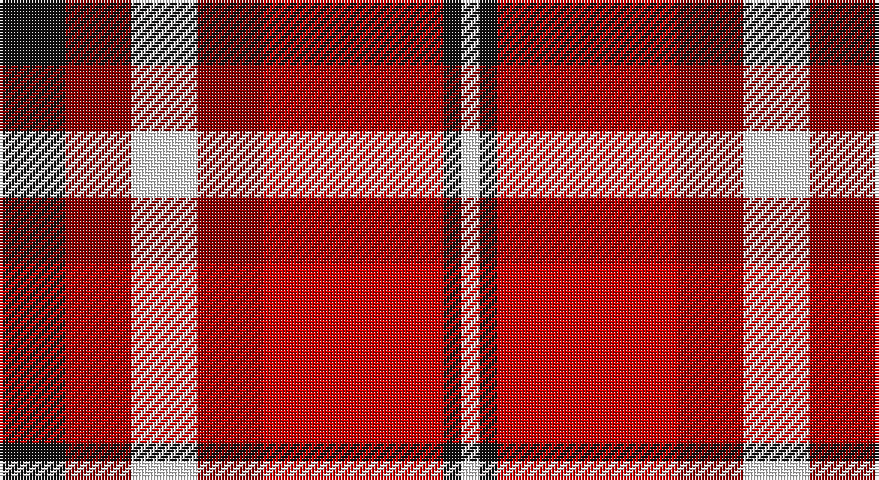

This page is one **sett** — a single exact thread-count. It belongs to the [tartan](/setts/k11ri11w11ri11r30k3w3/)
(the same proportion at any scale), whose colour order is pattern [KRWRRKW](/stripes/krwrrkw/).

Sourced from register-of-tartans.  It is a [7 stripe tartan](/stripes/stripes7/).

Original link https://www.tartanregister.gov.uk/tartanDetails.aspx?ref=10173

2 attestations — the source records this cloth was collapsed from (oldest owns this page)

<ul>
<li>23/12/2009 — Swallow (Personal) (register-of-tartans, <a href="https://www.tartanregister.gov.uk/tartanDetails.aspx?ref=10173">record</a>)</li>
<li>23rd Dec. 2009 — Swallow (Personal) (tartans-authority, <a href="http://www.tartansauthority.com/tartan-ferret/display/10173/">record</a>)</li>
</ul>

## Register references

External register numbers recorded for this tartan.

- Scottish Register of Tartans: [10173](https://www.tartanregister.gov.uk/tartanDetails?ref=10173)
- Scottish Tartans Authority (ITI): 10173

## Thread count
K/22 DR22 W22 DR22 R60 K6 W/6

One full sett is **292 threads**.

## Palette

Palette: <strong>Tartan Register</strong> <small style="color:#888">(2 of 4 colours)</small>
<table><thead><tr><th>Colour</th><th>Threads</th><th>Shade</th><th>Base</th><th>OKLCh</th></tr></thead><tbody><tr><td>K/</td><td style="text-align:right;font-variant-numeric:tabular-nums">22</td><td><code style="background-color:#101010;">#101010</code> <small style="color:#888">#101010</small></td><td>K <code style="background-color:#000000;">#000000</code></td><td><small style="color:#888">oklch(17.3% 0.000 89.9)</small></td></tr><tr><td>DR</td><td style="text-align:right;font-variant-numeric:tabular-nums">22</td><td><code style="background-color:#8B0000;">#8B0000</code> <small style="color:#888">#8B0000</small></td><td>R <code style="background-color:#CC0000;">#CC0000</code></td><td><small style="color:#888">oklch(40.0% 0.164 29.2)</small></td></tr><tr><td>W</td><td style="text-align:right;font-variant-numeric:tabular-nums">22</td><td><code style="background-color:#FFFFFF;">#FFFFFF</code> <small style="color:#888">#FFFFFF</small></td><td>W <code style="background-color:#F7F7F7;">#F7F7F7</code></td><td><small style="color:#888">oklch(100.0% 0.000 89.9)</small></td></tr><tr><td>DR</td><td style="text-align:right;font-variant-numeric:tabular-nums">22</td><td><code style="background-color:#8B0000;">#8B0000</code> <small style="color:#888">#8B0000</small></td><td>R <code style="background-color:#CC0000;">#CC0000</code></td><td><small style="color:#888">oklch(40.0% 0.164 29.2)</small></td></tr><tr><td>R</td><td style="text-align:right;font-variant-numeric:tabular-nums">60</td><td><code style="background-color:#CD0000;">#CD0000</code> <small style="color:#888">#CD0000</small></td><td>R <code style="background-color:#CC0000;">#CC0000</code></td><td><small style="color:#888">oklch(53.3% 0.219 29.2)</small></td></tr><tr><td>K</td><td style="text-align:right;font-variant-numeric:tabular-nums">6</td><td><code style="background-color:#101010;">#101010</code> <small style="color:#888">#101010</small></td><td>K <code style="background-color:#000000;">#000000</code></td><td><small style="color:#888">oklch(17.3% 0.000 89.9)</small></td></tr><tr><td>W/</td><td style="text-align:right;font-variant-numeric:tabular-nums">6</td><td><code style="background-color:#FFFFFF;">#FFFFFF</code> <small style="color:#888">#FFFFFF</small></td><td>W <code style="background-color:#F7F7F7;">#F7F7F7</code></td><td><small style="color:#888">oklch(100.0% 0.000 89.9)</small></td></tr></tbody></table>

# Sample pattern

## Nearest tartans

The nearest existing variants by ΔTartan distance, with this tartan at the top so the swatches line up against it.

ΔTartan

Tartan

Sett

—

<a href="/ttd/edit/#slug=k11ri11w11ri11r30k3w3~x2">Swallow (Personal)</a> <a class="nn-out" href="/variants/s7/k11ri11w11ri11r30k3w3~x2/" title="open its dictionary page">↗</a>

1.22

<a href="/ttd/edit/#slug=dy11db1dy11w10db1r11db1r11~x2&amp;base=k11ri11w11ri11r30k3w3~x2">St. Andrews (Queens University) (Cor</a> <a class="nn-out" href="/variants/s8/dy11db1dy11w10db1r11db1r11~x2/" title="open its dictionary page">↗</a>

1.24

<a href="/ttd/edit/#slug=lb2r12db2lb6k6lb1&amp;base=k11ri11w11ri11r30k3w3~x2">MacTavish</a> <a class="nn-out" href="/variants/s6/lb2r12db2lb6k6lb1/" title="open its dictionary page">↗</a>

1.35

<a href="/ttd/edit/#slug=ri4r3ri18rii18w18rii1w2rii4~x2&amp;base=k11ri11w11ri11r30k3w3~x2">Gigha, Cherry (Dance)</a> <a class="nn-out" href="/variants/s8/ri4r3ri18rii18w18rii1w2rii4~x2/" title="open its dictionary page">↗</a>

1.44

<a href="/ttd/edit/#slug=lr1k1r10g10k5lr5r10k1lr1~x4&amp;base=k11ri11w11ri11r30k3w3~x2">Graham Red</a> <a class="nn-out" href="/variants/s9/lr1k1r10g10k5lr5r10k1lr1~x4/" title="open its dictionary page">↗</a>

1.46

<a href="/ttd/edit/#slug=k2db2r26dg25k13db13r26db2k2~x2&amp;base=k11ri11w11ri11r30k3w3~x2">MacNaughton (Logan) #2</a> <a class="nn-out" href="/variants/s9/k2db2r26dg25k13db13r26db2k2~x2/" title="open its dictionary page">↗</a>

1.48

<a href="/ttd/edit/#slug=r12w2o3w2r3k5r2o18w2~x2&amp;base=k11ri11w11ri11r30k3w3~x2">Ballater</a> <a class="nn-out" href="/variants/s9/r12w2o3w2r3k5r2o18w2~x2/" title="open its dictionary page">↗</a>

1.50

<a href="/ttd/edit/#slug=k6r20w2ri9w3lb2~x2&amp;base=k11ri11w11ri11r30k3w3~x2">Thermos Un-named (aretefact)</a> <a class="nn-out" href="/variants/s6/k6r20w2ri9w3lb2~x2/" title="open its dictionary page">↗</a>

1.52

<a href="/ttd/edit/#slug=w15do8m25do72r98ly15&amp;base=k11ri11w11ri11r30k3w3~x2">Afternoon Tea / Apple Tea</a> <a class="nn-out" href="/variants/s6/w15do8m25do72r98ly15/" title="open its dictionary page">↗</a>

1.53

<a href="/ttd/edit/#slug=lb2k2r14dg15k8lb7r14k2lb2&amp;base=k11ri11w11ri11r30k3w3~x2">Montrose</a> <a class="nn-out" href="/variants/s9/lb2k2r14dg15k8lb7r14k2lb2/" title="open its dictionary page">↗</a>

1.53

<a href="/ttd/edit/#slug=w6r18k2r6g7k8ly6~x4&amp;base=k11ri11w11ri11r30k3w3~x2">Thirkill (Dalgliesh)</a> <a class="nn-out" href="/variants/s7/w6r18k2r6g7k8ly6~x4/" title="open its dictionary page">↗</a>

## Neighbour map

Every grey dot is one of 14360 variants placed by the first two principal components of the ΔTartan feature space (44% of its variance). Red is this tartan; blue dots are its nearest — click one to open its page.

<svg viewBox="0 0 640 380" role="img" style="max-width:100%;height:auto;border:1px solid #e0e0e0;border-radius:4px;display:block" xmlns="http://www.w3.org/2000/svg"><image href="/nn/cloud.v1.png" width="640" height="380"/><a href="/variants/s8/dy11db1dy11w10db1r11db1r11~x2/"><circle cx="199.7" cy="191.1" r="4" fill="#3465a4"><title>St. Andrews (Queens University) (Cor</title></circle></a><a href="/variants/s6/lb2r12db2lb6k6lb1/"><circle cx="185.0" cy="174.4" r="4" fill="#3465a4"><title>MacTavish</title></circle></a><a href="/variants/s8/ri4r3ri18rii18w18rii1w2rii4~x2/"><circle cx="206.0" cy="144.6" r="4" fill="#3465a4"><title>Gigha, Cherry (Dance)</title></circle></a><a href="/variants/s9/lr1k1r10g10k5lr5r10k1lr1~x4/"><circle cx="200.4" cy="172.5" r="4" fill="#3465a4"><title>Graham Red</title></circle></a><a href="/variants/s9/k2db2r26dg25k13db13r26db2k2~x2/"><circle cx="229.3" cy="162.3" r="4" fill="#3465a4"><title>MacNaughton (Logan) #2</title></circle></a><a href="/variants/s9/r12w2o3w2r3k5r2o18w2~x2/"><circle cx="222.1" cy="163.2" r="4" fill="#3465a4"><title>Ballater</title></circle></a><a href="/variants/s6/k6r20w2ri9w3lb2~x2/"><circle cx="225.6" cy="163.0" r="4" fill="#3465a4"><title>Thermos Un-named (aretefact)</title></circle></a><a href="/variants/s6/w15do8m25do72r98ly15/"><circle cx="220.2" cy="163.1" r="4" fill="#3465a4"><title>Afternoon Tea / Apple Tea</title></circle></a><a href="/variants/s9/lb2k2r14dg15k8lb7r14k2lb2/"><circle cx="158.4" cy="185.1" r="4" fill="#3465a4"><title>Montrose</title></circle></a><a href="/variants/s7/w6r18k2r6g7k8ly6~x4/"><circle cx="148.6" cy="181.2" r="4" fill="#3465a4"><title>Thirkill (Dalgliesh)</title></circle></a><circle cx="162.3" cy="177.8" r="5" fill="#c00000"/></svg>

ID: /variants/s7/k11ri11w11ri11r30k3w3~x2/
