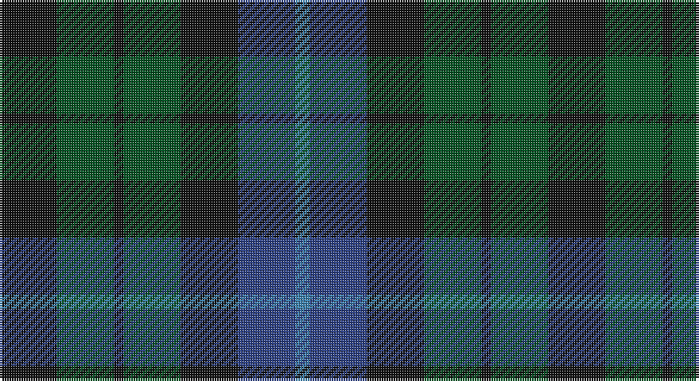

This page is one **sett** — a single exact thread-count. It belongs to the [tartan](/setts/k12dg12k2dg12k12db12t3/)
(the same proportion at any scale), whose colour order is pattern [BBKGKGK](/stripes/bbkgkgk/).

Part of the [MacIntyre](/tartans/macintyre/) tartan — the named design grouping this sett with its other cloths.

Sourced from register-of-tartans.  It is a [7 stripe tartan](/stripes/stripes7/).

Original link https://www.tartanregister.gov.uk/tartanDetails.aspx?ref=2483

## Register references

External register numbers recorded for this tartan.

- Scottish Register of Tartans: [2483](https://www.tartanregister.gov.uk/tartanDetails.aspx?ref=2483)
- Scottish Tartans World Register: 56

## Thread count
K/24 G24 K4 G24 K24 Ba24 B/6

One full sett is **230 threads**.

## Palette

Palette: <strong>Tartan Register</strong>
<table><thead><tr><th>Colour</th><th>Threads</th><th>Shade</th><th>Base</th><th>OKLCh</th></tr></thead><tbody><tr><td>K/</td><td style="text-align:right;font-variant-numeric:tabular-nums">24</td><td><code style="background-color:#101010;">#101010</code> <small style="color:#888">#101010</small></td><td>K <code style="background-color:#000000;">#000000</code></td><td><small style="color:#888">oklch(17.3% 0.000 89.9)</small></td></tr><tr><td>G</td><td style="text-align:right;font-variant-numeric:tabular-nums">24</td><td><code style="background-color:#005020;">#005020</code> <small style="color:#888">#005020</small></td><td>G <code style="background-color:#006100;">#006100</code></td><td><small style="color:#888">oklch(37.7% 0.105 149.6)</small></td></tr><tr><td>K</td><td style="text-align:right;font-variant-numeric:tabular-nums">4</td><td><code style="background-color:#101010;">#101010</code> <small style="color:#888">#101010</small></td><td>K <code style="background-color:#000000;">#000000</code></td><td><small style="color:#888">oklch(17.3% 0.000 89.9)</small></td></tr><tr><td>G</td><td style="text-align:right;font-variant-numeric:tabular-nums">24</td><td><code style="background-color:#005020;">#005020</code> <small style="color:#888">#005020</small></td><td>G <code style="background-color:#006100;">#006100</code></td><td><small style="color:#888">oklch(37.7% 0.105 149.6)</small></td></tr><tr><td>K</td><td style="text-align:right;font-variant-numeric:tabular-nums">24</td><td><code style="background-color:#101010;">#101010</code> <small style="color:#888">#101010</small></td><td>K <code style="background-color:#000000;">#000000</code></td><td><small style="color:#888">oklch(17.3% 0.000 89.9)</small></td></tr><tr><td>Ba</td><td style="text-align:right;font-variant-numeric:tabular-nums">24</td><td><code style="background-color:#2C4084;">#2C4084</code> <small style="color:#888">#2C4084</small></td><td>B <code style="background-color:#2A418A;">#2A418A</code></td><td><small style="color:#888">oklch(39.4% 0.117 268.3)</small></td></tr><tr><td>B/</td><td style="text-align:right;font-variant-numeric:tabular-nums">6</td><td><code style="background-color:#3C82AF;">#3C82AF</code> <small style="color:#888">#3C82AF</small></td><td>B <code style="background-color:#2A418A;">#2A418A</code></td><td><small style="color:#888">oklch(58.1% 0.099 239.8)</small></td></tr></tbody></table>

# Sample pattern

## Nearest tartans

The nearest existing variants by ΔTartan distance, with this tartan at the top so the swatches line up against it.

ΔTartan

Tartan

Sett

—

<a href="/ttd/edit/#slug=k12dg12k2dg12k12db12t3~x2">MacIntyre</a> <a class="nn-out" href="/variants/s7/k12dg12k2dg12k12db12t3~x2/" title="open its dictionary page">↗</a>

0.32

<a href="/ttd/edit/#slug=k6dg6r1dg6k6db6k1~x2&amp;base=k12dg12k2dg12k12db12t3~x2">MacCallum #2</a> <a class="nn-out" href="/variants/s7/k6dg6r1dg6k6db6k1~x2/" title="open its dictionary page">↗</a>

0.96

<a href="/ttd/edit/#slug=dg21k14dg9dt21k3dt12p3~x2&amp;base=k12dg12k2dg12k12db12t3~x2">Scotsman</a> <a class="nn-out" href="/variants/s7/dg21k14dg9dt21k3dt12p3~x2/" title="open its dictionary page">↗</a>

0.97

<a href="/ttd/edit/#slug=r1dy7g7db7g7db7r1~x8&amp;base=k12dg12k2dg12k12db12t3~x2">Tennant (Yules)</a> <a class="nn-out" href="/variants/s7/r1dy7g7db7g7db7r1~x8/" title="open its dictionary page">↗</a>

0.99

<a href="/ttd/edit/#slug=db8dg8db1dg8k8db8ly2~x2&amp;base=k12dg12k2dg12k12db12t3~x2">MacKay</a> <a class="nn-out" href="/variants/s7/db8dg8db1dg8k8db8ly2~x2/" title="open its dictionary page">↗</a>

1.08

<a href="/ttd/edit/#slug=k3dg12k12r2db12k3~x2&amp;base=k12dg12k2dg12k12db12t3~x2">Ferguson of Balquhidder #3</a> <a class="nn-out" href="/variants/s6/k3dg12k12r2db12k3~x2/" title="open its dictionary page">↗</a>

1.12

<a href="/ttd/edit/#slug=k7dg7k1dg7k7t1dp7k1~x4&amp;base=k12dg12k2dg12k12db12t3~x2">Wilson's No 108</a> <a class="nn-out" href="/variants/s8/k7dg7k1dg7k7t1dp7k1~x4/" title="open its dictionary page">↗</a>

1.15

<a href="/ttd/edit/#slug=g21k14g9db21k3db12dp3~x2&amp;base=k12dg12k2dg12k12db12t3~x2">Scotsman</a> <a class="nn-out" href="/variants/s7/g21k14g9db21k3db12dp3~x2/" title="open its dictionary page">↗</a>

1.15

<a href="/ttd/edit/#slug=dp4n18k17n3g18n4~x2&amp;base=k12dg12k2dg12k12db12t3~x2">Scottish Airports (Corporate)</a> <a class="nn-out" href="/variants/s6/dp4n18k17n3g18n4~x2/" title="open its dictionary page">↗</a>

1.18

<a href="/ttd/edit/#slug=k3dg4k1dg4k3db4k1~x2&amp;base=k12dg12k2dg12k12db12t3~x2">Unidentified No 63</a> <a class="nn-out" href="/variants/s7/k3dg4k1dg4k3db4k1~x2/" title="open its dictionary page">↗</a>

1.20

<a href="/ttd/edit/#slug=k4dg4ly1dg4k4db4k1~x2&amp;base=k12dg12k2dg12k12db12t3~x2">MacKay Coat</a> <a class="nn-out" href="/variants/s7/k4dg4ly1dg4k4db4k1~x2/" title="open its dictionary page">↗</a>

## Neighbour map

Every grey dot is one of 14360 variants placed by the first two principal components of the ΔTartan feature space (44% of its variance). Red is this tartan; blue dots are its nearest — click one to open its page.

<svg viewBox="0 0 640 380" role="img" style="max-width:100%;height:auto;border:1px solid #e0e0e0;border-radius:4px;display:block" xmlns="http://www.w3.org/2000/svg"><image href="/nn/cloud.v1.png" width="640" height="380"/><a href="/variants/s7/k6dg6r1dg6k6db6k1~x2/"><circle cx="221.0" cy="297.6" r="4" fill="#3465a4"><title>MacCallum #2</title></circle></a><a href="/variants/s7/dg21k14dg9dt21k3dt12p3~x2/"><circle cx="231.9" cy="285.3" r="4" fill="#3465a4"><title>Scotsman</title></circle></a><a href="/variants/s7/r1dy7g7db7g7db7r1~x8/"><circle cx="208.4" cy="281.6" r="4" fill="#3465a4"><title>Tennant (Yules)</title></circle></a><a href="/variants/s7/db8dg8db1dg8k8db8ly2~x2/"><circle cx="200.6" cy="277.9" r="4" fill="#3465a4"><title>MacKay</title></circle></a><a href="/variants/s6/k3dg12k12r2db12k3~x2/"><circle cx="225.2" cy="281.2" r="4" fill="#3465a4"><title>Ferguson of Balquhidder #3</title></circle></a><a href="/variants/s8/k7dg7k1dg7k7t1dp7k1~x4/"><circle cx="235.0" cy="265.9" r="4" fill="#3465a4"><title>Wilson's No 108</title></circle></a><a href="/variants/s7/g21k14g9db21k3db12dp3~x2/"><circle cx="210.8" cy="270.0" r="4" fill="#3465a4"><title>Scotsman</title></circle></a><a href="/variants/s6/dp4n18k17n3g18n4~x2/"><circle cx="223.0" cy="281.8" r="4" fill="#3465a4"><title>Scottish Airports (Corporate)</title></circle></a><a href="/variants/s7/k3dg4k1dg4k3db4k1~x2/"><circle cx="235.9" cy="345.5" r="4" fill="#3465a4"><title>Unidentified No 63</title></circle></a><a href="/variants/s7/k4dg4ly1dg4k4db4k1~x2/"><circle cx="169.1" cy="306.5" r="4" fill="#3465a4"><title>MacKay Coat</title></circle></a><circle cx="212.8" cy="303.8" r="5" fill="#c00000"/></svg>

ID: /variants/s7/k12dg12k2dg12k12db12t3~x2/
