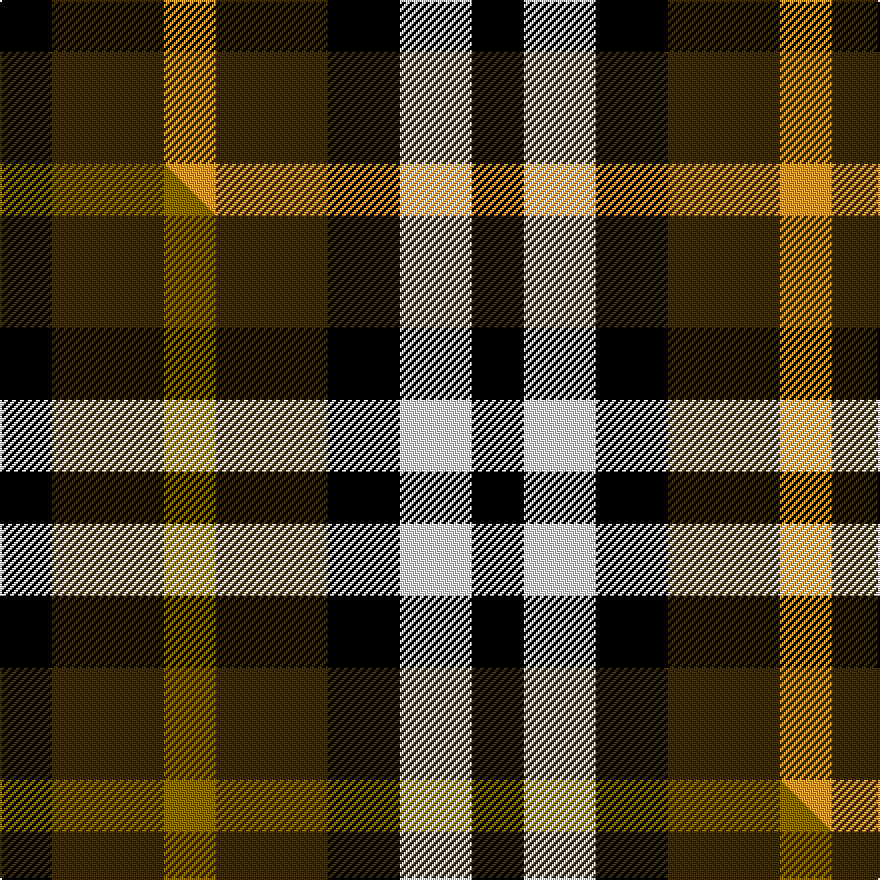

This is one **variant** — a specific cloth: this exact thread count and colourway, with its own
provenance below. It is one weaving of the [sett](/setts/k13dy28lo13dy28k18w18k13/) (the scale-free proportion — the
same cloth at any scale or shade), whose colour order is pattern [KGYGKWK](/stripes/kgygkwk/).

Part of the [Boxer Beauty](/tartans/b/bo/boxer-beauty/) tartan — the named design grouping this sett with its other cloths.

Sourced from tartans-authority.  It is a [7 stripe tartan](/stripes/stripes7/).

Original link [https://www.tartanregister.gov.uk/tartanDetails.aspx?ref=10914](https://www.tartanregister.gov.uk/tartanDetails.aspx?ref=10914)

Dataset <small>— provenance for this record, inherited from the source manifest</small>

<dl class="dataset-prov">
<dt>source</dt><dd><a href="/sources/tartans-authority/">Scottish Tartans Authority</a></dd>
<dt>data captured from</dt><dd><a href="https://github.com/thetartan/tartan-database/blob/master/data/tartans-authority/data.csv">https://github.com/thetartan/tartan-database/blob/master/data/tartans-authority/data.csv</a></dd>
<dt>data date</dt><dd>2013 <small>(this record)</small></dd>
<dt>licence</dt><dd><a href="https://creativecommons.org/licenses/by-nc-nd/4.0/">CC BY-NC-ND 4.0</a></dd>
</dl>

Capture chain <small>— the hands this data passed through, oldest first; each capture carries its own licence</small>

<ol class="capture-chain">
<li><a href="https://www.tartansauthority.com/">Scottish Tartans Authority</a> <small>the heritage body's archive — its tartan-ferret record browser is retired (links repaired to the SRT, above)</small></li>
<li><a href="https://github.com/thetartan/tartan-database">thetartan/tartan-database</a> <small>2016-2017</small> · <a href="https://creativecommons.org/licenses/by-nc-nd/4.0/">CC BY-NC-ND 4.0</a> <small>Levko Kravets's frozen compilation — the capture we vendored, and where its CC licence text came from</small></li>
<li>this dictionary <small>captured 2026-06-10 · commit 5bf86c7566</small> <small>each re-capture is a git commit to data/sources</small></li>
</ol>

## Register references

External register numbers recorded for this tartan.

- Scottish Register of Tartans: [10914](https://www.tartanregister.gov.uk/tartanDetails?ref=10914)
- Scottish Tartans Authority (ITI): 10914

## Thread count
K/26 DY56 LO26 DY56 K36 W36 K/26

One full sett is **472 threads**.

## Palette
<table><thead><tr><th>Colour</th><th>Shade</th><th>OKLCh</th></tr></thead><tbody><tr><td>K</td><td><code style="background-color:#000000;">#000000</code> <small style="color:#888">#000000</small></td><td><small style="color:#888">oklch(0.0% 0.000 0.0)</small></td></tr><tr><td>LO</td><td><code style="background-color:#FF9C34;">#FF9C34</code> <small style="color:#888">#FF9C34</small></td><td><small style="color:#888">oklch(77.9% 0.161 61.8)</small></td></tr><tr><td>DY</td><td><code style="background-color:#3A2B0D;">#3A2B0D</code> <small style="color:#888">#3A2B0D</small></td><td><small style="color:#888">oklch(30.0% 0.049 82.0)</small></td></tr><tr><td>W</td><td><code style="background-color:#F7F7F7;">#F7F7F7</code> <small style="color:#888">#F7F7F7</small></td><td><small style="color:#888">oklch(97.6% 0.000 89.9)</small></td></tr></tbody></table>

# Sample pattern

## Compared to the master

This cloth is one sett of its design; the master sett (the exemplar the design is anchored on) is below for comparison.

Its **ΔTartan distance** from the master is **0.30** — the same measure the nearest-tartans table ranks by (0 is identical; a re-scale of the same cloth is near 0, a recolour or a different proportion further).

<figure class="master-compare" style="margin:0">

this sett
master sett ★

<figcaption style="color:#888;font-size:smaller">One weave of this sett against the <a href="/setts/k13dy28y13dy28k18w18k13/">master sett ★</a>, split on the diagonal: a shared proportion runs seamlessly across it with only the shades shifting; a different proportion breaks on it.</figcaption>
</figure>

## Nearest tartan variants

The nearest existing variants by ΔTartan distance, with this cloth at the top so the swatches line up against it.

ΔTartan

Threads

Variant

Sett

—

472

<a href="/variants/s7/k13dy28lo13dy28k18w18k13~x2/">Boxer Beauty</a>

<a href="/ttd/edit/#slug=k13dy28y13dy28k18w18k13~x2&amp;base=k13dy28lo13dy28k18w18k13~x2" title="compare in the TTD">0.30</a>

472

<a href="/variants/s7/k13dy28y13dy28k18w18k13~x2/">Boxer Beauty</a>

<a href="/ttd/edit/#slug=k5o5w1o5k5r1~x10~o2503076&amp;base=k13dy28lo13dy28k18w18k13~x2" title="compare in the TTD">2.38</a>

380

<a href="/variants/s6/k5ly5w1ly5k5r1~x10~ly2503076/">Canyon County Idaho Sheriff</a>

<a href="/ttd/edit/#slug=k5ly5w1ly5k5r1~x10&amp;base=k13dy28lo13dy28k18w18k13~x2" title="compare in the TTD">2.41</a>

380

<a href="/variants/s6/k5ly5w1ly5k5r1~x10/">Canyon County Idaho Sheriff (Corp)</a>

<a href="/ttd/edit/#slug=g6dp3k3dp3k3dp3g6r2~x2~dp1607327-r2109032&amp;base=k13dy28lo13dy28k18w18k13~x2" title="compare in the TTD">2.47</a>

100

<a href="/variants/s8/g6dp3k3dp3k3dp3g6r2~x2~dp1607327-r2109032/">Wilson's No.137</a>

<a href="/ttd/edit/#slug=r2k1db2k1g2k1~x28&amp;base=k13dy28lo13dy28k18w18k13~x2" title="compare in the TTD">2.59</a>

420

<a href="/variants/s6/r2k1db2k1g2k1~x28/">Burnicle (2015)</a>

<a href="/ttd/edit/#slug=y15r7k12y12k12dy12r7~x2&amp;base=k13dy28lo13dy28k18w18k13~x2" title="compare in the TTD">3.02</a>

264

<a href="/variants/s7/y15r7k12y12k12dy12r7~x2/">Duffus Lord... Portrait Tartan</a>

<a href="/ttd/edit/#slug=ly11r6k10ly10k10dy10r4~x2&amp;base=k13dy28lo13dy28k18w18k13~x2" title="compare in the TTD">3.04</a>

214

<a href="/variants/s7/ly11r6k10ly10k10dy10r4~x2/">Duffus Hose, Lord</a>

<a href="/ttd/edit/#slug=r10db6k8g10r6g3r6~x2&amp;base=k13dy28lo13dy28k18w18k13~x2" title="compare in the TTD">3.12</a>

164

<a href="/variants/s7/r10db6k8g10r6g3r6~x2/">MacDuff #3</a>

<a href="/ttd/edit/#slug=k4g8k7db8r4~x2&amp;base=k13dy28lo13dy28k18w18k13~x2" title="compare in the TTD">3.18</a>

108

<a href="/variants/s5/k4g8k7db8r4~x2/">Durham</a>

<a href="/ttd/edit/#slug=dp3k3dp3g6r2~x2&amp;base=k13dy28lo13dy28k18w18k13~x2" title="compare in the TTD">3.21</a>

58

<a href="/variants/s5/dp3k3dp3g6r2~x2/">Austin (Wilson's No 137)</a>

## Neighbour map

Every grey dot is one of 13621 variants placed by the first two principal components of the ΔTartan feature space (42% of its variance). Red is this tartan; blue dots are its nearest — click one to open its page.

<svg viewBox="0 0 640 380" role="img" style="max-width:100%;height:auto;border:1px solid #e0e0e0;border-radius:4px;display:block" xmlns="http://www.w3.org/2000/svg"><image href="/nn/cloud.v1.png" width="640" height="380"/><a href="/variants/s7/k13dy28y13dy28k18w18k13~x2/"><circle cx="71.9" cy="293.8" r="4" fill="#3465a4"><title>Boxer Beauty</title></circle></a><a href="/variants/s6/k5ly5w1ly5k5r1~x10~ly2503076/"><circle cx="160.0" cy="241.5" r="4" fill="#3465a4"><title>Canyon County Idaho Sheriff</title></circle></a><a href="/variants/s6/k5ly5w1ly5k5r1~x10/"><circle cx="151.1" cy="240.6" r="4" fill="#3465a4"><title>Canyon County Idaho Sheriff (Corp)</title></circle></a><a href="/variants/s8/g6dp3k3dp3k3dp3g6r2~x2~dp1607327-r2109032/"><circle cx="102.1" cy="279.2" r="4" fill="#3465a4"><title>Wilson's No.137</title></circle></a><a href="/variants/s6/r2k1db2k1g2k1~x28/"><circle cx="34.0" cy="307.8" r="4" fill="#3465a4"><title>Burnicle (2015)</title></circle></a><a href="/variants/s7/y15r7k12y12k12dy12r7~x2/"><circle cx="44.6" cy="315.3" r="4" fill="#3465a4"><title>Duffus Lord... Portrait Tartan</title></circle></a><a href="/variants/s7/ly11r6k10ly10k10dy10r4~x2/"><circle cx="31.6" cy="294.8" r="4" fill="#3465a4"><title>Duffus Hose, Lord</title></circle></a><a href="/variants/s7/r10db6k8g10r6g3r6~x2/"><circle cx="111.6" cy="281.9" r="4" fill="#3465a4"><title>MacDuff #3</title></circle></a><a href="/variants/s5/k4g8k7db8r4~x2/"><circle cx="47.4" cy="324.6" r="4" fill="#3465a4"><title>Durham</title></circle></a><a href="/variants/s5/dp3k3dp3g6r2~x2/"><circle cx="96.5" cy="298.8" r="4" fill="#3465a4"><title>Austin (Wilson's No 137)</title></circle></a><circle cx="67.5" cy="291.7" r="5" fill="#c00000"/><text x="320" y="376" text-anchor="middle" font-size="11" fill="#999">ground</text><text x="11" y="190" text-anchor="middle" font-size="11" fill="#999" transform="rotate(-90 11 190)">complexity</text></svg>

ID: /variants/s7/k13dy28lo13dy28k18w18k13~x2/
