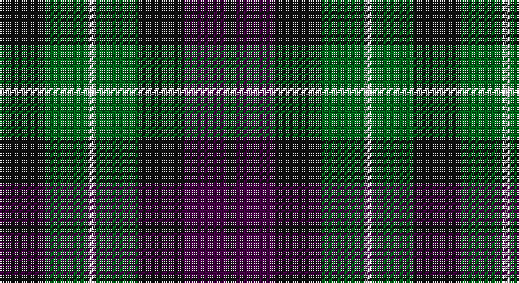

This page is one **sett** — a single exact thread-count. It belongs to the [tartan](/setts/k13g12w2g12k13dp12k2/)
(the same proportion at any scale), whose colour order is pattern [KBKGWGK](/stripes/kbkgwgk/).

Part of the [MacLaggan](/tartans/maclaggan/) tartan — the named design grouping this sett with its other cloths.

Sourced from register-of-tartans.  It is a [7 stripe tartan](/stripes/stripes7/).

Original link https://www.tartanregister.gov.uk/tartanDetails.aspx?ref=2589

## Also known as

This cloth is also recorded under:

- MacLaggan Artifact

## Register references

External register numbers recorded for this tartan.

- Scottish Register of Tartans: [2589](https://www.tartanregister.gov.uk/tartanDetails.aspx?ref=2589)
- Scottish Tartans Authority (ITI): 1045
- Scottish Tartans World Register: 1045

## Thread count
K/26 G24 W4 G24 K26 DP24 K/4

One full sett is **234 threads**.

## Palette

Palette: <strong>Tartan Register</strong>
<table><thead><tr><th>Colour</th><th>Threads</th><th>Shade</th><th>Base</th><th>OKLCh</th></tr></thead><tbody><tr><td>K/</td><td style="text-align:right;font-variant-numeric:tabular-nums">26</td><td><code style="background-color:#101010;">#101010</code> <small style="color:#888">#101010</small></td><td>K <code style="background-color:#000000;">#000000</code></td><td><small style="color:#888">oklch(17.3% 0.000 89.9)</small></td></tr><tr><td>G</td><td style="text-align:right;font-variant-numeric:tabular-nums">24</td><td><code style="background-color:#006818;">#006818</code> <small style="color:#888">#006818</small></td><td>G <code style="background-color:#006100;">#006100</code></td><td><small style="color:#888">oklch(45.0% 0.142 145.0)</small></td></tr><tr><td>W</td><td style="text-align:right;font-variant-numeric:tabular-nums">4</td><td><code style="background-color:#FFFFFF;">#FFFFFF</code> <small style="color:#888">#FFFFFF</small></td><td>W <code style="background-color:#F7F7F7;">#F7F7F7</code></td><td><small style="color:#888">oklch(100.0% 0.000 89.9)</small></td></tr><tr><td>G</td><td style="text-align:right;font-variant-numeric:tabular-nums">24</td><td><code style="background-color:#006818;">#006818</code> <small style="color:#888">#006818</small></td><td>G <code style="background-color:#006100;">#006100</code></td><td><small style="color:#888">oklch(45.0% 0.142 145.0)</small></td></tr><tr><td>K</td><td style="text-align:right;font-variant-numeric:tabular-nums">26</td><td><code style="background-color:#101010;">#101010</code> <small style="color:#888">#101010</small></td><td>K <code style="background-color:#000000;">#000000</code></td><td><small style="color:#888">oklch(17.3% 0.000 89.9)</small></td></tr><tr><td>DP</td><td style="text-align:right;font-variant-numeric:tabular-nums">24</td><td><code style="background-color:#440044;">#440044</code> <small style="color:#888">#440044</small></td><td>B <code style="background-color:#2A418A;">#2A418A</code></td><td><small style="color:#888">oklch(27.1% 0.125 328.4)</small></td></tr><tr><td>K/</td><td style="text-align:right;font-variant-numeric:tabular-nums">4</td><td><code style="background-color:#101010;">#101010</code> <small style="color:#888">#101010</small></td><td>K <code style="background-color:#000000;">#000000</code></td><td><small style="color:#888">oklch(17.3% 0.000 89.9)</small></td></tr></tbody></table>

# Sample pattern

## Nearest tartans

The nearest existing variants by ΔTartan distance, with this tartan at the top so the swatches line up against it.

ΔTartan

Tartan

Sett

—

<a href="/ttd/edit/#slug=k13g12w2g12k13dp12k2~x2">MacLaggan</a> <a class="nn-out" href="/variants/s7/k13g12w2g12k13dp12k2~x2/" title="open its dictionary page">↗</a>

0.71

<a href="/ttd/edit/#slug=k11dg12k2dg12k12dp12w3~x2&amp;base=k13g12w2g12k13dp12k2~x2">Wilson's No 97</a> <a class="nn-out" href="/variants/s7/k11dg12k2dg12k12dp12w3~x2/" title="open its dictionary page">↗</a>

0.79

<a href="/ttd/edit/#slug=k6dg6ly1dg6k6dp6k1~x4&amp;base=k13g12w2g12k13dp12k2~x2">Abercrombie (Wilsons No 2/64)</a> <a class="nn-out" href="/variants/s7/k6dg6ly1dg6k6dp6k1~x4/" title="open its dictionary page">↗</a>

0.89

<a href="/ttd/edit/#slug=k9g9w2g9k9db9k3~x2&amp;base=k13g12w2g12k13dp12k2~x2">Graham of Montrose - 1850 (Clan)</a> <a class="nn-out" href="/variants/s7/k9g9w2g9k9db9k3~x2/" title="open its dictionary page">↗</a>

0.89

<a href="/ttd/edit/#slug=db4dg6w1dg6k6db6k2~x2&amp;base=k13g12w2g12k13dp12k2~x2">MacNeil of Colonsay</a> <a class="nn-out" href="/variants/s7/db4dg6w1dg6k6db6k2~x2/" title="open its dictionary page">↗</a>

0.97

<a href="/ttd/edit/#slug=db16g14w2g14k13db12k4~x2&amp;base=k13g12w2g12k13dp12k2~x2">MacNeil of Colonsay (Clan)</a> <a class="nn-out" href="/variants/s7/db16g14w2g14k13db12k4~x2/" title="open its dictionary page">↗</a>

0.99

<a href="/ttd/edit/#slug=r4g12k12g2db12g3~x2&amp;base=k13g12w2g12k13dp12k2~x2">Gunn - 1810 (Clan)</a> <a class="nn-out" href="/variants/s6/r4g12k12g2db12g3~x2/" title="open its dictionary page">↗</a>

1.05

<a href="/ttd/edit/#slug=k11g12w2g12k12dp12r3~x2&amp;base=k13g12w2g12k13dp12k2~x2">Cunningham / Wilson's No 120</a> <a class="nn-out" href="/variants/s7/k11g12w2g12k12dp12r3~x2/" title="open its dictionary page">↗</a>

1.06

<a href="/ttd/edit/#slug=y3dg6k6y4r1y1~x2&amp;base=k13g12w2g12k13dp12k2~x2">Waterloo</a> <a class="nn-out" href="/variants/s6/y3dg6k6y4r1y1~x2/" title="open its dictionary page">↗</a>

1.08

<a href="/ttd/edit/#slug=db1k6db6k6g6k1w1~x6&amp;base=k13g12w2g12k13dp12k2~x2">Forbes - 1947 (Lyon Court)</a> <a class="nn-out" href="/variants/s7/db1k6db6k6g6k1w1~x6/" title="open its dictionary page">↗</a>

1.11

<a href="/ttd/edit/#slug=dg24k4dg24k24t7r24t7~x2&amp;base=k13g12w2g12k13dp12k2~x2">Unidentified Pinafore</a> <a class="nn-out" href="/variants/s7/dg24k4dg24k24t7r24t7~x2/" title="open its dictionary page">↗</a>

## Neighbour map

Every grey dot is one of 14360 variants placed by the first two principal components of the ΔTartan feature space (44% of its variance). Red is this tartan; blue dots are its nearest — click one to open its page.

<svg viewBox="0 0 640 380" role="img" style="max-width:100%;height:auto;border:1px solid #e0e0e0;border-radius:4px;display:block" xmlns="http://www.w3.org/2000/svg"><image href="/nn/cloud.v1.png" width="640" height="380"/><a href="/variants/s7/k11dg12k2dg12k12dp12w3~x2/"><circle cx="165.1" cy="276.2" r="4" fill="#3465a4"><title>Wilson's No 97</title></circle></a><a href="/variants/s7/k6dg6ly1dg6k6dp6k1~x4/"><circle cx="192.8" cy="280.0" r="4" fill="#3465a4"><title>Abercrombie (Wilsons No 2/64)</title></circle></a><a href="/variants/s7/k9g9w2g9k9db9k3~x2/"><circle cx="148.3" cy="290.3" r="4" fill="#3465a4"><title>Graham of Montrose - 1850 (Clan)</title></circle></a><a href="/variants/s7/db4dg6w1dg6k6db6k2~x2/"><circle cx="161.7" cy="281.1" r="4" fill="#3465a4"><title>MacNeil of Colonsay</title></circle></a><a href="/variants/s7/db16g14w2g14k13db12k4~x2/"><circle cx="173.9" cy="270.7" r="4" fill="#3465a4"><title>MacNeil of Colonsay (Clan)</title></circle></a><a href="/variants/s6/r4g12k12g2db12g3~x2/"><circle cx="167.6" cy="264.9" r="4" fill="#3465a4"><title>Gunn - 1810 (Clan)</title></circle></a><a href="/variants/s7/k11g12w2g12k12dp12r3~x2/"><circle cx="131.2" cy="256.3" r="4" fill="#3465a4"><title>Cunningham / Wilson's No 120</title></circle></a><a href="/variants/s6/y3dg6k6y4r1y1~x2/"><circle cx="157.3" cy="255.4" r="4" fill="#3465a4"><title>Waterloo</title></circle></a><a href="/variants/s7/db1k6db6k6g6k1w1~x6/"><circle cx="216.3" cy="255.2" r="4" fill="#3465a4"><title>Forbes - 1947 (Lyon Court)</title></circle></a><a href="/variants/s7/dg24k4dg24k24t7r24t7~x2/"><circle cx="192.4" cy="269.9" r="4" fill="#3465a4"><title>Unidentified Pinafore</title></circle></a><circle cx="185.4" cy="267.6" r="5" fill="#c00000"/></svg>

ID: /variants/s7/k13g12w2g12k13dp12k2~x2/
