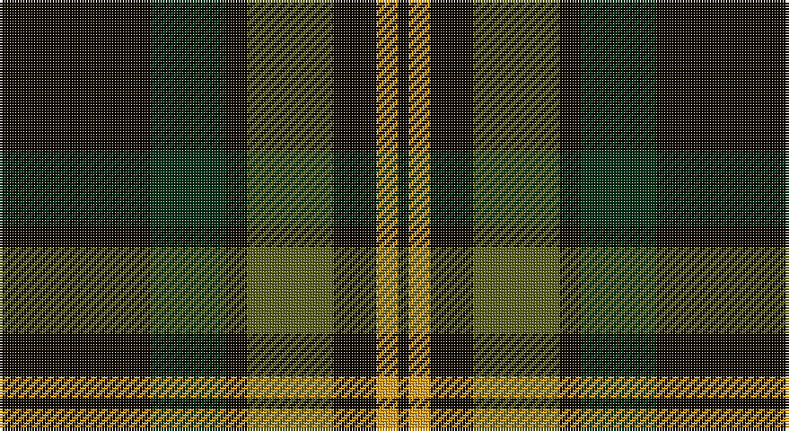

This page is one **sett** — a single exact thread-count. It belongs to the [tartan](/setts/k14dg7k2y8k4lo2k1/)
(the same proportion at any scale), whose colour order is pattern [KGKGKYK](/stripes/kgkgkyk/).

Sourced from register-of-tartans.  It is a [7 stripe tartan](/stripes/stripes7/).

Original link https://www.tartanregister.gov.uk/tartanDetails.aspx?ref=10346

## Also known as

This cloth is also recorded under:

- Grass of Rasunda , The

## Register references

External register numbers recorded for this tartan.

- Scottish Register of Tartans: [10346](https://www.tartanregister.gov.uk/tartanDetails.aspx?ref=10346)

## Thread count
K/56 DG28 K8 G32 K16 Y8 K/4

One full sett is **244 threads**.

## Palette

Palette: <strong>Tartan Register</strong> <small style="color:#888">(1 of 4 colours)</small>
<table><thead><tr><th>Colour</th><th>Threads</th><th>Shade</th><th>Base</th><th>OKLCh</th></tr></thead><tbody><tr><td>K/</td><td style="text-align:right;font-variant-numeric:tabular-nums">56</td><td><code style="background-color:#120A01;">#120A01</code> <small style="color:#888">#120A01</small></td><td>K <code style="background-color:#000000;">#000000</code></td><td><small style="color:#888">oklch(15.2% 0.028 78.6)</small></td></tr><tr><td>DG</td><td style="text-align:right;font-variant-numeric:tabular-nums">28</td><td><code style="background-color:#052F14;">#052F14</code> <small style="color:#888">#052F14</small></td><td>G <code style="background-color:#006100;">#006100</code></td><td><small style="color:#888">oklch(26.9% 0.067 150.8)</small></td></tr><tr><td>K</td><td style="text-align:right;font-variant-numeric:tabular-nums">8</td><td><code style="background-color:#120A01;">#120A01</code> <small style="color:#888">#120A01</small></td><td>K <code style="background-color:#000000;">#000000</code></td><td><small style="color:#888">oklch(15.2% 0.028 78.6)</small></td></tr><tr><td>G</td><td style="text-align:right;font-variant-numeric:tabular-nums">32</td><td><code style="background-color:#5A601E;">#5A601E</code> <small style="color:#888">#5A601E</small></td><td>G <code style="background-color:#006100;">#006100</code></td><td><small style="color:#888">oklch(47.0% 0.088 114.2)</small></td></tr><tr><td>K</td><td style="text-align:right;font-variant-numeric:tabular-nums">16</td><td><code style="background-color:#120A01;">#120A01</code> <small style="color:#888">#120A01</small></td><td>K <code style="background-color:#000000;">#000000</code></td><td><small style="color:#888">oklch(15.2% 0.028 78.6)</small></td></tr><tr><td>Y</td><td style="text-align:right;font-variant-numeric:tabular-nums">8</td><td><code style="background-color:#E0A126;">#E0A126</code> <small style="color:#888">#E0A126</small></td><td>Y <code style="background-color:#F2BF00;">#F2BF00</code></td><td><small style="color:#888">oklch(75.1% 0.146 78.3)</small></td></tr><tr><td>K/</td><td style="text-align:right;font-variant-numeric:tabular-nums">4</td><td><code style="background-color:#120A01;">#120A01</code> <small style="color:#888">#120A01</small></td><td>K <code style="background-color:#000000;">#000000</code></td><td><small style="color:#888">oklch(15.2% 0.028 78.6)</small></td></tr></tbody></table>

# Sample pattern

## Nearest tartans

The nearest existing variants by ΔTartan distance, with this tartan at the top so the swatches line up against it.

ΔTartan

Tartan

Sett

—

<a href="/ttd/edit/#slug=k14dg7k2y8k4lo2k1~x4">Grass of Rasunda (2009), The</a> <a class="nn-out" href="/variants/s7/k14dg7k2y8k4lo2k1~x4/" title="open its dictionary page">↗</a>

0.46

<a href="/ttd/edit/#slug=k14dg7k2y8k4ly2k1~x4&amp;base=k14dg7k2y8k4lo2k1~x4">Grass of Rasunda (Commemorative)</a> <a class="nn-out" href="/variants/s7/k14dg7k2y8k4ly2k1~x4/" title="open its dictionary page">↗</a>

1.03

<a href="/ttd/edit/#slug=ly2dg12db6r3dg12r4db1~x2&amp;base=k14dg7k2y8k4lo2k1~x4">MacKintosh Hunting</a> <a class="nn-out" href="/variants/s7/ly2dg12db6r3dg12r4db1~x2/" title="open its dictionary page">↗</a>

1.04

<a href="/ttd/edit/#slug=k8lo1k8dg13r2~x4&amp;base=k14dg7k2y8k4lo2k1~x4">Tolmie</a> <a class="nn-out" href="/variants/s5/k8lo1k8dg13r2~x4/" title="open its dictionary page">↗</a>

1.21

<a href="/variants/s6/dg26ki3dg12k10dp15w2~x2/">Lossiemouth/Hersbruck</a>

1.23

<a href="/ttd/edit/#slug=dg46k18dg6k13r4k4w4~x2&amp;base=k14dg7k2y8k4lo2k1~x4">Page</a> <a class="nn-out" href="/variants/s7/dg46k18dg6k13r4k4w4~x2/" title="open its dictionary page">↗</a>

1.23

<a href="/ttd/edit/#slug=db13dg8r5db3dg2r1ly1~x4&amp;base=k14dg7k2y8k4lo2k1~x4">Fibonacci7</a> <a class="nn-out" href="/variants/s7/db13dg8r5db3dg2r1ly1~x4/" title="open its dictionary page">↗</a>

1.26

<a href="/ttd/edit/#slug=dr20db2dr5db5k18g5dr5g2dr15~x2&amp;base=k14dg7k2y8k4lo2k1~x4">Laois</a> <a class="nn-out" href="/variants/s9/dr20db2dr5db5k18g5dr5g2dr15~x2/" title="open its dictionary page">↗</a>

1.28

<a href="/ttd/edit/#slug=dg6r2dg13k6w2k16r3~x2&amp;base=k14dg7k2y8k4lo2k1~x4">Sinclair Hunting</a> <a class="nn-out" href="/variants/s7/dg6r2dg13k6w2k16r3~x2/" title="open its dictionary page">↗</a>

1.32

<a href="/variants/s10/k20t2k6g16dp4k9~x2/">Wilson's No.167</a>

1.33

<a href="/ttd/edit/#slug=g6k16w1k16g8k4g12r2~x2&amp;base=k14dg7k2y8k4lo2k1~x4">MacAulay Hunting</a> <a class="nn-out" href="/variants/s8/g6k16w1k16g8k4g12r2~x2/" title="open its dictionary page">↗</a>

## Neighbour map

Every grey dot is one of 14360 variants placed by the first two principal components of the ΔTartan feature space (44% of its variance). Red is this tartan; blue dots are its nearest — click one to open its page.

<svg viewBox="0 0 640 380" role="img" style="max-width:100%;height:auto;border:1px solid #e0e0e0;border-radius:4px;display:block" xmlns="http://www.w3.org/2000/svg"><image href="/nn/cloud.v1.png" width="640" height="380"/><a href="/variants/s7/k14dg7k2y8k4ly2k1~x4/"><circle cx="312.5" cy="218.7" r="4" fill="#3465a4"><title>Grass of Rasunda (Commemorative)</title></circle></a><a href="/variants/s7/ly2dg12db6r3dg12r4db1~x2/"><circle cx="334.0" cy="227.1" r="4" fill="#3465a4"><title>MacKintosh Hunting</title></circle></a><a href="/variants/s5/k8lo1k8dg13r2~x4/"><circle cx="307.4" cy="246.6" r="4" fill="#3465a4"><title>Tolmie</title></circle></a><a href="/variants/s6/dg26ki3dg12k10dp15w2~x2/"><circle cx="301.9" cy="229.6" r="4" fill="#3465a4"><title>Lossiemouth/Hersbruck</title></circle></a><a href="/variants/s7/dg46k18dg6k13r4k4w4~x2/"><circle cx="343.8" cy="210.4" r="4" fill="#3465a4"><title>Page</title></circle></a><a href="/variants/s7/db13dg8r5db3dg2r1ly1~x4/"><circle cx="283.5" cy="208.0" r="4" fill="#3465a4"><title>Fibonacci7</title></circle></a><a href="/variants/s9/dr20db2dr5db5k18g5dr5g2dr15~x2/"><circle cx="326.3" cy="221.4" r="4" fill="#3465a4"><title>Laois</title></circle></a><a href="/variants/s7/dg6r2dg13k6w2k16r3~x2/"><circle cx="253.8" cy="239.3" r="4" fill="#3465a4"><title>Sinclair Hunting</title></circle></a><a href="/variants/s10/k20t2k6g16dp4k9~x2/"><circle cx="267.7" cy="224.3" r="4" fill="#3465a4"><title>Wilson's No.167</title></circle></a><a href="/variants/s8/g6k16w1k16g8k4g12r2~x2/"><circle cx="326.3" cy="217.2" r="4" fill="#3465a4"><title>MacAulay Hunting</title></circle></a><circle cx="320.6" cy="221.8" r="5" fill="#c00000"/></svg>

ID: /variants/s7/k14dg7k2y8k4lo2k1~x4/
