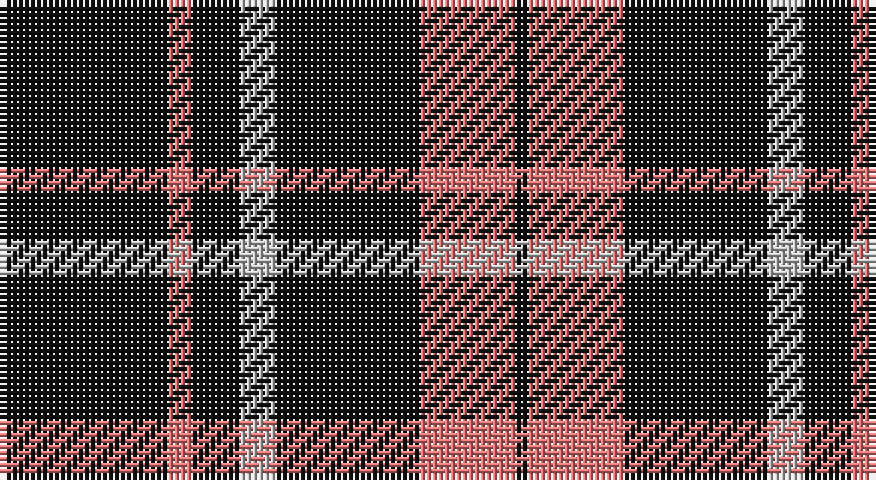

This page is one **sett** — a single exact thread-count. It belongs to the [tartan](/setts/k14r2k4lb3k12r8k1/)
(the same proportion at any scale), whose colour order is pattern [KRKWKRK](/stripes/krkwkrk/).

Part of the [Punky Princess](/tartans/punky-princess/) tartan — the named design grouping this sett with its other cloths.

Sourced from tartans-authority.  It is a [7 stripe tartan](/stripes/stripes7/).

Original link http://www.tartansauthority.com/tartan-ferret/display/10618/

## Register references

External register numbers recorded for this tartan.

- Scottish Register of Tartans: [10618](https://www.tartanregister.gov.uk/tartanDetails?ref=10618)
- Scottish Tartans Authority (ITI): 10618

## Thread count
K/28 LR4 K8 N6 K24 LR16 K/2

One full sett is **146 threads**.

## Palette

Palette: <strong>Tartan Register</strong>
<table><thead><tr><th>Colour</th><th>Threads</th><th>Shade</th><th>Base</th><th>OKLCh</th></tr></thead><tbody><tr><td>K/</td><td style="text-align:right;font-variant-numeric:tabular-nums">28</td><td><code style="background-color:#101010;">#101010</code> <small style="color:#888">#101010</small></td><td>K <code style="background-color:#000000;">#000000</code></td><td><small style="color:#888">oklch(17.3% 0.000 89.9)</small></td></tr><tr><td>LR</td><td style="text-align:right;font-variant-numeric:tabular-nums">4</td><td><code style="background-color:#E87878;">#E87878</code> <small style="color:#888">#E87878</small></td><td>R <code style="background-color:#CC0000;">#CC0000</code></td><td><small style="color:#888">oklch(70.0% 0.139 21.2)</small></td></tr><tr><td>K</td><td style="text-align:right;font-variant-numeric:tabular-nums">8</td><td><code style="background-color:#101010;">#101010</code> <small style="color:#888">#101010</small></td><td>K <code style="background-color:#000000;">#000000</code></td><td><small style="color:#888">oklch(17.3% 0.000 89.9)</small></td></tr><tr><td>N</td><td style="text-align:right;font-variant-numeric:tabular-nums">6</td><td><code style="background-color:#C0C0C0;">#C0C0C0</code> <small style="color:#888">#C0C0C0</small></td><td>W <code style="background-color:#F7F7F7;">#F7F7F7</code></td><td><small style="color:#888">oklch(80.8% 0.000 89.9)</small></td></tr><tr><td>K</td><td style="text-align:right;font-variant-numeric:tabular-nums">24</td><td><code style="background-color:#101010;">#101010</code> <small style="color:#888">#101010</small></td><td>K <code style="background-color:#000000;">#000000</code></td><td><small style="color:#888">oklch(17.3% 0.000 89.9)</small></td></tr><tr><td>LR</td><td style="text-align:right;font-variant-numeric:tabular-nums">16</td><td><code style="background-color:#E87878;">#E87878</code> <small style="color:#888">#E87878</small></td><td>R <code style="background-color:#CC0000;">#CC0000</code></td><td><small style="color:#888">oklch(70.0% 0.139 21.2)</small></td></tr><tr><td>K/</td><td style="text-align:right;font-variant-numeric:tabular-nums">2</td><td><code style="background-color:#101010;">#101010</code> <small style="color:#888">#101010</small></td><td>K <code style="background-color:#000000;">#000000</code></td><td><small style="color:#888">oklch(17.3% 0.000 89.9)</small></td></tr></tbody></table>

# Sample pattern

## Compared to the master

This cloth is one sett of its design; the master sett (the exemplar the design is anchored on) is below for comparison.

<figure style="margin:0"><figcaption style="color:#888;font-size:smaller">this sett</figcaption></figure>
<figure style="margin:0"><figcaption style="color:#888;font-size:smaller"><a href="/setts/k14m2k4lr3k12m8k1/">master sett →</a></figcaption></figure>

## Nearest tartans

The nearest existing variants by ΔTartan distance, with this tartan at the top so the swatches line up against it.

ΔTartan

Tartan

Sett

—

<a href="/ttd/edit/#slug=k14r2k4lb3k12r8k1~x2">Punky Princess (Fashion)</a> <a class="nn-out" href="/variants/s7/k14r2k4lb3k12r8k1~x2/" title="open its dictionary page">↗</a>

1.16

<a href="/ttd/edit/#slug=k21w2k5w9k13g2~x4&amp;base=k14r2k4lb3k12r8k1~x2">New Zealand District Tartan</a> <a class="nn-out" href="/variants/s6/k21w2k5w9k13g2~x4/" title="open its dictionary page">↗</a>

1.23

<a href="/ttd/edit/#slug=k17r6k2w6k17lo2~x2&amp;base=k14r2k4lb3k12r8k1~x2">Black 1990 (Name)</a> <a class="nn-out" href="/variants/s6/k17r6k2w6k17lo2~x2/" title="open its dictionary page">↗</a>

1.29

<a href="/ttd/edit/#slug=k2lb5k1lb1k10r1k1~x4&amp;base=k14r2k4lb3k12r8k1~x2">Lundy Reform</a> <a class="nn-out" href="/variants/s7/k2lb5k1lb1k10r1k1~x4/" title="open its dictionary page">↗</a>

1.29

<a href="/ttd/edit/#slug=k1o2k7o11k18ly2k1~x2&amp;base=k14r2k4lb3k12r8k1~x2">DDB Canada (Fashion)</a> <a class="nn-out" href="/variants/s7/k1o2k7o11k18ly2k1~x2/" title="open its dictionary page">↗</a>

1.31

<a href="/ttd/edit/#slug=k17r6k2lb6k17lo2~x2&amp;base=k14r2k4lb3k12r8k1~x2">Black (symmetrical)</a> <a class="nn-out" href="/variants/s6/k17r6k2lb6k17lo2~x2/" title="open its dictionary page">↗</a>

1.39

<a href="/ttd/edit/#slug=g12k8w6k22w3k8w3k40g6&amp;base=k14r2k4lb3k12r8k1~x2">Jensen, Sven (Personal)</a> <a class="nn-out" href="/variants/s9/g12k8w6k22w3k8w3k40g6/" title="open its dictionary page">↗</a>

1.48

<a href="/ttd/edit/#slug=k16b2k8r3lr3r3k8~x2&amp;base=k14r2k4lb3k12r8k1~x2">Benson (New England)</a> <a class="nn-out" href="/variants/s7/k16b2k8r3lr3r3k8~x2/" title="open its dictionary page">↗</a>

1.48

<a href="/ttd/edit/#slug=k39o3k3o3k14o28r3~x2&amp;base=k14r2k4lb3k12r8k1~x2">Moffat (1984)</a> <a class="nn-out" href="/variants/s7/k39o3k3o3k14o28r3~x2/" title="open its dictionary page">↗</a>

1.49

<a href="/ttd/edit/#slug=k21lb2k4lb4do2lb4k13g2~x4&amp;base=k14r2k4lb3k12r8k1~x2">Anzac (Fashion)</a> <a class="nn-out" href="/variants/s8/k21lb2k4lb4do2lb4k13g2~x4/" title="open its dictionary page">↗</a>

1.51

<a href="/ttd/edit/#slug=k17ly2k2ly2k9lb11k2lb11k20ly2~x2&amp;base=k14r2k4lb3k12r8k1~x2">Coppa Romana (Corporate)</a> <a class="nn-out" href="/variants/s10/k17ly2k2ly2k9lb11k2lb11k20ly2~x2/" title="open its dictionary page">↗</a>

## Neighbour map

Every grey dot is one of 14360 variants placed by the first two principal components of the ΔTartan feature space (44% of its variance). Red is this tartan; blue dots are its nearest — click one to open its page.

<svg viewBox="0 0 640 380" role="img" style="max-width:100%;height:auto;border:1px solid #e0e0e0;border-radius:4px;display:block" xmlns="http://www.w3.org/2000/svg"><image href="/nn/cloud.v1.png" width="640" height="380"/><a href="/variants/s6/k21w2k5w9k13g2~x4/"><circle cx="414.8" cy="228.2" r="4" fill="#3465a4"><title>New Zealand District Tartan</title></circle></a><a href="/variants/s6/k17r6k2w6k17lo2~x2/"><circle cx="371.2" cy="223.5" r="4" fill="#3465a4"><title>Black 1990 (Name)</title></circle></a><a href="/variants/s7/k2lb5k1lb1k10r1k1~x4/"><circle cx="376.1" cy="196.2" r="4" fill="#3465a4"><title>Lundy Reform</title></circle></a><a href="/variants/s7/k1o2k7o11k18ly2k1~x2/"><circle cx="394.7" cy="188.2" r="4" fill="#3465a4"><title>DDB Canada (Fashion)</title></circle></a><a href="/variants/s6/k17r6k2lb6k17lo2~x2/"><circle cx="380.7" cy="228.4" r="4" fill="#3465a4"><title>Black (symmetrical)</title></circle></a><a href="/variants/s9/g12k8w6k22w3k8w3k40g6/"><circle cx="416.0" cy="198.2" r="4" fill="#3465a4"><title>Jensen, Sven (Personal)</title></circle></a><a href="/variants/s7/k16b2k8r3lr3r3k8~x2/"><circle cx="402.8" cy="229.1" r="4" fill="#3465a4"><title>Benson (New England)</title></circle></a><a href="/variants/s7/k39o3k3o3k14o28r3~x2/"><circle cx="372.2" cy="198.8" r="4" fill="#3465a4"><title>Moffat (1984)</title></circle></a><a href="/variants/s8/k21lb2k4lb4do2lb4k13g2~x4/"><circle cx="402.0" cy="189.4" r="4" fill="#3465a4"><title>Anzac (Fashion)</title></circle></a><a href="/variants/s10/k17ly2k2ly2k9lb11k2lb11k20ly2~x2/"><circle cx="326.0" cy="193.5" r="4" fill="#3465a4"><title>Coppa Romana (Corporate)</title></circle></a><circle cx="398.0" cy="211.4" r="5" fill="#c00000"/></svg>

ID: /variants/s7/k14r2k4lb3k12r8k1~x2/
