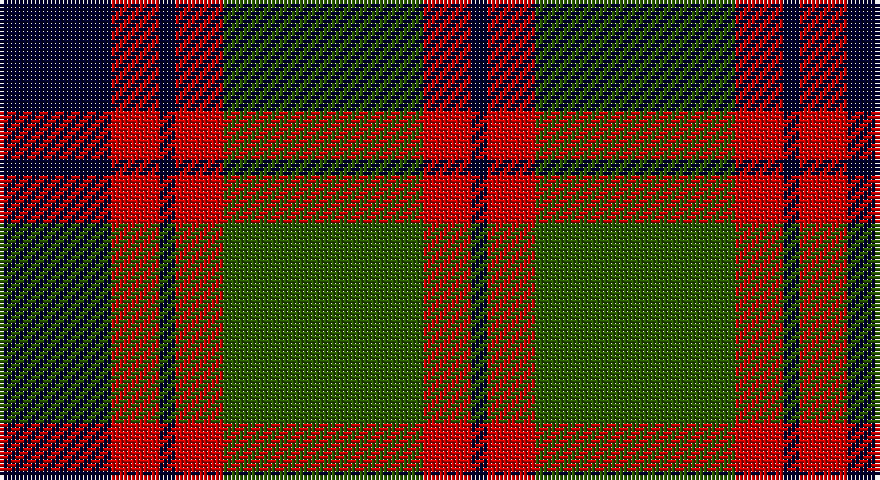

This page is one **sett** — a single exact thread-count. It belongs to the [tartan](/setts/k14r6k2r6dg25r6k2/)
(the same proportion at any scale), whose colour order is pattern [KRGRKRK](/stripes/krgrkrk/).

Part of the [Logan](/tartans/logan/) tartan — the named design grouping this sett with its other cloths.

Sourced from tartans-authority.  It is a [7 stripe tartan](/stripes/stripes7/).

Original link http://www.tartansauthority.com/tartan-ferret/display/398/

## Also known as

This cloth is also recorded under:

- Logan #2
- Logan #4
- Logan #5
- Logan #6
- Logan with Yellow
- Logan, with Yellow

## Register references

External register numbers recorded for this tartan.

- Scottish Tartans Authority (ITI): 398

## Thread count
DB/28 R12 DB4 R12 G50 R12 DB/4

One full sett is **212 threads**.

## Palette

Palette: <strong>Tartan Register</strong> <small style="color:#888">(2 of 3 colours)</small>
<table><thead><tr><th>Colour</th><th>Threads</th><th>Shade</th><th>Base</th><th>OKLCh</th></tr></thead><tbody><tr><td>DB/</td><td style="text-align:right;font-variant-numeric:tabular-nums">28</td><td><code style="background-color:#00002C;">#00002C</code> <small style="color:#888">#00002C</small></td><td>K <code style="background-color:#000000;">#000000</code></td><td><small style="color:#888">oklch(13.2% 0.092 264.1)</small></td></tr><tr><td>R</td><td style="text-align:right;font-variant-numeric:tabular-nums">12</td><td><code style="background-color:#C80000;">#C80000</code> <small style="color:#888">#C80000</small></td><td>R <code style="background-color:#CC0000;">#CC0000</code></td><td><small style="color:#888">oklch(52.3% 0.215 29.2)</small></td></tr><tr><td>DB</td><td style="text-align:right;font-variant-numeric:tabular-nums">4</td><td><code style="background-color:#00002C;">#00002C</code> <small style="color:#888">#00002C</small></td><td>K <code style="background-color:#000000;">#000000</code></td><td><small style="color:#888">oklch(13.2% 0.092 264.1)</small></td></tr><tr><td>R</td><td style="text-align:right;font-variant-numeric:tabular-nums">12</td><td><code style="background-color:#C80000;">#C80000</code> <small style="color:#888">#C80000</small></td><td>R <code style="background-color:#CC0000;">#CC0000</code></td><td><small style="color:#888">oklch(52.3% 0.215 29.2)</small></td></tr><tr><td>G</td><td style="text-align:right;font-variant-numeric:tabular-nums">50</td><td><code style="background-color:#285800;">#285800</code> <small style="color:#888">#285800</small></td><td>G <code style="background-color:#006100;">#006100</code></td><td><small style="color:#888">oklch(41.0% 0.122 135.8)</small></td></tr><tr><td>R</td><td style="text-align:right;font-variant-numeric:tabular-nums">12</td><td><code style="background-color:#C80000;">#C80000</code> <small style="color:#888">#C80000</small></td><td>R <code style="background-color:#CC0000;">#CC0000</code></td><td><small style="color:#888">oklch(52.3% 0.215 29.2)</small></td></tr><tr><td>DB/</td><td style="text-align:right;font-variant-numeric:tabular-nums">4</td><td><code style="background-color:#00002C;">#00002C</code> <small style="color:#888">#00002C</small></td><td>K <code style="background-color:#000000;">#000000</code></td><td><small style="color:#888">oklch(13.2% 0.092 264.1)</small></td></tr></tbody></table>

# Sample pattern

## Compared to the master

This cloth is one sett of its design; the master sett (the exemplar the design is anchored on) is below for comparison.

<figure style="margin:0"><figcaption style="color:#888;font-size:smaller">this sett</figcaption></figure>
<figure style="margin:0"><figcaption style="color:#888;font-size:smaller"><a href="/setts/dp8r3ly1r3dg14r3ly1/">master sett →</a></figcaption></figure>

## Nearest tartans

The nearest existing variants by ΔTartan distance, with this tartan at the top so the swatches line up against it.

ΔTartan

Tartan

Sett

—

<a href="/ttd/edit/#slug=k14r6k2r6dg25r6k2~x2">Logan - 1810 (Cockburn Collection)</a> <a class="nn-out" href="/variants/s7/k14r6k2r6dg25r6k2~x2/" title="open its dictionary page">↗</a>

0.69

<a href="/ttd/edit/#slug=k15r4k1r4dg15r4k1~x4&amp;base=k14r6k2r6dg25r6k2~x2">Logan (Dark)</a> <a class="nn-out" href="/variants/s7/k15r4k1r4dg15r4k1~x4/" title="open its dictionary page">↗</a>

0.94

<a href="/ttd/edit/#slug=db9r6dg2r6dg18r6dg2&amp;base=k14r6k2r6dg25r6k2~x2">Skene D</a> <a class="nn-out" href="/variants/s7/db9r6dg2r6dg18r6dg2/" title="open its dictionary page">↗</a>

0.95

<a href="/ttd/edit/#slug=db9r3db1r3dg9r3db1~x2&amp;base=k14r6k2r6dg25r6k2~x2">Skene</a> <a class="nn-out" href="/variants/s7/db9r3db1r3dg9r3db1~x2/" title="open its dictionary page">↗</a>

1.03

<a href="/ttd/edit/#slug=k9lr4k1lr4dg15r4k1~x4&amp;base=k14r6k2r6dg25r6k2~x2">Logan - 1797 (Dark)</a> <a class="nn-out" href="/variants/s7/k9lr4k1lr4dg15r4k1~x4/" title="open its dictionary page">↗</a>

1.08

<a href="/ttd/edit/#slug=dg20db2dg2db2dg2db8r24db2r3&amp;base=k14r6k2r6dg25r6k2~x2">Lindsay Red</a> <a class="nn-out" href="/variants/s9/dg20db2dg2db2dg2db8r24db2r3/" title="open its dictionary page">↗</a>

1.14

<a href="/ttd/edit/#slug=k2r7k6g12ly1g1k2~x4&amp;base=k14r6k2r6dg25r6k2~x2">Blackstock Hunting</a> <a class="nn-out" href="/variants/s7/k2r7k6g12ly1g1k2~x4/" title="open its dictionary page">↗</a>

1.15

<a href="/ttd/edit/#slug=g8r2g12k6g3db6r24k4~x2&amp;base=k14r6k2r6dg25r6k2~x2">Dickie</a> <a class="nn-out" href="/variants/s8/g8r2g12k6g3db6r24k4~x2/" title="open its dictionary page">↗</a>

1.15

<a href="/ttd/edit/#slug=k3lo18dg6r17k31dg3~x2&amp;base=k14r6k2r6dg25r6k2~x2">MacMillan - 2002 (Black - Unofficial</a> <a class="nn-out" href="/variants/s6/k3lo18dg6r17k31dg3~x2/" title="open its dictionary page">↗</a>

1.17

<a href="/ttd/edit/#slug=dg12g6dg6r15k1r1k2~x2&amp;base=k14r6k2r6dg25r6k2~x2">Cook (Name)</a> <a class="nn-out" href="/variants/s7/dg12g6dg6r15k1r1k2~x2/" title="open its dictionary page">↗</a>

1.18

<a href="/ttd/edit/#slug=g1r9g3k3g3r1k9w1~x2&amp;base=k14r6k2r6dg25r6k2~x2">Manson Family Tartan</a> <a class="nn-out" href="/variants/s8/g1r9g3k3g3r1k9w1~x2/" title="open its dictionary page">↗</a>

## Neighbour map

Every grey dot is one of 14360 variants placed by the first two principal components of the ΔTartan feature space (44% of its variance). Red is this tartan; blue dots are its nearest — click one to open its page.

<svg viewBox="0 0 640 380" role="img" style="max-width:100%;height:auto;border:1px solid #e0e0e0;border-radius:4px;display:block" xmlns="http://www.w3.org/2000/svg"><image href="/nn/cloud.v1.png" width="640" height="380"/><a href="/variants/s7/k15r4k1r4dg15r4k1~x4/"><circle cx="268.3" cy="207.9" r="4" fill="#3465a4"><title>Logan (Dark)</title></circle></a><a href="/variants/s7/db9r6dg2r6dg18r6dg2/"><circle cx="255.6" cy="234.4" r="4" fill="#3465a4"><title>Skene D</title></circle></a><a href="/variants/s7/db9r3db1r3dg9r3db1~x2/"><circle cx="218.7" cy="229.7" r="4" fill="#3465a4"><title>Skene</title></circle></a><a href="/variants/s7/k9lr4k1lr4dg15r4k1~x4/"><circle cx="214.9" cy="186.2" r="4" fill="#3465a4"><title>Logan - 1797 (Dark)</title></circle></a><a href="/variants/s9/dg20db2dg2db2dg2db8r24db2r3/"><circle cx="274.0" cy="178.0" r="4" fill="#3465a4"><title>Lindsay Red</title></circle></a><a href="/variants/s7/k2r7k6g12ly1g1k2~x4/"><circle cx="229.0" cy="196.0" r="4" fill="#3465a4"><title>Blackstock Hunting</title></circle></a><a href="/variants/s8/g8r2g12k6g3db6r24k4~x2/"><circle cx="200.1" cy="181.3" r="4" fill="#3465a4"><title>Dickie</title></circle></a><a href="/variants/s6/k3lo18dg6r17k31dg3~x2/"><circle cx="217.6" cy="211.7" r="4" fill="#3465a4"><title>MacMillan - 2002 (Black - Unofficial</title></circle></a><a href="/variants/s7/dg12g6dg6r15k1r1k2~x2/"><circle cx="252.7" cy="191.8" r="4" fill="#3465a4"><title>Cook (Name)</title></circle></a><a href="/variants/s8/g1r9g3k3g3r1k9w1~x2/"><circle cx="202.7" cy="193.3" r="4" fill="#3465a4"><title>Manson Family Tartan</title></circle></a><circle cx="249.9" cy="207.4" r="5" fill="#c00000"/></svg>

ID: /variants/s7/k14r6k2r6dg25r6k2~x2/
