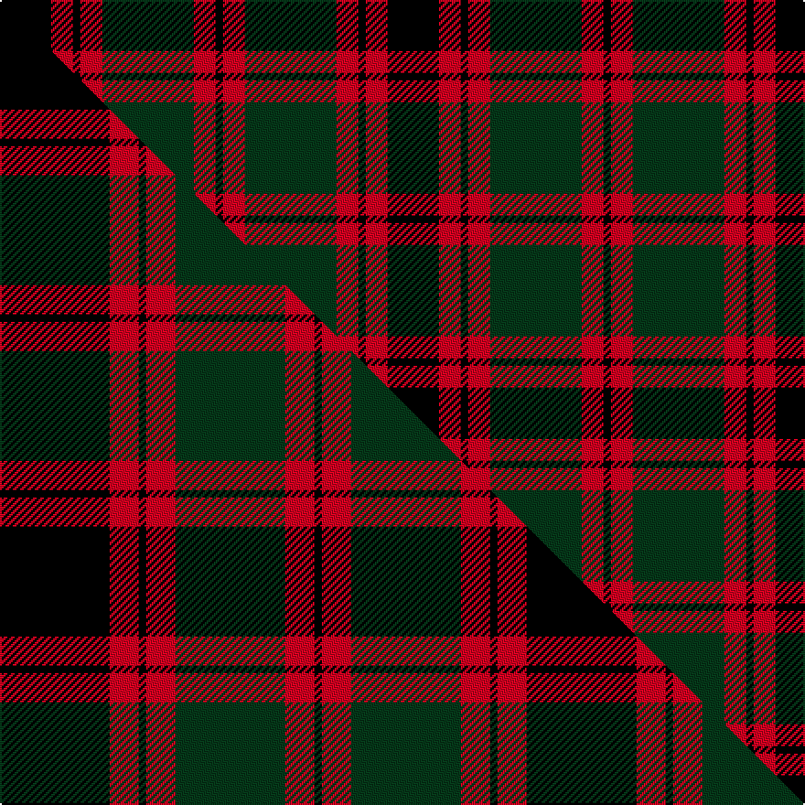

This page is one **sett** — a single exact thread-count. It belongs to the [tartan](/setts/k14r6k2r6dg25r6k2/)
(the same proportion at any scale), whose colour order is pattern [KRGRKRK](/stripes/krgrkrk/).

Part of the [Logan](/tartans/logan/) tartan — the named design grouping this sett with its other cloths.

Sourced from tartans-authority.  It is a [7 stripe tartan](/stripes/stripes7/).

Original link http://www.tartansauthority.com/tartan-ferret/display/398/

## Register references

External register numbers recorded for this tartan.

- Scottish Tartans Authority (ITI): 398

## Thread count
K/28 R12 K4 R12 DG50 R12 K/4

One full sett is **212 threads**.

## Palette
<table><thead><tr><th>Colour</th><th>Shade</th><th>OKLCh</th></tr></thead><tbody><tr><td>K</td><td><code style="background-color:#000000;">#000000</code> <small style="color:#888">#000000</small></td><td><small style="color:#888">oklch(0.0% 0.000 0.0)</small></td></tr><tr><td>DG</td><td><code style="background-color:#053819;">#053819</code> <small style="color:#888">#053819</small></td><td><small style="color:#888">oklch(30.0% 0.075 151.3)</small></td></tr><tr><td>R</td><td><code style="background-color:#D60020;">#D60020</code> <small style="color:#888">#D60020</small></td><td><small style="color:#888">oklch(55.2% 0.224 25.5)</small></td></tr></tbody></table>

# Sample pattern

## Compared to the master

This cloth is one sett of its design; the master sett (the exemplar the design is anchored on) is below for comparison.

Its **ΔTartan distance** from the master is **0.44** — the same measure the nearest-tartans table ranks by (0 is identical; a re-scale of the same cloth is near 0, a recolour or a different proportion further).

<figure class="master-compare" style="margin:0">

this sett
master sett ★

<figcaption style="color:#888;font-size:smaller">One weave of this sett against the <a href="/setts/k15r4k1r4dg15r4k1/">master sett ★</a>, split on the diagonal: a shared proportion runs seamlessly across it with only the shades shifting; a different proportion breaks on it.</figcaption>
</figure>

## Nearest variants

The nearest existing variants by ΔTartan distance, with this cloth at the top so the swatches line up against it.

ΔTartan

Threads

Variant

Sett

—

212

<a href="/variants/s7/k14r6k2r6dg25r6k2~x2/">Logan - 1810 (Cockburn Collection)</a>

<a href="/ttd/edit/#slug=k15r4k1r4dg15r4k1~x4&amp;base=k14r6k2r6dg25r6k2~x2" title="compare in the TTD">0.57</a>

288

<a href="/variants/s7/k15r4k1r4dg15r4k1~x4/">Logan (Dark)</a>

<a href="/ttd/edit/#slug=dg28r4k25r22dg27r4k2~x2&amp;base=k14r6k2r6dg25r6k2~x2" title="compare in the TTD">1.58</a>

388

<a href="/variants/s7/dg28r4k25r22dg27r4k2~x2/">Glasgow, City of District Tartan</a>

<a href="/ttd/edit/#slug=k9lr4k1lr4dg15r4k1~x4~lr2805035-r2109032&amp;base=k14r6k2r6dg25r6k2~x2" title="compare in the TTD">2.25</a>

264

<a href="/variants/s7/k9lr4k1lr4dg15r4k1~x4~lr2805035-r2109032/">Logan - 1797 (Dark)</a>

<a href="/ttd/edit/#slug=db1k1dr12g12k6db5dr12k1db1~x4&amp;base=k14r6k2r6dg25r6k2~x2" title="compare in the TTD">2.47</a>

400

<a href="/variants/s9/db1k1dr12g12k6db5dr12k1db1~x4/">Montrose (Macnaughton variation)</a>

<a href="/ttd/edit/#slug=k1db1r16g16k12db8r16db1k1~x2&amp;base=k14r6k2r6dg25r6k2~x2" title="compare in the TTD">2.56</a>

284

<a href="/variants/s9/k1db1r16g16k12db8r16db1k1~x2/">MacNaughton</a>

<a href="/ttd/edit/#slug=k2r7k6g12y1g1k2~x4&amp;base=k14r6k2r6dg25r6k2~x2" title="compare in the TTD">2.79</a>

232

<a href="/variants/s7/k2r7k6g12y1g1k2~x4/">Blackstock Hunting</a>

<a href="/ttd/edit/#slug=k3dr8k3dr8lo19dr7dt36dr3~x2&amp;base=k14r6k2r6dg25r6k2~x2" title="compare in the TTD">2.88</a>

336

<a href="/variants/s8/k3dr8k3dr8lo19dr7dt36dr3~x2/">Private SA Club</a>

<a href="/ttd/edit/#slug=dg12g6dg6r15k1r1k2~x2&amp;base=k14r6k2r6dg25r6k2~x2" title="compare in the TTD">2.95</a>

144

<a href="/variants/s7/dg12g6dg6r15k1r1k2~x2/">Cook (Name)</a>

<a href="/ttd/edit/#slug=k12r1k1r1k1r4dg12y1dg2~x4&amp;base=k14r6k2r6dg25r6k2~x2" title="compare in the TTD">2.97</a>

224

<a href="/variants/s9/k12r1k1r1k1r4dg12y1dg2~x4/">Durie</a>

## Neighbour map

Every grey dot is one of 13620 variants placed by the first two principal components of the ΔTartan feature space (42% of its variance). Red is this tartan; blue dots are its nearest — click one to open its page.

<svg viewBox="0 0 640 380" role="img" style="max-width:100%;height:auto;border:1px solid #e0e0e0;border-radius:4px;display:block" xmlns="http://www.w3.org/2000/svg"><image href="/nn/cloud.v1.png" width="640" height="380"/><a href="/variants/s7/k15r4k1r4dg15r4k1~x4/"><circle cx="214.5" cy="173.9" r="4" fill="#3465a4"><title>Logan (Dark)</title></circle></a><a href="/variants/s7/dg28r4k25r22dg27r4k2~x2/"><circle cx="252.4" cy="199.4" r="4" fill="#3465a4"><title>Glasgow, City of District Tartan</title></circle></a><a href="/variants/s7/k9lr4k1lr4dg15r4k1~x4~lr2805035-r2109032/"><circle cx="173.3" cy="164.2" r="4" fill="#3465a4"><title>Logan - 1797 (Dark)</title></circle></a><a href="/variants/s9/db1k1dr12g12k6db5dr12k1db1~x4/"><circle cx="231.9" cy="178.2" r="4" fill="#3465a4"><title>Montrose (Macnaughton variation)</title></circle></a><a href="/variants/s9/k1db1r16g16k12db8r16db1k1~x2/"><circle cx="188.5" cy="149.0" r="4" fill="#3465a4"><title>MacNaughton</title></circle></a><a href="/variants/s7/k2r7k6g12y1g1k2~x4/"><circle cx="175.4" cy="171.0" r="4" fill="#3465a4"><title>Blackstock Hunting</title></circle></a><a href="/variants/s8/k3dr8k3dr8lo19dr7dt36dr3~x2/"><circle cx="210.5" cy="168.7" r="4" fill="#3465a4"><title>Private SA Club</title></circle></a><a href="/variants/s7/dg12g6dg6r15k1r1k2~x2/"><circle cx="222.5" cy="174.9" r="4" fill="#3465a4"><title>Cook (Name)</title></circle></a><a href="/variants/s9/k12r1k1r1k1r4dg12y1dg2~x4/"><circle cx="216.9" cy="148.5" r="4" fill="#3465a4"><title>Durie</title></circle></a><circle cx="218.1" cy="183.4" r="5" fill="#c00000"/><text x="320" y="376" text-anchor="middle" font-size="11" fill="#999">ground</text><text x="11" y="190" text-anchor="middle" font-size="11" fill="#999" transform="rotate(-90 11 190)">complexity</text></svg>

ID: /variants/s7/k14r6k2r6dg25r6k2~x2/
