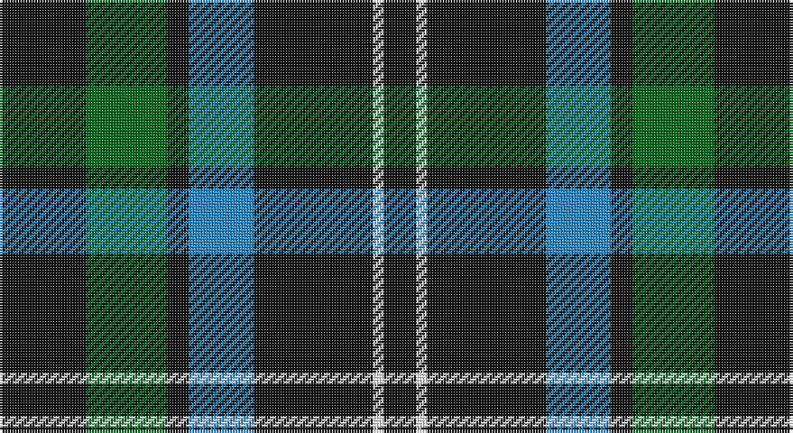

This page is one **sett** — a single exact thread-count. It belongs to the [tartan](/setts/k16g15k4t12k22w2k6/)
(the same proportion at any scale), whose colour order is pattern [KGKBKWK](/stripes/kgkbkwk/).

Part of the [Frame](/tartans/frame/) tartan — the named design grouping this sett with its other cloths.

Sourced from register-of-tartans.  It is a [7 stripe tartan](/stripes/stripes7/).

Original link https://www.tartanregister.gov.uk/tartanDetails.aspx?ref=1243

2 attestations — the source records this cloth was collapsed from (oldest owns this page)

<ul>
<li>01/06/2004 — Frame (Edinburgh) (Personal) (register-of-tartans, <a href="https://www.tartanregister.gov.uk/tartanDetails.aspx?ref=1243">record</a>)</li>
<li>June 2004 — Frame (Personal) (tartans-authority, <a href="http://www.tartansauthority.com/tartan-ferret/display/6289/">record</a>)</li>
</ul>

## Register references

External register numbers recorded for this tartan.

- Scottish Register of Tartans: [1243](https://www.tartanregister.gov.uk/tartanDetails.aspx?ref=1243)
- Scottish Tartans Authority (ITI): 6289

## Thread count
K/32 G30 K8 B24 K44 W4 K/12

One full sett is **264 threads**.

## Palette

Palette: <strong>Tartan Register</strong>
<table><thead><tr><th>Colour</th><th>Threads</th><th>Shade</th><th>Base</th><th>OKLCh</th></tr></thead><tbody><tr><td>K/</td><td style="text-align:right;font-variant-numeric:tabular-nums">32</td><td><code style="background-color:#101010;">#101010</code> <small style="color:#888">#101010</small></td><td>K <code style="background-color:#000000;">#000000</code></td><td><small style="color:#888">oklch(17.3% 0.000 89.9)</small></td></tr><tr><td>G</td><td style="text-align:right;font-variant-numeric:tabular-nums">30</td><td><code style="background-color:#006818;">#006818</code> <small style="color:#888">#006818</small></td><td>G <code style="background-color:#006100;">#006100</code></td><td><small style="color:#888">oklch(45.0% 0.142 145.0)</small></td></tr><tr><td>K</td><td style="text-align:right;font-variant-numeric:tabular-nums">8</td><td><code style="background-color:#101010;">#101010</code> <small style="color:#888">#101010</small></td><td>K <code style="background-color:#000000;">#000000</code></td><td><small style="color:#888">oklch(17.3% 0.000 89.9)</small></td></tr><tr><td>B</td><td style="text-align:right;font-variant-numeric:tabular-nums">24</td><td><code style="background-color:#2888C4;">#2888C4</code> <small style="color:#888">#2888C4</small></td><td>B <code style="background-color:#2A418A;">#2A418A</code></td><td><small style="color:#888">oklch(60.1% 0.125 241.5)</small></td></tr><tr><td>K</td><td style="text-align:right;font-variant-numeric:tabular-nums">44</td><td><code style="background-color:#101010;">#101010</code> <small style="color:#888">#101010</small></td><td>K <code style="background-color:#000000;">#000000</code></td><td><small style="color:#888">oklch(17.3% 0.000 89.9)</small></td></tr><tr><td>W</td><td style="text-align:right;font-variant-numeric:tabular-nums">4</td><td><code style="background-color:#FCFCFC;">#FCFCFC</code> <small style="color:#888">#FCFCFC</small></td><td>W <code style="background-color:#F7F7F7;">#F7F7F7</code></td><td><small style="color:#888">oklch(99.1% 0.000 89.9)</small></td></tr><tr><td>K/</td><td style="text-align:right;font-variant-numeric:tabular-nums">12</td><td><code style="background-color:#101010;">#101010</code> <small style="color:#888">#101010</small></td><td>K <code style="background-color:#000000;">#000000</code></td><td><small style="color:#888">oklch(17.3% 0.000 89.9)</small></td></tr></tbody></table>

# Sample pattern

## Compared to the master

This cloth is one sett of its design; the master sett (the exemplar the design is anchored on) is below for comparison.

<figure style="margin:0"><figcaption style="color:#888;font-size:smaller">this sett</figcaption></figure>
<figure style="margin:0"><figcaption style="color:#888;font-size:smaller"><a href="/setts/dg4do14r1do1dg1do1r1do14r14do1r1dg1/">master sett →</a></figcaption></figure>

## Nearest tartans

The nearest existing variants by ΔTartan distance, with this tartan at the top so the swatches line up against it.

ΔTartan

Tartan

Sett

—

<a href="/ttd/edit/#slug=k16g15k4t12k22w2k6~x2">Frame (Edinburgh) (Personal)</a> <a class="nn-out" href="/variants/s7/k16g15k4t12k22w2k6~x2/" title="open its dictionary page">↗</a>

0.90

<a href="/ttd/edit/#slug=k36w3k10w3g28r6k18~x2&amp;base=k16g15k4t12k22w2k6~x2">Wild Highlanders (Corporate)</a> <a class="nn-out" href="/variants/s7/k36w3k10w3g28r6k18~x2/" title="open its dictionary page">↗</a>

1.06

<a href="/ttd/edit/#slug=dg3w5dg3db6dg5db1dg12r1~x2&amp;base=k16g15k4t12k22w2k6~x2">Hasegawa (Akasaka) (Personal)</a> <a class="nn-out" href="/variants/s8/dg3w5dg3db6dg5db1dg12r1~x2/" title="open its dictionary page">↗</a>

1.08

<a href="/ttd/edit/#slug=k25ly5k5g25k25b3k10~x2&amp;base=k16g15k4t12k22w2k6~x2">London Community Gospel Choir</a> <a class="nn-out" href="/variants/s7/k25ly5k5g25k25b3k10~x2/" title="open its dictionary page">↗</a>

1.30

<a href="/ttd/edit/#slug=r3dg10r3dg14db16dg3ly2&amp;base=k16g15k4t12k22w2k6~x2">Cameron Hunting</a> <a class="nn-out" href="/variants/s7/r3dg10r3dg14db16dg3ly2/" title="open its dictionary page">↗</a>

1.30

<a href="/ttd/edit/#slug=k16w15k4dt12k22r2k6~x2&amp;base=k16g15k4t12k22w2k6~x2">Sanley-Cantamessa (Personal)</a> <a class="nn-out" href="/variants/s7/k16w15k4dt12k22r2k6~x2/" title="open its dictionary page">↗</a>

1.34

<a href="/ttd/edit/#slug=g6k16w1k16g8k4g12r2~x2&amp;base=k16g15k4t12k22w2k6~x2">MacAulay Hunting</a> <a class="nn-out" href="/variants/s8/g6k16w1k16g8k4g12r2~x2/" title="open its dictionary page">↗</a>

1.34

<a href="/ttd/edit/#slug=ly2dg12db6r3dg12r4db1&amp;base=k16g15k4t12k22w2k6~x2">MacKintosh Hunting</a> <a class="nn-out" href="/variants/s7/ly2dg12db6r3dg12r4db1/" title="open its dictionary page">↗</a>

1.38

<a href="/ttd/edit/#slug=k10n2lb5k5r1k5lb5n2k10r1~x4&amp;base=k16g15k4t12k22w2k6~x2">Callaway Corporate Tartan</a> <a class="nn-out" href="/variants/s10/k10n2lb5k5r1k5lb5n2k10r1~x4/" title="open its dictionary page">↗</a>

1.38

<a href="/ttd/edit/#slug=k20t2k6g16p4k9~x2&amp;base=k16g15k4t12k22w2k6~x2">Wilson's, No 167</a> <a class="nn-out" href="/variants/s6/k20t2k6g16p4k9~x2/" title="open its dictionary page">↗</a>

1.39

<a href="/ttd/edit/#slug=r1k10n2lb5k5r1~x4&amp;base=k16g15k4t12k22w2k6~x2">Callaway (Corporate)</a> <a class="nn-out" href="/variants/s6/r1k10n2lb5k5r1~x4/" title="open its dictionary page">↗</a>

## Neighbour map

Every grey dot is one of 14360 variants placed by the first two principal components of the ΔTartan feature space (44% of its variance). Red is this tartan; blue dots are its nearest — click one to open its page.

<svg viewBox="0 0 640 380" role="img" style="max-width:100%;height:auto;border:1px solid #e0e0e0;border-radius:4px;display:block" xmlns="http://www.w3.org/2000/svg"><image href="/nn/cloud.v1.png" width="640" height="380"/><a href="/variants/s7/k36w3k10w3g28r6k18~x2/"><circle cx="328.7" cy="209.9" r="4" fill="#3465a4"><title>Wild Highlanders (Corporate)</title></circle></a><a href="/variants/s8/dg3w5dg3db6dg5db1dg12r1~x2/"><circle cx="311.2" cy="201.7" r="4" fill="#3465a4"><title>Hasegawa (Akasaka) (Personal)</title></circle></a><a href="/variants/s7/k25ly5k5g25k25b3k10~x2/"><circle cx="350.0" cy="242.7" r="4" fill="#3465a4"><title>London Community Gospel Choir</title></circle></a><a href="/variants/s7/r3dg10r3dg14db16dg3ly2/"><circle cx="263.4" cy="230.7" r="4" fill="#3465a4"><title>Cameron Hunting</title></circle></a><a href="/variants/s7/k16w15k4dt12k22r2k6~x2/"><circle cx="277.0" cy="212.3" r="4" fill="#3465a4"><title>Sanley-Cantamessa (Personal)</title></circle></a><a href="/variants/s8/g6k16w1k16g8k4g12r2~x2/"><circle cx="326.3" cy="217.2" r="4" fill="#3465a4"><title>MacAulay Hunting</title></circle></a><a href="/variants/s7/ly2dg12db6r3dg12r4db1/"><circle cx="301.7" cy="210.3" r="4" fill="#3465a4"><title>MacKintosh Hunting</title></circle></a><a href="/variants/s10/k10n2lb5k5r1k5lb5n2k10r1~x4/"><circle cx="307.9" cy="200.3" r="4" fill="#3465a4"><title>Callaway Corporate Tartan</title></circle></a><a href="/variants/s6/k20t2k6g16p4k9~x2/"><circle cx="298.8" cy="233.3" r="4" fill="#3465a4"><title>Wilson's, No 167</title></circle></a><a href="/variants/s6/r1k10n2lb5k5r1~x4/"><circle cx="308.7" cy="209.9" r="4" fill="#3465a4"><title>Callaway (Corporate)</title></circle></a><circle cx="305.1" cy="233.6" r="5" fill="#c00000"/></svg>

ID: /variants/s7/k16g15k4t12k22w2k6~x2/
