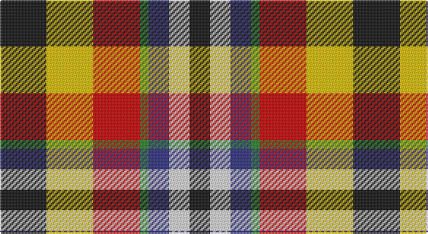

This page is one **sett** — a single exact thread-count. It belongs to the [tartan](/setts/k16ly16r16g3db7w7k7/)
(the same proportion at any scale), whose colour order is pattern [KWBGRYK](/stripes/kwbgryk/).

Sourced from register-of-tartans.  It is a [7 stripe tartan](/stripes/stripes7/).

Original link https://www.tartanregister.gov.uk/tartanDetails.aspx?ref=10236

2 attestations — the source records this cloth was collapsed from (oldest owns this page)

<ul>
<li>03/02/2010 — Eusa (register-of-tartans, <a href="https://www.tartanregister.gov.uk/tartanDetails.aspx?ref=10236">record</a>)</li>
<li>3rd Feb 2010 — Eusa (District) (tartans-authority, <a href="http://www.tartansauthority.com/tartan-ferret/display/10236/">record</a>)</li>
</ul>

## Register references

External register numbers recorded for this tartan.

- Scottish Register of Tartans: [10236](https://www.tartanregister.gov.uk/tartanDetails?ref=10236)
- Scottish Tartans Authority (ITI): 10236

## Thread count
K/32 Y32 R32 G6 DB14 LN14 K/14

One full sett is **242 threads**.

## Palette

Palette: <strong>Tartan Register</strong> <small style="color:#888">(5 of 6 colours)</small>
<table><thead><tr><th>Colour</th><th>Threads</th><th>Shade</th><th>Base</th><th>OKLCh</th></tr></thead><tbody><tr><td>K/</td><td style="text-align:right;font-variant-numeric:tabular-nums">32</td><td><code style="background-color:#101010;">#101010</code> <small style="color:#888">#101010</small></td><td>K <code style="background-color:#000000;">#000000</code></td><td><small style="color:#888">oklch(17.3% 0.000 89.9)</small></td></tr><tr><td>Y</td><td style="text-align:right;font-variant-numeric:tabular-nums">32</td><td><code style="background-color:#E8C000;">#E8C000</code> <small style="color:#888">#E8C000</small></td><td>Y <code style="background-color:#F2BF00;">#F2BF00</code></td><td><small style="color:#888">oklch(81.9% 0.168 93.7)</small></td></tr><tr><td>R</td><td style="text-align:right;font-variant-numeric:tabular-nums">32</td><td><code style="background-color:#C80000;">#C80000</code> <small style="color:#888">#C80000</small></td><td>R <code style="background-color:#CC0000;">#CC0000</code></td><td><small style="color:#888">oklch(52.3% 0.215 29.2)</small></td></tr><tr><td>G</td><td style="text-align:right;font-variant-numeric:tabular-nums">6</td><td><code style="background-color:#288028;">#288028</code> <small style="color:#888">#288028</small></td><td>G <code style="background-color:#006100;">#006100</code></td><td><small style="color:#888">oklch(52.9% 0.149 143.1)</small></td></tr><tr><td>DB</td><td style="text-align:right;font-variant-numeric:tabular-nums">14</td><td><code style="background-color:#2C2C80;">#2C2C80</code> <small style="color:#888">#2C2C80</small></td><td>B <code style="background-color:#2A418A;">#2A418A</code></td><td><small style="color:#888">oklch(35.0% 0.138 276.6)</small></td></tr><tr><td>LN</td><td style="text-align:right;font-variant-numeric:tabular-nums">14</td><td><code style="background-color:#E0E0E0;">#E0E0E0</code> <small style="color:#888">#E0E0E0</small></td><td>W <code style="background-color:#F7F7F7;">#F7F7F7</code></td><td><small style="color:#888">oklch(90.7% 0.000 89.9)</small></td></tr><tr><td>K/</td><td style="text-align:right;font-variant-numeric:tabular-nums">14</td><td><code style="background-color:#101010;">#101010</code> <small style="color:#888">#101010</small></td><td>K <code style="background-color:#000000;">#000000</code></td><td><small style="color:#888">oklch(17.3% 0.000 89.9)</small></td></tr></tbody></table>

# Sample pattern

## Nearest tartans

The nearest existing variants by ΔTartan distance, with this tartan at the top so the swatches line up against it.

ΔTartan

Tartan

Sett

—

<a href="/ttd/edit/#slug=k16ly16r16g3db7w7k7~x2">Eusa</a> <a class="nn-out" href="/variants/s7/k16ly16r16g3db7w7k7~x2/" title="open its dictionary page">↗</a>

1.02

<a href="/ttd/edit/#slug=lo6r8k4w6y16k13lr19k5~x2&amp;base=k16ly16r16g3db7w7k7~x2">Kilkenny County Crest (Fashion)</a> <a class="nn-out" href="/variants/s8/lo6r8k4w6y16k13lr19k5~x2/" title="open its dictionary page">↗</a>

1.15

<a href="/ttd/edit/#slug=r1lo4dr3r1dr3lr1g3db3lr1~x4&amp;base=k16ly16r16g3db7w7k7~x2">Isle of Arran (Personal)</a> <a class="nn-out" href="/variants/s9/r1lo4dr3r1dr3lr1g3db3lr1~x4/" title="open its dictionary page">↗</a>

1.17

<a href="/ttd/edit/#slug=r10lr36k24r30lo8k16w18db16lo9&amp;base=k16ly16r16g3db7w7k7~x2">Tipperary County Crest (Fashion)</a> <a class="nn-out" href="/variants/s9/r10lr36k24r30lo8k16w18db16lo9/" title="open its dictionary page">↗</a>

1.35

<a href="/ttd/edit/#slug=r3lb8k9g16r12n12lo3~x2&amp;base=k16ly16r16g3db7w7k7~x2">Alabama (Fashion)</a> <a class="nn-out" href="/variants/s7/r3lb8k9g16r12n12lo3~x2/" title="open its dictionary page">↗</a>

1.36

<a href="/ttd/edit/#slug=db8r11g5dbi3ly3w5k3~x2&amp;base=k16ly16r16g3db7w7k7~x2">Nicolson of Assynt &amp; Coigach (Name)</a> <a class="nn-out" href="/variants/s7/db8r11g5dbi3ly3w5k3~x2/" title="open its dictionary page">↗</a>

1.41

<a href="/ttd/edit/#slug=w5y4b1y4r4b1dg4ly1~x2&amp;base=k16ly16r16g3db7w7k7~x2">Devon Rural Skills Trust</a> <a class="nn-out" href="/variants/s8/w5y4b1y4r4b1dg4ly1~x2/" title="open its dictionary page">↗</a>

1.42

<a href="/ttd/edit/#slug=r11dbi3db8w3ly3g5k5~x4&amp;base=k16ly16r16g3db7w7k7~x2">Nicolson of Taransay Hunting (Personal)</a> <a class="nn-out" href="/variants/s7/r11dbi3db8w3ly3g5k5~x4/" title="open its dictionary page">↗</a>

1.44

<a href="/ttd/edit/#slug=r2ly1r5k4g5w1~x4&amp;base=k16ly16r16g3db7w7k7~x2">Aboyne II (Fashion)</a> <a class="nn-out" href="/variants/s6/r2ly1r5k4g5w1~x4/" title="open its dictionary page">↗</a>

1.44

<a href="/ttd/edit/#slug=w5y4t1y4r4t1dg4ly1~x6&amp;base=k16ly16r16g3db7w7k7~x2">Devon Rural Skills Trust</a> <a class="nn-out" href="/variants/s8/w5y4t1y4r4t1dg4ly1~x6/" title="open its dictionary page">↗</a>

1.45

<a href="/ttd/edit/#slug=r6k2r12g10k3w2k3ly2k8w4db6w12r4&amp;base=k16ly16r16g3db7w7k7~x2">Victoria</a> <a class="nn-out" href="/variants/s13/r6k2r12g10k3w2k3ly2k8w4db6w12r4/" title="open its dictionary page">↗</a>

## Neighbour map

Every grey dot is one of 14360 variants placed by the first two principal components of the ΔTartan feature space (44% of its variance). Red is this tartan; blue dots are its nearest — click one to open its page.

<svg viewBox="0 0 640 380" role="img" style="max-width:100%;height:auto;border:1px solid #e0e0e0;border-radius:4px;display:block" xmlns="http://www.w3.org/2000/svg"><image href="/nn/cloud.v1.png" width="640" height="380"/><a href="/variants/s8/lo6r8k4w6y16k13lr19k5~x2/"><circle cx="20.6" cy="204.5" r="4" fill="#3465a4"><title>Kilkenny County Crest (Fashion)</title></circle></a><a href="/variants/s9/r1lo4dr3r1dr3lr1g3db3lr1~x4/"><circle cx="16.1" cy="212.0" r="4" fill="#3465a4"><title>Isle of Arran (Personal)</title></circle></a><a href="/variants/s9/r10lr36k24r30lo8k16w18db16lo9/"><circle cx="14.0" cy="202.2" r="4" fill="#3465a4"><title>Tipperary County Crest (Fashion)</title></circle></a><a href="/variants/s7/r3lb8k9g16r12n12lo3~x2/"><circle cx="25.5" cy="218.8" r="4" fill="#3465a4"><title>Alabama (Fashion)</title></circle></a><a href="/variants/s7/db8r11g5dbi3ly3w5k3~x2/"><circle cx="14.0" cy="198.9" r="4" fill="#3465a4"><title>Nicolson of Assynt &amp; Coigach (Name)</title></circle></a><a href="/variants/s8/w5y4b1y4r4b1dg4ly1~x2/"><circle cx="44.4" cy="204.1" r="4" fill="#3465a4"><title>Devon Rural Skills Trust</title></circle></a><a href="/variants/s7/r11dbi3db8w3ly3g5k5~x4/"><circle cx="14.0" cy="203.0" r="4" fill="#3465a4"><title>Nicolson of Taransay Hunting (Personal)</title></circle></a><a href="/variants/s6/r2ly1r5k4g5w1~x4/"><circle cx="112.9" cy="222.9" r="4" fill="#3465a4"><title>Aboyne II (Fashion)</title></circle></a><a href="/variants/s8/w5y4t1y4r4t1dg4ly1~x6/"><circle cx="36.2" cy="200.2" r="4" fill="#3465a4"><title>Devon Rural Skills Trust</title></circle></a><a href="/variants/s13/r6k2r12g10k3w2k3ly2k8w4db6w12r4/"><circle cx="17.2" cy="152.3" r="4" fill="#3465a4"><title>Victoria</title></circle></a><circle cx="25.0" cy="199.6" r="5" fill="#c00000"/></svg>

ID: /variants/s7/k16ly16r16g3db7w7k7~x2/
