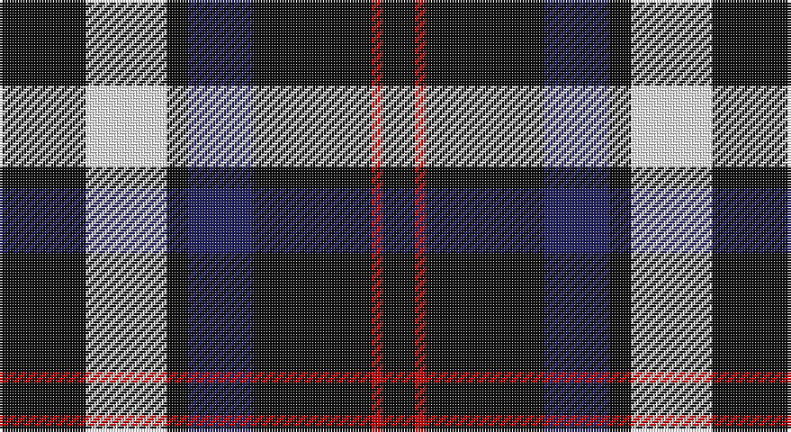

This page is one **sett** — a single exact thread-count. It belongs to the [tartan](/setts/k16w15k4db12k22r2k6/)
(the same proportion at any scale), whose colour order is pattern [KRKBKWK](/stripes/krkbkwk/).

Part of the [Sanley-Cantamessa](/tartans/sanley-cantamessa/) tartan — the named design grouping this sett with its other cloths.

Sourced from tartans-authority.  It is a [7 stripe tartan](/stripes/stripes7/).

Original link http://www.tartansauthority.com/tartan-ferret/display/10854/

## Register references

External register numbers recorded for this tartan.

- Scottish Register of Tartans: [10854](https://www.tartanregister.gov.uk/tartanDetails?ref=10854)
- Scottish Tartans Authority (ITI): 10854

## Thread count
K/32 W30 K8 DB24 K44 R4 K/12

One full sett is **264 threads**.

## Palette

Palette: <strong>Tartan Register</strong>
<table><thead><tr><th>Colour</th><th>Threads</th><th>Shade</th><th>Base</th><th>OKLCh</th></tr></thead><tbody><tr><td>K/</td><td style="text-align:right;font-variant-numeric:tabular-nums">32</td><td><code style="background-color:#101010;">#101010</code> <small style="color:#888">#101010</small></td><td>K <code style="background-color:#000000;">#000000</code></td><td><small style="color:#888">oklch(17.3% 0.000 89.9)</small></td></tr><tr><td>W</td><td style="text-align:right;font-variant-numeric:tabular-nums">30</td><td><code style="background-color:#FCFCFC;">#FCFCFC</code> <small style="color:#888">#FCFCFC</small></td><td>W <code style="background-color:#F7F7F7;">#F7F7F7</code></td><td><small style="color:#888">oklch(99.1% 0.000 89.9)</small></td></tr><tr><td>K</td><td style="text-align:right;font-variant-numeric:tabular-nums">8</td><td><code style="background-color:#101010;">#101010</code> <small style="color:#888">#101010</small></td><td>K <code style="background-color:#000000;">#000000</code></td><td><small style="color:#888">oklch(17.3% 0.000 89.9)</small></td></tr><tr><td>DB</td><td style="text-align:right;font-variant-numeric:tabular-nums">24</td><td><code style="background-color:#202060;">#202060</code> <small style="color:#888">#202060</small></td><td>B <code style="background-color:#2A418A;">#2A418A</code></td><td><small style="color:#888">oklch(28.9% 0.111 276.9)</small></td></tr><tr><td>K</td><td style="text-align:right;font-variant-numeric:tabular-nums">44</td><td><code style="background-color:#101010;">#101010</code> <small style="color:#888">#101010</small></td><td>K <code style="background-color:#000000;">#000000</code></td><td><small style="color:#888">oklch(17.3% 0.000 89.9)</small></td></tr><tr><td>R</td><td style="text-align:right;font-variant-numeric:tabular-nums">4</td><td><code style="background-color:#C80000;">#C80000</code> <small style="color:#888">#C80000</small></td><td>R <code style="background-color:#CC0000;">#CC0000</code></td><td><small style="color:#888">oklch(52.3% 0.215 29.2)</small></td></tr><tr><td>K/</td><td style="text-align:right;font-variant-numeric:tabular-nums">12</td><td><code style="background-color:#101010;">#101010</code> <small style="color:#888">#101010</small></td><td>K <code style="background-color:#000000;">#000000</code></td><td><small style="color:#888">oklch(17.3% 0.000 89.9)</small></td></tr></tbody></table>

# Sample pattern

## Compared to the master

This cloth is one sett of its design; the master sett (the exemplar the design is anchored on) is below for comparison.

<figure style="margin:0"><figcaption style="color:#888;font-size:smaller">this sett</figcaption></figure>
<figure style="margin:0"><figcaption style="color:#888;font-size:smaller"><a href="/setts/k16w15k4dt12k22r2k6/">master sett →</a></figcaption></figure>

## Nearest tartans

The nearest existing variants by ΔTartan distance, with this tartan at the top so the swatches line up against it.

ΔTartan

Tartan

Sett

—

<a href="/ttd/edit/#slug=k16w15k4db12k22r2k6~x2">Sanley-Cantamessa</a> <a class="nn-out" href="/variants/s7/k16w15k4db12k22r2k6~x2/" title="open its dictionary page">↗</a>

0.30

<a href="/ttd/edit/#slug=k16w15k4dt12k22r2k6~x2&amp;base=k16w15k4db12k22r2k6~x2">Sanley-Cantamessa (Personal)</a> <a class="nn-out" href="/variants/s7/k16w15k4dt12k22r2k6~x2/" title="open its dictionary page">↗</a>

1.01

<a href="/ttd/edit/#slug=r1k10n2lb5k5r1~x4&amp;base=k16w15k4db12k22r2k6~x2">Callaway (Corporate)</a> <a class="nn-out" href="/variants/s6/r1k10n2lb5k5r1~x4/" title="open its dictionary page">↗</a>

1.04

<a href="/ttd/edit/#slug=k10n2lb5k5r1k5lb5n2k10r1~x4&amp;base=k16w15k4db12k22r2k6~x2">Callaway Corporate Tartan</a> <a class="nn-out" href="/variants/s10/k10n2lb5k5r1k5lb5n2k10r1~x4/" title="open its dictionary page">↗</a>

1.29

<a href="/ttd/edit/#slug=dg3w5dg3db6dg5db1dg12r1~x2&amp;base=k16w15k4db12k22r2k6~x2">Hasegawa (Akasaka) (Personal)</a> <a class="nn-out" href="/variants/s8/dg3w5dg3db6dg5db1dg12r1~x2/" title="open its dictionary page">↗</a>

1.39

<a href="/ttd/edit/#slug=k16g15k4t12k22w2k6~x2&amp;base=k16w15k4db12k22r2k6~x2">Frame (Edinburgh) (Personal)</a> <a class="nn-out" href="/variants/s7/k16g15k4t12k22w2k6~x2/" title="open its dictionary page">↗</a>

1.43

<a href="/ttd/edit/#slug=dy7k7dy4k26w12k3w14m2k6&amp;base=k16w15k4db12k22r2k6~x2">Aquascutum (Kinloch Anderson)</a> <a class="nn-out" href="/variants/s9/dy7k7dy4k26w12k3w14m2k6/" title="open its dictionary page">↗</a>

1.48

<a href="/ttd/edit/#slug=k11w1k1w1k4o8r1~x8&amp;base=k16w15k4db12k22r2k6~x2">Dunfermline Athletic (2008) (Corp)</a> <a class="nn-out" href="/variants/s7/k11w1k1w1k4o8r1~x8/" title="open its dictionary page">↗</a>

1.53

<a href="/variants/s10/r12db3g5db16ly2g2~x2/">Dunbog Primary School</a>

1.54

<a href="/ttd/edit/#slug=k36w3k10w3g28r6k18~x2&amp;base=k16w15k4db12k22r2k6~x2">Wild Highlanders (Corporate)</a> <a class="nn-out" href="/variants/s7/k36w3k10w3g28r6k18~x2/" title="open its dictionary page">↗</a>

1.56

<a href="/ttd/edit/#slug=k2o6k2o6k12r1~x4&amp;base=k16w15k4db12k22r2k6~x2">MacSween, Black (Personal)</a> <a class="nn-out" href="/variants/s6/k2o6k2o6k12r1~x4/" title="open its dictionary page">↗</a>

## Neighbour map

Every grey dot is one of 14360 variants placed by the first two principal components of the ΔTartan feature space (44% of its variance). Red is this tartan; blue dots are its nearest — click one to open its page.

<svg viewBox="0 0 640 380" role="img" style="max-width:100%;height:auto;border:1px solid #e0e0e0;border-radius:4px;display:block" xmlns="http://www.w3.org/2000/svg"><image href="/nn/cloud.v1.png" width="640" height="380"/><a href="/variants/s7/k16w15k4dt12k22r2k6~x2/"><circle cx="277.0" cy="212.3" r="4" fill="#3465a4"><title>Sanley-Cantamessa (Personal)</title></circle></a><a href="/variants/s6/r1k10n2lb5k5r1~x4/"><circle cx="308.7" cy="209.9" r="4" fill="#3465a4"><title>Callaway (Corporate)</title></circle></a><a href="/variants/s10/k10n2lb5k5r1k5lb5n2k10r1~x4/"><circle cx="307.9" cy="200.3" r="4" fill="#3465a4"><title>Callaway Corporate Tartan</title></circle></a><a href="/variants/s8/dg3w5dg3db6dg5db1dg12r1~x2/"><circle cx="311.2" cy="201.7" r="4" fill="#3465a4"><title>Hasegawa (Akasaka) (Personal)</title></circle></a><a href="/variants/s7/k16g15k4t12k22w2k6~x2/"><circle cx="305.1" cy="233.6" r="4" fill="#3465a4"><title>Frame (Edinburgh) (Personal)</title></circle></a><a href="/variants/s9/dy7k7dy4k26w12k3w14m2k6/"><circle cx="232.2" cy="171.8" r="4" fill="#3465a4"><title>Aquascutum (Kinloch Anderson)</title></circle></a><a href="/variants/s7/k11w1k1w1k4o8r1~x8/"><circle cx="311.1" cy="183.5" r="4" fill="#3465a4"><title>Dunfermline Athletic (2008) (Corp)</title></circle></a><a href="/variants/s10/r12db3g5db16ly2g2~x2/"><circle cx="264.1" cy="195.3" r="4" fill="#3465a4"><title>Dunbog Primary School</title></circle></a><a href="/variants/s7/k36w3k10w3g28r6k18~x2/"><circle cx="328.7" cy="209.9" r="4" fill="#3465a4"><title>Wild Highlanders (Corporate)</title></circle></a><a href="/variants/s6/k2o6k2o6k12r1~x4/"><circle cx="327.4" cy="224.9" r="4" fill="#3465a4"><title>MacSween, Black (Personal)</title></circle></a><circle cx="278.4" cy="212.5" r="5" fill="#c00000"/></svg>

ID: /variants/s7/k16w15k4db12k22r2k6~x2/
