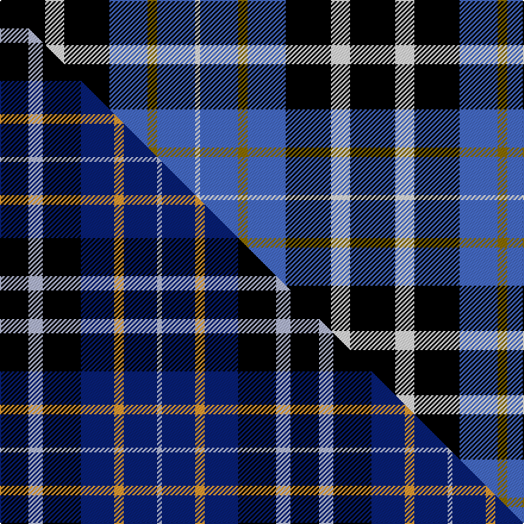

This is one **variant** — a specific cloth: this exact thread count and colourway, with its own
provenance below. It is one weaving of the [sett](/tartans/s/st/st-johnstone-f-c/) (the scale-free proportion — the
same cloth at any scale or shade), whose colour order is pattern [KWKBGBW](/stripes/kwkbgbw/).

Part of the [St. Johnstone F.C.](/tartans/s/st/st-johnstone-f-c/) tartan — the named design grouping this sett with its other cloths.

Sourced from weddslist.  It is a [7 stripe tartan](/stripes/stripes7/).

Original link [http://www.weddslist.com/cgi-bin/tartans/pg.pl?source=sts](http://www.weddslist.com/cgi-bin/tartans/pg.pl?source=sts)

Dataset <small>— provenance for this record, inherited from the source manifest</small>

<dl class="dataset-prov">
<dt>source</dt><dd><a href="/sources/weddslist/">Weddslist</a></dd>
<dt>data captured from</dt><dd><a href="https://github.com/thetartan/tartan-database/blob/master/data/weddslist/data.csv">https://github.com/thetartan/tartan-database/blob/master/data/weddslist/data.csv</a></dd>
<dt>data date</dt><dd>2016-11-17 <small>(dataset default)</small></dd>
<dt>licence</dt><dd><a href="https://creativecommons.org/licenses/by-nc-nd/4.0/">CC BY-NC-ND 4.0</a></dd>
</dl>

Capture chain <small>— the hands this data passed through, oldest first; each capture carries its own licence</small>

<ol class="capture-chain">
<li><a href="https://www.weddslist.com/tartans/">Weddslist</a> <small>the living privately compiled reference</small></li>
<li><a href="https://github.com/thetartan/tartan-database">thetartan/tartan-database</a> <small>2016-2017</small> · <a href="https://creativecommons.org/licenses/by-nc-nd/4.0/">CC BY-NC-ND 4.0</a> <small>Levko Kravets's frozen compilation — the capture we vendored, and where its CC licence text came from</small></li>
<li>this dictionary <small>captured 2026-06-10 · commit 5bf86c7566</small> <small>each re-capture is a git commit to data/sources</small></li>
</ol>

## Thread count
K/38 W16 K38 B32 Y8 B32 W/4

One full sett is **294 threads**.

## Palette
<table><thead><tr><th>Colour</th><th>Shade</th><th>OKLCh</th></tr></thead><tbody><tr><td>B</td><td><code style="background-color:#466CC8;">#466CC8</code> <small style="color:#888">#466CC8</small></td><td><small style="color:#888">oklch(55.1% 0.149 265.0)</small></td></tr><tr><td>K</td><td><code style="background-color:#000000;">#000000</code> <small style="color:#888">#000000</small></td><td><small style="color:#888">oklch(0.0% 0.000 0.0)</small></td></tr><tr><td>W</td><td><code style="background-color:#F7F7F7;">#F7F7F7</code> <small style="color:#888">#F7F7F7</small></td><td><small style="color:#888">oklch(97.6% 0.000 89.9)</small></td></tr><tr><td>Y</td><td><code style="background-color:#8B6E00;">#8B6E00</code> <small style="color:#888">#8B6E00</small></td><td><small style="color:#888">oklch(55.1% 0.113 90.4)</small></td></tr></tbody></table>

# Sample pattern

## Compared to the master

This cloth is one sett of its design; the master sett (the exemplar the design is anchored on) is below for comparison.

Its **ΔTartan distance** from the master is **1.24** — the same measure the nearest-tartans table ranks by (0 is identical; a re-scale of the same cloth is near 0, a recolour or a different proportion further).

<figure class="master-compare" style="margin:0">

this sett
master sett ★

<figcaption style="color:#888;font-size:smaller">One weave of this sett against the <a href="/setts/k6lb3k8db7lo2db7lb1/">master sett ★</a>, split on the diagonal: a shared proportion runs seamlessly across it with only the shades shifting; a different proportion breaks on it.</figcaption>
</figure>

## Nearest tartan variants

The nearest existing variants by ΔTartan distance, with this cloth at the top so the swatches line up against it.

ΔTartan

Threads

Variant

Sett

—

294

<a href="/variants/s7/k19w8k19b16y4b16w2~x2/">St Johnstone F.C.</a>

<a href="/ttd/edit/#slug=k6lb3k8db7lo2db7lb1~x4&amp;base=k19w8k19b16y4b16w2~x2" title="compare in the TTD">1.24</a>

244

<a href="/variants/s7/k6lb3k8db7lo2db7lb1~x4/">St. Johnstone F.C. (Sports)</a>

<a href="/ttd/edit/#slug=k6lb3k8db7lo2db7lb1~x4~db1406275&amp;base=k19w8k19b16y4b16w2~x2" title="compare in the TTD">1.24</a>

244

<a href="/variants/s7/k6lb3k8db7lo2db7lb1~x4~db1406275/">St Johnstone F.C. Corporate Sport Tartan</a>

<a href="/ttd/edit/#slug=db2y1db7w1k7w2~x6&amp;base=k19w8k19b16y4b16w2~x2" title="compare in the TTD">1.63</a>

216

<a href="/variants/s6/db2y1db7w1k7w2~x6/">Hawick Rugby Club</a>

<a href="/ttd/edit/#slug=k3r2k14lb2db6lb2db16lb3~x2&amp;base=k19w8k19b16y4b16w2~x2" title="compare in the TTD">1.87</a>

180

<a href="/variants/s8/k3r2k14lb2db6lb2db16lb3~x2/">Immanuel Presbyterian Church (Milwaukee)</a>

<a href="/ttd/edit/#slug=k3b16k4b3k12w2~x3&amp;base=k19w8k19b16y4b16w2~x2" title="compare in the TTD">1.88</a>

225

<a href="/variants/s6/k3b16k4b3k12w2~x3/">MacMugen</a>

<a href="/ttd/edit/#slug=k15y2k10db18w3~x2&amp;base=k19w8k19b16y4b16w2~x2" title="compare in the TTD">2.01</a>

156

<a href="/variants/s5/k15y2k10db18w3~x2/">College of Radiographers</a>

<a href="/ttd/edit/#slug=k7r3k24b28y3~x2&amp;base=k19w8k19b16y4b16w2~x2" title="compare in the TTD">2.04</a>

240

<a href="/variants/s5/k7r3k24b28y3~x2/">Robert Gordon University</a>

<a href="/ttd/edit/#slug=k10w7k8w7k8b14k4b14k16y2&amp;base=k19w8k19b16y4b16w2~x2" title="compare in the TTD">2.24</a>

168

<a href="/variants/s10/k10w7k8w7k8b14k4b14k16y2/">Little of Morton Rig</a>

<a href="/ttd/edit/#slug=db44k9w3k24ly15k6w7~x2&amp;base=k19w8k19b16y4b16w2~x2" title="compare in the TTD">2.26</a>

330

<a href="/variants/s7/db44k9w3k24ly15k6w7~x2/">Longford County Crest (Fashion)</a>

<a href="/ttd/edit/#slug=db3g12k13w2db13w3~x2~db1406275&amp;base=k19w8k19b16y4b16w2~x2" title="compare in the TTD">2.27</a>

172

<a href="/variants/s6/db3g12k13w2db13w3~x2~db1406275/">Herd/Hurd</a>

## Neighbour map

Every grey dot is one of 13657 variants placed by the first two principal components of the ΔTartan feature space (42% of its variance). Red is this tartan; blue dots are its nearest — click one to open its page. The map is a flat projection of a many-dimensional space — [how to read it](/posts/neighbourhood-maps/).

<svg viewBox="0 0 640 380" role="img" style="max-width:100%;height:auto;border:1px solid #e0e0e0;border-radius:4px;display:block" xmlns="http://www.w3.org/2000/svg"><image href="/nn/cloud.v1.png" width="640" height="380"/><a href="/variants/s7/k6lb3k8db7lo2db7lb1~x4/"><circle cx="157.6" cy="226.1" r="4" fill="#3465a4"><title>St. Johnstone F.C. (Sports)</title></circle></a><a href="/variants/s7/k6lb3k8db7lo2db7lb1~x4~db1406275/"><circle cx="157.5" cy="207.8" r="4" fill="#3465a4"><title>St Johnstone F.C. Corporate Sport Tartan</title></circle></a><a href="/variants/s6/db2y1db7w1k7w2~x6/"><circle cx="178.4" cy="192.9" r="4" fill="#3465a4"><title>Hawick Rugby Club</title></circle></a><a href="/variants/s8/k3r2k14lb2db6lb2db16lb3~x2/"><circle cx="193.0" cy="179.0" r="4" fill="#3465a4"><title>Immanuel Presbyterian Church (Milwaukee)</title></circle></a><a href="/variants/s6/k3b16k4b3k12w2~x3/"><circle cx="242.9" cy="213.1" r="4" fill="#3465a4"><title>MacMugen</title></circle></a><a href="/variants/s5/k15y2k10db18w3~x2/"><circle cx="235.0" cy="215.7" r="4" fill="#3465a4"><title>College of Radiographers</title></circle></a><a href="/variants/s5/k7r3k24b28y3~x2/"><circle cx="225.2" cy="194.5" r="4" fill="#3465a4"><title>Robert Gordon University</title></circle></a><a href="/variants/s10/k10w7k8w7k8b14k4b14k16y2/"><circle cx="160.0" cy="209.3" r="4" fill="#3465a4"><title>Little of Morton Rig</title></circle></a><a href="/variants/s7/db44k9w3k24ly15k6w7~x2/"><circle cx="178.7" cy="168.0" r="4" fill="#3465a4"><title>Longford County Crest (Fashion)</title></circle></a><a href="/variants/s6/db3g12k13w2db13w3~x2~db1406275/"><circle cx="108.1" cy="226.4" r="4" fill="#3465a4"><title>Herd/Hurd</title></circle></a><circle cx="165.7" cy="212.5" r="5" fill="#c00000"/><text x="320" y="376" text-anchor="middle" font-size="11" fill="#999">ground</text><text x="11" y="190" text-anchor="middle" font-size="11" fill="#999" transform="rotate(-90 11 190)">complexity</text></svg>

ID: /variants/s7/k19w8k19b16y4b16w2~x2/
