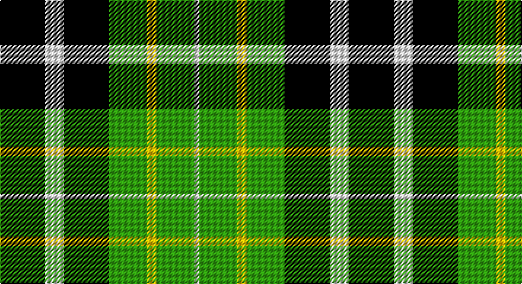

This page is one **sett** — a single exact thread-count. It belongs to the [tartan](/setts/k19w8k19g16ly4g16w2/)
(the same proportion at any scale), whose colour order is pattern [KWKGYGW](/stripes/kwkgygw/).

Sourced from weddslist.  It is a [7 stripe tartan](/stripes/stripes7/).

Original link http://www.weddslist.com/cgi-bin/tartans/pg.pl?source=sts

## Thread count
K/38 LN16 K38 G32 Y8 G32 LN/4

One full sett is **294 threads**.

## Palette

Palette: <strong>Tartan Register</strong> <small style="color:#888">(2 of 4 colours)</small>
<table><thead><tr><th>Colour</th><th>Threads</th><th>Shade</th><th>Base</th><th>OKLCh</th></tr></thead><tbody><tr><td>K/</td><td style="text-align:right;font-variant-numeric:tabular-nums">38</td><td><code style="background-color:#000000;">#000000</code> <small style="color:#888">#000000</small></td><td>K <code style="background-color:#000000;">#000000</code></td><td><small style="color:#888">oklch(0.0% 0.000 0.0)</small></td></tr><tr><td>LN</td><td style="text-align:right;font-variant-numeric:tabular-nums">16</td><td><code style="background-color:#E0E0E0;">#E0E0E0</code> <small style="color:#888">#E0E0E0</small></td><td>W <code style="background-color:#F7F7F7;">#F7F7F7</code></td><td><small style="color:#888">oklch(90.7% 0.000 89.9)</small></td></tr><tr><td>K</td><td style="text-align:right;font-variant-numeric:tabular-nums">38</td><td><code style="background-color:#000000;">#000000</code> <small style="color:#888">#000000</small></td><td>K <code style="background-color:#000000;">#000000</code></td><td><small style="color:#888">oklch(0.0% 0.000 0.0)</small></td></tr><tr><td>G</td><td style="text-align:right;font-variant-numeric:tabular-nums">32</td><td><code style="background-color:#30A010;">#30A010</code> <small style="color:#888">#30A010</small></td><td>G <code style="background-color:#006100;">#006100</code></td><td><small style="color:#888">oklch(61.9% 0.195 140.5)</small></td></tr><tr><td>Y</td><td style="text-align:right;font-variant-numeric:tabular-nums">8</td><td><code style="background-color:#F0C000;">#F0C000</code> <small style="color:#888">#F0C000</small></td><td>Y <code style="background-color:#F2BF00;">#F2BF00</code></td><td><small style="color:#888">oklch(82.7% 0.169 90.5)</small></td></tr><tr><td>G</td><td style="text-align:right;font-variant-numeric:tabular-nums">32</td><td><code style="background-color:#30A010;">#30A010</code> <small style="color:#888">#30A010</small></td><td>G <code style="background-color:#006100;">#006100</code></td><td><small style="color:#888">oklch(61.9% 0.195 140.5)</small></td></tr><tr><td>LN/</td><td style="text-align:right;font-variant-numeric:tabular-nums">4</td><td><code style="background-color:#E0E0E0;">#E0E0E0</code> <small style="color:#888">#E0E0E0</small></td><td>W <code style="background-color:#F7F7F7;">#F7F7F7</code></td><td><small style="color:#888">oklch(90.7% 0.000 89.9)</small></td></tr></tbody></table>

# Sample pattern

## Nearest tartans

The nearest existing variants by ΔTartan distance, with this tartan at the top so the swatches line up against it.

ΔTartan

Tartan

Sett

—

<a href="/ttd/edit/#slug=k19w8k19g16ly4g16w2~x2">St Johnstone F.C.</a> <a class="nn-out" href="/variants/s7/k19w8k19g16ly4g16w2~x2/" title="open its dictionary page">↗</a>

1.02

<a href="/ttd/edit/#slug=g9w1g6k7db7k1~x2&amp;base=k19w8k19g16ly4g16w2~x2">Menteith</a> <a class="nn-out" href="/variants/s6/g9w1g6k7db7k1~x2/" title="open its dictionary page">↗</a>

1.02

<a href="/ttd/edit/#slug=k2g9t1k6b4g2~x2&amp;base=k19w8k19g16ly4g16w2~x2">Unnamed 3</a> <a class="nn-out" href="/variants/s6/k2g9t1k6b4g2~x2/" title="open its dictionary page">↗</a>

1.12

<a href="/ttd/edit/#slug=k8g8k1g8k8b8w2~x2&amp;base=k19w8k19g16ly4g16w2~x2">Unnamed, No 31</a> <a class="nn-out" href="/variants/s7/k8g8k1g8k8b8w2~x2/" title="open its dictionary page">↗</a>

1.20

<a href="/ttd/edit/#slug=k2g7t1k6r4g2~x4&amp;base=k19w8k19g16ly4g16w2~x2">Walker, James</a> <a class="nn-out" href="/variants/s6/k2g7t1k6r4g2~x4/" title="open its dictionary page">↗</a>

1.26

<a href="/ttd/edit/#slug=g8k2t1g4k6db6k1~x2&amp;base=k19w8k19g16ly4g16w2~x2">MacCallum</a> <a class="nn-out" href="/variants/s7/g8k2t1g4k6db6k1~x2/" title="open its dictionary page">↗</a>

1.30

<a href="/ttd/edit/#slug=r5db15k15g15w2g15k15g15w2~x2&amp;base=k19w8k19g16ly4g16w2~x2">Arrol</a> <a class="nn-out" href="/variants/s9/r5db15k15g15w2g15k15g15w2~x2/" title="open its dictionary page">↗</a>

1.31

<a href="/ttd/edit/#slug=k4w19k11dg15k3dg16ly3~x2&amp;base=k19w8k19g16ly4g16w2~x2">Lawson, William 2002</a> <a class="nn-out" href="/variants/s7/k4w19k11dg15k3dg16ly3~x2/" title="open its dictionary page">↗</a>

1.32

<a href="/ttd/edit/#slug=g6r2g13k6w2k16r3~x2&amp;base=k19w8k19g16ly4g16w2~x2">Sinclair, hunting</a> <a class="nn-out" href="/variants/s7/g6r2g13k6w2k16r3~x2/" title="open its dictionary page">↗</a>

1.38

<a href="/ttd/edit/#slug=g24k4g24k24t7r24t7~x2&amp;base=k19w8k19g16ly4g16w2~x2">Unidentified, Pinafore</a> <a class="nn-out" href="/variants/s7/g24k4g24k24t7r24t7~x2/" title="open its dictionary page">↗</a>

1.41

<a href="/ttd/edit/#slug=g1db5g1k5g6ly1~x2&amp;base=k19w8k19g16ly4g16w2~x2">MacKay</a> <a class="nn-out" href="/variants/s6/g1db5g1k5g6ly1~x2/" title="open its dictionary page">↗</a>

## Neighbour map

Every grey dot is one of 14360 variants placed by the first two principal components of the ΔTartan feature space (44% of its variance). Red is this tartan; blue dots are its nearest — click one to open its page.

<svg viewBox="0 0 640 380" role="img" style="max-width:100%;height:auto;border:1px solid #e0e0e0;border-radius:4px;display:block" xmlns="http://www.w3.org/2000/svg"><image href="/nn/cloud.v1.png" width="640" height="380"/><a href="/variants/s6/g9w1g6k7db7k1~x2/"><circle cx="194.3" cy="237.2" r="4" fill="#3465a4"><title>Menteith</title></circle></a><a href="/variants/s6/k2g9t1k6b4g2~x2/"><circle cx="189.6" cy="223.1" r="4" fill="#3465a4"><title>Unnamed 3</title></circle></a><a href="/variants/s7/k8g8k1g8k8b8w2~x2/"><circle cx="128.3" cy="241.2" r="4" fill="#3465a4"><title>Unnamed, No 31</title></circle></a><a href="/variants/s6/k2g7t1k6r4g2~x4/"><circle cx="157.6" cy="237.9" r="4" fill="#3465a4"><title>Walker, James</title></circle></a><a href="/variants/s7/g8k2t1g4k6db6k1~x2/"><circle cx="171.2" cy="232.3" r="4" fill="#3465a4"><title>MacCallum</title></circle></a><a href="/variants/s9/r5db15k15g15w2g15k15g15w2~x2/"><circle cx="132.0" cy="215.8" r="4" fill="#3465a4"><title>Arrol</title></circle></a><a href="/variants/s7/k4w19k11dg15k3dg16ly3~x2/"><circle cx="148.1" cy="225.5" r="4" fill="#3465a4"><title>Lawson, William 2002</title></circle></a><a href="/variants/s7/g6r2g13k6w2k16r3~x2/"><circle cx="202.9" cy="217.0" r="4" fill="#3465a4"><title>Sinclair, hunting</title></circle></a><a href="/variants/s7/g24k4g24k24t7r24t7~x2/"><circle cx="136.9" cy="243.1" r="4" fill="#3465a4"><title>Unidentified, Pinafore</title></circle></a><a href="/variants/s6/g1db5g1k5g6ly1~x2/"><circle cx="156.9" cy="239.0" r="4" fill="#3465a4"><title>MacKay</title></circle></a><circle cx="166.3" cy="221.9" r="5" fill="#c00000"/></svg>

ID: /variants/s7/k19w8k19g16ly4g16w2~x2/
