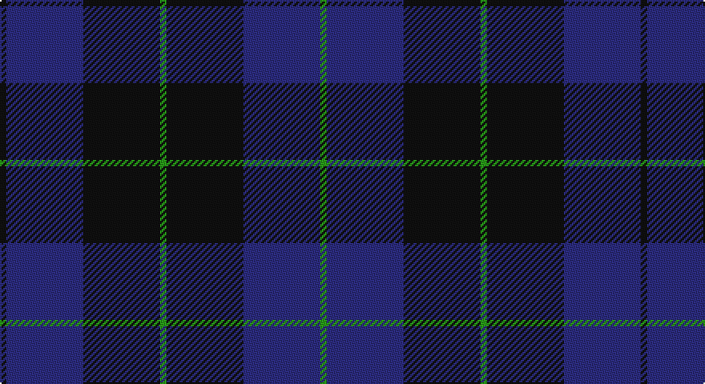

This page is one **sett** — a single exact thread-count. It belongs to the [tartan](/setts/k1db12k12g1k12db12g1/)
(the same proportion at any scale), whose colour order is pattern [GBKGKBK](/stripes/gbkgkbk/).

Part of the [Marchmont](/tartans/marchmont/) tartan — the named design grouping this sett with its other cloths.

Sourced from tartans-authority.  It is a [7 stripe tartan](/stripes/stripes7/).

Original link http://www.tartansauthority.com/tartan-ferret/display/2521/

## Provenance

Earliest known date: 1997 Designed by Keith Lumsden of Scottish Tartans Society. A tartan for personal blankets and clothing.

## Also known as

This cloth is also recorded under:

- Marchmont Personal

2 attestations — the source records this cloth was collapsed from (oldest owns this page)

<ul>
<li>1997 — Marchmont (Personal) (tartans-authority, <a href="http://www.tartansauthority.com/tartan-ferret/display/2521/">record</a>)</li>
<li>undated — Marchmont Personal Tartan (house-of-tartan, <a href="http://www.house-of-tartan.scotland.net/house/TartanViewjs.asp?colr=Def&tnam=2521">record</a>)</li>
</ul>

## Register references

External register numbers recorded for this tartan.

- Scottish Tartans Authority (ITI): 2521

## Thread count
K/4 DB48 K48 G4 K48 DB48 G/4

One full sett is **400 threads**.

## Palette

Palette: <strong>Tartan Register</strong>
<table><thead><tr><th>Colour</th><th>Threads</th><th>Shade</th><th>Base</th><th>OKLCh</th></tr></thead><tbody><tr><td>K/</td><td style="text-align:right;font-variant-numeric:tabular-nums">4</td><td><code style="background-color:#101010;">#101010</code> <small style="color:#888">#101010</small></td><td>K <code style="background-color:#000000;">#000000</code></td><td><small style="color:#888">oklch(17.3% 0.000 89.9)</small></td></tr><tr><td>DB</td><td style="text-align:right;font-variant-numeric:tabular-nums">48</td><td><code style="background-color:#2C2C80;">#2C2C80</code> <small style="color:#888">#2C2C80</small></td><td>B <code style="background-color:#2A418A;">#2A418A</code></td><td><small style="color:#888">oklch(35.0% 0.138 276.6)</small></td></tr><tr><td>K</td><td style="text-align:right;font-variant-numeric:tabular-nums">48</td><td><code style="background-color:#101010;">#101010</code> <small style="color:#888">#101010</small></td><td>K <code style="background-color:#000000;">#000000</code></td><td><small style="color:#888">oklch(17.3% 0.000 89.9)</small></td></tr><tr><td>G</td><td style="text-align:right;font-variant-numeric:tabular-nums">4</td><td><code style="background-color:#289C18;">#289C18</code> <small style="color:#888">#289C18</small></td><td>G <code style="background-color:#006100;">#006100</code></td><td><small style="color:#888">oklch(60.6% 0.191 141.6)</small></td></tr><tr><td>K</td><td style="text-align:right;font-variant-numeric:tabular-nums">48</td><td><code style="background-color:#101010;">#101010</code> <small style="color:#888">#101010</small></td><td>K <code style="background-color:#000000;">#000000</code></td><td><small style="color:#888">oklch(17.3% 0.000 89.9)</small></td></tr><tr><td>DB</td><td style="text-align:right;font-variant-numeric:tabular-nums">48</td><td><code style="background-color:#2C2C80;">#2C2C80</code> <small style="color:#888">#2C2C80</small></td><td>B <code style="background-color:#2A418A;">#2A418A</code></td><td><small style="color:#888">oklch(35.0% 0.138 276.6)</small></td></tr><tr><td>G/</td><td style="text-align:right;font-variant-numeric:tabular-nums">4</td><td><code style="background-color:#289C18;">#289C18</code> <small style="color:#888">#289C18</small></td><td>G <code style="background-color:#006100;">#006100</code></td><td><small style="color:#888">oklch(60.6% 0.191 141.6)</small></td></tr></tbody></table>

# Sample pattern

## Compared to the master

This cloth is one sett of its design; the master sett (the exemplar the design is anchored on) is below for comparison.

<figure style="margin:0"><figcaption style="color:#888;font-size:smaller">this sett</figcaption></figure>
<figure style="margin:0"><figcaption style="color:#888;font-size:smaller"><a href="/setts/db12k12g1k12db12g1db12k12g1k12db12k1/">master sett →</a></figcaption></figure>

## Nearest tartans

The nearest existing variants by ΔTartan distance, with this tartan at the top so the swatches line up against it.

ΔTartan

Tartan

Sett

—

<a href="/ttd/edit/#slug=k1db12k12g1k12db12g1~x4">Marchmont (Personal)</a> <a class="nn-out" href="/variants/s7/k1db12k12g1k12db12g1~x4/" title="open its dictionary page">↗</a>

0.80

<a href="/ttd/edit/#slug=k15db4k15db28r2~x2&amp;base=k1db12k12g1k12db12g1~x4">MacKay (Blue) #2</a> <a class="nn-out" href="/variants/s5/k15db4k15db28r2~x2/" title="open its dictionary page">↗</a>

0.93

<a href="/ttd/edit/#slug=db37r10dg22db11dg3r3~x2&amp;base=k1db12k12g1k12db12g1~x4">Perthshire, New /Tourist Board</a> <a class="nn-out" href="/variants/s6/db37r10dg22db11dg3r3~x2/" title="open its dictionary page">↗</a>

1.05

<a href="/ttd/edit/#slug=db8k39db8k39db87r6&amp;base=k1db12k12g1k12db12g1~x4">Largan (?)</a> <a class="nn-out" href="/variants/s6/db8k39db8k39db87r6/" title="open its dictionary page">↗</a>

1.06

<a href="/ttd/edit/#slug=k6db10k10b1k1b1k10b6~x4&amp;base=k1db12k12g1k12db12g1~x4">Oban</a> <a class="nn-out" href="/variants/s8/k6db10k10b1k1b1k10b6~x4/" title="open its dictionary page">↗</a>

1.15

<a href="/ttd/edit/#slug=db2k11db5k1db5k1~x6&amp;base=k1db12k12g1k12db12g1~x4">Gagetown (School)</a> <a class="nn-out" href="/variants/s6/db2k11db5k1db5k1~x6/" title="open its dictionary page">↗</a>

1.23

<a href="/ttd/edit/#slug=db12k12g1k12db12g1db12k12g1k12db12k1~x4&amp;base=k1db12k12g1k12db12g1~x4">Marchmont (Personal)</a> <a class="nn-out" href="/variants/s12/db12k12g1k12db12g1db12k12g1k12db12k1~x4/" title="open its dictionary page">↗</a>

1.23

<a href="/ttd/edit/#slug=k3db23k17r2~x2&amp;base=k1db12k12g1k12db12g1~x4">Wellington Variation</a> <a class="nn-out" href="/variants/s4/k3db23k17r2~x2/" title="open its dictionary page">↗</a>

1.24

<a href="/ttd/edit/#slug=db5k2db14k14db2lr2~x2&amp;base=k1db12k12g1k12db12g1~x4">Royal Scotsman Train (Corporate)</a> <a class="nn-out" href="/variants/s6/db5k2db14k14db2lr2~x2/" title="open its dictionary page">↗</a>

1.25

<a href="/ttd/edit/#slug=db1k3db1k3db8r1~x4&amp;base=k1db12k12g1k12db12g1~x4">Morgan (MacKay Blue) Clan Tartan</a> <a class="nn-out" href="/variants/s6/db1k3db1k3db8r1~x4/" title="open its dictionary page">↗</a>

1.35

<a href="/ttd/edit/#slug=k20db2k6db2k4db27w2db8~x2&amp;base=k1db12k12g1k12db12g1~x4">Pride of Kinross</a> <a class="nn-out" href="/variants/s8/k20db2k6db2k4db27w2db8~x2/" title="open its dictionary page">↗</a>

## Neighbour map

Every grey dot is one of 14360 variants placed by the first two principal components of the ΔTartan feature space (44% of its variance). Red is this tartan; blue dots are its nearest — click one to open its page.

<svg viewBox="0 0 640 380" role="img" style="max-width:100%;height:auto;border:1px solid #e0e0e0;border-radius:4px;display:block" xmlns="http://www.w3.org/2000/svg"><image href="/nn/cloud.v1.png" width="640" height="380"/><a href="/variants/s5/k15db4k15db28r2~x2/"><circle cx="378.2" cy="271.0" r="4" fill="#3465a4"><title>MacKay (Blue) #2</title></circle></a><a href="/variants/s6/db37r10dg22db11dg3r3~x2/"><circle cx="387.9" cy="266.5" r="4" fill="#3465a4"><title>Perthshire, New /Tourist Board</title></circle></a><a href="/variants/s6/db8k39db8k39db87r6/"><circle cx="429.8" cy="255.6" r="4" fill="#3465a4"><title>Largan (?)</title></circle></a><a href="/variants/s8/k6db10k10b1k1b1k10b6~x4/"><circle cx="367.6" cy="264.7" r="4" fill="#3465a4"><title>Oban</title></circle></a><a href="/variants/s6/db2k11db5k1db5k1~x6/"><circle cx="413.4" cy="281.1" r="4" fill="#3465a4"><title>Gagetown (School)</title></circle></a><a href="/variants/s12/db12k12g1k12db12g1db12k12g1k12db12k1~x4/"><circle cx="353.2" cy="258.9" r="4" fill="#3465a4"><title>Marchmont (Personal)</title></circle></a><a href="/variants/s4/k3db23k17r2~x2/"><circle cx="394.4" cy="286.2" r="4" fill="#3465a4"><title>Wellington Variation</title></circle></a><a href="/variants/s6/db5k2db14k14db2lr2~x2/"><circle cx="353.0" cy="271.7" r="4" fill="#3465a4"><title>Royal Scotsman Train (Corporate)</title></circle></a><a href="/variants/s6/db1k3db1k3db8r1~x4/"><circle cx="404.2" cy="272.9" r="4" fill="#3465a4"><title>Morgan (MacKay Blue) Clan Tartan</title></circle></a><a href="/variants/s8/k20db2k6db2k4db27w2db8~x2/"><circle cx="389.7" cy="222.8" r="4" fill="#3465a4"><title>Pride of Kinross</title></circle></a><circle cx="366.9" cy="265.4" r="5" fill="#c00000"/></svg>

ID: /variants/s7/k1db12k12g1k12db12g1~x4/
