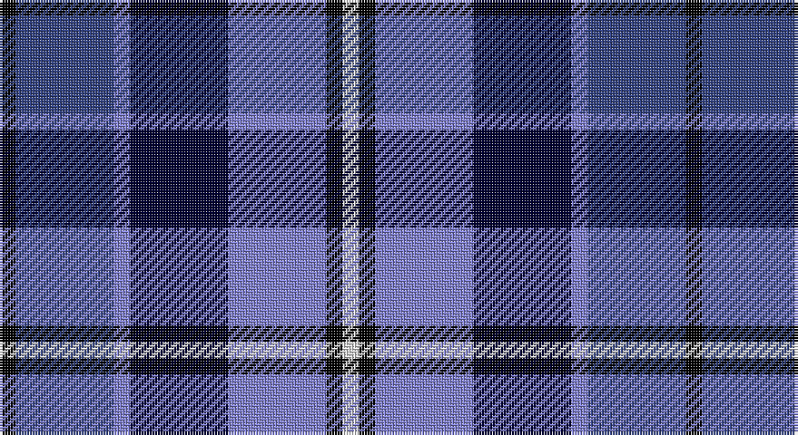

This page is one **sett** — a single exact thread-count. It belongs to the [tartan](/setts/k1db6b1ki6b6k1w1/)
(the same proportion at any scale), whose colour order is pattern [KBBKBKW](/stripes/kbbkbkw/).

Part of the [Mary Washington](/tartans/mary-washington/) tartan — the named design grouping this sett with its other cloths.

Sourced from weddslist.  It is a [7 stripe tartan](/stripes/stripes7/).

Original link http://www.weddslist.com/cgi-bin/tartans/pg.pl?source=sts

## Thread count
K/6 Ba36 B6 DB36 B36 K6 LN/6

One full sett is **252 threads**.

## Palette

Palette: <strong>Tartan Register</strong> <small style="color:#888">(2 of 5 colours)</small>
<table><thead><tr><th>Colour</th><th>Threads</th><th>Shade</th><th>Base</th><th>OKLCh</th></tr></thead><tbody><tr><td>K/</td><td style="text-align:right;font-variant-numeric:tabular-nums">6</td><td><code style="background-color:#000000;">#000000</code> <small style="color:#888">#000000</small></td><td>K <code style="background-color:#000000;">#000000</code></td><td><small style="color:#888">oklch(0.0% 0.000 0.0)</small></td></tr><tr><td>Ba</td><td style="text-align:right;font-variant-numeric:tabular-nums">36</td><td><code style="background-color:#304080;">#304080</code> <small style="color:#888">#304080</small></td><td>B <code style="background-color:#2A418A;">#2A418A</code></td><td><small style="color:#888">oklch(39.4% 0.109 270.2)</small></td></tr><tr><td>B</td><td style="text-align:right;font-variant-numeric:tabular-nums">6</td><td><code style="background-color:#8080D0;">#8080D0</code> <small style="color:#888">#8080D0</small></td><td>B <code style="background-color:#2A418A;">#2A418A</code></td><td><small style="color:#888">oklch(63.4% 0.119 282.5)</small></td></tr><tr><td>DB</td><td style="text-align:right;font-variant-numeric:tabular-nums">36</td><td><code style="background-color:#000030;">#000030</code> <small style="color:#888">#000030</small></td><td>K <code style="background-color:#000000;">#000000</code></td><td><small style="color:#888">oklch(14.0% 0.097 264.1)</small></td></tr><tr><td>B</td><td style="text-align:right;font-variant-numeric:tabular-nums">36</td><td><code style="background-color:#8080D0;">#8080D0</code> <small style="color:#888">#8080D0</small></td><td>B <code style="background-color:#2A418A;">#2A418A</code></td><td><small style="color:#888">oklch(63.4% 0.119 282.5)</small></td></tr><tr><td>K</td><td style="text-align:right;font-variant-numeric:tabular-nums">6</td><td><code style="background-color:#000000;">#000000</code> <small style="color:#888">#000000</small></td><td>K <code style="background-color:#000000;">#000000</code></td><td><small style="color:#888">oklch(0.0% 0.000 0.0)</small></td></tr><tr><td>LN/</td><td style="text-align:right;font-variant-numeric:tabular-nums">6</td><td><code style="background-color:#E0E0E0;">#E0E0E0</code> <small style="color:#888">#E0E0E0</small></td><td>W <code style="background-color:#F7F7F7;">#F7F7F7</code></td><td><small style="color:#888">oklch(90.7% 0.000 89.9)</small></td></tr></tbody></table>

# Sample pattern

## Compared to the master

This cloth is one sett of its design; the master sett (the exemplar the design is anchored on) is below for comparison.

<figure style="margin:0"><figcaption style="color:#888;font-size:smaller">this sett</figcaption></figure>
<figure style="margin:0"><figcaption style="color:#888;font-size:smaller"><a href="/setts/k1db6t1dt6t6k1w1/">master sett →</a></figcaption></figure>

## Nearest tartans

The nearest existing variants by ΔTartan distance, with this tartan at the top so the swatches line up against it.

ΔTartan

Tartan

Sett

—

<a href="/ttd/edit/#slug=k1db6b1ki6b6k1w1~x6">Mary Washington</a> <a class="nn-out" href="/variants/s7/k1db6b1ki6b6k1w1~x6/" title="open its dictionary page">↗</a>

1.12

<a href="/ttd/edit/#slug=db2b9m1db9dg9w2~x4&amp;base=k1db6b1ki6b6k1w1~x6">American Express</a> <a class="nn-out" href="/variants/s6/db2b9m1db9dg9w2~x4/" title="open its dictionary page">↗</a>

1.24

<a href="/ttd/edit/#slug=ly5dbi24k8db18ly6o3&amp;base=k1db6b1ki6b6k1w1~x6">CALA Homes</a> <a class="nn-out" href="/variants/s6/ly5dbi24k8db18ly6o3/" title="open its dictionary page">↗</a>

1.32

<a href="/ttd/edit/#slug=ly5db24k8dbi18ly6dy3&amp;base=k1db6b1ki6b6k1w1~x6">Cala Homes (Corporate)</a> <a class="nn-out" href="/variants/s6/ly5db24k8dbi18ly6dy3/" title="open its dictionary page">↗</a>

1.32

<a href="/ttd/edit/#slug=lb4r2db14k4lb4k3lb3k2r2lbi2~x2&amp;base=k1db6b1ki6b6k1w1~x6">Naysmith, William A (Personal)</a> <a class="nn-out" href="/variants/s10/lb4r2db14k4lb4k3lb3k2r2lbi2~x2/" title="open its dictionary page">↗</a>

1.33

<a href="/ttd/edit/#slug=w2db15y2dbi20r9w2~x2&amp;base=k1db6b1ki6b6k1w1~x6">The Open Championship</a> <a class="nn-out" href="/variants/s6/w2db15y2dbi20r9w2~x2/" title="open its dictionary page">↗</a>

1.35

<a href="/ttd/edit/#slug=r1o5k5db1k1db6ly1~x8&amp;base=k1db6b1ki6b6k1w1~x6">Lopez-Gasparotto</a> <a class="nn-out" href="/variants/s7/r1o5k5db1k1db6ly1~x8/" title="open its dictionary page">↗</a>

1.35

<a href="/ttd/edit/#slug=k3lo1lb9lo1db9k3t1~x4&amp;base=k1db6b1ki6b6k1w1~x6">St. Francis Xavier University</a> <a class="nn-out" href="/variants/s7/k3lo1lb9lo1db9k3t1~x4/" title="open its dictionary page">↗</a>

1.36

<a href="/ttd/edit/#slug=t16db3t3o3t3db10r12w4~x2&amp;base=k1db6b1ki6b6k1w1~x6">Greer (Name?)</a> <a class="nn-out" href="/variants/s8/t16db3t3o3t3db10r12w4~x2/" title="open its dictionary page">↗</a>

1.36

<a href="/variants/s7/k3db24t3ki25t22k3t3~x2/">Strathclyde blue</a>

1.39

<a href="/ttd/edit/#slug=b5k15lr5n9lr2db2lr2db2n9k3~x2&amp;base=k1db6b1ki6b6k1w1~x6">Ryukoku University Heian Senior High School</a> <a class="nn-out" href="/variants/s10/b5k15lr5n9lr2db2lr2db2n9k3~x2/" title="open its dictionary page">↗</a>

## Neighbour map

Every grey dot is one of 14360 variants placed by the first two principal components of the ΔTartan feature space (44% of its variance). Red is this tartan; blue dots are its nearest — click one to open its page.

<svg viewBox="0 0 640 380" role="img" style="max-width:100%;height:auto;border:1px solid #e0e0e0;border-radius:4px;display:block" xmlns="http://www.w3.org/2000/svg"><image href="/nn/cloud.v1.png" width="640" height="380"/><a href="/variants/s6/db2b9m1db9dg9w2~x4/"><circle cx="126.7" cy="208.9" r="4" fill="#3465a4"><title>American Express</title></circle></a><a href="/variants/s6/ly5dbi24k8db18ly6o3/"><circle cx="123.0" cy="206.0" r="4" fill="#3465a4"><title>CALA Homes</title></circle></a><a href="/variants/s6/ly5db24k8dbi18ly6dy3/"><circle cx="142.7" cy="212.9" r="4" fill="#3465a4"><title>Cala Homes (Corporate)</title></circle></a><a href="/variants/s10/lb4r2db14k4lb4k3lb3k2r2lbi2~x2/"><circle cx="108.6" cy="167.6" r="4" fill="#3465a4"><title>Naysmith, William A (Personal)</title></circle></a><a href="/variants/s6/w2db15y2dbi20r9w2~x2/"><circle cx="176.8" cy="189.4" r="4" fill="#3465a4"><title>The Open Championship</title></circle></a><a href="/variants/s7/r1o5k5db1k1db6ly1~x8/"><circle cx="131.9" cy="210.8" r="4" fill="#3465a4"><title>Lopez-Gasparotto</title></circle></a><a href="/variants/s7/k3lo1lb9lo1db9k3t1~x4/"><circle cx="110.6" cy="169.7" r="4" fill="#3465a4"><title>St. Francis Xavier University</title></circle></a><a href="/variants/s8/t16db3t3o3t3db10r12w4~x2/"><circle cx="124.3" cy="204.8" r="4" fill="#3465a4"><title>Greer (Name?)</title></circle></a><a href="/variants/s7/k3db24t3ki25t22k3t3~x2/"><circle cx="174.8" cy="217.7" r="4" fill="#3465a4"><title>Strathclyde blue</title></circle></a><a href="/variants/s10/b5k15lr5n9lr2db2lr2db2n9k3~x2/"><circle cx="95.2" cy="178.1" r="4" fill="#3465a4"><title>Ryukoku University Heian Senior High School</title></circle></a><circle cx="101.4" cy="204.9" r="5" fill="#c00000"/></svg>

ID: /variants/s7/k1db6b1ki6b6k1w1~x6/
