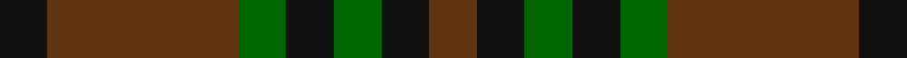
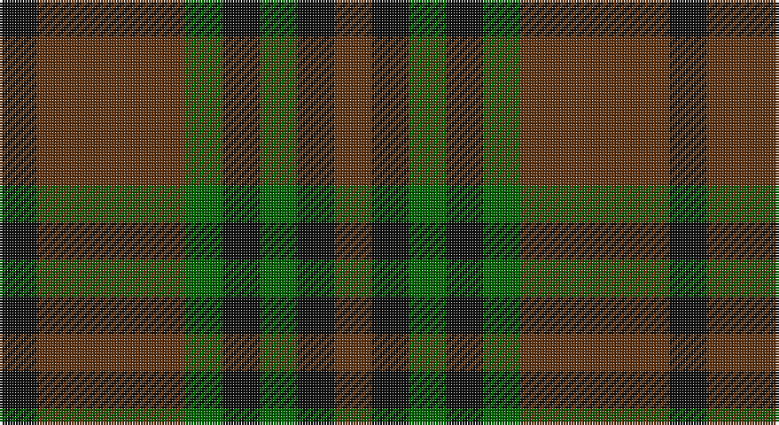

This page is one **sett** — a single exact thread-count. It belongs to the [tartan](/setts/k1dy4g1k1g1k1dy1/)
(the same proportion at any scale), whose colour order is pattern [GKGKGGK](/stripes/gkgkggk/).

Sourced from register-of-tartans.  It is a [7 stripe tartan](/stripes/stripes7/).

Original link https://www.tartanregister.gov.uk/tartanDetails.aspx?ref=10274

## Register references

External register numbers recorded for this tartan.

- Scottish Register of Tartans: [10274](https://www.tartanregister.gov.uk/tartanDetails.aspx?ref=10274)

## Thread count
K/14 T56 G14 K14 G14 K14 T/14

One full sett is **252 threads**.

## Palette

Palette: <strong>Logan (The Scottish Gael, 1831)</strong> <small style="color:#888">(2 of 3 colours)</small>
<table><thead><tr><th>Colour</th><th>Threads</th><th>Shade</th><th>Base</th><th>OKLCh</th></tr></thead><tbody><tr><td>K/</td><td style="text-align:right;font-variant-numeric:tabular-nums">14</td><td><code style="background-color:#101010;">#101010</code> <small style="color:#888">#101010</small></td><td>K <code style="background-color:#000000;">#000000</code></td><td><small style="color:#888">oklch(17.3% 0.000 89.9)</small></td></tr><tr><td>T</td><td style="text-align:right;font-variant-numeric:tabular-nums">56</td><td><code style="background-color:#603311;">#603311</code> <small style="color:#888">#603311</small></td><td>G <code style="background-color:#006100;">#006100</code></td><td><small style="color:#888">oklch(37.2% 0.079 53.9)</small></td></tr><tr><td>G</td><td style="text-align:right;font-variant-numeric:tabular-nums">14</td><td><code style="background-color:#006400;">#006400</code> <small style="color:#888">#006400</small></td><td>G <code style="background-color:#006100;">#006100</code></td><td><small style="color:#888">oklch(43.6% 0.148 142.5)</small></td></tr><tr><td>K</td><td style="text-align:right;font-variant-numeric:tabular-nums">14</td><td><code style="background-color:#101010;">#101010</code> <small style="color:#888">#101010</small></td><td>K <code style="background-color:#000000;">#000000</code></td><td><small style="color:#888">oklch(17.3% 0.000 89.9)</small></td></tr><tr><td>G</td><td style="text-align:right;font-variant-numeric:tabular-nums">14</td><td><code style="background-color:#006400;">#006400</code> <small style="color:#888">#006400</small></td><td>G <code style="background-color:#006100;">#006100</code></td><td><small style="color:#888">oklch(43.6% 0.148 142.5)</small></td></tr><tr><td>K</td><td style="text-align:right;font-variant-numeric:tabular-nums">14</td><td><code style="background-color:#101010;">#101010</code> <small style="color:#888">#101010</small></td><td>K <code style="background-color:#000000;">#000000</code></td><td><small style="color:#888">oklch(17.3% 0.000 89.9)</small></td></tr><tr><td>T/</td><td style="text-align:right;font-variant-numeric:tabular-nums">14</td><td><code style="background-color:#603311;">#603311</code> <small style="color:#888">#603311</small></td><td>G <code style="background-color:#006100;">#006100</code></td><td><small style="color:#888">oklch(37.2% 0.079 53.9)</small></td></tr></tbody></table>

# Sample pattern

## Nearest tartans

The nearest existing variants by ΔTartan distance, with this tartan at the top so the swatches line up against it.

ΔTartan

Tartan

Sett

—

<a href="/ttd/edit/#slug=k1dy4g1k1g1k1dy1~x14">McCanna NW (Olympia, USA) Hunting (Personal)</a> <a class="nn-out" href="/variants/s7/k1dy4g1k1g1k1dy1~x14/" title="open its dictionary page">↗</a>

0.58

<a href="/ttd/edit/#slug=k1dy4dg1k1dg1k1dy1~x10&amp;base=k1dy4g1k1g1k1dy1~x14">McCanna NW Htg (Personal)</a> <a class="nn-out" href="/variants/s7/k1dy4dg1k1dg1k1dy1~x10/" title="open its dictionary page">↗</a>

1.25

<a href="/ttd/edit/#slug=o9do4o4do4o24dy19do19dy4~x2&amp;base=k1dy4g1k1g1k1dy1~x14">Chindecella Gorse (Kemete Heil)</a> <a class="nn-out" href="/variants/s8/o9do4o4do4o24dy19do19dy4~x2/" title="open its dictionary page">↗</a>

1.65

<a href="/ttd/edit/#slug=dg1dr8dg8r1dg8dr8lr1~x4&amp;base=k1dy4g1k1g1k1dy1~x14">MacKinnon Hunting</a> <a class="nn-out" href="/variants/s7/dg1dr8dg8r1dg8dr8lr1~x4/" title="open its dictionary page">↗</a>

1.65

<a href="/ttd/edit/#slug=dg1dr8dg8r1dg8dr8lr1~x2&amp;base=k1dy4g1k1g1k1dy1~x14">MacKinnon Hunting</a> <a class="nn-out" href="/variants/s7/dg1dr8dg8r1dg8dr8lr1~x2/" title="open its dictionary page">↗</a>

1.73

<a href="/ttd/edit/#slug=dg24dt3dg3dt3dg3dt9m24dg3m4~x2&amp;base=k1dy4g1k1g1k1dy1~x14">Lindsay</a> <a class="nn-out" href="/variants/s9/dg24dt3dg3dt3dg3dt9m24dg3m4~x2/" title="open its dictionary page">↗</a>

1.82

<a href="/ttd/edit/#slug=db5o15dy4o4dy24o4dy4db5&amp;base=k1dy4g1k1g1k1dy1~x14">Daks-Simpson (Muted Skye)</a> <a class="nn-out" href="/variants/s8/db5o15dy4o4dy24o4dy4db5/" title="open its dictionary page">↗</a>

1.84

<a href="/ttd/edit/#slug=dg24db3dg3db3dg3db9m24dg3m4~x2&amp;base=k1dy4g1k1g1k1dy1~x14">Lindsay (Chisholm Red)</a> <a class="nn-out" href="/variants/s9/dg24db3dg3db3dg3db9m24dg3m4~x2/" title="open its dictionary page">↗</a>

1.89

<a href="/ttd/edit/#slug=dy1db3dy1dg3dy4r1~x2&amp;base=k1dy4g1k1g1k1dy1~x14">Fraser Hunting #2</a> <a class="nn-out" href="/variants/s6/dy1db3dy1dg3dy4r1~x2/" title="open its dictionary page">↗</a>

1.89

<a href="/ttd/edit/#slug=dt3g11dt3dr11dt18lo3~x2&amp;base=k1dy4g1k1g1k1dy1~x14">Harbour Town Hilton Head, The</a> <a class="nn-out" href="/variants/s6/dt3g11dt3dr11dt18lo3~x2/" title="open its dictionary page">↗</a>

1.90

<a href="/ttd/edit/#slug=dy7r3dy9g15db19dy14r4~x2&amp;base=k1dy4g1k1g1k1dy1~x14">Dorward/Dogwood</a> <a class="nn-out" href="/variants/s7/dy7r3dy9g15db19dy14r4~x2/" title="open its dictionary page">↗</a>

## Neighbour map

Every grey dot is one of 14360 variants placed by the first two principal components of the ΔTartan feature space (44% of its variance). Red is this tartan; blue dots are its nearest — click one to open its page.

<svg viewBox="0 0 640 380" role="img" style="max-width:100%;height:auto;border:1px solid #e0e0e0;border-radius:4px;display:block" xmlns="http://www.w3.org/2000/svg"><image href="/nn/cloud.v1.png" width="640" height="380"/><a href="/variants/s7/k1dy4dg1k1dg1k1dy1~x10/"><circle cx="328.7" cy="313.7" r="4" fill="#3465a4"><title>McCanna NW Htg (Personal)</title></circle></a><a href="/variants/s8/o9do4o4do4o24dy19do19dy4~x2/"><circle cx="281.2" cy="274.7" r="4" fill="#3465a4"><title>Chindecella Gorse (Kemete Heil)</title></circle></a><a href="/variants/s7/dg1dr8dg8r1dg8dr8lr1~x4/"><circle cx="361.7" cy="282.6" r="4" fill="#3465a4"><title>MacKinnon Hunting</title></circle></a><a href="/variants/s7/dg1dr8dg8r1dg8dr8lr1~x2/"><circle cx="361.7" cy="282.6" r="4" fill="#3465a4"><title>MacKinnon Hunting</title></circle></a><a href="/variants/s9/dg24dt3dg3dt3dg3dt9m24dg3m4~x2/"><circle cx="336.5" cy="248.7" r="4" fill="#3465a4"><title>Lindsay</title></circle></a><a href="/variants/s8/db5o15dy4o4dy24o4dy4db5/"><circle cx="315.2" cy="254.7" r="4" fill="#3465a4"><title>Daks-Simpson (Muted Skye)</title></circle></a><a href="/variants/s9/dg24db3dg3db3dg3db9m24dg3m4~x2/"><circle cx="342.1" cy="251.9" r="4" fill="#3465a4"><title>Lindsay (Chisholm Red)</title></circle></a><a href="/variants/s6/dy1db3dy1dg3dy4r1~x2/"><circle cx="271.2" cy="324.6" r="4" fill="#3465a4"><title>Fraser Hunting #2</title></circle></a><a href="/variants/s6/dt3g11dt3dr11dt18lo3~x2/"><circle cx="278.0" cy="278.7" r="4" fill="#3465a4"><title>Harbour Town Hilton Head, The</title></circle></a><a href="/variants/s7/dy7r3dy9g15db19dy14r4~x2/"><circle cx="229.6" cy="280.8" r="4" fill="#3465a4"><title>Dorward/Dogwood</title></circle></a><circle cx="317.5" cy="306.2" r="5" fill="#c00000"/></svg>

ID: /variants/s7/k1dy4g1k1g1k1dy1~x14/
