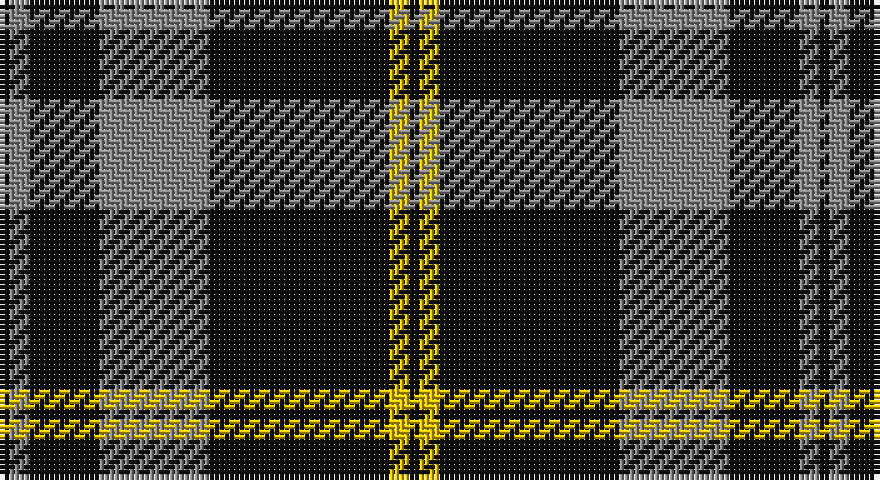

This page is one **sett** — a single exact thread-count. It belongs to the [tartan](/setts/k1o2k7o11k18ly2k1/)
(the same proportion at any scale), whose colour order is pattern [KRKRKYK](/stripes/krkrkyk/).

Sourced from tartans-authority.  It is a [7 stripe tartan](/stripes/stripes7/).

Original link http://www.tartansauthority.com/tartan-ferret/display/7657/

2 attestations — the source records this cloth was collapsed from (oldest owns this page)

<ul>
<li>June 2008 — DDB Canada (Fashion) (tartans-authority, <a href="http://www.tartansauthority.com/tartan-ferret/display/7657/">record</a>)</li>
<li>undated — DDB Canada (register-of-tartans, <a href="https://www.tartanregister.gov.uk/tartanDetails.aspx?ref=5665">record</a>)</li>
</ul>

## Register references

External register numbers recorded for this tartan.

- Scottish Register of Tartans: [5665](https://www.tartanregister.gov.uk/tartanDetails.aspx?ref=5665)
- Scottish Tartans Authority (ITI): 7657

## Thread count
K/2 N4 K14 N22 K36 Y4 K/2

One full sett is **164 threads**.

## Palette

Palette: <strong>Tartan Register</strong>
<table><thead><tr><th>Colour</th><th>Threads</th><th>Shade</th><th>Base</th><th>OKLCh</th></tr></thead><tbody><tr><td>K/</td><td style="text-align:right;font-variant-numeric:tabular-nums">2</td><td><code style="background-color:#101010;">#101010</code> <small style="color:#888">#101010</small></td><td>K <code style="background-color:#000000;">#000000</code></td><td><small style="color:#888">oklch(17.3% 0.000 89.9)</small></td></tr><tr><td>N</td><td style="text-align:right;font-variant-numeric:tabular-nums">4</td><td><code style="background-color:#888888;">#888888</code> <small style="color:#888">#888888</small></td><td>R <code style="background-color:#CC0000;">#CC0000</code></td><td><small style="color:#888">oklch(62.7% 0.000 89.9)</small></td></tr><tr><td>K</td><td style="text-align:right;font-variant-numeric:tabular-nums">14</td><td><code style="background-color:#101010;">#101010</code> <small style="color:#888">#101010</small></td><td>K <code style="background-color:#000000;">#000000</code></td><td><small style="color:#888">oklch(17.3% 0.000 89.9)</small></td></tr><tr><td>N</td><td style="text-align:right;font-variant-numeric:tabular-nums">22</td><td><code style="background-color:#888888;">#888888</code> <small style="color:#888">#888888</small></td><td>R <code style="background-color:#CC0000;">#CC0000</code></td><td><small style="color:#888">oklch(62.7% 0.000 89.9)</small></td></tr><tr><td>K</td><td style="text-align:right;font-variant-numeric:tabular-nums">36</td><td><code style="background-color:#101010;">#101010</code> <small style="color:#888">#101010</small></td><td>K <code style="background-color:#000000;">#000000</code></td><td><small style="color:#888">oklch(17.3% 0.000 89.9)</small></td></tr><tr><td>Y</td><td style="text-align:right;font-variant-numeric:tabular-nums">4</td><td><code style="background-color:#E8C000;">#E8C000</code> <small style="color:#888">#E8C000</small></td><td>Y <code style="background-color:#F2BF00;">#F2BF00</code></td><td><small style="color:#888">oklch(81.9% 0.168 93.7)</small></td></tr><tr><td>K/</td><td style="text-align:right;font-variant-numeric:tabular-nums">2</td><td><code style="background-color:#101010;">#101010</code> <small style="color:#888">#101010</small></td><td>K <code style="background-color:#000000;">#000000</code></td><td><small style="color:#888">oklch(17.3% 0.000 89.9)</small></td></tr></tbody></table>

# Sample pattern

## Nearest tartans

The nearest existing variants by ΔTartan distance, with this tartan at the top so the swatches line up against it.

ΔTartan

Tartan

Sett

—

<a href="/ttd/edit/#slug=k1o2k7o11k18ly2k1~x2">DDB Canada (Fashion)</a> <a class="nn-out" href="/variants/s7/k1o2k7o11k18ly2k1~x2/" title="open its dictionary page">↗</a>

0.65

<a href="/ttd/edit/#slug=k39o3k3o3k14o28r3~x2&amp;base=k1o2k7o11k18ly2k1~x2">Moffat (1984)</a> <a class="nn-out" href="/variants/s7/k39o3k3o3k14o28r3~x2/" title="open its dictionary page">↗</a>

0.98

<a href="/ttd/edit/#slug=k13o1k1o1k4o10ly1o1~x6&amp;base=k1o2k7o11k18ly2k1~x2">West Point</a> <a class="nn-out" href="/variants/s8/k13o1k1o1k4o10ly1o1~x6/" title="open its dictionary page">↗</a>

1.06

<a href="/ttd/edit/#slug=k37w9k3dg9w3~x2&amp;base=k1o2k7o11k18ly2k1~x2">Glen Coe Trade Tartan</a> <a class="nn-out" href="/variants/s5/k37w9k3dg9w3~x2/" title="open its dictionary page">↗</a>

1.09

<a href="/ttd/edit/#slug=t50k4t12k23lo4k4~x2&amp;base=k1o2k7o11k18ly2k1~x2">Sligo Irish County Tartan</a> <a class="nn-out" href="/variants/s6/t50k4t12k23lo4k4~x2/" title="open its dictionary page">↗</a>

1.10

<a href="/ttd/edit/#slug=k2lb5k1lb1k10r1k1~x4&amp;base=k1o2k7o11k18ly2k1~x2">Lundy Reform</a> <a class="nn-out" href="/variants/s7/k2lb5k1lb1k10r1k1~x4/" title="open its dictionary page">↗</a>

1.15

<a href="/ttd/edit/#slug=k53o22k10o10k2o4~x2&amp;base=k1o2k7o11k18ly2k1~x2">Black Isle</a> <a class="nn-out" href="/variants/s6/k53o22k10o10k2o4~x2/" title="open its dictionary page">↗</a>

1.16

<a href="/ttd/edit/#slug=k75y26y3k4ly6~x2&amp;base=k1o2k7o11k18ly2k1~x2">Perry Ancient (Personal)</a> <a class="nn-out" href="/variants/s5/k75y26y3k4ly6~x2/" title="open its dictionary page">↗</a>

1.19

<a href="/ttd/edit/#slug=g12k8w6k22w3k8w3k40g6&amp;base=k1o2k7o11k18ly2k1~x2">Jensen, Sven (Personal)</a> <a class="nn-out" href="/variants/s9/g12k8w6k22w3k8w3k40g6/" title="open its dictionary page">↗</a>

1.20

<a href="/ttd/edit/#slug=y5r3y35k28y4k11y2~x2&amp;base=k1o2k7o11k18ly2k1~x2">Korner-Macpherson (Personal)</a> <a class="nn-out" href="/variants/s7/y5r3y35k28y4k11y2~x2/" title="open its dictionary page">↗</a>

1.23

<a href="/ttd/edit/#slug=k39y3k3y3k14y28r3~x2&amp;base=k1o2k7o11k18ly2k1~x2">Moffat</a> <a class="nn-out" href="/variants/s7/k39y3k3y3k14y28r3~x2/" title="open its dictionary page">↗</a>

## Neighbour map

Every grey dot is one of 14360 variants placed by the first two principal components of the ΔTartan feature space (44% of its variance). Red is this tartan; blue dots are its nearest — click one to open its page.

<svg viewBox="0 0 640 380" role="img" style="max-width:100%;height:auto;border:1px solid #e0e0e0;border-radius:4px;display:block" xmlns="http://www.w3.org/2000/svg"><image href="/nn/cloud.v1.png" width="640" height="380"/><a href="/variants/s7/k39o3k3o3k14o28r3~x2/"><circle cx="372.2" cy="198.8" r="4" fill="#3465a4"><title>Moffat (1984)</title></circle></a><a href="/variants/s8/k13o1k1o1k4o10ly1o1~x6/"><circle cx="350.9" cy="183.3" r="4" fill="#3465a4"><title>West Point</title></circle></a><a href="/variants/s5/k37w9k3dg9w3~x2/"><circle cx="372.6" cy="208.0" r="4" fill="#3465a4"><title>Glen Coe Trade Tartan</title></circle></a><a href="/variants/s6/t50k4t12k23lo4k4~x2/"><circle cx="369.2" cy="198.3" r="4" fill="#3465a4"><title>Sligo Irish County Tartan</title></circle></a><a href="/variants/s7/k2lb5k1lb1k10r1k1~x4/"><circle cx="376.1" cy="196.2" r="4" fill="#3465a4"><title>Lundy Reform</title></circle></a><a href="/variants/s6/k53o22k10o10k2o4~x2/"><circle cx="449.6" cy="199.0" r="4" fill="#3465a4"><title>Black Isle</title></circle></a><a href="/variants/s5/k75y26y3k4ly6~x2/"><circle cx="462.0" cy="183.0" r="4" fill="#3465a4"><title>Perry Ancient (Personal)</title></circle></a><a href="/variants/s9/g12k8w6k22w3k8w3k40g6/"><circle cx="416.0" cy="198.2" r="4" fill="#3465a4"><title>Jensen, Sven (Personal)</title></circle></a><a href="/variants/s7/y5r3y35k28y4k11y2~x2/"><circle cx="346.9" cy="188.6" r="4" fill="#3465a4"><title>Korner-Macpherson (Personal)</title></circle></a><a href="/variants/s7/k39y3k3y3k14y28r3~x2/"><circle cx="356.9" cy="196.9" r="4" fill="#3465a4"><title>Moffat</title></circle></a><circle cx="394.7" cy="188.2" r="5" fill="#c00000"/></svg>

ID: /variants/s7/k1o2k7o11k18ly2k1~x2/
