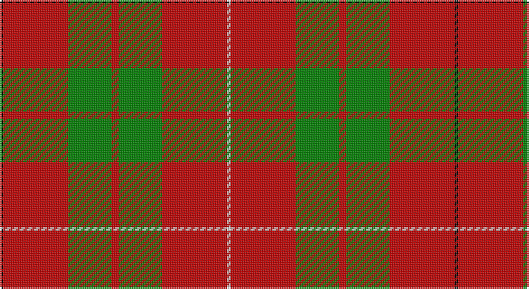

This page is one **sett** — a single exact thread-count. It belongs to the [tartan](/setts/k1r18g12r2g12r18w1/)
(the same proportion at any scale), whose colour order is pattern [KRGRGRW](/stripes/krgrgrw/).

Sourced from weddslist.  It is a [7 stripe tartan](/stripes/stripes7/).

Original link http://www.weddslist.com/cgi-bin/tartans/pg.pl?source=sts

## Thread count
K/2 R36 G24 R4 G24 R36 LN/2

One full sett is **252 threads**.

## Palette

Palette: <strong>Tartan Register</strong> <small style="color:#888">(2 of 4 colours)</small>
<table><thead><tr><th>Colour</th><th>Threads</th><th>Shade</th><th>Base</th><th>OKLCh</th></tr></thead><tbody><tr><td>K/</td><td style="text-align:right;font-variant-numeric:tabular-nums">2</td><td><code style="background-color:#000000;">#000000</code> <small style="color:#888">#000000</small></td><td>K <code style="background-color:#000000;">#000000</code></td><td><small style="color:#888">oklch(0.0% 0.000 0.0)</small></td></tr><tr><td>R</td><td style="text-align:right;font-variant-numeric:tabular-nums">36</td><td><code style="background-color:#C00000;">#C00000</code> <small style="color:#888">#C00000</small></td><td>R <code style="background-color:#CC0000;">#CC0000</code></td><td><small style="color:#888">oklch(50.7% 0.208 29.2)</small></td></tr><tr><td>G</td><td style="text-align:right;font-variant-numeric:tabular-nums">24</td><td><code style="background-color:#008000;">#008000</code> <small style="color:#888">#008000</small></td><td>G <code style="background-color:#006100;">#006100</code></td><td><small style="color:#888">oklch(52.0% 0.177 142.5)</small></td></tr><tr><td>R</td><td style="text-align:right;font-variant-numeric:tabular-nums">4</td><td><code style="background-color:#C00000;">#C00000</code> <small style="color:#888">#C00000</small></td><td>R <code style="background-color:#CC0000;">#CC0000</code></td><td><small style="color:#888">oklch(50.7% 0.208 29.2)</small></td></tr><tr><td>G</td><td style="text-align:right;font-variant-numeric:tabular-nums">24</td><td><code style="background-color:#008000;">#008000</code> <small style="color:#888">#008000</small></td><td>G <code style="background-color:#006100;">#006100</code></td><td><small style="color:#888">oklch(52.0% 0.177 142.5)</small></td></tr><tr><td>R</td><td style="text-align:right;font-variant-numeric:tabular-nums">36</td><td><code style="background-color:#C00000;">#C00000</code> <small style="color:#888">#C00000</small></td><td>R <code style="background-color:#CC0000;">#CC0000</code></td><td><small style="color:#888">oklch(50.7% 0.208 29.2)</small></td></tr><tr><td>LN/</td><td style="text-align:right;font-variant-numeric:tabular-nums">2</td><td><code style="background-color:#E0E0E0;">#E0E0E0</code> <small style="color:#888">#E0E0E0</small></td><td>W <code style="background-color:#F7F7F7;">#F7F7F7</code></td><td><small style="color:#888">oklch(90.7% 0.000 89.9)</small></td></tr></tbody></table>

# Sample pattern

## Nearest tartans

The nearest existing variants by ΔTartan distance, with this tartan at the top so the swatches line up against it.

ΔTartan

Tartan

Sett

—

<a href="/ttd/edit/#slug=k1r18g12r2g12r18w1~x2">MacKinnon 8</a> <a class="nn-out" href="/variants/s7/k1r18g12r2g12r18w1~x2/" title="open its dictionary page">↗</a>

0.75

<a href="/ttd/edit/#slug=k1r18dg12r2dg12r18w1~x2&amp;base=k1r18g12r2g12r18w1~x2">MacKinnon #4</a> <a class="nn-out" href="/variants/s7/k1r18dg12r2dg12r18w1~x2/" title="open its dictionary page">↗</a>

0.91

<a href="/ttd/edit/#slug=r2g6ly1g6r3g2r16db1~x4&amp;base=k1r18g12r2g12r18w1~x2">Burnett</a> <a class="nn-out" href="/variants/s8/r2g6ly1g6r3g2r16db1~x4/" title="open its dictionary page">↗</a>

0.95

<a href="/ttd/edit/#slug=k2r16g6r3g8w1~x4&amp;base=k1r18g12r2g12r18w1~x2">MacAulay (Clan)</a> <a class="nn-out" href="/variants/s6/k2r16g6r3g8w1~x4/" title="open its dictionary page">↗</a>

0.95

<a href="/ttd/edit/#slug=k2r16g6r3g8lb1~x2&amp;base=k1r18g12r2g12r18w1~x2">MacAulay</a> <a class="nn-out" href="/variants/s6/k2r16g6r3g8lb1~x2/" title="open its dictionary page">↗</a>

0.97

<a href="/ttd/edit/#slug=r2g6ly1g6r3g2r16t1~x4&amp;base=k1r18g12r2g12r18w1~x2">Burnett of Leys Family Tartan</a> <a class="nn-out" href="/variants/s8/r2g6ly1g6r3g2r16t1~x4/" title="open its dictionary page">↗</a>

1.09

<a href="/ttd/edit/#slug=r32t5g17r4g5w2~x2&amp;base=k1r18g12r2g12r18w1~x2">Wilson's, No 5</a> <a class="nn-out" href="/variants/s6/r32t5g17r4g5w2~x2/" title="open its dictionary page">↗</a>

1.10

<a href="/ttd/edit/#slug=r2g6r2g6r16ly1~x2&amp;base=k1r18g12r2g12r18w1~x2">Cameron</a> <a class="nn-out" href="/variants/s6/r2g6r2g6r16ly1~x2/" title="open its dictionary page">↗</a>

1.10

<a href="/ttd/edit/#slug=r35g16r5g5w2k3~x2&amp;base=k1r18g12r2g12r18w1~x2">MacGregor</a> <a class="nn-out" href="/variants/s6/r35g16r5g5w2k3~x2/" title="open its dictionary page">↗</a>

1.11

<a href="/ttd/edit/#slug=k2r16g6r3g8w1~x2&amp;base=k1r18g12r2g12r18w1~x2">MacAulay</a> <a class="nn-out" href="/variants/s6/k2r16g6r3g8w1~x2/" title="open its dictionary page">↗</a>

1.13

<a href="/variants/s8/r24t3w1g9r12~x8/">Menzies</a>

## Neighbour map

Every grey dot is one of 14360 variants placed by the first two principal components of the ΔTartan feature space (44% of its variance). Red is this tartan; blue dots are its nearest — click one to open its page.

<svg viewBox="0 0 640 380" role="img" style="max-width:100%;height:auto;border:1px solid #e0e0e0;border-radius:4px;display:block" xmlns="http://www.w3.org/2000/svg"><image href="/nn/cloud.v1.png" width="640" height="380"/><a href="/variants/s7/k1r18dg12r2dg12r18w1~x2/"><circle cx="372.7" cy="180.0" r="4" fill="#3465a4"><title>MacKinnon #4</title></circle></a><a href="/variants/s8/r2g6ly1g6r3g2r16db1~x4/"><circle cx="370.8" cy="167.1" r="4" fill="#3465a4"><title>Burnett</title></circle></a><a href="/variants/s6/k2r16g6r3g8w1~x4/"><circle cx="330.6" cy="188.3" r="4" fill="#3465a4"><title>MacAulay (Clan)</title></circle></a><a href="/variants/s6/k2r16g6r3g8lb1~x2/"><circle cx="334.7" cy="190.4" r="4" fill="#3465a4"><title>MacAulay</title></circle></a><a href="/variants/s8/r2g6ly1g6r3g2r16t1~x4/"><circle cx="376.7" cy="168.9" r="4" fill="#3465a4"><title>Burnett of Leys Family Tartan</title></circle></a><a href="/variants/s6/r32t5g17r4g5w2~x2/"><circle cx="351.4" cy="178.2" r="4" fill="#3465a4"><title>Wilson's, No 5</title></circle></a><a href="/variants/s6/r2g6r2g6r16ly1~x2/"><circle cx="415.5" cy="201.3" r="4" fill="#3465a4"><title>Cameron</title></circle></a><a href="/variants/s6/r35g16r5g5w2k3~x2/"><circle cx="379.2" cy="162.1" r="4" fill="#3465a4"><title>MacGregor</title></circle></a><a href="/variants/s6/k2r16g6r3g8w1~x2/"><circle cx="314.2" cy="181.6" r="4" fill="#3465a4"><title>MacAulay</title></circle></a><a href="/variants/s8/r24t3w1g9r12~x8/"><circle cx="372.9" cy="155.2" r="4" fill="#3465a4"><title>Menzies</title></circle></a><circle cx="372.8" cy="184.3" r="5" fill="#c00000"/></svg>

ID: /variants/s7/k1r18g12r2g12r18w1~x2/
