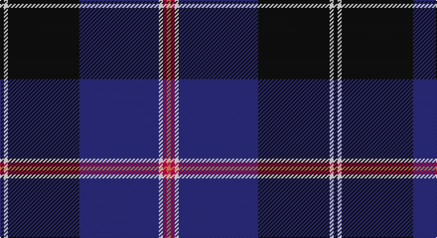

This page is one **sett** — a single exact thread-count. It belongs to the [tartan](/setts/k1w1k18db20w1r1lo1/)
(the same proportion at any scale), whose colour order is pattern [KWKBWRY](/stripes/kwkbwry/).

Sourced from register-of-tartans.  It is a [7 stripe tartan](/stripes/stripes7/).

Original link https://www.tartanregister.gov.uk/tartanDetails.aspx?ref=1289

2 attestations — the source records this cloth was collapsed from (oldest owns this page)

<ul>
<li>01/09/2005 — Fuller of Hopewell (Personal) (register-of-tartans, <a href="https://www.tartanregister.gov.uk/tartanDetails.aspx?ref=1289">record</a>)</li>
<li>2005 September — Fuller of Hopewell (Personal) (tartans-authority, <a href="http://www.tartansauthority.com/tartan-ferret/display/6781/">record</a>)</li>
</ul>

## Register references

External register numbers recorded for this tartan.

- Scottish Register of Tartans: [1289](https://www.tartanregister.gov.uk/tartanDetails.aspx?ref=1289)
- Scottish Tartans Authority (ITI): 6781

## Thread count
K/4 W4 K72 DB80 W4 R4 O/4

One full sett is **336 threads**.

## Palette

Palette: <strong>Tartan Register</strong> <small style="color:#888">(4 of 5 colours)</small>
<table><thead><tr><th>Colour</th><th>Threads</th><th>Shade</th><th>Base</th><th>OKLCh</th></tr></thead><tbody><tr><td>K/</td><td style="text-align:right;font-variant-numeric:tabular-nums">4</td><td><code style="background-color:#101010;">#101010</code> <small style="color:#888">#101010</small></td><td>K <code style="background-color:#000000;">#000000</code></td><td><small style="color:#888">oklch(17.3% 0.000 89.9)</small></td></tr><tr><td>W</td><td style="text-align:right;font-variant-numeric:tabular-nums">4</td><td><code style="background-color:#F8F8F8;">#F8F8F8</code> <small style="color:#888">#F8F8F8</small></td><td>W <code style="background-color:#F7F7F7;">#F7F7F7</code></td><td><small style="color:#888">oklch(97.9% 0.000 89.9)</small></td></tr><tr><td>K</td><td style="text-align:right;font-variant-numeric:tabular-nums">72</td><td><code style="background-color:#101010;">#101010</code> <small style="color:#888">#101010</small></td><td>K <code style="background-color:#000000;">#000000</code></td><td><small style="color:#888">oklch(17.3% 0.000 89.9)</small></td></tr><tr><td>DB</td><td style="text-align:right;font-variant-numeric:tabular-nums">80</td><td><code style="background-color:#2C2C80;">#2C2C80</code> <small style="color:#888">#2C2C80</small></td><td>B <code style="background-color:#2A418A;">#2A418A</code></td><td><small style="color:#888">oklch(35.0% 0.138 276.6)</small></td></tr><tr><td>W</td><td style="text-align:right;font-variant-numeric:tabular-nums">4</td><td><code style="background-color:#F8F8F8;">#F8F8F8</code> <small style="color:#888">#F8F8F8</small></td><td>W <code style="background-color:#F7F7F7;">#F7F7F7</code></td><td><small style="color:#888">oklch(97.9% 0.000 89.9)</small></td></tr><tr><td>R</td><td style="text-align:right;font-variant-numeric:tabular-nums">4</td><td><code style="background-color:#C80050;">#C80050</code> <small style="color:#888">#C80050</small></td><td>R <code style="background-color:#CC0000;">#CC0000</code></td><td><small style="color:#888">oklch(53.2% 0.213 9.9)</small></td></tr><tr><td>O/</td><td style="text-align:right;font-variant-numeric:tabular-nums">4</td><td><code style="background-color:#EC8048;">#EC8048</code> <small style="color:#888">#EC8048</small></td><td>Y <code style="background-color:#F2BF00;">#F2BF00</code></td><td><small style="color:#888">oklch(71.0% 0.150 46.4)</small></td></tr></tbody></table>

# Sample pattern

## Nearest tartans

The nearest existing variants by ΔTartan distance, with this tartan at the top so the swatches line up against it.

ΔTartan

Tartan

Sett

—

<a href="/ttd/edit/#slug=k1w1k18db20w1r1lo1~x4">Fuller of Hopewell (Personal)</a> <a class="nn-out" href="/variants/s7/k1w1k18db20w1r1lo1~x4/" title="open its dictionary page">↗</a>

0.89

<a href="/ttd/edit/#slug=w3db2ly1db2ly1db31k28r2k2~x2&amp;base=k1w1k18db20w1r1lo1~x4">Hill (Name)</a> <a class="nn-out" href="/variants/s9/w3db2ly1db2ly1db31k28r2k2~x2/" title="open its dictionary page">↗</a>

0.95

<a href="/ttd/edit/#slug=g1db1k1db30k30w2db5ly1~x2&amp;base=k1w1k18db20w1r1lo1~x4">Binder Wedding (Personal)</a> <a class="nn-out" href="/variants/s8/g1db1k1db30k30w2db5ly1~x2/" title="open its dictionary page">↗</a>

1.03

<a href="/ttd/edit/#slug=db42k6lo2k3lo2g10r7k2~x2&amp;base=k1w1k18db20w1r1lo1~x4">MacBeth (Fashion)</a> <a class="nn-out" href="/variants/s8/db42k6lo2k3lo2g10r7k2~x2/" title="open its dictionary page">↗</a>

1.12

<a href="/ttd/edit/#slug=k3r1k30w1db28r1db1w3~x2&amp;base=k1w1k18db20w1r1lo1~x4">Dunlop</a> <a class="nn-out" href="/variants/s8/k3r1k30w1db28r1db1w3~x2/" title="open its dictionary page">↗</a>

1.16

<a href="/ttd/edit/#slug=k8ly1k1db28k12g2k1t2~x2&amp;base=k1w1k18db20w1r1lo1~x4">Hope-Weir / Weir</a> <a class="nn-out" href="/variants/s8/k8ly1k1db28k12g2k1t2~x2/" title="open its dictionary page">↗</a>

1.19

<a href="/ttd/edit/#slug=r3w2g5k35db40ly3~x2&amp;base=k1w1k18db20w1r1lo1~x4">Italian National</a> <a class="nn-out" href="/variants/s6/r3w2g5k35db40ly3~x2/" title="open its dictionary page">↗</a>

1.20

<a href="/ttd/edit/#slug=r3w2r2db2r2db24k28r2k3ly1~x2&amp;base=k1w1k18db20w1r1lo1~x4">Locky</a> <a class="nn-out" href="/variants/s10/r3w2r2db2r2db24k28r2k3ly1~x2/" title="open its dictionary page">↗</a>

1.20

<a href="/ttd/edit/#slug=db20dy1db1dy1dg8k1w3~x2&amp;base=k1w1k18db20w1r1lo1~x4">Chestico</a> <a class="nn-out" href="/variants/s7/db20dy1db1dy1dg8k1w3~x2/" title="open its dictionary page">↗</a>

1.21

<a href="/ttd/edit/#slug=r12lo6k88db45k6db6ly6&amp;base=k1w1k18db20w1r1lo1~x4">City of Rome Pipe Band (Corporate)</a> <a class="nn-out" href="/variants/s7/r12lo6k88db45k6db6ly6/" title="open its dictionary page">↗</a>

1.22

<a href="/ttd/edit/#slug=k8r4k36db48r6g3lo2~x2&amp;base=k1w1k18db20w1r1lo1~x4">Royal Marines Condor</a> <a class="nn-out" href="/variants/s7/k8r4k36db48r6g3lo2~x2/" title="open its dictionary page">↗</a>

## Neighbour map

Every grey dot is one of 14360 variants placed by the first two principal components of the ΔTartan feature space (44% of its variance). Red is this tartan; blue dots are its nearest — click one to open its page.

<svg viewBox="0 0 640 380" role="img" style="max-width:100%;height:auto;border:1px solid #e0e0e0;border-radius:4px;display:block" xmlns="http://www.w3.org/2000/svg"><image href="/nn/cloud.v1.png" width="640" height="380"/><a href="/variants/s9/w3db2ly1db2ly1db31k28r2k2~x2/"><circle cx="337.4" cy="114.0" r="4" fill="#3465a4"><title>Hill (Name)</title></circle></a><a href="/variants/s8/g1db1k1db30k30w2db5ly1~x2/"><circle cx="358.0" cy="127.7" r="4" fill="#3465a4"><title>Binder Wedding (Personal)</title></circle></a><a href="/variants/s8/db42k6lo2k3lo2g10r7k2~x2/"><circle cx="342.9" cy="140.2" r="4" fill="#3465a4"><title>MacBeth (Fashion)</title></circle></a><a href="/variants/s8/k3r1k30w1db28r1db1w3~x2/"><circle cx="359.1" cy="139.7" r="4" fill="#3465a4"><title>Dunlop</title></circle></a><a href="/variants/s8/k8ly1k1db28k12g2k1t2~x2/"><circle cx="320.2" cy="126.3" r="4" fill="#3465a4"><title>Hope-Weir / Weir</title></circle></a><a href="/variants/s6/r3w2g5k35db40ly3~x2/"><circle cx="260.3" cy="144.0" r="4" fill="#3465a4"><title>Italian National</title></circle></a><a href="/variants/s10/r3w2r2db2r2db24k28r2k3ly1~x2/"><circle cx="295.6" cy="107.8" r="4" fill="#3465a4"><title>Locky</title></circle></a><a href="/variants/s7/db20dy1db1dy1dg8k1w3~x2/"><circle cx="352.6" cy="145.2" r="4" fill="#3465a4"><title>Chestico</title></circle></a><a href="/variants/s7/r12lo6k88db45k6db6ly6/"><circle cx="336.3" cy="167.9" r="4" fill="#3465a4"><title>City of Rome Pipe Band (Corporate)</title></circle></a><a href="/variants/s7/k8r4k36db48r6g3lo2~x2/"><circle cx="320.6" cy="164.0" r="4" fill="#3465a4"><title>Royal Marines Condor</title></circle></a><circle cx="313.1" cy="144.7" r="5" fill="#c00000"/></svg>

ID: /variants/s7/k1w1k18db20w1r1lo1~x4/
