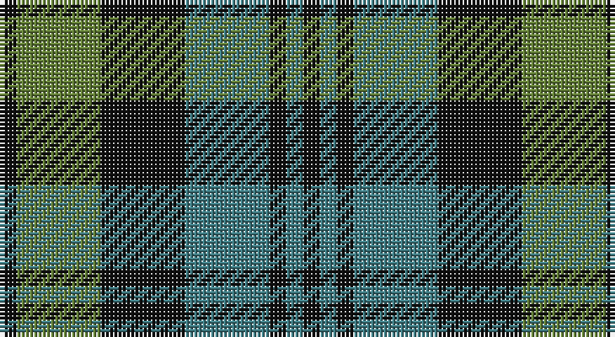

This page is one **sett** — a single exact thread-count. It belongs to the [tartan](/setts/k1y5k5g5k1g1k1/)
(the same proportion at any scale), whose colour order is pattern [KGKGKGK](/stripes/kgkgkgk/).

Sourced from tartans-authority.  It is a [7 stripe tartan](/stripes/stripes7/).

Original link http://www.tartansauthority.com/tartan-ferret/display/1039/

## Register references

External register numbers recorded for this tartan.

- Scottish Tartans Authority (ITI): 1039

## Thread count
K/4 Ga20 K20 G20 K4 G4 K/4

One full sett is **144 threads**.

## Palette

Palette: <strong>Logan (The Scottish Gael, 1831)</strong> <small style="color:#888">(1 of 3 colours)</small>
<table><thead><tr><th>Colour</th><th>Threads</th><th>Shade</th><th>Base</th><th>OKLCh</th></tr></thead><tbody><tr><td>K/</td><td style="text-align:right;font-variant-numeric:tabular-nums">4</td><td><code style="background-color:#101010;">#101010</code> <small style="color:#888">#101010</small></td><td>K <code style="background-color:#000000;">#000000</code></td><td><small style="color:#888">oklch(17.3% 0.000 89.9)</small></td></tr><tr><td>Ga</td><td style="text-align:right;font-variant-numeric:tabular-nums">20</td><td><code style="background-color:#648038;">#648038</code> <small style="color:#888">#648038</small></td><td>G <code style="background-color:#006100;">#006100</code></td><td><small style="color:#888">oklch(56.1% 0.105 127.2)</small></td></tr><tr><td>K</td><td style="text-align:right;font-variant-numeric:tabular-nums">20</td><td><code style="background-color:#101010;">#101010</code> <small style="color:#888">#101010</small></td><td>K <code style="background-color:#000000;">#000000</code></td><td><small style="color:#888">oklch(17.3% 0.000 89.9)</small></td></tr><tr><td>G</td><td style="text-align:right;font-variant-numeric:tabular-nums">20</td><td><code style="background-color:#407C84;">#407C84</code> <small style="color:#888">#407C84</small></td><td>G <code style="background-color:#006100;">#006100</code></td><td><small style="color:#888">oklch(54.9% 0.063 206.8)</small></td></tr><tr><td>K</td><td style="text-align:right;font-variant-numeric:tabular-nums">4</td><td><code style="background-color:#101010;">#101010</code> <small style="color:#888">#101010</small></td><td>K <code style="background-color:#000000;">#000000</code></td><td><small style="color:#888">oklch(17.3% 0.000 89.9)</small></td></tr><tr><td>G</td><td style="text-align:right;font-variant-numeric:tabular-nums">4</td><td><code style="background-color:#407C84;">#407C84</code> <small style="color:#888">#407C84</small></td><td>G <code style="background-color:#006100;">#006100</code></td><td><small style="color:#888">oklch(54.9% 0.063 206.8)</small></td></tr><tr><td>K/</td><td style="text-align:right;font-variant-numeric:tabular-nums">4</td><td><code style="background-color:#101010;">#101010</code> <small style="color:#888">#101010</small></td><td>K <code style="background-color:#000000;">#000000</code></td><td><small style="color:#888">oklch(17.3% 0.000 89.9)</small></td></tr></tbody></table>

# Sample pattern

## Nearest tartans

The nearest existing variants by ΔTartan distance, with this tartan at the top so the swatches line up against it.

ΔTartan

Tartan

Sett

—

<a href="/ttd/edit/#slug=k1y5k5g5k1g1k1~x4">Strathspey District (District)</a> <a class="nn-out" href="/variants/s7/k1y5k5g5k1g1k1~x4/" title="open its dictionary page">↗</a>

1.12

<a href="/ttd/edit/#slug=b6k6b18k18g22k5~x2&amp;base=k1y5k5g5k1g1k1~x4">Campbell, The 42nd</a> <a class="nn-out" href="/variants/s6/b6k6b18k18g22k5~x2/" title="open its dictionary page">↗</a>

1.13

<a href="/ttd/edit/#slug=r5g12dbi4db4dbi22g18dbi4r5&amp;base=k1y5k5g5k1g1k1~x4">Daks, Navy</a> <a class="nn-out" href="/variants/s8/r5g12dbi4db4dbi22g18dbi4r5/" title="open its dictionary page">↗</a>

1.16

<a href="/ttd/edit/#slug=g12k14t11k3t3k3t11k14g12t3~x2&amp;base=k1y5k5g5k1g1k1~x4">Wilson's No.166</a> <a class="nn-out" href="/variants/s10/g12k14t11k3t3k3t11k14g12t3~x2/" title="open its dictionary page">↗</a>

1.18

<a href="/ttd/edit/#slug=o6k1o1k1o2k4dy6k1o2k2~x4&amp;base=k1y5k5g5k1g1k1~x4">Tyndrum District Tartan</a> <a class="nn-out" href="/variants/s10/o6k1o1k1o2k4dy6k1o2k2~x4/" title="open its dictionary page">↗</a>

1.22

<a href="/ttd/edit/#slug=g52lb7g9k35db35k7&amp;base=k1y5k5g5k1g1k1~x4">Redland</a> <a class="nn-out" href="/variants/s6/g52lb7g9k35db35k7/" title="open its dictionary page">↗</a>

1.25

<a href="/ttd/edit/#slug=k3b4g20k20g3lo3~x4&amp;base=k1y5k5g5k1g1k1~x4">Michaluk (Personal)</a> <a class="nn-out" href="/variants/s6/k3b4g20k20g3lo3~x4/" title="open its dictionary page">↗</a>

1.25

<a href="/ttd/edit/#slug=y3dg6k6y4r1y1~x2&amp;base=k1y5k5g5k1g1k1~x4">Waterloo</a> <a class="nn-out" href="/variants/s6/y3dg6k6y4r1y1~x2/" title="open its dictionary page">↗</a>

1.26

<a href="/ttd/edit/#slug=r3g6db2dbi2db11g9db2r3~x2&amp;base=k1y5k5g5k1g1k1~x4">Daks (Navy)</a> <a class="nn-out" href="/variants/s8/r3g6db2dbi2db11g9db2r3~x2/" title="open its dictionary page">↗</a>

1.27

<a href="/ttd/edit/#slug=t3dg12k14t11r3t3~x2&amp;base=k1y5k5g5k1g1k1~x4">Wellington or Waterloo</a> <a class="nn-out" href="/variants/s6/t3dg12k14t11r3t3~x2/" title="open its dictionary page">↗</a>

1.30

<a href="/ttd/edit/#slug=g14db2g2k8dp9k2~x2&amp;base=k1y5k5g5k1g1k1~x4">MacArthur of Milton Hunting Clan Tartan</a> <a class="nn-out" href="/variants/s6/g14db2g2k8dp9k2~x2/" title="open its dictionary page">↗</a>

## Neighbour map

Every grey dot is one of 14360 variants placed by the first two principal components of the ΔTartan feature space (44% of its variance). Red is this tartan; blue dots are its nearest — click one to open its page.

<svg viewBox="0 0 640 380" role="img" style="max-width:100%;height:auto;border:1px solid #e0e0e0;border-radius:4px;display:block" xmlns="http://www.w3.org/2000/svg"><image href="/nn/cloud.v1.png" width="640" height="380"/><a href="/variants/s6/b6k6b18k18g22k5~x2/"><circle cx="181.0" cy="298.8" r="4" fill="#3465a4"><title>Campbell, The 42nd</title></circle></a><a href="/variants/s8/r5g12dbi4db4dbi22g18dbi4r5/"><circle cx="175.0" cy="232.4" r="4" fill="#3465a4"><title>Daks, Navy</title></circle></a><a href="/variants/s10/g12k14t11k3t3k3t11k14g12t3~x2/"><circle cx="164.1" cy="268.6" r="4" fill="#3465a4"><title>Wilson's No.166</title></circle></a><a href="/variants/s10/o6k1o1k1o2k4dy6k1o2k2~x4/"><circle cx="213.3" cy="232.7" r="4" fill="#3465a4"><title>Tyndrum District Tartan</title></circle></a><a href="/variants/s6/g52lb7g9k35db35k7/"><circle cx="207.5" cy="247.7" r="4" fill="#3465a4"><title>Redland</title></circle></a><a href="/variants/s6/k3b4g20k20g3lo3~x4/"><circle cx="233.7" cy="228.3" r="4" fill="#3465a4"><title>Michaluk (Personal)</title></circle></a><a href="/variants/s6/y3dg6k6y4r1y1~x2/"><circle cx="157.3" cy="255.4" r="4" fill="#3465a4"><title>Waterloo</title></circle></a><a href="/variants/s8/r3g6db2dbi2db11g9db2r3~x2/"><circle cx="200.6" cy="248.3" r="4" fill="#3465a4"><title>Daks (Navy)</title></circle></a><a href="/variants/s6/t3dg12k14t11r3t3~x2/"><circle cx="149.5" cy="265.5" r="4" fill="#3465a4"><title>Wellington or Waterloo</title></circle></a><a href="/variants/s6/g14db2g2k8dp9k2~x2/"><circle cx="221.2" cy="246.3" r="4" fill="#3465a4"><title>MacArthur of Milton Hunting Clan Tartan</title></circle></a><circle cx="210.7" cy="263.1" r="5" fill="#c00000"/></svg>

ID: /variants/s7/k1y5k5g5k1g1k1~x4/
