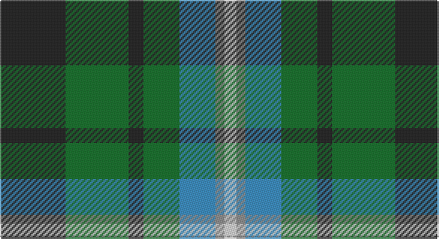

This page is one **sett** — a single exact thread-count. It belongs to the [tartan](/setts/k22g21k5g12t12o3w4/)
(the same proportion at any scale), whose colour order is pattern [KGKGBRW](/stripes/kgkgbrw/).

Sourced from register-of-tartans.  It is a [7 stripe tartan](/stripes/stripes7/).

Original link https://www.tartanregister.gov.uk/tartanDetails.aspx?ref=11103

## Also known as

This cloth is also recorded under:

- Disciples of Christ Motorcycle Ministry

2 attestations — the source records this cloth was collapsed from (oldest owns this page)

<ul>
<li>02/06/2014 — Disciples of Christ Motorcycle Ministry (Switzerland) (register-of-tartans, <a href="https://www.tartanregister.gov.uk/tartanDetails.aspx?ref=11103">record</a>)</li>
<li>2014 — Disciples of Christ MM (Switzerland) (tartans-authority, <a href="http://www.tartansauthority.com/tartan-ferret/display/11103/">record</a>)</li>
</ul>

## Register references

External register numbers recorded for this tartan.

- Scottish Register of Tartans: [11103](https://www.tartanregister.gov.uk/tartanDetails?ref=11103)
- Scottish Tartans Authority (ITI): 11103

## Thread count
K/44 G42 K10 G24 B24 N6 LN/8

One full sett is **264 threads**.

## Palette

Palette: <strong>Tartan Register</strong>
<table><thead><tr><th>Colour</th><th>Threads</th><th>Shade</th><th>Base</th><th>OKLCh</th></tr></thead><tbody><tr><td>K/</td><td style="text-align:right;font-variant-numeric:tabular-nums">44</td><td><code style="background-color:#101010;">#101010</code> <small style="color:#888">#101010</small></td><td>K <code style="background-color:#000000;">#000000</code></td><td><small style="color:#888">oklch(17.3% 0.000 89.9)</small></td></tr><tr><td>G</td><td style="text-align:right;font-variant-numeric:tabular-nums">42</td><td><code style="background-color:#006818;">#006818</code> <small style="color:#888">#006818</small></td><td>G <code style="background-color:#006100;">#006100</code></td><td><small style="color:#888">oklch(45.0% 0.142 145.0)</small></td></tr><tr><td>K</td><td style="text-align:right;font-variant-numeric:tabular-nums">10</td><td><code style="background-color:#101010;">#101010</code> <small style="color:#888">#101010</small></td><td>K <code style="background-color:#000000;">#000000</code></td><td><small style="color:#888">oklch(17.3% 0.000 89.9)</small></td></tr><tr><td>G</td><td style="text-align:right;font-variant-numeric:tabular-nums">24</td><td><code style="background-color:#006818;">#006818</code> <small style="color:#888">#006818</small></td><td>G <code style="background-color:#006100;">#006100</code></td><td><small style="color:#888">oklch(45.0% 0.142 145.0)</small></td></tr><tr><td>B</td><td style="text-align:right;font-variant-numeric:tabular-nums">24</td><td><code style="background-color:#2888C4;">#2888C4</code> <small style="color:#888">#2888C4</small></td><td>B <code style="background-color:#2A418A;">#2A418A</code></td><td><small style="color:#888">oklch(60.1% 0.125 241.5)</small></td></tr><tr><td>N</td><td style="text-align:right;font-variant-numeric:tabular-nums">6</td><td><code style="background-color:#888888;">#888888</code> <small style="color:#888">#888888</small></td><td>R <code style="background-color:#CC0000;">#CC0000</code></td><td><small style="color:#888">oklch(62.7% 0.000 89.9)</small></td></tr><tr><td>LN/</td><td style="text-align:right;font-variant-numeric:tabular-nums">8</td><td><code style="background-color:#E0E0E0;">#E0E0E0</code> <small style="color:#888">#E0E0E0</small></td><td>W <code style="background-color:#F7F7F7;">#F7F7F7</code></td><td><small style="color:#888">oklch(90.7% 0.000 89.9)</small></td></tr></tbody></table>

# Sample pattern

## Nearest tartans

The nearest existing variants by ΔTartan distance, with this tartan at the top so the swatches line up against it.

ΔTartan

Tartan

Sett

—

<a href="/ttd/edit/#slug=k22g21k5g12t12o3w4~x2">Disciples of Christ Motorcycle Ministry (Switzerland)</a> <a class="nn-out" href="/variants/s7/k22g21k5g12t12o3w4~x2/" title="open its dictionary page">↗</a>

0.73

<a href="/ttd/edit/#slug=g31ly4g6k19db18t9~x2&amp;base=k22g21k5g12t12o3w4~x2">Lanarkshire</a> <a class="nn-out" href="/variants/s6/g31ly4g6k19db18t9~x2/" title="open its dictionary page">↗</a>

0.74

<a href="/variants/s7/k7db11ki3db11dy11g22db3~x2/">Scottish Odyssey Commemorative Tartan</a>

0.95

<a href="/ttd/edit/#slug=ly4dg30g15db5t10ly4~x2&amp;base=k22g21k5g12t12o3w4~x2">MPS Emerald Society NCLEES 2012</a> <a class="nn-out" href="/variants/s6/ly4dg30g15db5t10ly4~x2/" title="open its dictionary page">↗</a>

0.97

<a href="/ttd/edit/#slug=ly4dg30g15db5b10ly4~x2&amp;base=k22g21k5g12t12o3w4~x2">MPS Emerald Society</a> <a class="nn-out" href="/variants/s6/ly4dg30g15db5b10ly4~x2/" title="open its dictionary page">↗</a>

0.97

<a href="/ttd/edit/#slug=w3dt10dt12gi11db3gi11g4gi2~x2&amp;base=k22g21k5g12t12o3w4~x2">Queen of the South</a> <a class="nn-out" href="/variants/s8/w3dt10dt12gi11db3gi11g4gi2~x2/" title="open its dictionary page">↗</a>

1.00

<a href="/ttd/edit/#slug=g9t2g1k6db6r1db1~x2&amp;base=k22g21k5g12t12o3w4~x2">MacTaggert</a> <a class="nn-out" href="/variants/s7/g9t2g1k6db6r1db1~x2/" title="open its dictionary page">↗</a>

1.01

<a href="/ttd/edit/#slug=g24k4g6r4g6k19db22w5~x2&amp;base=k22g21k5g12t12o3w4~x2">MacRae, Ancient hunting</a> <a class="nn-out" href="/variants/s8/g24k4g6r4g6k19db22w5~x2/" title="open its dictionary page">↗</a>

1.02

<a href="/ttd/edit/#slug=k5g30ly3b15k15b7w3~x2&amp;base=k22g21k5g12t12o3w4~x2">Dick (Personal)</a> <a class="nn-out" href="/variants/s7/k5g30ly3b15k15b7w3~x2/" title="open its dictionary page">↗</a>

1.03

<a href="/ttd/edit/#slug=g5r4g19k10g8w4db18r4~x2&amp;base=k22g21k5g12t12o3w4~x2">CSCA (Corporate)</a> <a class="nn-out" href="/variants/s8/g5r4g19k10g8w4db18r4~x2/" title="open its dictionary page">↗</a>

1.06

<a href="/ttd/edit/#slug=dg31ly4dg6k19db18t9~x2&amp;base=k22g21k5g12t12o3w4~x2">Lanark</a> <a class="nn-out" href="/variants/s6/dg31ly4dg6k19db18t9~x2/" title="open its dictionary page">↗</a>

## Neighbour map

Every grey dot is one of 14360 variants placed by the first two principal components of the ΔTartan feature space (44% of its variance). Red is this tartan; blue dots are its nearest — click one to open its page.

<svg viewBox="0 0 640 380" role="img" style="max-width:100%;height:auto;border:1px solid #e0e0e0;border-radius:4px;display:block" xmlns="http://www.w3.org/2000/svg"><image href="/nn/cloud.v1.png" width="640" height="380"/><a href="/variants/s6/g31ly4g6k19db18t9~x2/"><circle cx="165.1" cy="233.2" r="4" fill="#3465a4"><title>Lanarkshire</title></circle></a><a href="/variants/s7/k7db11ki3db11dy11g22db3~x2/"><circle cx="127.8" cy="225.1" r="4" fill="#3465a4"><title>Scottish Odyssey Commemorative Tartan</title></circle></a><a href="/variants/s6/ly4dg30g15db5t10ly4~x2/"><circle cx="174.5" cy="213.8" r="4" fill="#3465a4"><title>MPS Emerald Society NCLEES 2012</title></circle></a><a href="/variants/s6/ly4dg30g15db5b10ly4~x2/"><circle cx="178.3" cy="214.8" r="4" fill="#3465a4"><title>MPS Emerald Society</title></circle></a><a href="/variants/s8/w3dt10dt12gi11db3gi11g4gi2~x2/"><circle cx="141.6" cy="226.2" r="4" fill="#3465a4"><title>Queen of the South</title></circle></a><a href="/variants/s7/g9t2g1k6db6r1db1~x2/"><circle cx="144.7" cy="193.7" r="4" fill="#3465a4"><title>MacTaggert</title></circle></a><a href="/variants/s8/g24k4g6r4g6k19db22w5~x2/"><circle cx="118.6" cy="204.2" r="4" fill="#3465a4"><title>MacRae, Ancient hunting</title></circle></a><a href="/variants/s7/k5g30ly3b15k15b7w3~x2/"><circle cx="159.9" cy="191.6" r="4" fill="#3465a4"><title>Dick (Personal)</title></circle></a><a href="/variants/s8/g5r4g19k10g8w4db18r4~x2/"><circle cx="140.7" cy="226.0" r="4" fill="#3465a4"><title>CSCA (Corporate)</title></circle></a><a href="/variants/s6/dg31ly4dg6k19db18t9~x2/"><circle cx="154.0" cy="229.3" r="4" fill="#3465a4"><title>Lanark</title></circle></a><circle cx="156.0" cy="222.3" r="5" fill="#c00000"/></svg>

ID: /variants/s7/k22g21k5g12t12o3w4~x2/
