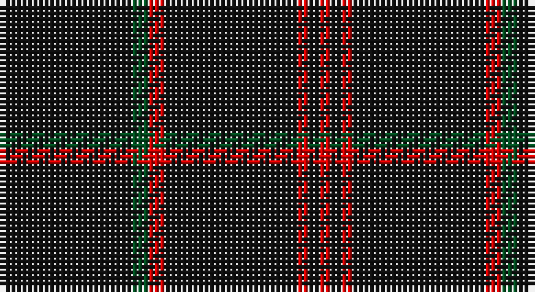

This page is one **sett** — a single exact thread-count. It belongs to the [tartan](/setts/k24dg3r3k24r2k2r2/)
(the same proportion at any scale), whose colour order is pattern [KGRKRKR](/stripes/kgrkrkr/).

Part of the [Unidentified](/tartans/unidentified/) tartan — the named design grouping this sett with its other cloths.

Sourced from register-of-tartans.  It is a [7 stripe tartan](/stripes/stripes7/).

Original link https://www.tartanregister.gov.uk/tartanDetails.aspx?ref=4246

## Also known as

This cloth is also recorded under:

- Unidentified #10
- Unidentified #12
- Unidentified #14
- Unidentified #15
- Unidentified #16
- Unidentified #18
- Unidentified #2
- Unidentified #21
- Unidentified #22
- Unidentified #24
- Unidentified #25
- Unidentified #28
- Unidentified #29
- Unidentified #30
- Unidentified #31
- Unidentified #32
- Unidentified #36
- Unidentified #37
- Unidentified #38
- Unidentified #40
- Unidentified #43
- Unidentified #44
- Unidentified #45
- Unidentified #46
- Unidentified #47
- Unidentified #48
- Unidentified #49
- Unidentified #5
- Unidentified #50
- Unidentified #51
- Unidentified #52
- Unidentified #53
- Unidentified #54
- Unidentified #55
- Unidentified #56
- Unidentified #57
- Unidentified #58
- Unidentified #59
- Unidentified #60
- Unidentified #61
- Unidentified #62
- Unidentified #63
- Unidentified #64
- Unidentified #65
- Unidentified #66
- Unidentified #7
- Unidentified #8
- Unidentified #9
- Unidentified 16
- Unidentified Artifact
- Unidentified Plaid
- Unidentified Plaid #11
- Unidentified Plaid #13
- Unidentified Plaid #2
- Unidentified Plaid #3
- Unidentified Plaid #7
- Unidentified Plaid #8
- Unidentified Plaid #9
- Unidentified Portrait

## Register references

External register numbers recorded for this tartan.

- Scottish Register of Tartans: [4246](https://www.tartanregister.gov.uk/tartanDetails.aspx?ref=4246)
- Scottish Tartans World Register: 2041

## Thread count
K/24 G3 R3 K24 R2 K2 R/2

One full sett is **94 threads**.

## Palette

Palette: <strong>Tartan Register</strong>
<table><thead><tr><th>Colour</th><th>Threads</th><th>Shade</th><th>Base</th><th>OKLCh</th></tr></thead><tbody><tr><td>K/</td><td style="text-align:right;font-variant-numeric:tabular-nums">24</td><td><code style="background-color:#101010;">#101010</code> <small style="color:#888">#101010</small></td><td>K <code style="background-color:#000000;">#000000</code></td><td><small style="color:#888">oklch(17.3% 0.000 89.9)</small></td></tr><tr><td>G</td><td style="text-align:right;font-variant-numeric:tabular-nums">3</td><td><code style="background-color:#005020;">#005020</code> <small style="color:#888">#005020</small></td><td>G <code style="background-color:#006100;">#006100</code></td><td><small style="color:#888">oklch(37.7% 0.105 149.6)</small></td></tr><tr><td>R</td><td style="text-align:right;font-variant-numeric:tabular-nums">3</td><td><code style="background-color:#DC0000;">#DC0000</code> <small style="color:#888">#DC0000</small></td><td>R <code style="background-color:#CC0000;">#CC0000</code></td><td><small style="color:#888">oklch(56.2% 0.230 29.2)</small></td></tr><tr><td>K</td><td style="text-align:right;font-variant-numeric:tabular-nums">24</td><td><code style="background-color:#101010;">#101010</code> <small style="color:#888">#101010</small></td><td>K <code style="background-color:#000000;">#000000</code></td><td><small style="color:#888">oklch(17.3% 0.000 89.9)</small></td></tr><tr><td>R</td><td style="text-align:right;font-variant-numeric:tabular-nums">2</td><td><code style="background-color:#DC0000;">#DC0000</code> <small style="color:#888">#DC0000</small></td><td>R <code style="background-color:#CC0000;">#CC0000</code></td><td><small style="color:#888">oklch(56.2% 0.230 29.2)</small></td></tr><tr><td>K</td><td style="text-align:right;font-variant-numeric:tabular-nums">2</td><td><code style="background-color:#101010;">#101010</code> <small style="color:#888">#101010</small></td><td>K <code style="background-color:#000000;">#000000</code></td><td><small style="color:#888">oklch(17.3% 0.000 89.9)</small></td></tr><tr><td>R/</td><td style="text-align:right;font-variant-numeric:tabular-nums">2</td><td><code style="background-color:#DC0000;">#DC0000</code> <small style="color:#888">#DC0000</small></td><td>R <code style="background-color:#CC0000;">#CC0000</code></td><td><small style="color:#888">oklch(56.2% 0.230 29.2)</small></td></tr></tbody></table>

# Sample pattern

## Compared to the master

This cloth is one sett of its design; the master sett (the exemplar the design is anchored on) is below for comparison.

<figure style="margin:0"><figcaption style="color:#888;font-size:smaller">this sett</figcaption></figure>
<figure style="margin:0"><figcaption style="color:#888;font-size:smaller"><a href="/setts/dp4r3dp26r26dg26r4/">master sett →</a></figcaption></figure>

## Nearest tartans

The nearest existing variants by ΔTartan distance, with this tartan at the top so the swatches line up against it.

ΔTartan

Tartan

Sett

—

<a href="/ttd/edit/#slug=k24dg3r3k24r2k2r2">Unidentified #45</a> <a class="nn-out" href="/variants/s7/k24dg3r3k24r2k2r2/" title="open its dictionary page">↗</a>

1.27

<a href="/ttd/edit/#slug=k3g2k20r2k12g2k4g2k6g2~x2&amp;base=k24dg3r3k24r2k2r2">Renwick</a> <a class="nn-out" href="/variants/s10/k3g2k20r2k12g2k4g2k6g2~x2/" title="open its dictionary page">↗</a>

1.44

<a href="/ttd/edit/#slug=r7k3r3k22r3k3r3k37ly2k4~x2&amp;base=k24dg3r3k24r2k2r2">Maier (Personal)</a> <a class="nn-out" href="/variants/s10/r7k3r3k22r3k3r3k37ly2k4~x2/" title="open its dictionary page">↗</a>

1.54

<a href="/ttd/edit/#slug=k10n2k2n8k40r4k5ri2~x2&amp;base=k24dg3r3k24r2k2r2">Laird Abdullah (Personal)</a> <a class="nn-out" href="/variants/s8/k10n2k2n8k40r4k5ri2~x2/" title="open its dictionary page">↗</a>

1.56

<a href="/ttd/edit/#slug=dt74m9dt4r5dt4m9dt37db9~x2&amp;base=k24dg3r3k24r2k2r2">Rikaco Vintage</a> <a class="nn-out" href="/variants/s8/dt74m9dt4r5dt4m9dt37db9~x2/" title="open its dictionary page">↗</a>

1.67

<a href="/ttd/edit/#slug=k15n7k6n11k50n4~x2&amp;base=k24dg3r3k24r2k2r2">Freedom of Scotland</a> <a class="nn-out" href="/variants/s6/k15n7k6n11k50n4~x2/" title="open its dictionary page">↗</a>

1.68

<a href="/ttd/edit/#slug=k72r3k11t9k11r3k37&amp;base=k24dg3r3k24r2k2r2">Chafyn House (School)</a> <a class="nn-out" href="/variants/s7/k72r3k11t9k11r3k37/" title="open its dictionary page">↗</a>

1.72

<a href="/ttd/edit/#slug=k62r3k3lo3k3r3k9o5~x2&amp;base=k24dg3r3k24r2k2r2">Auld Bernensis</a> <a class="nn-out" href="/variants/s8/k62r3k3lo3k3r3k9o5~x2/" title="open its dictionary page">↗</a>

1.72

<a href="/ttd/edit/#slug=k24g3r3k24r2k2r2&amp;base=k24dg3r3k24r2k2r2">Unidentified 11</a> <a class="nn-out" href="/variants/s7/k24g3r3k24r2k2r2/" title="open its dictionary page">↗</a>

1.73

<a href="/ttd/edit/#slug=k60t3k9g7&amp;base=k24dg3r3k24r2k2r2">Wallington (Corporate?)</a> <a class="nn-out" href="/variants/s4/k60t3k9g7/" title="open its dictionary page">↗</a>

1.78

<a href="/ttd/edit/#slug=k45ly4k4ly9k4ly4k45r4~x2&amp;base=k24dg3r3k24r2k2r2">Gwynn</a> <a class="nn-out" href="/variants/s8/k45ly4k4ly9k4ly4k45r4~x2/" title="open its dictionary page">↗</a>

## Neighbour map

Every grey dot is one of 14360 variants placed by the first two principal components of the ΔTartan feature space (44% of its variance). Red is this tartan; blue dots are its nearest — click one to open its page.

<svg viewBox="0 0 640 380" role="img" style="max-width:100%;height:auto;border:1px solid #e0e0e0;border-radius:4px;display:block" xmlns="http://www.w3.org/2000/svg"><image href="/nn/cloud.v1.png" width="640" height="380"/><a href="/variants/s10/k3g2k20r2k12g2k4g2k6g2~x2/"><circle cx="561.7" cy="237.4" r="4" fill="#3465a4"><title>Renwick</title></circle></a><a href="/variants/s10/r7k3r3k22r3k3r3k37ly2k4~x2/"><circle cx="541.7" cy="172.7" r="4" fill="#3465a4"><title>Maier (Personal)</title></circle></a><a href="/variants/s8/k10n2k2n8k40r4k5ri2~x2/"><circle cx="537.7" cy="174.3" r="4" fill="#3465a4"><title>Laird Abdullah (Personal)</title></circle></a><a href="/variants/s8/dt74m9dt4r5dt4m9dt37db9~x2/"><circle cx="538.7" cy="182.9" r="4" fill="#3465a4"><title>Rikaco Vintage</title></circle></a><a href="/variants/s6/k15n7k6n11k50n4~x2/"><circle cx="564.5" cy="266.5" r="4" fill="#3465a4"><title>Freedom of Scotland</title></circle></a><a href="/variants/s7/k72r3k11t9k11r3k37/"><circle cx="626.0" cy="214.1" r="4" fill="#3465a4"><title>Chafyn House (School)</title></circle></a><a href="/variants/s8/k62r3k3lo3k3r3k9o5~x2/"><circle cx="598.1" cy="152.5" r="4" fill="#3465a4"><title>Auld Bernensis</title></circle></a><a href="/variants/s7/k24g3r3k24r2k2r2/"><circle cx="548.1" cy="219.2" r="4" fill="#3465a4"><title>Unidentified 11</title></circle></a><a href="/variants/s4/k60t3k9g7/"><circle cx="626.0" cy="231.8" r="4" fill="#3465a4"><title>Wallington (Corporate?)</title></circle></a><a href="/variants/s8/k45ly4k4ly9k4ly4k45r4~x2/"><circle cx="515.7" cy="196.1" r="4" fill="#3465a4"><title>Gwynn</title></circle></a><circle cx="577.4" cy="225.7" r="5" fill="#c00000"/></svg>

ID: /variants/s7/k24dg3r3k24r2k2r2/
