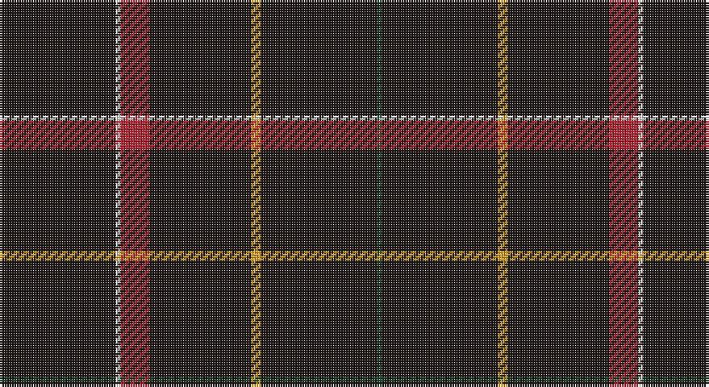

This page is one **sett** — a single exact thread-count. It belongs to the [tartan](/setts/k24w1r6k21lo2k24dg1/)
(the same proportion at any scale), whose colour order is pattern [GKYKRWK](/stripes/gkykrwk/).

Sourced from register-of-tartans.  It is a [7 stripe tartan](/stripes/stripes7/).

Original link https://www.tartanregister.gov.uk/tartanDetails.aspx?ref=10266

## Register references

External register numbers recorded for this tartan.

- Scottish Register of Tartans: [10266](https://www.tartanregister.gov.uk/tartanDetails.aspx?ref=10266)

## Thread count
K/48 W2 R12 K42 Y4 K48 DG/2

One full sett is **266 threads**.

## Palette

Palette: <strong>Tartan Register</strong> <small style="color:#888">(2 of 5 colours)</small>
<table><thead><tr><th>Colour</th><th>Threads</th><th>Shade</th><th>Base</th><th>OKLCh</th></tr></thead><tbody><tr><td>K/</td><td style="text-align:right;font-variant-numeric:tabular-nums">48</td><td><code style="background-color:#1C1714;">#1C1714</code> <small style="color:#888">#1C1714</small></td><td>K <code style="background-color:#000000;">#000000</code></td><td><small style="color:#888">oklch(20.9% 0.010 52.9)</small></td></tr><tr><td>W</td><td style="text-align:right;font-variant-numeric:tabular-nums">2</td><td><code style="background-color:#F9F5EF;">#F9F5EF</code> <small style="color:#888">#F9F5EF</small></td><td>W <code style="background-color:#F7F7F7;">#F7F7F7</code></td><td><small style="color:#888">oklch(97.2% 0.009 78.3)</small></td></tr><tr><td>R</td><td style="text-align:right;font-variant-numeric:tabular-nums">12</td><td><code style="background-color:#B62531;">#B62531</code> <small style="color:#888">#B62531</small></td><td>R <code style="background-color:#CC0000;">#CC0000</code></td><td><small style="color:#888">oklch(50.8% 0.180 22.7)</small></td></tr><tr><td>K</td><td style="text-align:right;font-variant-numeric:tabular-nums">42</td><td><code style="background-color:#1C1714;">#1C1714</code> <small style="color:#888">#1C1714</small></td><td>K <code style="background-color:#000000;">#000000</code></td><td><small style="color:#888">oklch(20.9% 0.010 52.9)</small></td></tr><tr><td>Y</td><td style="text-align:right;font-variant-numeric:tabular-nums">4</td><td><code style="background-color:#E0A126;">#E0A126</code> <small style="color:#888">#E0A126</small></td><td>Y <code style="background-color:#F2BF00;">#F2BF00</code></td><td><small style="color:#888">oklch(75.1% 0.146 78.3)</small></td></tr><tr><td>K</td><td style="text-align:right;font-variant-numeric:tabular-nums">48</td><td><code style="background-color:#1C1714;">#1C1714</code> <small style="color:#888">#1C1714</small></td><td>K <code style="background-color:#000000;">#000000</code></td><td><small style="color:#888">oklch(20.9% 0.010 52.9)</small></td></tr><tr><td>DG/</td><td style="text-align:right;font-variant-numeric:tabular-nums">2</td><td><code style="background-color:#1E492B;">#1E492B</code> <small style="color:#888">#1E492B</small></td><td>G <code style="background-color:#006100;">#006100</code></td><td><small style="color:#888">oklch(36.6% 0.071 151.3)</small></td></tr></tbody></table>

# Sample pattern

## Nearest tartans

The nearest existing variants by ΔTartan distance, with this tartan at the top so the swatches line up against it.

ΔTartan

Tartan

Sett

—

<a href="/ttd/edit/#slug=k24w1r6k21lo2k24dg1~x2">Gourlay, George (Personal)</a> <a class="nn-out" href="/variants/s7/k24w1r6k21lo2k24dg1~x2/" title="open its dictionary page">↗</a>

0.39

<a href="/ttd/edit/#slug=k24w1r6k21lo2k24g1~x2&amp;base=k24w1r6k21lo2k24dg1~x2">Gourlay, George (Personal)</a> <a class="nn-out" href="/variants/s7/k24w1r6k21lo2k24g1~x2/" title="open its dictionary page">↗</a>

1.83

<a href="/ttd/edit/#slug=k25w1n3w1k31n3k31w2o9~x2&amp;base=k24w1r6k21lo2k24dg1~x2">Savannah Harley Davidson (Corporate)</a> <a class="nn-out" href="/variants/s9/k25w1n3w1k31n3k31w2o9~x2/" title="open its dictionary page">↗</a>

1.86

<a href="/ttd/edit/#slug=k31r2k10db1k1w1~x4&amp;base=k24w1r6k21lo2k24dg1~x2">NewGeneration Alchemy (NGA) Inc</a> <a class="nn-out" href="/variants/s6/k31r2k10db1k1w1~x4/" title="open its dictionary page">↗</a>

1.91

<a href="/ttd/edit/#slug=dt40dg3dp4dt28lo2lr2dt7~x2&amp;base=k24w1r6k21lo2k24dg1~x2">Pisniak (Personal)</a> <a class="nn-out" href="/variants/s7/dt40dg3dp4dt28lo2lr2dt7~x2/" title="open its dictionary page">↗</a>

1.97

<a href="/ttd/edit/#slug=k40dg15k10r2k10lo2k10~x2&amp;base=k24w1r6k21lo2k24dg1~x2">Langhein, Alex (Personal)</a> <a class="nn-out" href="/variants/s7/k40dg15k10r2k10lo2k10~x2/" title="open its dictionary page">↗</a>

2.00

<a href="/ttd/edit/#slug=k72r3k11t9k11r3k37&amp;base=k24w1r6k21lo2k24dg1~x2">Chafyn House (School)</a> <a class="nn-out" href="/variants/s7/k72r3k11t9k11r3k37/" title="open its dictionary page">↗</a>

2.03

<a href="/ttd/edit/#slug=dt74m9dt4r5dt4m9dt37db9~x2&amp;base=k24w1r6k21lo2k24dg1~x2">Rikaco Vintage</a> <a class="nn-out" href="/variants/s8/dt74m9dt4r5dt4m9dt37db9~x2/" title="open its dictionary page">↗</a>

2.07

<a href="/ttd/edit/#slug=k10n2k2n8k40r4k5ri2~x2&amp;base=k24w1r6k21lo2k24dg1~x2">Laird Abdullah (Personal)</a> <a class="nn-out" href="/variants/s8/k10n2k2n8k40r4k5ri2~x2/" title="open its dictionary page">↗</a>

2.08

<a href="/ttd/edit/#slug=k62r3k3lo3k3r3k9o5~x2&amp;base=k24w1r6k21lo2k24dg1~x2">Auld Bernensis</a> <a class="nn-out" href="/variants/s8/k62r3k3lo3k3r3k9o5~x2/" title="open its dictionary page">↗</a>

2.12

<a href="/ttd/edit/#slug=dt40ly10dt8r20dt100w5&amp;base=k24w1r6k21lo2k24dg1~x2">East of Scotland Tartan Army</a> <a class="nn-out" href="/variants/s6/dt40ly10dt8r20dt100w5/" title="open its dictionary page">↗</a>

## Neighbour map

Every grey dot is one of 14360 variants placed by the first two principal components of the ΔTartan feature space (44% of its variance). Red is this tartan; blue dots are its nearest — click one to open its page.

<svg viewBox="0 0 640 380" role="img" style="max-width:100%;height:auto;border:1px solid #e0e0e0;border-radius:4px;display:block" xmlns="http://www.w3.org/2000/svg"><image href="/nn/cloud.v1.png" width="640" height="380"/><a href="/variants/s7/k24w1r6k21lo2k24g1~x2/"><circle cx="581.4" cy="186.1" r="4" fill="#3465a4"><title>Gourlay, George (Personal)</title></circle></a><a href="/variants/s9/k25w1n3w1k31n3k31w2o9~x2/"><circle cx="538.7" cy="156.0" r="4" fill="#3465a4"><title>Savannah Harley Davidson (Corporate)</title></circle></a><a href="/variants/s6/k31r2k10db1k1w1~x4/"><circle cx="626.0" cy="172.5" r="4" fill="#3465a4"><title>NewGeneration Alchemy (NGA) Inc</title></circle></a><a href="/variants/s7/dt40dg3dp4dt28lo2lr2dt7~x2/"><circle cx="626.0" cy="204.4" r="4" fill="#3465a4"><title>Pisniak (Personal)</title></circle></a><a href="/variants/s7/k40dg15k10r2k10lo2k10~x2/"><circle cx="547.6" cy="220.6" r="4" fill="#3465a4"><title>Langhein, Alex (Personal)</title></circle></a><a href="/variants/s7/k72r3k11t9k11r3k37/"><circle cx="626.0" cy="214.1" r="4" fill="#3465a4"><title>Chafyn House (School)</title></circle></a><a href="/variants/s8/dt74m9dt4r5dt4m9dt37db9~x2/"><circle cx="538.7" cy="182.9" r="4" fill="#3465a4"><title>Rikaco Vintage</title></circle></a><a href="/variants/s8/k10n2k2n8k40r4k5ri2~x2/"><circle cx="537.7" cy="174.3" r="4" fill="#3465a4"><title>Laird Abdullah (Personal)</title></circle></a><a href="/variants/s8/k62r3k3lo3k3r3k9o5~x2/"><circle cx="598.1" cy="152.5" r="4" fill="#3465a4"><title>Auld Bernensis</title></circle></a><a href="/variants/s6/dt40ly10dt8r20dt100w5/"><circle cx="517.3" cy="181.3" r="4" fill="#3465a4"><title>East of Scotland Tartan Army</title></circle></a><circle cx="587.8" cy="186.8" r="5" fill="#c00000"/></svg>

ID: /variants/s7/k24w1r6k21lo2k24dg1~x2/
