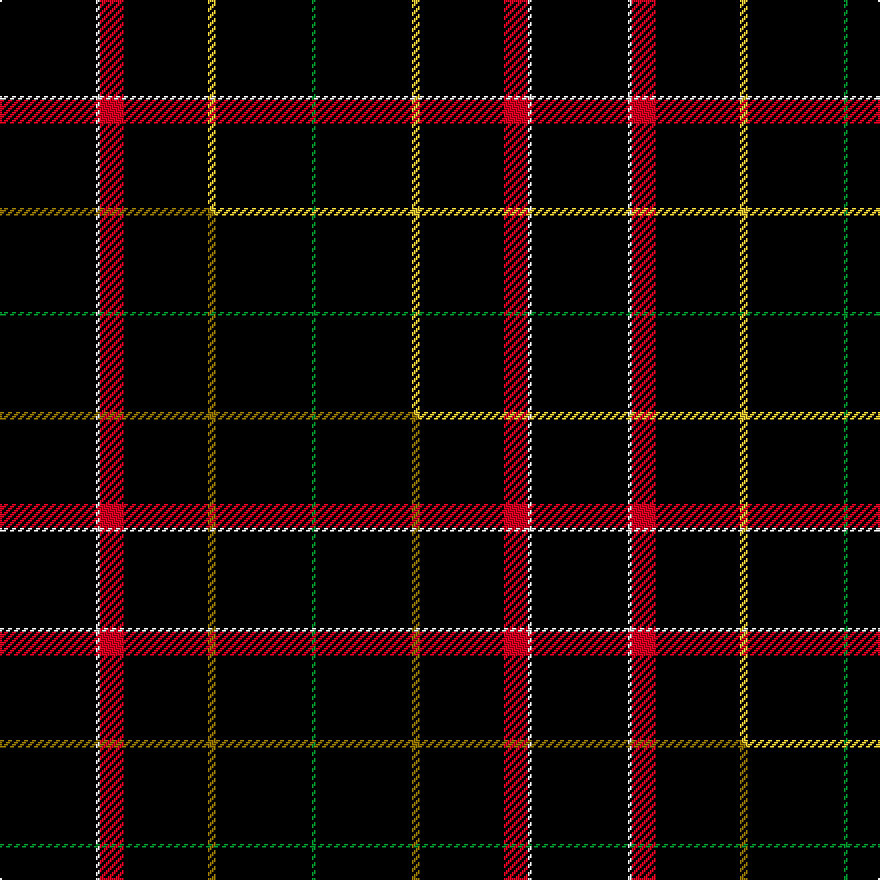

This page is one **sett** — a single exact thread-count. It belongs to the [tartan](/setts/k24w1r6k21ly2k24g1/)
(the same proportion at any scale), whose colour order is pattern [GKYKRWK](/stripes/gkykrwk/).

Part of the [Gourlay, George](/tartans/gourlay-george/) tartan — the named design grouping this sett with its other cloths.

Sourced from tartans-authority.  It is a [7 stripe tartan](/stripes/stripes7/).

Original link http://www.tartansauthority.com/tartan-ferret/display/10266/

## Register references

External register numbers recorded for this tartan.

- Scottish Register of Tartans: [10266](https://www.tartanregister.gov.uk/tartanDetails?ref=10266)
- Scottish Tartans Authority (ITI): 10266

## Thread count
K/48 W2 R12 K42 LY4 K48 G/2

One full sett is **266 threads**.

## Palette
<table><thead><tr><th>Colour</th><th>Shade</th><th>OKLCh</th></tr></thead><tbody><tr><td>LY</td><td><code style="background-color:#DCBC32;">#DCBC32</code> <small style="color:#888">#DCBC32</small></td><td><small style="color:#888">oklch(80.0% 0.150 95.2)</small></td></tr><tr><td>G</td><td><code style="background-color:#008B2A;">#008B2A</code> <small style="color:#888">#008B2A</small></td><td><small style="color:#888">oklch(55.4% 0.170 145.9)</small></td></tr><tr><td>K</td><td><code style="background-color:#000000;">#000000</code> <small style="color:#888">#000000</small></td><td><small style="color:#888">oklch(0.0% 0.000 0.0)</small></td></tr><tr><td>W</td><td><code style="background-color:#F7F7F7;">#F7F7F7</code> <small style="color:#888">#F7F7F7</small></td><td><small style="color:#888">oklch(97.6% 0.000 89.9)</small></td></tr><tr><td>R</td><td><code style="background-color:#D60020;">#D60020</code> <small style="color:#888">#D60020</small></td><td><small style="color:#888">oklch(55.2% 0.224 25.5)</small></td></tr></tbody></table>

# Sample pattern

## Compared to the master

This cloth is one sett of its design; the master sett (the exemplar the design is anchored on) is below for comparison.

Its **ΔTartan distance** from the master is **0.27** — the same measure the nearest-tartans table ranks by (0 is identical; a re-scale of the same cloth is near 0, a recolour or a different proportion further).

<figure class="master-compare" style="margin:0">

this sett
master sett ★

<figcaption style="color:#888;font-size:smaller">One weave of this sett against the <a href="/setts/k24w1r6k21y2k24g1/">master sett ★</a>, split on the diagonal: a shared proportion runs seamlessly across it with only the shades shifting; a different proportion breaks on it.</figcaption>
</figure>

## Nearest tartan variants

The nearest existing variants by ΔTartan distance, with this cloth at the top so the swatches line up against it.

ΔTartan

Threads

Variant

Sett

—

266

<a href="/variants/s7/k24w1r6k21ly2k24g1~x2/">Gourlay, George (Personal)</a>

<a href="/ttd/edit/#slug=k24w1r6k21y2k24g1~x2&amp;base=k24w1r6k21ly2k24g1~x2" title="compare in the TTD">0.00</a>

266

<a href="/variants/s7/k24w1r6k21y2k24g1~x2/">Gourlay, George (Personal)</a>

<a href="/ttd/edit/#slug=k36y5k1y1n5k12~x2&amp;base=k24w1r6k21ly2k24g1~x2" title="compare in the TTD">1.18</a>

144

<a href="/variants/s6/k36y5k1y1n5k12~x2/">Merola (2016)</a>

<a href="/ttd/edit/#slug=k8y1k1r1k4db1~x12&amp;base=k24w1r6k21ly2k24g1~x2" title="compare in the TTD">1.19</a>

276

<a href="/variants/s6/k8y1k1r1k4db1~x12/">Justus</a>

<a href="/ttd/edit/#slug=k4r4k20r1k20w4~x6&amp;base=k24w1r6k21ly2k24g1~x2" title="compare in the TTD">1.39</a>

588

<a href="/variants/s6/k4r4k20r1k20w4~x6/">Lanoir</a>

<a href="/ttd/edit/#slug=k40dg15k10o2k10lo2~x2&amp;base=k24w1r6k21ly2k24g1~x2" title="compare in the TTD">1.46</a>

232

<a href="/variants/s6/k40dg15k10o2k10lo2~x2/">Kalkofen (Name)</a>

<a href="/ttd/edit/#slug=k31r2k10db1k1w1~x4&amp;base=k24w1r6k21ly2k24g1~x2" title="compare in the TTD">1.48</a>

240

<a href="/variants/s6/k31r2k10db1k1w1~x4/">NewGeneration Alchemy (NGA) Inc</a>

<a href="/ttd/edit/#slug=k20db2k2db4dg4y2k40r2w3~x2&amp;base=k24w1r6k21ly2k24g1~x2" title="compare in the TTD">1.48</a>

270

<a href="/variants/s9/k20db2k2db4dg4y2k40r2w3~x2/">McCuaig (Glenelg and the Western Isles) Hunting</a>

<a href="/ttd/edit/#slug=k24g3r3k24r2k2r2&amp;base=k24w1r6k21ly2k24g1~x2" title="compare in the TTD">1.49</a>

94

<a href="/variants/s7/k24g3r3k24r2k2r2/">Unidentified #45</a>

<a href="/ttd/edit/#slug=k50db2k13w1k13db5g15r2~x2&amp;base=k24w1r6k21ly2k24g1~x2" title="compare in the TTD">1.70</a>

300

<a href="/variants/s8/k50db2k13w1k13db5g15r2~x2/">Center</a>

<a href="/ttd/edit/#slug=k50t2k13w1k13t5g15r2~x2&amp;base=k24w1r6k21ly2k24g1~x2" title="compare in the TTD">1.70</a>

300

<a href="/variants/s8/k50t2k13w1k13t5g15r2~x2/">Center (Name)</a>

## Neighbour map

Every grey dot is one of 13620 variants placed by the first two principal components of the ΔTartan feature space (42% of its variance). Red is this tartan; blue dots are its nearest — click one to open its page.

<svg viewBox="0 0 640 380" role="img" style="max-width:100%;height:auto;border:1px solid #e0e0e0;border-radius:4px;display:block" xmlns="http://www.w3.org/2000/svg"><image href="/nn/cloud.v1.png" width="640" height="380"/><a href="/variants/s7/k24w1r6k21y2k24g1~x2/"><circle cx="506.2" cy="124.1" r="4" fill="#3465a4"><title>Gourlay, George (Personal)</title></circle></a><a href="/variants/s6/k36y5k1y1n5k12~x2/"><circle cx="522.7" cy="121.8" r="4" fill="#3465a4"><title>Merola (2016)</title></circle></a><a href="/variants/s6/k8y1k1r1k4db1~x12/"><circle cx="449.2" cy="180.4" r="4" fill="#3465a4"><title>Justus</title></circle></a><a href="/variants/s6/k4r4k20r1k20w4~x6/"><circle cx="469.1" cy="155.2" r="4" fill="#3465a4"><title>Lanoir</title></circle></a><a href="/variants/s6/k40dg15k10o2k10lo2~x2/"><circle cx="456.7" cy="156.5" r="4" fill="#3465a4"><title>Kalkofen (Name)</title></circle></a><a href="/variants/s6/k31r2k10db1k1w1~x4/"><circle cx="604.7" cy="103.7" r="4" fill="#3465a4"><title>NewGeneration Alchemy (NGA) Inc</title></circle></a><a href="/variants/s9/k20db2k2db4dg4y2k40r2w3~x2/"><circle cx="417.1" cy="78.0" r="4" fill="#3465a4"><title>McCuaig (Glenelg and the Western Isles) Hunting</title></circle></a><a href="/variants/s7/k24g3r3k24r2k2r2/"><circle cx="491.3" cy="157.9" r="4" fill="#3465a4"><title>Unidentified #45</title></circle></a><a href="/variants/s8/k50db2k13w1k13db5g15r2~x2/"><circle cx="427.9" cy="74.4" r="4" fill="#3465a4"><title>Center</title></circle></a><a href="/variants/s8/k50t2k13w1k13t5g15r2~x2/"><circle cx="419.5" cy="72.6" r="4" fill="#3465a4"><title>Center (Name)</title></circle></a><circle cx="497.9" cy="121.9" r="5" fill="#c00000"/><text x="320" y="376" text-anchor="middle" font-size="11" fill="#999">ground</text><text x="11" y="190" text-anchor="middle" font-size="11" fill="#999" transform="rotate(-90 11 190)">complexity</text></svg>

ID: /variants/s7/k24w1r6k21ly2k24g1~x2/
