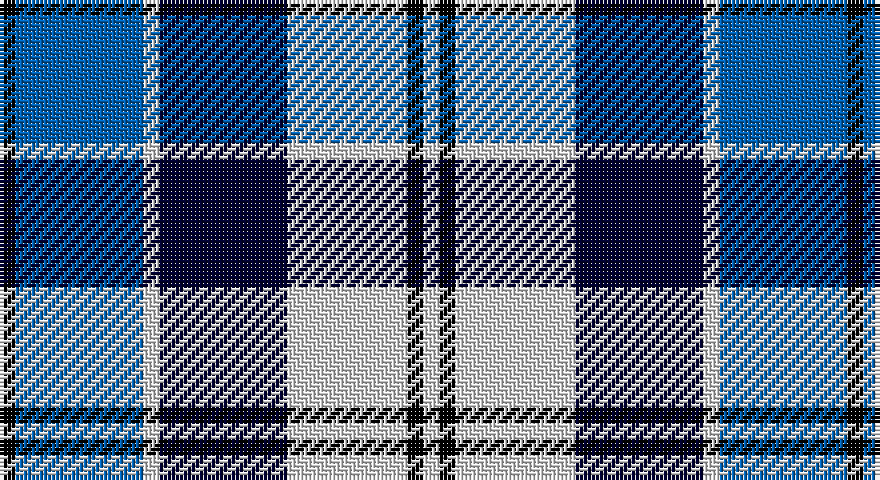

This page is one **sett** — a single exact thread-count. It belongs to the [tartan](/setts/k2b16w2ki16w15k2w2/)
(the same proportion at any scale), whose colour order is pattern [KBWKWKW](/stripes/kbwkwkw/).

Part of the [Strathclyde](/tartans/strathclyde/) tartan — the named design grouping this sett with its other cloths.

Sourced from weddslist.  It is a [7 stripe tartan](/stripes/stripes7/).

Original link http://www.weddslist.com/cgi-bin/tartans/pg.pl?source=sts

## Also known as

This cloth is also recorded under:

- Strathclyde blue

## Thread count
K/4 B32 LN4 DB32 LN30 K4 LN/4

One full sett is **212 threads**.

## Palette

Palette: <strong>Tartan Register</strong> <small style="color:#888">(2 of 4 colours)</small>
<table><thead><tr><th>Colour</th><th>Threads</th><th>Shade</th><th>Base</th><th>OKLCh</th></tr></thead><tbody><tr><td>K/</td><td style="text-align:right;font-variant-numeric:tabular-nums">4</td><td><code style="background-color:#000000;">#000000</code> <small style="color:#888">#000000</small></td><td>K <code style="background-color:#000000;">#000000</code></td><td><small style="color:#888">oklch(0.0% 0.000 0.0)</small></td></tr><tr><td>B</td><td style="text-align:right;font-variant-numeric:tabular-nums">32</td><td><code style="background-color:#0060B0;">#0060B0</code> <small style="color:#888">#0060B0</small></td><td>B <code style="background-color:#2A418A;">#2A418A</code></td><td><small style="color:#888">oklch(48.8% 0.148 252.5)</small></td></tr><tr><td>LN</td><td style="text-align:right;font-variant-numeric:tabular-nums">4</td><td><code style="background-color:#E0E0E0;">#E0E0E0</code> <small style="color:#888">#E0E0E0</small></td><td>W <code style="background-color:#F7F7F7;">#F7F7F7</code></td><td><small style="color:#888">oklch(90.7% 0.000 89.9)</small></td></tr><tr><td>DB</td><td style="text-align:right;font-variant-numeric:tabular-nums">32</td><td><code style="background-color:#000030;">#000030</code> <small style="color:#888">#000030</small></td><td>K <code style="background-color:#000000;">#000000</code></td><td><small style="color:#888">oklch(14.0% 0.097 264.1)</small></td></tr><tr><td>LN</td><td style="text-align:right;font-variant-numeric:tabular-nums">30</td><td><code style="background-color:#E0E0E0;">#E0E0E0</code> <small style="color:#888">#E0E0E0</small></td><td>W <code style="background-color:#F7F7F7;">#F7F7F7</code></td><td><small style="color:#888">oklch(90.7% 0.000 89.9)</small></td></tr><tr><td>K</td><td style="text-align:right;font-variant-numeric:tabular-nums">4</td><td><code style="background-color:#000000;">#000000</code> <small style="color:#888">#000000</small></td><td>K <code style="background-color:#000000;">#000000</code></td><td><small style="color:#888">oklch(0.0% 0.000 0.0)</small></td></tr><tr><td>LN/</td><td style="text-align:right;font-variant-numeric:tabular-nums">4</td><td><code style="background-color:#E0E0E0;">#E0E0E0</code> <small style="color:#888">#E0E0E0</small></td><td>W <code style="background-color:#F7F7F7;">#F7F7F7</code></td><td><small style="color:#888">oklch(90.7% 0.000 89.9)</small></td></tr></tbody></table>

# Sample pattern

## Compared to the master

This cloth is one sett of its design; the master sett (the exemplar the design is anchored on) is below for comparison.

<figure style="margin:0"><figcaption style="color:#888;font-size:smaller">this sett</figcaption></figure>
<figure style="margin:0"><figcaption style="color:#888;font-size:smaller"><a href="/setts/k4db2k15w10b15db2b4/">master sett →</a></figcaption></figure>

## Nearest tartans

The nearest existing variants by ΔTartan distance, with this tartan at the top so the swatches line up against it.

ΔTartan

Tartan

Sett

—

<a href="/ttd/edit/#slug=k2b16w2ki16w15k2w2~x2">Strathclyde</a> <a class="nn-out" href="/variants/s7/k2b16w2ki16w15k2w2~x2/" title="open its dictionary page">↗</a>

0.91

<a href="/ttd/edit/#slug=k4db2k15w10b15db2b4~x2&amp;base=k2b16w2ki16w15k2w2~x2">Strathclyde</a> <a class="nn-out" href="/variants/s7/k4db2k15w10b15db2b4~x2/" title="open its dictionary page">↗</a>

0.94

<a href="/ttd/edit/#slug=k4lo2k13lo1w8b13lo2b4~x2&amp;base=k2b16w2ki16w15k2w2~x2">Bannockbane Blue #1</a> <a class="nn-out" href="/variants/s8/k4lo2k13lo1w8b13lo2b4~x2/" title="open its dictionary page">↗</a>

0.95

<a href="/ttd/edit/#slug=dbi1g7dbi7db2w6dbi1w1~x4&amp;base=k2b16w2ki16w15k2w2~x2">Blue Boy, The (Fashion)</a> <a class="nn-out" href="/variants/s7/dbi1g7dbi7db2w6dbi1w1~x4/" title="open its dictionary page">↗</a>

1.02

<a href="/ttd/edit/#slug=k3lo1lb9lo1db9k3t1~x4&amp;base=k2b16w2ki16w15k2w2~x2">St. Francis Xavier University</a> <a class="nn-out" href="/variants/s7/k3lo1lb9lo1db9k3t1~x4/" title="open its dictionary page">↗</a>

1.04

<a href="/ttd/edit/#slug=r3db15w13o6db2o2r2~x2&amp;base=k2b16w2ki16w15k2w2~x2">Thom(p)son, Navy</a> <a class="nn-out" href="/variants/s7/r3db15w13o6db2o2r2~x2/" title="open its dictionary page">↗</a>

1.04

<a href="/ttd/edit/#slug=b1lb6db1b3k3b1~x8&amp;base=k2b16w2ki16w15k2w2~x2">Thompson (Dance)</a> <a class="nn-out" href="/variants/s6/b1lb6db1b3k3b1~x8/" title="open its dictionary page">↗</a>

1.12

<a href="/ttd/edit/#slug=b15k2w2k2w2k16lr22ly2~x4&amp;base=k2b16w2ki16w15k2w2~x2">Sneddon, Jonathan Taylor (Personal)</a> <a class="nn-out" href="/variants/s8/b15k2w2k2w2k16lr22ly2~x4/" title="open its dictionary page">↗</a>

1.22

<a href="/ttd/edit/#slug=dg4db22dt6w10db3w6dp4dt3w4~x2&amp;base=k2b16w2ki16w15k2w2~x2">Sibbald Blue (2014)</a> <a class="nn-out" href="/variants/s9/dg4db22dt6w10db3w6dp4dt3w4~x2/" title="open its dictionary page">↗</a>

1.27

<a href="/ttd/edit/#slug=b27w2b14k14lg4k4lg4k4lg27&amp;base=k2b16w2ki16w15k2w2~x2">(1) Abercrombie</a> <a class="nn-out" href="/variants/s9/b27w2b14k14lg4k4lg4k4lg27/" title="open its dictionary page">↗</a>

1.31

<a href="/ttd/edit/#slug=dg4db22dbi6w10db3w6dp4dbi3w4~x2&amp;base=k2b16w2ki16w15k2w2~x2">Sibbald Blue (2014)</a> <a class="nn-out" href="/variants/s9/dg4db22dbi6w10db3w6dp4dbi3w4~x2/" title="open its dictionary page">↗</a>

## Neighbour map

Every grey dot is one of 14360 variants placed by the first two principal components of the ΔTartan feature space (44% of its variance). Red is this tartan; blue dots are its nearest — click one to open its page.

<svg viewBox="0 0 640 380" role="img" style="max-width:100%;height:auto;border:1px solid #e0e0e0;border-radius:4px;display:block" xmlns="http://www.w3.org/2000/svg"><image href="/nn/cloud.v1.png" width="640" height="380"/><a href="/variants/s7/k4db2k15w10b15db2b4~x2/"><circle cx="129.3" cy="208.9" r="4" fill="#3465a4"><title>Strathclyde</title></circle></a><a href="/variants/s8/k4lo2k13lo1w8b13lo2b4~x2/"><circle cx="148.8" cy="173.3" r="4" fill="#3465a4"><title>Bannockbane Blue #1</title></circle></a><a href="/variants/s7/dbi1g7dbi7db2w6dbi1w1~x4/"><circle cx="115.9" cy="203.8" r="4" fill="#3465a4"><title>Blue Boy, The (Fashion)</title></circle></a><a href="/variants/s7/k3lo1lb9lo1db9k3t1~x4/"><circle cx="110.6" cy="169.7" r="4" fill="#3465a4"><title>St. Francis Xavier University</title></circle></a><a href="/variants/s7/r3db15w13o6db2o2r2~x2/"><circle cx="151.2" cy="190.0" r="4" fill="#3465a4"><title>Thom(p)son, Navy</title></circle></a><a href="/variants/s6/b1lb6db1b3k3b1~x8/"><circle cx="134.2" cy="216.0" r="4" fill="#3465a4"><title>Thompson (Dance)</title></circle></a><a href="/variants/s8/b15k2w2k2w2k16lr22ly2~x4/"><circle cx="134.4" cy="148.3" r="4" fill="#3465a4"><title>Sneddon, Jonathan Taylor (Personal)</title></circle></a><a href="/variants/s9/dg4db22dt6w10db3w6dp4dt3w4~x2/"><circle cx="122.9" cy="166.1" r="4" fill="#3465a4"><title>Sibbald Blue (2014)</title></circle></a><a href="/variants/s9/b27w2b14k14lg4k4lg4k4lg27/"><circle cx="184.0" cy="160.4" r="4" fill="#3465a4"><title>(1) Abercrombie</title></circle></a><a href="/variants/s9/dg4db22dbi6w10db3w6dp4dbi3w4~x2/"><circle cx="125.3" cy="164.7" r="4" fill="#3465a4"><title>Sibbald Blue (2014)</title></circle></a><circle cx="128.7" cy="189.2" r="5" fill="#c00000"/></svg>

ID: /variants/s7/k2b16w2ki16w15k2w2~x2/
