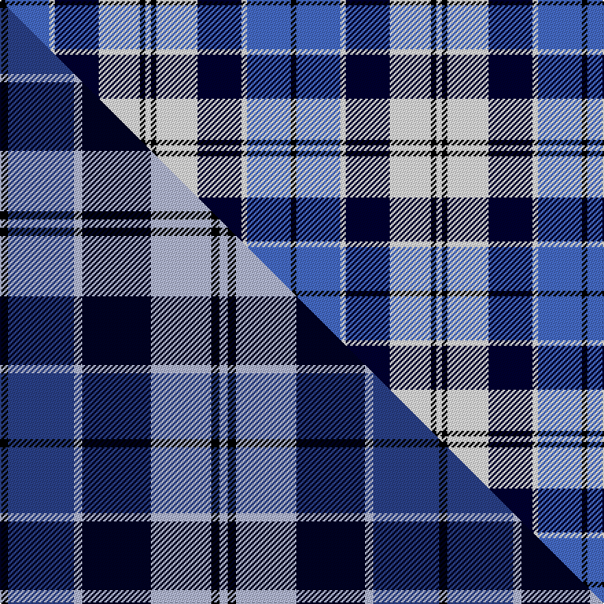

This page is one **sett** — a single exact thread-count. It belongs to the [tartan](/setts/k2b16w2ki16w15k2w2/)
(the same proportion at any scale), whose colour order is pattern [KBWKWKW](/stripes/kbwkwkw/).

Part of the [Strathclyde](/tartans/strathclyde/) tartan — the named design grouping this sett with its other cloths.

Sourced from weddslist.  It is a [7 stripe tartan](/stripes/stripes7/).

Original link http://www.weddslist.com/cgi-bin/tartans/pg.pl?source=sts

## Thread count
K/4 B32 W4 Ki32 W30 K4 W/4

One full sett is **212 threads**.

## Palette
<table><thead><tr><th>Colour</th><th>Shade</th><th>OKLCh</th></tr></thead><tbody><tr><td>B</td><td><code style="background-color:#466CC8;">#466CC8</code> <small style="color:#888">#466CC8</small></td><td><small style="color:#888">oklch(55.1% 0.149 265.0)</small></td></tr><tr><td>K</td><td><code style="background-color:#000030;">#000030</code> <small style="color:#888">#000030</small></td><td><small style="color:#888">oklch(14.0% 0.097 264.1)</small></td></tr><tr><td>K</td><td><code style="background-color:#000000;">#000000</code> <small style="color:#888">#000000</small></td><td><small style="color:#888">oklch(0.0% 0.000 0.0)</small></td></tr><tr><td>W</td><td><code style="background-color:#F7F7F7;">#F7F7F7</code> <small style="color:#888">#F7F7F7</small></td><td><small style="color:#888">oklch(97.6% 0.000 89.9)</small></td></tr></tbody></table>

# Sample pattern

## Compared to the master

This cloth is one sett of its design; the master sett (the exemplar the design is anchored on) is below for comparison.

Its **ΔTartan distance** from the master is **0.95** — the same measure the nearest-tartans table ranks by (0 is identical; a re-scale of the same cloth is near 0, a recolour or a different proportion further).

<figure class="master-compare" style="margin:0">

this sett
master sett ★

<figcaption style="color:#888;font-size:smaller">One weave of this sett against the <a href="/setts/k3db24lb3ki25lb22k3lb3/">master sett ★</a>, split on the diagonal: a shared proportion runs seamlessly across it with only the shades shifting; a different proportion breaks on it.</figcaption>
</figure>

## Nearest tartan variants

The nearest existing variants by ΔTartan distance, with this cloth at the top so the swatches line up against it.

ΔTartan

Threads

Variant

Sett

—

212

<a href="/variants/s7/k2b16w2ki16w15k2w2~x2~ki0604259/">Strathclyde</a>

<a href="/ttd/edit/#slug=k2lb16w2db16w15k2w2~x2&amp;base=k2b16w2ki16w15k2w2~x2~ki0604259" title="compare in the TTD">0.00</a>

212

<a href="/variants/s7/k2lb16w2db16w15k2w2~x2/">Strathclyde 1975 (District)</a>

<a href="/ttd/edit/#slug=k3w25g16w3db25w3~x2&amp;base=k2b16w2ki16w15k2w2~x2~ki0604259" title="compare in the TTD">2.24</a>

288

<a href="/variants/s6/k3w25g16w3db25w3~x2/">Birnham, Blue (Dance)</a>

2.56

—

<a href="/variants/s10/lbi4dr2db14k4lbi4k3lbi3k2dr2lb2~x2~lbi3200000-lb3103284/">Naysmith, William A (Personal)</a>

<a href="/ttd/edit/#slug=k1dbi6lb1db6lb6k1w1~x6~dbi1406275-db1404245&amp;base=k2b16w2ki16w15k2w2~x2~ki0604259" title="compare in the TTD">2.67</a>

252

<a href="/variants/s7/k1dbi6lb1db6lb6k1w1~x6~dbi1406275-db1404245/">Mary Washington</a>

## Neighbour map

Every grey dot is one of 13620 variants placed by the first two principal components of the ΔTartan feature space (42% of its variance). Red is this tartan; blue dots are its nearest — click one to open its page.

<svg viewBox="0 0 640 380" role="img" style="max-width:100%;height:auto;border:1px solid #e0e0e0;border-radius:4px;display:block" xmlns="http://www.w3.org/2000/svg"><image href="/nn/cloud.v1.png" width="640" height="380"/><a href="/variants/s7/k2lb16w2db16w15k2w2~x2/"><circle cx="137.4" cy="198.8" r="4" fill="#3465a4"><title>Strathclyde 1975 (District)</title></circle></a><a href="/variants/s6/k3w25g16w3db25w3~x2/"><circle cx="166.9" cy="209.9" r="4" fill="#3465a4"><title>Birnham, Blue (Dance)</title></circle></a><a href="/variants/s10/lbi4dr2db14k4lbi4k3lbi3k2dr2lb2~x2~lbi3200000-lb3103284/"><circle cx="98.8" cy="171.3" r="4" fill="#3465a4"><title>Naysmith, William A (Personal)</title></circle></a><a href="/variants/s7/k1dbi6lb1db6lb6k1w1~x6~dbi1406275-db1404245/"><circle cx="101.1" cy="204.8" r="4" fill="#3465a4"><title>Mary Washington</title></circle></a><circle cx="127.4" cy="193.4" r="5" fill="#c00000"/><text x="320" y="376" text-anchor="middle" font-size="11" fill="#999">ground</text><text x="11" y="190" text-anchor="middle" font-size="11" fill="#999" transform="rotate(-90 11 190)">complexity</text></svg>

ID: /variants/s7/k2b16w2ki16w15k2w2~x2~ki0604259/
