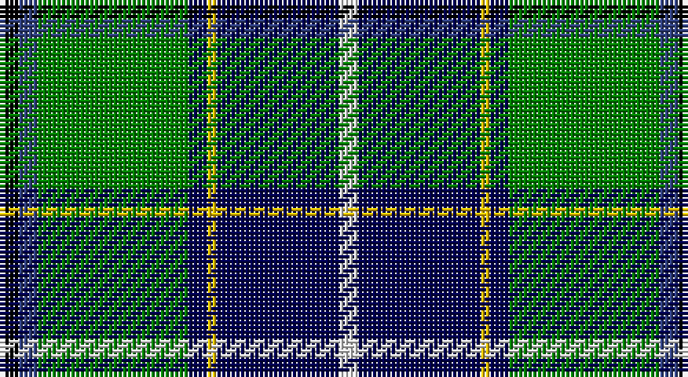

This page is one **sett** — a single exact thread-count. It belongs to the [tartan](/setts/k2db2g16dbi2ly1dbi13w2/)
(the same proportion at any scale), whose colour order is pattern [KBGBYBW](/stripes/kbgbybw/).

Part of the [Wishart, hunting](/tartans/wishart-hunting/) tartan — the named design grouping this sett with its other cloths.

Sourced from weddslist.  It is a [7 stripe tartan](/stripes/stripes7/).

Original link http://www.weddslist.com/cgi-bin/tartans/pg.pl?source=sts

## Also known as

This cloth is also recorded under:

- Wishart Htg
- Wishart Hunting

## Thread count
K/4 B4 G32 DB4 Y2 DB26 LN/4

One full sett is **144 threads**.

## Palette

Palette: <strong>Tartan Register</strong> <small style="color:#888">(2 of 6 colours)</small>
<table><thead><tr><th>Colour</th><th>Threads</th><th>Shade</th><th>Base</th><th>OKLCh</th></tr></thead><tbody><tr><td>K/</td><td style="text-align:right;font-variant-numeric:tabular-nums">4</td><td><code style="background-color:#000000;">#000000</code> <small style="color:#888">#000000</small></td><td>K <code style="background-color:#000000;">#000000</code></td><td><small style="color:#888">oklch(0.0% 0.000 0.0)</small></td></tr><tr><td>B</td><td style="text-align:right;font-variant-numeric:tabular-nums">4</td><td><code style="background-color:#304080;">#304080</code> <small style="color:#888">#304080</small></td><td>B <code style="background-color:#2A418A;">#2A418A</code></td><td><small style="color:#888">oklch(39.4% 0.109 270.2)</small></td></tr><tr><td>G</td><td style="text-align:right;font-variant-numeric:tabular-nums">32</td><td><code style="background-color:#008000;">#008000</code> <small style="color:#888">#008000</small></td><td>G <code style="background-color:#006100;">#006100</code></td><td><small style="color:#888">oklch(52.0% 0.177 142.5)</small></td></tr><tr><td>DB</td><td style="text-align:right;font-variant-numeric:tabular-nums">4</td><td><code style="background-color:#000050;">#000050</code> <small style="color:#888">#000050</small></td><td>B <code style="background-color:#2A418A;">#2A418A</code></td><td><small style="color:#888">oklch(19.5% 0.135 264.1)</small></td></tr><tr><td>Y</td><td style="text-align:right;font-variant-numeric:tabular-nums">2</td><td><code style="background-color:#F0C000;">#F0C000</code> <small style="color:#888">#F0C000</small></td><td>Y <code style="background-color:#F2BF00;">#F2BF00</code></td><td><small style="color:#888">oklch(82.7% 0.169 90.5)</small></td></tr><tr><td>DB</td><td style="text-align:right;font-variant-numeric:tabular-nums">26</td><td><code style="background-color:#000050;">#000050</code> <small style="color:#888">#000050</small></td><td>B <code style="background-color:#2A418A;">#2A418A</code></td><td><small style="color:#888">oklch(19.5% 0.135 264.1)</small></td></tr><tr><td>LN/</td><td style="text-align:right;font-variant-numeric:tabular-nums">4</td><td><code style="background-color:#E0E0E0;">#E0E0E0</code> <small style="color:#888">#E0E0E0</small></td><td>W <code style="background-color:#F7F7F7;">#F7F7F7</code></td><td><small style="color:#888">oklch(90.7% 0.000 89.9)</small></td></tr></tbody></table>

# Sample pattern

## Nearest tartans

The nearest existing variants by ΔTartan distance, with this tartan at the top so the swatches line up against it.

ΔTartan

Tartan

Sett

—

<a href="/ttd/edit/#slug=k2db2g16dbi2ly1dbi13w2~x2">Wishart, hunting</a> <a class="nn-out" href="/variants/s7/k2db2g16dbi2ly1dbi13w2~x2/" title="open its dictionary page">↗</a>

1.05

<a href="/ttd/edit/#slug=t6db17p4db2k11g33ly4~x2&amp;base=k2db2g16dbi2ly1dbi13w2~x2">East Lothian</a> <a class="nn-out" href="/variants/s7/t6db17p4db2k11g33ly4~x2/" title="open its dictionary page">↗</a>

1.08

<a href="/ttd/edit/#slug=k2dbi2g16db2ly1db13w2~x2&amp;base=k2db2g16dbi2ly1dbi13w2~x2">Wishart Hunting Family Tartan</a> <a class="nn-out" href="/variants/s7/k2dbi2g16db2ly1db13w2~x2/" title="open its dictionary page">↗</a>

1.14

<a href="/ttd/edit/#slug=g5ly1r2g25k14db19w4g2~x2&amp;base=k2db2g16dbi2ly1dbi13w2~x2">Tooth</a> <a class="nn-out" href="/variants/s8/g5ly1r2g25k14db19w4g2~x2/" title="open its dictionary page">↗</a>

1.17

<a href="/ttd/edit/#slug=db3r2db22k11g24lp2g3~x2&amp;base=k2db2g16dbi2ly1dbi13w2~x2">MacThomas</a> <a class="nn-out" href="/variants/s7/db3r2db22k11g24lp2g3~x2/" title="open its dictionary page">↗</a>

1.21

<a href="/ttd/edit/#slug=db6r4db24lb3k6g18lo4g2lo2g4~x2&amp;base=k2db2g16dbi2ly1dbi13w2~x2">Greene</a> <a class="nn-out" href="/variants/s10/db6r4db24lb3k6g18lo4g2lo2g4~x2/" title="open its dictionary page">↗</a>

1.27

<a href="/ttd/edit/#slug=g3dp2g25k6r2k6t20k1lb2~x2&amp;base=k2db2g16dbi2ly1dbi13w2~x2">Birch (Name)</a> <a class="nn-out" href="/variants/s9/g3dp2g25k6r2k6t20k1lb2~x2/" title="open its dictionary page">↗</a>

1.28

<a href="/ttd/edit/#slug=w3r3db16g32t3k3ly2~x2&amp;base=k2db2g16dbi2ly1dbi13w2~x2">Washington State</a> <a class="nn-out" href="/variants/s7/w3r3db16g32t3k3ly2~x2/" title="open its dictionary page">↗</a>

1.29

<a href="/ttd/edit/#slug=w2db20dg2g2dg2g4dg8ly2r1~x2&amp;base=k2db2g16dbi2ly1dbi13w2~x2">Nova Scotia</a> <a class="nn-out" href="/variants/s9/w2db20dg2g2dg2g4dg8ly2r1~x2/" title="open its dictionary page">↗</a>

1.31

<a href="/ttd/edit/#slug=db24k8g8r2g8k1w2~x2&amp;base=k2db2g16dbi2ly1dbi13w2~x2">Ferguson of Athol</a> <a class="nn-out" href="/variants/s7/db24k8g8r2g8k1w2~x2/" title="open its dictionary page">↗</a>

1.32

<a href="/ttd/edit/#slug=db24k8g8r2g8k1ly2~x2&amp;base=k2db2g16dbi2ly1dbi13w2~x2">MacLaren</a> <a class="nn-out" href="/variants/s7/db24k8g8r2g8k1ly2~x2/" title="open its dictionary page">↗</a>

## Neighbour map

Every grey dot is one of 14360 variants placed by the first two principal components of the ΔTartan feature space (44% of its variance). Red is this tartan; blue dots are its nearest — click one to open its page.

<svg viewBox="0 0 640 380" role="img" style="max-width:100%;height:auto;border:1px solid #e0e0e0;border-radius:4px;display:block" xmlns="http://www.w3.org/2000/svg"><image href="/nn/cloud.v1.png" width="640" height="380"/><a href="/variants/s7/t6db17p4db2k11g33ly4~x2/"><circle cx="170.3" cy="145.3" r="4" fill="#3465a4"><title>East Lothian</title></circle></a><a href="/variants/s7/k2dbi2g16db2ly1db13w2~x2/"><circle cx="223.7" cy="150.6" r="4" fill="#3465a4"><title>Wishart Hunting Family Tartan</title></circle></a><a href="/variants/s8/g5ly1r2g25k14db19w4g2~x2/"><circle cx="193.9" cy="121.3" r="4" fill="#3465a4"><title>Tooth</title></circle></a><a href="/variants/s7/db3r2db22k11g24lp2g3~x2/"><circle cx="195.0" cy="177.1" r="4" fill="#3465a4"><title>MacThomas</title></circle></a><a href="/variants/s10/db6r4db24lb3k6g18lo4g2lo2g4~x2/"><circle cx="154.2" cy="139.2" r="4" fill="#3465a4"><title>Greene</title></circle></a><a href="/variants/s9/g3dp2g25k6r2k6t20k1lb2~x2/"><circle cx="193.0" cy="102.5" r="4" fill="#3465a4"><title>Birch (Name)</title></circle></a><a href="/variants/s7/w3r3db16g32t3k3ly2~x2/"><circle cx="224.6" cy="119.1" r="4" fill="#3465a4"><title>Washington State</title></circle></a><a href="/variants/s9/w2db20dg2g2dg2g4dg8ly2r1~x2/"><circle cx="231.2" cy="115.7" r="4" fill="#3465a4"><title>Nova Scotia</title></circle></a><a href="/variants/s7/db24k8g8r2g8k1w2~x2/"><circle cx="234.4" cy="147.2" r="4" fill="#3465a4"><title>Ferguson of Athol</title></circle></a><a href="/variants/s7/db24k8g8r2g8k1ly2~x2/"><circle cx="236.1" cy="147.8" r="4" fill="#3465a4"><title>MacLaren</title></circle></a><circle cx="194.0" cy="139.7" r="5" fill="#c00000"/></svg>

ID: /variants/s7/k2db2g16dbi2ly1dbi13w2~x2/
