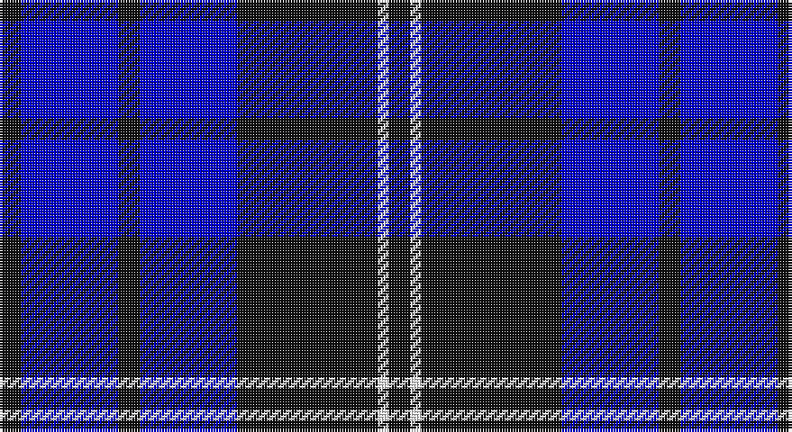

This page is one **sett** — a single exact thread-count. It belongs to the [tartan](/setts/k2db9k2db9k13w1k2/)
(the same proportion at any scale), whose colour order is pattern [KBKBKWK](/stripes/kbkbkwk/).

Sourced from register-of-tartans.  It is a [7 stripe tartan](/stripes/stripes7/).

Original link https://www.tartanregister.gov.uk/tartanDetails.aspx?ref=11382

## Register references

External register numbers recorded for this tartan.

- Scottish Register of Tartans: [11382](https://www.tartanregister.gov.uk/tartanDetails.aspx?ref=11382)

## Thread count
K/8 B36 K8 B36 K52 W4 K/8

One full sett is **288 threads**.

## Palette

Palette: <strong>Tartan Register</strong>
<table><thead><tr><th>Colour</th><th>Threads</th><th>Shade</th><th>Base</th><th>OKLCh</th></tr></thead><tbody><tr><td>K/</td><td style="text-align:right;font-variant-numeric:tabular-nums">8</td><td><code style="background-color:#101010;">#101010</code> <small style="color:#888">#101010</small></td><td>K <code style="background-color:#000000;">#000000</code></td><td><small style="color:#888">oklch(17.3% 0.000 89.9)</small></td></tr><tr><td>B</td><td style="text-align:right;font-variant-numeric:tabular-nums">36</td><td><code style="background-color:#0000CD;">#0000CD</code> <small style="color:#888">#0000CD</small></td><td>B <code style="background-color:#2A418A;">#2A418A</code></td><td><small style="color:#888">oklch(38.3% 0.266 264.1)</small></td></tr><tr><td>K</td><td style="text-align:right;font-variant-numeric:tabular-nums">8</td><td><code style="background-color:#101010;">#101010</code> <small style="color:#888">#101010</small></td><td>K <code style="background-color:#000000;">#000000</code></td><td><small style="color:#888">oklch(17.3% 0.000 89.9)</small></td></tr><tr><td>B</td><td style="text-align:right;font-variant-numeric:tabular-nums">36</td><td><code style="background-color:#0000CD;">#0000CD</code> <small style="color:#888">#0000CD</small></td><td>B <code style="background-color:#2A418A;">#2A418A</code></td><td><small style="color:#888">oklch(38.3% 0.266 264.1)</small></td></tr><tr><td>K</td><td style="text-align:right;font-variant-numeric:tabular-nums">52</td><td><code style="background-color:#101010;">#101010</code> <small style="color:#888">#101010</small></td><td>K <code style="background-color:#000000;">#000000</code></td><td><small style="color:#888">oklch(17.3% 0.000 89.9)</small></td></tr><tr><td>W</td><td style="text-align:right;font-variant-numeric:tabular-nums">4</td><td><code style="background-color:#FFFFFF;">#FFFFFF</code> <small style="color:#888">#FFFFFF</small></td><td>W <code style="background-color:#F7F7F7;">#F7F7F7</code></td><td><small style="color:#888">oklch(100.0% 0.000 89.9)</small></td></tr><tr><td>K/</td><td style="text-align:right;font-variant-numeric:tabular-nums">8</td><td><code style="background-color:#101010;">#101010</code> <small style="color:#888">#101010</small></td><td>K <code style="background-color:#000000;">#000000</code></td><td><small style="color:#888">oklch(17.3% 0.000 89.9)</small></td></tr></tbody></table>

# Sample pattern

## Nearest tartans

The nearest existing variants by ΔTartan distance, with this tartan at the top so the swatches line up against it.

ΔTartan

Tartan

Sett

—

<a href="/ttd/edit/#slug=k2db9k2db9k13w1k2~x4">Swan 2015, Brian E (Personal)</a> <a class="nn-out" href="/variants/s7/k2db9k2db9k13w1k2~x4/" title="open its dictionary page">↗</a>

0.91

<a href="/ttd/edit/#slug=k6db17k6db17k27w3~x2&amp;base=k2db9k2db9k13w1k2~x4">Swan, Brian E</a> <a class="nn-out" href="/variants/s6/k6db17k6db17k27w3~x2/" title="open its dictionary page">↗</a>

0.99

<a href="/ttd/edit/#slug=k33db8k4db35p3~x2&amp;base=k2db9k2db9k13w1k2~x4">Fenston/Morris (Personal)</a> <a class="nn-out" href="/variants/s5/k33db8k4db35p3~x2/" title="open its dictionary page">↗</a>

1.35

<a href="/ttd/edit/#slug=k3lb2k18db18k2db3~x4&amp;base=k2db9k2db9k13w1k2~x4">Swan</a> <a class="nn-out" href="/variants/s6/k3lb2k18db18k2db3~x4/" title="open its dictionary page">↗</a>

1.57

<a href="/ttd/edit/#slug=db52k28w5k3w2k10&amp;base=k2db9k2db9k13w1k2~x4">St Andrews, Earl of</a> <a class="nn-out" href="/variants/s6/db52k28w5k3w2k10/" title="open its dictionary page">↗</a>

1.58

<a href="/ttd/edit/#slug=db24t13db4t4w2~x2&amp;base=k2db9k2db9k13w1k2~x4">Gallaecia (Unofficial) (District)</a> <a class="nn-out" href="/variants/s5/db24t13db4t4w2~x2/" title="open its dictionary page">↗</a>

1.60

<a href="/ttd/edit/#slug=r4k21w2k20db21k2db2~x2&amp;base=k2db9k2db9k13w1k2~x4">St. Georges, Edgbaston</a> <a class="nn-out" href="/variants/s7/r4k21w2k20db21k2db2~x2/" title="open its dictionary page">↗</a>

1.60

<a href="/ttd/edit/#slug=db5w3db33k3db3k36db3~x2&amp;base=k2db9k2db9k13w1k2~x4">Argentina</a> <a class="nn-out" href="/variants/s7/db5w3db33k3db3k36db3~x2/" title="open its dictionary page">↗</a>

1.64

<a href="/ttd/edit/#slug=k10n10k60w9k7n36w6k6&amp;base=k2db9k2db9k13w1k2~x4">Salem Scottish Dancer's Wee Bluet</a> <a class="nn-out" href="/variants/s8/k10n10k60w9k7n36w6k6/" title="open its dictionary page">↗</a>

1.71

<a href="/ttd/edit/#slug=k1lo2k3db12k18w1~x2&amp;base=k2db9k2db9k13w1k2~x4">Jon's Theme (Fashion)</a> <a class="nn-out" href="/variants/s6/k1lo2k3db12k18w1~x2/" title="open its dictionary page">↗</a>

1.74

<a href="/ttd/edit/#slug=db30dbi2k9w3db6w4k3dbi6~x2&amp;base=k2db9k2db9k13w1k2~x4">Auto Docs</a> <a class="nn-out" href="/variants/s8/db30dbi2k9w3db6w4k3dbi6~x2/" title="open its dictionary page">↗</a>

## Neighbour map

Every grey dot is one of 14360 variants placed by the first two principal components of the ΔTartan feature space (44% of its variance). Red is this tartan; blue dots are its nearest — click one to open its page.

<svg viewBox="0 0 640 380" role="img" style="max-width:100%;height:auto;border:1px solid #e0e0e0;border-radius:4px;display:block" xmlns="http://www.w3.org/2000/svg"><image href="/nn/cloud.v1.png" width="640" height="380"/><a href="/variants/s6/k6db17k6db17k27w3~x2/"><circle cx="291.5" cy="259.5" r="4" fill="#3465a4"><title>Swan, Brian E</title></circle></a><a href="/variants/s5/k33db8k4db35p3~x2/"><circle cx="346.7" cy="251.0" r="4" fill="#3465a4"><title>Fenston/Morris (Personal)</title></circle></a><a href="/variants/s6/k3lb2k18db18k2db3~x4/"><circle cx="298.4" cy="230.8" r="4" fill="#3465a4"><title>Swan</title></circle></a><a href="/variants/s6/db52k28w5k3w2k10/"><circle cx="368.9" cy="189.4" r="4" fill="#3465a4"><title>St Andrews, Earl of</title></circle></a><a href="/variants/s5/db24t13db4t4w2~x2/"><circle cx="365.3" cy="235.6" r="4" fill="#3465a4"><title>Gallaecia (Unofficial) (District)</title></circle></a><a href="/variants/s7/r4k21w2k20db21k2db2~x2/"><circle cx="347.6" cy="223.2" r="4" fill="#3465a4"><title>St. Georges, Edgbaston</title></circle></a><a href="/variants/s7/db5w3db33k3db3k36db3~x2/"><circle cx="379.3" cy="225.0" r="4" fill="#3465a4"><title>Argentina</title></circle></a><a href="/variants/s8/k10n10k60w9k7n36w6k6/"><circle cx="315.8" cy="204.4" r="4" fill="#3465a4"><title>Salem Scottish Dancer's Wee Bluet</title></circle></a><a href="/variants/s6/k1lo2k3db12k18w1~x2/"><circle cx="373.9" cy="194.9" r="4" fill="#3465a4"><title>Jon's Theme (Fashion)</title></circle></a><a href="/variants/s8/db30dbi2k9w3db6w4k3dbi6~x2/"><circle cx="301.0" cy="170.0" r="4" fill="#3465a4"><title>Auto Docs</title></circle></a><circle cx="322.4" cy="230.3" r="5" fill="#c00000"/></svg>

ID: /variants/s7/k2db9k2db9k13w1k2~x4/
