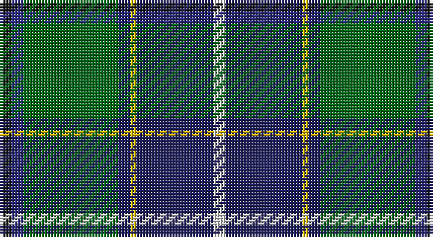

This page is one **sett** — a single exact thread-count. It belongs to the [tartan](/setts/k2dbi2g16db2ly1db13w2/)
(the same proportion at any scale), whose colour order is pattern [KBGBYBW](/stripes/kbgbybw/).

Part of the [Wishart, hunting](/tartans/wishart-hunting/) tartan — the named design grouping this sett with its other cloths.

Sourced from house-of-tartan.  It is a [7 stripe tartan](/stripes/stripes7/).

Original link http://www.house-of-tartan.scotland.net/house/TartanViewjs.asp?colr=Def&tnam=2104

## Provenance

Earliest known date: 1990 The Wisharts of Pittarrow and Logie Wishart were a lowland family dating from around the 12th Century. The family's origins are unknown, but the name Guiscard, Wiscard, Wishart, meaning 'cunning' is Norman-French. We have also sought to associate the Wishart tartan with that of another family by virtue of the marriage of a Sir John Wishart to Jean, daughter of William Douglas, 9th Earl of Angus in the 16th Century. The Wishart tartan combines the Wallace and Douglas tartans, in an original new sett which was designed by Dr David Wishart with the assistance of the Scottish College of Textiles in Galashiels. (D. Wishart, 1990)

## Also known as

This cloth is also recorded under:

- Wishart Htg
- Wishart Hunting

## Thread count
K/4 DB4 G32 DBa4 Y2 DBa26 LN/4

One full sett is **144 threads**.

## Palette

Palette: <strong>Tartan Register</strong>
<table><thead><tr><th>Colour</th><th>Threads</th><th>Shade</th><th>Base</th><th>OKLCh</th></tr></thead><tbody><tr><td>K/</td><td style="text-align:right;font-variant-numeric:tabular-nums">4</td><td><code style="background-color:#101010;">#101010</code> <small style="color:#888">#101010</small></td><td>K <code style="background-color:#000000;">#000000</code></td><td><small style="color:#888">oklch(17.3% 0.000 89.9)</small></td></tr><tr><td>DB</td><td style="text-align:right;font-variant-numeric:tabular-nums">4</td><td><code style="background-color:#2C2C80;">#2C2C80</code> <small style="color:#888">#2C2C80</small></td><td>B <code style="background-color:#2A418A;">#2A418A</code></td><td><small style="color:#888">oklch(35.0% 0.138 276.6)</small></td></tr><tr><td>G</td><td style="text-align:right;font-variant-numeric:tabular-nums">32</td><td><code style="background-color:#006818;">#006818</code> <small style="color:#888">#006818</small></td><td>G <code style="background-color:#006100;">#006100</code></td><td><small style="color:#888">oklch(45.0% 0.142 145.0)</small></td></tr><tr><td>DBa</td><td style="text-align:right;font-variant-numeric:tabular-nums">4</td><td><code style="background-color:#202060;">#202060</code> <small style="color:#888">#202060</small></td><td>B <code style="background-color:#2A418A;">#2A418A</code></td><td><small style="color:#888">oklch(28.9% 0.111 276.9)</small></td></tr><tr><td>Y</td><td style="text-align:right;font-variant-numeric:tabular-nums">2</td><td><code style="background-color:#E8C000;">#E8C000</code> <small style="color:#888">#E8C000</small></td><td>Y <code style="background-color:#F2BF00;">#F2BF00</code></td><td><small style="color:#888">oklch(81.9% 0.168 93.7)</small></td></tr><tr><td>DBa</td><td style="text-align:right;font-variant-numeric:tabular-nums">26</td><td><code style="background-color:#202060;">#202060</code> <small style="color:#888">#202060</small></td><td>B <code style="background-color:#2A418A;">#2A418A</code></td><td><small style="color:#888">oklch(28.9% 0.111 276.9)</small></td></tr><tr><td>LN/</td><td style="text-align:right;font-variant-numeric:tabular-nums">4</td><td><code style="background-color:#E0E0E0;">#E0E0E0</code> <small style="color:#888">#E0E0E0</small></td><td>W <code style="background-color:#F7F7F7;">#F7F7F7</code></td><td><small style="color:#888">oklch(90.7% 0.000 89.9)</small></td></tr></tbody></table>

# Sample pattern

## Compared to the master

This cloth is one sett of its design; the master sett (the exemplar the design is anchored on) is below for comparison.

<figure style="margin:0"><figcaption style="color:#888;font-size:smaller">this sett</figcaption></figure>
<figure style="margin:0"><figcaption style="color:#888;font-size:smaller"><a href="/setts/k2db2g16dbi2ly1dbi13w2/">master sett →</a></figcaption></figure>

## Nearest tartans

The nearest existing variants by ΔTartan distance, with this tartan at the top so the swatches line up against it.

ΔTartan

Tartan

Sett

—

<a href="/ttd/edit/#slug=k2dbi2g16db2ly1db13w2~x2">Wishart Hunting Family Tartan</a> <a class="nn-out" href="/variants/s7/k2dbi2g16db2ly1db13w2~x2/" title="open its dictionary page">↗</a>

0.80

<a href="/ttd/edit/#slug=w1dt16lo1r3lo1dg6y2dg6w1~x2&amp;base=k2dbi2g16db2ly1db13w2~x2">Kleto, Susan (Personal)</a> <a class="nn-out" href="/variants/s9/w1dt16lo1r3lo1dg6y2dg6w1~x2/" title="open its dictionary page">↗</a>

0.90

<a href="/ttd/edit/#slug=r4g14k3lp3g12db36w4~x2&amp;base=k2dbi2g16db2ly1db13w2~x2">Vipont</a> <a class="nn-out" href="/variants/s7/r4g14k3lp3g12db36w4~x2/" title="open its dictionary page">↗</a>

0.92

<a href="/ttd/edit/#slug=w2db20dg2g2dg2g4dg8ly2r1~x2&amp;base=k2dbi2g16db2ly1db13w2~x2">Nova Scotia</a> <a class="nn-out" href="/variants/s9/w2db20dg2g2dg2g4dg8ly2r1~x2/" title="open its dictionary page">↗</a>

0.95

<a href="/ttd/edit/#slug=g4r2g20db8k8db4lb1lo2k1~x2&amp;base=k2dbi2g16db2ly1db13w2~x2">Dodd of Branford</a> <a class="nn-out" href="/variants/s9/g4r2g20db8k8db4lb1lo2k1~x2/" title="open its dictionary page">↗</a>

0.97

<a href="/ttd/edit/#slug=lo2dg20db8dp3db2dp2db16w1lg2~x2&amp;base=k2dbi2g16db2ly1db13w2~x2">Scotland’s Golf Coast</a> <a class="nn-out" href="/variants/s9/lo2dg20db8dp3db2dp2db16w1lg2~x2/" title="open its dictionary page">↗</a>

1.00

<a href="/ttd/edit/#slug=t34r3t8db4t8k24g34k2w6&amp;base=k2dbi2g16db2ly1db13w2~x2">Hogg Dress (Name)</a> <a class="nn-out" href="/variants/s9/t34r3t8db4t8k24g34k2w6/" title="open its dictionary page">↗</a>

1.01

<a href="/ttd/edit/#slug=r3w6r2g32db36k2db4ly2~x2&amp;base=k2dbi2g16db2ly1db13w2~x2">Canadian Centennial</a> <a class="nn-out" href="/variants/s8/r3w6r2g32db36k2db4ly2~x2/" title="open its dictionary page">↗</a>

1.02

<a href="/ttd/edit/#slug=r6db27t2g2t2g30w4~x2&amp;base=k2dbi2g16db2ly1db13w2~x2">MX-5 Owners' Club</a> <a class="nn-out" href="/variants/s7/r6db27t2g2t2g30w4~x2/" title="open its dictionary page">↗</a>

1.02

<a href="/ttd/edit/#slug=k7db4dg31db3ly2db27lb4~x2&amp;base=k2dbi2g16db2ly1db13w2~x2">Wishart Htg (Clan)</a> <a class="nn-out" href="/variants/s7/k7db4dg31db3ly2db27lb4~x2/" title="open its dictionary page">↗</a>

1.03

<a href="/ttd/edit/#slug=w1db16ly1r3ly1gi6g2gi6w1~x2&amp;base=k2dbi2g16db2ly1db13w2~x2">Kleto, Susan (Personal)</a> <a class="nn-out" href="/variants/s9/w1db16ly1r3ly1gi6g2gi6w1~x2/" title="open its dictionary page">↗</a>

## Neighbour map

Every grey dot is one of 14360 variants placed by the first two principal components of the ΔTartan feature space (44% of its variance). Red is this tartan; blue dots are its nearest — click one to open its page.

<svg viewBox="0 0 640 380" role="img" style="max-width:100%;height:auto;border:1px solid #e0e0e0;border-radius:4px;display:block" xmlns="http://www.w3.org/2000/svg"><image href="/nn/cloud.v1.png" width="640" height="380"/><a href="/variants/s9/w1dt16lo1r3lo1dg6y2dg6w1~x2/"><circle cx="218.2" cy="135.4" r="4" fill="#3465a4"><title>Kleto, Susan (Personal)</title></circle></a><a href="/variants/s7/r4g14k3lp3g12db36w4~x2/"><circle cx="220.7" cy="154.8" r="4" fill="#3465a4"><title>Vipont</title></circle></a><a href="/variants/s9/w2db20dg2g2dg2g4dg8ly2r1~x2/"><circle cx="231.2" cy="115.7" r="4" fill="#3465a4"><title>Nova Scotia</title></circle></a><a href="/variants/s9/g4r2g20db8k8db4lb1lo2k1~x2/"><circle cx="240.2" cy="136.7" r="4" fill="#3465a4"><title>Dodd of Branford</title></circle></a><a href="/variants/s9/lo2dg20db8dp3db2dp2db16w1lg2~x2/"><circle cx="258.4" cy="136.2" r="4" fill="#3465a4"><title>Scotland’s Golf Coast</title></circle></a><a href="/variants/s9/t34r3t8db4t8k24g34k2w6/"><circle cx="181.2" cy="142.3" r="4" fill="#3465a4"><title>Hogg Dress (Name)</title></circle></a><a href="/variants/s8/r3w6r2g32db36k2db4ly2~x2/"><circle cx="242.8" cy="121.0" r="4" fill="#3465a4"><title>Canadian Centennial</title></circle></a><a href="/variants/s7/r6db27t2g2t2g30w4~x2/"><circle cx="242.4" cy="159.2" r="4" fill="#3465a4"><title>MX-5 Owners' Club</title></circle></a><a href="/variants/s7/k7db4dg31db3ly2db27lb4~x2/"><circle cx="246.6" cy="169.8" r="4" fill="#3465a4"><title>Wishart Htg (Clan)</title></circle></a><a href="/variants/s9/w1db16ly1r3ly1gi6g2gi6w1~x2/"><circle cx="198.2" cy="121.5" r="4" fill="#3465a4"><title>Kleto, Susan (Personal)</title></circle></a><circle cx="223.7" cy="150.6" r="5" fill="#c00000"/></svg>

ID: /variants/s7/k2dbi2g16db2ly1db13w2~x2/
