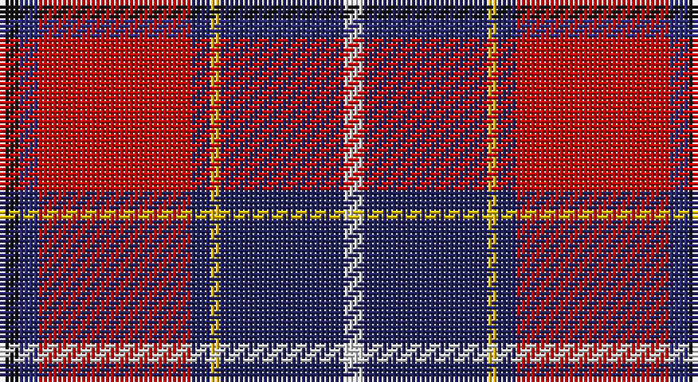

This page is one **sett** — a single exact thread-count. It belongs to the [tartan](/setts/k2dbi2r16db2ly1db13w2/)
(the same proportion at any scale), whose colour order is pattern [KBRBYBW](/stripes/kbrbybw/).

Part of the [Wishart Dress](/tartans/wishart-dress/) tartan — the named design grouping this sett with its other cloths.

Sourced from house-of-tartan.  It is a [7 stripe tartan](/stripes/stripes7/).

Original link http://www.house-of-tartan.scotland.net/house/TartanViewjs.asp?colr=Def&tnam=2105

## Provenance

Earliest known date: 1990 The Wisharts of Pittarrow and Logie Wishart were a lowland family dating from around the 12th Century. The family's origins are unknown, but the name Guiscard, Wiscard, Wishart, meaning 'cunning' is Norman-French. We have also sought to associate the Wishart tartan with that of another family by virtue of the marriage of a Sir John Wishart to Jean, daughter of William Douglas, 9th Earl of Angus in the 16th Century. The Wishart tartan combines the Wallace and Douglas tartans, in an original new sett which was designed by Dr David Wishart with the assistance of the Scottish College of Textiles in Galashiels. (D. Wishart, 1990)

## Also known as

This cloth is also recorded under:

- Wishart, dress

## Thread count
K/4 DB4 R32 DBa4 Y2 DBa26 LN/4

One full sett is **144 threads**.

## Palette

Palette: <strong>Tartan Register</strong>
<table><thead><tr><th>Colour</th><th>Threads</th><th>Shade</th><th>Base</th><th>OKLCh</th></tr></thead><tbody><tr><td>K/</td><td style="text-align:right;font-variant-numeric:tabular-nums">4</td><td><code style="background-color:#101010;">#101010</code> <small style="color:#888">#101010</small></td><td>K <code style="background-color:#000000;">#000000</code></td><td><small style="color:#888">oklch(17.3% 0.000 89.9)</small></td></tr><tr><td>DB</td><td style="text-align:right;font-variant-numeric:tabular-nums">4</td><td><code style="background-color:#2C2C80;">#2C2C80</code> <small style="color:#888">#2C2C80</small></td><td>B <code style="background-color:#2A418A;">#2A418A</code></td><td><small style="color:#888">oklch(35.0% 0.138 276.6)</small></td></tr><tr><td>R</td><td style="text-align:right;font-variant-numeric:tabular-nums">32</td><td><code style="background-color:#C80000;">#C80000</code> <small style="color:#888">#C80000</small></td><td>R <code style="background-color:#CC0000;">#CC0000</code></td><td><small style="color:#888">oklch(52.3% 0.215 29.2)</small></td></tr><tr><td>DBa</td><td style="text-align:right;font-variant-numeric:tabular-nums">4</td><td><code style="background-color:#202060;">#202060</code> <small style="color:#888">#202060</small></td><td>B <code style="background-color:#2A418A;">#2A418A</code></td><td><small style="color:#888">oklch(28.9% 0.111 276.9)</small></td></tr><tr><td>Y</td><td style="text-align:right;font-variant-numeric:tabular-nums">2</td><td><code style="background-color:#E8C000;">#E8C000</code> <small style="color:#888">#E8C000</small></td><td>Y <code style="background-color:#F2BF00;">#F2BF00</code></td><td><small style="color:#888">oklch(81.9% 0.168 93.7)</small></td></tr><tr><td>DBa</td><td style="text-align:right;font-variant-numeric:tabular-nums">26</td><td><code style="background-color:#202060;">#202060</code> <small style="color:#888">#202060</small></td><td>B <code style="background-color:#2A418A;">#2A418A</code></td><td><small style="color:#888">oklch(28.9% 0.111 276.9)</small></td></tr><tr><td>LN/</td><td style="text-align:right;font-variant-numeric:tabular-nums">4</td><td><code style="background-color:#E0E0E0;">#E0E0E0</code> <small style="color:#888">#E0E0E0</small></td><td>W <code style="background-color:#F7F7F7;">#F7F7F7</code></td><td><small style="color:#888">oklch(90.7% 0.000 89.9)</small></td></tr></tbody></table>

# Sample pattern

## Compared to the master

This cloth is one sett of its design; the master sett (the exemplar the design is anchored on) is below for comparison.

<figure style="margin:0"><figcaption style="color:#888;font-size:smaller">this sett</figcaption></figure>
<figure style="margin:0"><figcaption style="color:#888;font-size:smaller"><a href="/setts/k7dbi4r31db3ly2db27lb4/">master sett →</a></figcaption></figure>

## Nearest tartans

The nearest existing variants by ΔTartan distance, with this tartan at the top so the swatches line up against it.

ΔTartan

Tartan

Sett

—

<a href="/ttd/edit/#slug=k2dbi2r16db2ly1db13w2~x2">Wishart Dress Family Tartan</a> <a class="nn-out" href="/variants/s7/k2dbi2r16db2ly1db13w2~x2/" title="open its dictionary page">↗</a>

0.47

<a href="/ttd/edit/#slug=k7dbi4r31db3ly2db27lb4~x2&amp;base=k2dbi2r16db2ly1db13w2~x2">Wishart Dress (Clan)</a> <a class="nn-out" href="/variants/s7/k7dbi4r31db3ly2db27lb4~x2/" title="open its dictionary page">↗</a>

0.76

<a href="/ttd/edit/#slug=k2db2r16dbi2ly1dbi13w2~x2&amp;base=k2dbi2r16db2ly1db13w2~x2">Wishart, dress</a> <a class="nn-out" href="/variants/s7/k2db2r16dbi2ly1dbi13w2~x2/" title="open its dictionary page">↗</a>

0.89

<a href="/ttd/edit/#slug=r4ly2r34db10y4db4t4db23w3~x2&amp;base=k2dbi2r16db2ly1db13w2~x2">Heirloom Red Alba (Fashion)</a> <a class="nn-out" href="/variants/s9/r4ly2r34db10y4db4t4db23w3~x2/" title="open its dictionary page">↗</a>

1.00

<a href="/ttd/edit/#slug=gi3g3r22k5db22ly2~x2&amp;base=k2dbi2r16db2ly1db13w2~x2">MacLeod Society of Scotland</a> <a class="nn-out" href="/variants/s6/gi3g3r22k5db22ly2~x2/" title="open its dictionary page">↗</a>

1.05

<a href="/ttd/edit/#slug=r3n2r25o12k25w2lb2~x2&amp;base=k2dbi2r16db2ly1db13w2~x2">Bombeiros Voluntarios De Galicia (Co</a> <a class="nn-out" href="/variants/s7/r3n2r25o12k25w2lb2~x2/" title="open its dictionary page">↗</a>

1.06

<a href="/ttd/edit/#slug=k4db12lb3db4g8lo2r24db4r4~x2&amp;base=k2dbi2r16db2ly1db13w2~x2">MacCreary (Personal)</a> <a class="nn-out" href="/variants/s9/k4db12lb3db4g8lo2r24db4r4~x2/" title="open its dictionary page">↗</a>

1.08

<a href="/ttd/edit/#slug=db4ly3db22o6w2k6w2r26k3r4~x2&amp;base=k2dbi2r16db2ly1db13w2~x2">Asman Red (Personal)</a> <a class="nn-out" href="/variants/s10/db4ly3db22o6w2k6w2r26k3r4~x2/" title="open its dictionary page">↗</a>

1.13

<a href="/ttd/edit/#slug=ly3db8w3db34r34g4r4w2~x2&amp;base=k2dbi2r16db2ly1db13w2~x2">Manitoba Masonic (Corporate)</a> <a class="nn-out" href="/variants/s8/ly3db8w3db34r34g4r4w2~x2/" title="open its dictionary page">↗</a>

1.14

<a href="/ttd/edit/#slug=dp3lo2r19ri4dpi6k36dpi2lo3~x2&amp;base=k2dbi2r16db2ly1db13w2~x2">Hyland Evening (Personal)</a> <a class="nn-out" href="/variants/s8/dp3lo2r19ri4dpi6k36dpi2lo3~x2/" title="open its dictionary page">↗</a>

1.14

<a href="/variants/s12/k7dbi4r31db3ly2db27lb4~x2/">Wishart Dress</a>

## Neighbour map

Every grey dot is one of 14360 variants placed by the first two principal components of the ΔTartan feature space (44% of its variance). Red is this tartan; blue dots are its nearest — click one to open its page.

<svg viewBox="0 0 640 380" role="img" style="max-width:100%;height:auto;border:1px solid #e0e0e0;border-radius:4px;display:block" xmlns="http://www.w3.org/2000/svg"><image href="/nn/cloud.v1.png" width="640" height="380"/><a href="/variants/s7/k7dbi4r31db3ly2db27lb4~x2/"><circle cx="199.4" cy="127.5" r="4" fill="#3465a4"><title>Wishart Dress (Clan)</title></circle></a><a href="/variants/s7/k2db2r16dbi2ly1dbi13w2~x2/"><circle cx="210.4" cy="122.7" r="4" fill="#3465a4"><title>Wishart, dress</title></circle></a><a href="/variants/s9/r4ly2r34db10y4db4t4db23w3~x2/"><circle cx="252.0" cy="124.3" r="4" fill="#3465a4"><title>Heirloom Red Alba (Fashion)</title></circle></a><a href="/variants/s6/gi3g3r22k5db22ly2~x2/"><circle cx="187.6" cy="158.5" r="4" fill="#3465a4"><title>MacLeod Society of Scotland</title></circle></a><a href="/variants/s7/r3n2r25o12k25w2lb2~x2/"><circle cx="185.7" cy="136.1" r="4" fill="#3465a4"><title>Bombeiros Voluntarios De Galicia (Co</title></circle></a><a href="/variants/s9/k4db12lb3db4g8lo2r24db4r4~x2/"><circle cx="182.0" cy="135.7" r="4" fill="#3465a4"><title>MacCreary (Personal)</title></circle></a><a href="/variants/s10/db4ly3db22o6w2k6w2r26k3r4~x2/"><circle cx="168.4" cy="112.1" r="4" fill="#3465a4"><title>Asman Red (Personal)</title></circle></a><a href="/variants/s8/ly3db8w3db34r34g4r4w2~x2/"><circle cx="268.7" cy="126.3" r="4" fill="#3465a4"><title>Manitoba Masonic (Corporate)</title></circle></a><a href="/variants/s8/dp3lo2r19ri4dpi6k36dpi2lo3~x2/"><circle cx="253.7" cy="113.6" r="4" fill="#3465a4"><title>Hyland Evening (Personal)</title></circle></a><a href="/variants/s12/k7dbi4r31db3ly2db27lb4~x2/"><circle cx="220.1" cy="110.9" r="4" fill="#3465a4"><title>Wishart Dress</title></circle></a><circle cx="225.4" cy="125.0" r="5" fill="#c00000"/></svg>

ID: /variants/s7/k2dbi2r16db2ly1db13w2~x2/
