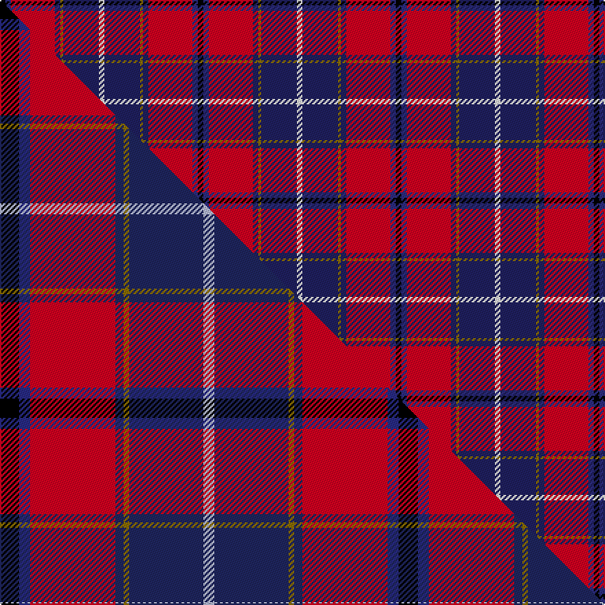

This is one **variant** — a specific cloth: this exact thread count and colourway, with its own
provenance below. It is one weaving of the [sett](/setts/k2dbi2r16db2y1db13w2/) (the scale-free proportion — the
same cloth at any scale or shade), whose colour order is pattern [KBRBGBW](/stripes/kbrbgbw/).

Part of the [Wishart Dress](/tartans/wishart-dress/) tartan — the named design grouping this sett with its other cloths.

Sourced from house-of-tartan.  It is a [7 stripe tartan](/stripes/stripes7/).

Original link [http://www.house-of-tartan.scotland.net/house/TartanViewjs.asp?colr=Def&tnam=2105](http://www.house-of-tartan.scotland.net/house/TartanViewjs.asp?colr=Def&tnam=2105)

## Provenance

Earliest known date: 1990 The Wisharts of Pittarrow and Logie Wishart were a lowland family dating from around the 12th Century. The family's origins are unknown, but the name Guiscard, Wiscard, Wishart, meaning 'cunning' is Norman-French. We have also sought to associate the Wishart tartan with that of another family by virtue of the marriage of a Sir John Wishart to Jean, daughter of William Douglas, 9th Earl of Angus in the 16th Century. The Wishart tartan combines the Wallace and Douglas tartans, in an original new sett which was designed by Dr David Wishart with the assistance of the Scottish College of Textiles in Galashiels. (D. Wishart, 1990)

Dataset <small>— provenance for this record, inherited from the source manifest</small>

<dl class="dataset-prov">
<dt>source</dt><dd><a href="/sources/house-of-tartan/">House of Tartan</a></dd>
<dt>data captured from</dt><dd><a href="https://github.com/thetartan/tartan-database/blob/master/data/house-of-tartan/data.csv">https://github.com/thetartan/tartan-database/blob/master/data/house-of-tartan/data.csv</a></dd>
<dt>data date</dt><dd>1990 <small>(this record)</small></dd>
<dt>licence</dt><dd><a href="https://creativecommons.org/licenses/by-nc-nd/4.0/">CC BY-NC-ND 4.0</a></dd>
</dl>

Capture chain <small>— the hands this data passed through, oldest first; each capture carries its own licence</small>

<ol class="capture-chain">
<li><a href="http://www.house-of-tartan.scotland.net/">House of Tartan</a> <small>the weaver/retailer's database — the site is now offline; the URL is kept as the ultimate source's identity</small></li>
<li><a href="https://github.com/thetartan/tartan-database">thetartan/tartan-database</a> <small>2016-2017</small> · <a href="https://creativecommons.org/licenses/by-nc-nd/4.0/">CC BY-NC-ND 4.0</a> <small>Levko Kravets's frozen compilation — the capture we vendored, and where its CC licence text came from</small></li>
<li>this dictionary <small>captured 2026-06-10 · commit 5bf86c7566</small> <small>each re-capture is a git commit to data/sources</small></li>
</ol>

## Thread count
K/4 DBi4 R32 DB4 Y2 DB26 W/4

One full sett is **144 threads**.

## Palette
<table><thead><tr><th>Colour</th><th>Shade</th><th>OKLCh</th></tr></thead><tbody><tr><td>DB</td><td><code style="background-color:#2C2C80;">#2C2C80</code> <small style="color:#888">#2C2C80</small></td><td><small style="color:#888">oklch(35.0% 0.138 276.6)</small></td></tr><tr><td>DB</td><td><code style="background-color:#202060;">#202060</code> <small style="color:#888">#202060</small></td><td><small style="color:#888">oklch(28.9% 0.111 276.9)</small></td></tr><tr><td>K</td><td><code style="background-color:#000000;">#000000</code> <small style="color:#888">#000000</small></td><td><small style="color:#888">oklch(0.0% 0.000 0.0)</small></td></tr><tr><td>W</td><td><code style="background-color:#F7F7F7;">#F7F7F7</code> <small style="color:#888">#F7F7F7</small></td><td><small style="color:#888">oklch(97.6% 0.000 89.9)</small></td></tr><tr><td>R</td><td><code style="background-color:#D60020;">#D60020</code> <small style="color:#888">#D60020</small></td><td><small style="color:#888">oklch(55.2% 0.224 25.5)</small></td></tr><tr><td>Y</td><td><code style="background-color:#8B6E00;">#8B6E00</code> <small style="color:#888">#8B6E00</small></td><td><small style="color:#888">oklch(55.1% 0.113 90.4)</small></td></tr></tbody></table>

# Sample pattern

## Compared to the master

This cloth is one sett of its design; the master sett (the exemplar the design is anchored on) is below for comparison.

Its **ΔTartan distance** from the master is **0.44** — the same measure the nearest-tartans table ranks by (0 is identical; a re-scale of the same cloth is near 0, a recolour or a different proportion further).

<figure class="master-compare" style="margin:0">

this sett
master sett ★

<figcaption style="color:#888;font-size:smaller">One weave of this sett against the <a href="/setts/k7dbi4r31db3y2db27lb4/">master sett ★</a>, split on the diagonal: a shared proportion runs seamlessly across it with only the shades shifting; a different proportion breaks on it.</figcaption>
</figure>

## Nearest tartan variants

The nearest existing variants by ΔTartan distance, with this cloth at the top so the swatches line up against it.

ΔTartan

Threads

Variant

Sett

—

144

<a href="/variants/s7/k2dbi2r16db2y1db13w2~x2~dbi1406275-db1204274/">Wishart Dress Family Tartan</a>

<a href="/ttd/edit/#slug=k2n2r16db2y1db13w2~x2~n1604274-db0805267&amp;base=k2dbi2r16db2y1db13w2~x2~dbi1406275-db1204274" title="compare in the TTD">0.09</a>

144

<a href="/variants/s7/k2dbi2r16db2y1db13w2~x2~dbi1604274-db0805267/">Wishart, dress</a>

<a href="/ttd/edit/#slug=k7db4r31dt3y2dt27lb4~x2~db1406275-dt1204274&amp;base=k2dbi2r16db2y1db13w2~x2~dbi1406275-db1204274" title="compare in the TTD">0.43</a>

290

<a href="/variants/s7/k7dbi4r31db3y2db27lb4~x2~dbi1406275-db1204274/">Wishart Dress</a>

<a href="/ttd/edit/#slug=k7db4r31dt3lo2dt27lb4~x2~db1406275-dt1204274&amp;base=k2dbi2r16db2y1db13w2~x2~dbi1406275-db1204274" title="compare in the TTD">0.73</a>

290

<a href="/variants/s7/k7dbi4r31db3lo2db27lb4~x2~dbi1406275-db1204274/">Wishart Dress (Clan)</a>

<a href="/ttd/edit/#slug=r48db16y5g17w8k3~x2&amp;base=k2dbi2r16db2y1db13w2~x2~dbi1406275-db1204274" title="compare in the TTD">1.97</a>

286

<a href="/variants/s6/r48db16y5g17w8k3~x2/">Scottish American Society of Michigan (Official)</a>

<a href="/ttd/edit/#slug=k2y1k2y8r29n9db24w2db2~x2&amp;base=k2dbi2r16db2y1db13w2~x2~dbi1406275-db1204274" title="compare in the TTD">2.10</a>

308

<a href="/variants/s9/k2y1k2y8r29n9db24w2db2~x2/">Lermontov</a>

<a href="/ttd/edit/#slug=k2dy1k2dy8r29n9dt24w2dt2~x2~dt1204274&amp;base=k2dbi2r16db2y1db13w2~x2~dbi1406275-db1204274" title="compare in the TTD">2.10</a>

308

<a href="/variants/s9/k2dy1k2dy8r29n9db24w2db2~x2~db1204274/">Lermontov Family Tartan</a>

<a href="/ttd/edit/#slug=db4dy3db22n6w2k6w2r26k3r4~x2~db1406275&amp;base=k2dbi2r16db2y1db13w2~x2~dbi1406275-db1204274" title="compare in the TTD">2.19</a>

296

<a href="/variants/s10/db4dy3db22n6w2k6w2r26k3r4~x2~db1406275/">Asman Dress Family Tartan</a>

<a href="/ttd/edit/#slug=db4dy3db22n6w2k6w2r26k3r4~x2&amp;base=k2dbi2r16db2y1db13w2~x2~dbi1406275-db1204274" title="compare in the TTD">2.20</a>

296

<a href="/variants/s10/db4dy3db22n6w2k6w2r26k3r4~x2/">Asman, Dress (Name)</a>

<a href="/ttd/edit/#slug=dg3g3r22k5db22dy2~x2~dg1806142-g2408144&amp;base=k2dbi2r16db2y1db13w2~x2~dbi1406275-db1204274" title="compare in the TTD">2.23</a>

218

<a href="/variants/s6/dg3g3r22k5db22dy2~x2~dg1806142-g2408144/">MacLeod Society of Scotland</a>

<a href="/ttd/edit/#slug=dg3b3r22k5ki22y2~x2~ki0604259&amp;base=k2dbi2r16db2y1db13w2~x2~dbi1406275-db1204274" title="compare in the TTD">2.40</a>

218

<a href="/variants/s6/dg3b3r22k5ki22y2~x2~ki0604259/">Clan MacLeod Society of Scotland, Centenary</a>

## Neighbour map

Every grey dot is one of 13621 variants placed by the first two principal components of the ΔTartan feature space (42% of its variance). Red is this tartan; blue dots are its nearest — click one to open its page.

<svg viewBox="0 0 640 380" role="img" style="max-width:100%;height:auto;border:1px solid #e0e0e0;border-radius:4px;display:block" xmlns="http://www.w3.org/2000/svg"><image href="/nn/cloud.v1.png" width="640" height="380"/><a href="/variants/s7/k2dbi2r16db2y1db13w2~x2~dbi1604274-db0805267/"><circle cx="193.4" cy="119.4" r="4" fill="#3465a4"><title>Wishart, dress</title></circle></a><a href="/variants/s7/k7dbi4r31db3y2db27lb4~x2~dbi1406275-db1204274/"><circle cx="213.8" cy="112.7" r="4" fill="#3465a4"><title>Wishart Dress</title></circle></a><a href="/variants/s7/k7dbi4r31db3lo2db27lb4~x2~dbi1406275-db1204274/"><circle cx="190.6" cy="128.2" r="4" fill="#3465a4"><title>Wishart Dress (Clan)</title></circle></a><a href="/variants/s6/r48db16y5g17w8k3~x2/"><circle cx="205.7" cy="134.4" r="4" fill="#3465a4"><title>Scottish American Society of Michigan (Official)</title></circle></a><a href="/variants/s9/k2y1k2y8r29n9db24w2db2~x2/"><circle cx="187.5" cy="91.8" r="4" fill="#3465a4"><title>Lermontov</title></circle></a><a href="/variants/s9/k2dy1k2dy8r29n9db24w2db2~x2~db1204274/"><circle cx="195.8" cy="93.1" r="4" fill="#3465a4"><title>Lermontov Family Tartan</title></circle></a><a href="/variants/s10/db4dy3db22n6w2k6w2r26k3r4~x2~db1406275/"><circle cx="151.0" cy="114.3" r="4" fill="#3465a4"><title>Asman Dress Family Tartan</title></circle></a><a href="/variants/s10/db4dy3db22n6w2k6w2r26k3r4~x2/"><circle cx="145.1" cy="113.3" r="4" fill="#3465a4"><title>Asman, Dress (Name)</title></circle></a><a href="/variants/s6/dg3g3r22k5db22dy2~x2~dg1806142-g2408144/"><circle cx="164.6" cy="152.4" r="4" fill="#3465a4"><title>MacLeod Society of Scotland</title></circle></a><a href="/variants/s6/dg3b3r22k5ki22y2~x2~ki0604259/"><circle cx="153.0" cy="145.3" r="4" fill="#3465a4"><title>Clan MacLeod Society of Scotland, Centenary</title></circle></a><circle cx="208.0" cy="123.2" r="5" fill="#c00000"/><text x="320" y="376" text-anchor="middle" font-size="11" fill="#999">ground</text><text x="11" y="190" text-anchor="middle" font-size="11" fill="#999" transform="rotate(-90 11 190)">complexity</text></svg>

ID: /variants/s7/k2dbi2r16db2y1db13w2~x2~dbi1406275-db1204274/
