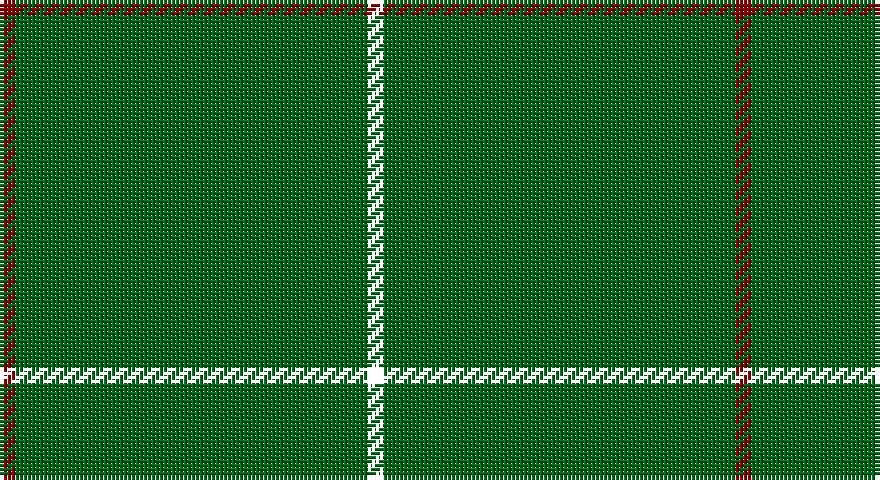

This page is one **sett** — a single exact thread-count. It belongs to the [tartan](/setts/k2g2g19g2g2g19r2/)
(the same proportion at any scale), whose colour order is pattern [KGGGGGR](/stripes/kgggggr/).

Sourced from tartans-authority.  It is a [7 stripe tartan](/stripes/stripes7/).

Original link http://www.tartansauthority.com/tartan-ferret/display/2234/

## Register references

External register numbers recorded for this tartan.

- Scottish Tartans Authority (ITI): 2234

## Thread count
DR/4 G38 G4 G4 G38 G4 MY/4

One full sett is **184 threads**.

## Palette

Palette: <strong>Tartan Register</strong>
<table><thead><tr><th>Colour</th><th>Threads</th><th>Shade</th><th>Base</th><th>OKLCh</th></tr></thead><tbody><tr><td>DR/</td><td style="text-align:right;font-variant-numeric:tabular-nums">4</td><td><code style="background-color:#880000;">#880000</code> <small style="color:#888">#880000</small></td><td>R <code style="background-color:#CC0000;">#CC0000</code></td><td><small style="color:#888">oklch(39.4% 0.162 29.2)</small></td></tr><tr><td>G</td><td style="text-align:right;font-variant-numeric:tabular-nums">38</td><td><code style="background-color:#006818;">#006818</code> <small style="color:#888">#006818</small></td><td>G <code style="background-color:#006100;">#006100</code></td><td><small style="color:#888">oklch(45.0% 0.142 145.0)</small></td></tr><tr><td>G</td><td style="text-align:right;font-variant-numeric:tabular-nums">4</td><td><code style="background-color:#006818;">#006818</code> <small style="color:#888">#006818</small></td><td>G <code style="background-color:#006100;">#006100</code></td><td><small style="color:#888">oklch(45.0% 0.142 145.0)</small></td></tr><tr><td>G</td><td style="text-align:right;font-variant-numeric:tabular-nums">4</td><td><code style="background-color:#006818;">#006818</code> <small style="color:#888">#006818</small></td><td>G <code style="background-color:#006100;">#006100</code></td><td><small style="color:#888">oklch(45.0% 0.142 145.0)</small></td></tr><tr><td>G</td><td style="text-align:right;font-variant-numeric:tabular-nums">38</td><td><code style="background-color:#006818;">#006818</code> <small style="color:#888">#006818</small></td><td>G <code style="background-color:#006100;">#006100</code></td><td><small style="color:#888">oklch(45.0% 0.142 145.0)</small></td></tr><tr><td>G</td><td style="text-align:right;font-variant-numeric:tabular-nums">4</td><td><code style="background-color:#006818;">#006818</code> <small style="color:#888">#006818</small></td><td>G <code style="background-color:#006100;">#006100</code></td><td><small style="color:#888">oklch(45.0% 0.142 145.0)</small></td></tr><tr><td>/</td><td style="text-align:right;font-variant-numeric:tabular-nums">4</td><td><code style="background-color:;"></code> <small style="color:#888"></small></td><td> <code style="background-color:;"></code></td><td><small style="color:#888"></small></td></tr></tbody></table>

# Sample pattern

## Nearest tartans

The nearest existing variants by ΔTartan distance, with this tartan at the top so the swatches line up against it.

ΔTartan

Tartan

Sett

—

<a href="/ttd/edit/#slug=k2g2g19g2g2g19r2~x2">Kenmore Hunting (Fashion)</a> <a class="nn-out" href="/variants/s7/k2g2g19g2g2g19r2~x2/" title="open its dictionary page">↗</a>

1.52

<a href="/ttd/edit/#slug=r2g19g2g2g19g2lo2~x2&amp;base=k2g2g19g2g2g19r2~x2">Kenmore Hunting</a> <a class="nn-out" href="/variants/s7/r2g19g2g2g19g2lo2~x2/" title="open its dictionary page">↗</a>

1.53

<a href="/ttd/edit/#slug=g2dp2g20g2g2dp1~x4&amp;base=k2g2g19g2g2g19r2~x2">Walters (Personal)</a> <a class="nn-out" href="/variants/s6/g2dp2g20g2g2dp1~x4/" title="open its dictionary page">↗</a>

1.54

<a href="/ttd/edit/#slug=dg62r7k4r4dg62~x2&amp;base=k2g2g19g2g2g19r2~x2">MacNab, Ancient</a> <a class="nn-out" href="/variants/s5/dg62r7k4r4dg62~x2/" title="open its dictionary page">↗</a>

1.81

<a href="/variants/s10/gi2dp2gi20gi2gi2g1~x4/">Walters (Personal)</a>

2.38

<a href="/variants/s8/r8g3r4g44w4~x2/">Welsh National</a>

2.47

<a href="/ttd/edit/#slug=dg30r2dg8r1dg5w2&amp;base=k2g2g19g2g2g19r2~x2">Dewi Sant</a> <a class="nn-out" href="/variants/s6/dg30r2dg8r1dg5w2/" title="open its dictionary page">↗</a>

2.49

<a href="/ttd/edit/#slug=g2o2g15o1w1g15o2g2~x2&amp;base=k2g2g19g2g2g19r2~x2">Bannockbane, hunting</a> <a class="nn-out" href="/variants/s8/g2o2g15o1w1g15o2g2~x2/" title="open its dictionary page">↗</a>

2.52

<a href="/ttd/edit/#slug=g23r3g7r3g23dp7~x2&amp;base=k2g2g19g2g2g19r2~x2">Highland Spring (1997)</a> <a class="nn-out" href="/variants/s6/g23r3g7r3g23dp7~x2/" title="open its dictionary page">↗</a>

2.58

<a href="/ttd/edit/#slug=dg2dy2dg15dy1w1dg15dy2dg2~x2&amp;base=k2g2g19g2g2g19r2~x2">Bannockbane Hunting</a> <a class="nn-out" href="/variants/s8/dg2dy2dg15dy1w1dg15dy2dg2~x2/" title="open its dictionary page">↗</a>

2.62

<a href="/variants/s10/r4g2r1g19k1g2~x4/">Loch Laggan</a>

## Neighbour map

Every grey dot is one of 14360 variants placed by the first two principal components of the ΔTartan feature space (44% of its variance). Red is this tartan; blue dots are its nearest — click one to open its page.

<svg viewBox="0 0 640 380" role="img" style="max-width:100%;height:auto;border:1px solid #e0e0e0;border-radius:4px;display:block" xmlns="http://www.w3.org/2000/svg"><image href="/nn/cloud.v1.png" width="640" height="380"/><a href="/variants/s7/r2g19g2g2g19g2lo2~x2/"><circle cx="626.0" cy="276.2" r="4" fill="#3465a4"><title>Kenmore Hunting</title></circle></a><a href="/variants/s6/g2dp2g20g2g2dp1~x4/"><circle cx="626.0" cy="226.0" r="4" fill="#3465a4"><title>Walters (Personal)</title></circle></a><a href="/variants/s5/dg62r7k4r4dg62~x2/"><circle cx="626.0" cy="264.5" r="4" fill="#3465a4"><title>MacNab, Ancient</title></circle></a><a href="/variants/s10/gi2dp2gi20gi2gi2g1~x4/"><circle cx="626.0" cy="218.8" r="4" fill="#3465a4"><title>Walters (Personal)</title></circle></a><a href="/variants/s8/r8g3r4g44w4~x2/"><circle cx="575.0" cy="207.6" r="4" fill="#3465a4"><title>Welsh National</title></circle></a><a href="/variants/s6/dg30r2dg8r1dg5w2/"><circle cx="626.0" cy="202.3" r="4" fill="#3465a4"><title>Dewi Sant</title></circle></a><a href="/variants/s8/g2o2g15o1w1g15o2g2~x2/"><circle cx="626.0" cy="248.8" r="4" fill="#3465a4"><title>Bannockbane, hunting</title></circle></a><a href="/variants/s6/g23r3g7r3g23dp7~x2/"><circle cx="515.0" cy="278.5" r="4" fill="#3465a4"><title>Highland Spring (1997)</title></circle></a><a href="/variants/s8/dg2dy2dg15dy1w1dg15dy2dg2~x2/"><circle cx="626.0" cy="241.8" r="4" fill="#3465a4"><title>Bannockbane Hunting</title></circle></a><a href="/variants/s10/r4g2r1g19k1g2~x4/"><circle cx="587.8" cy="176.1" r="4" fill="#3465a4"><title>Loch Laggan</title></circle></a><circle cx="626.0" cy="256.8" r="5" fill="#c00000"/></svg>

ID: /variants/s7/k2g2g19g2g2g19r2~x2/
