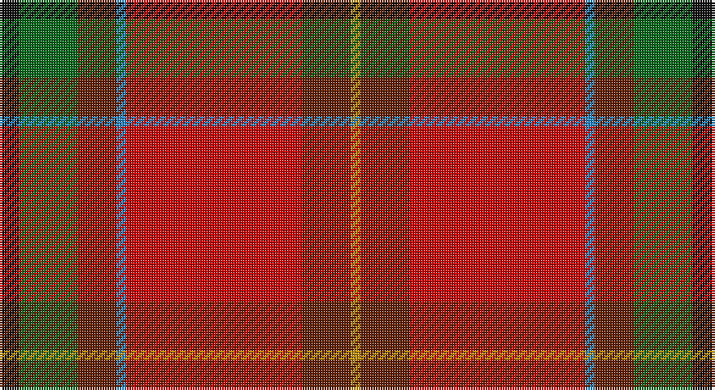

This page is one **sett** — a single exact thread-count. It belongs to the [tartan](/setts/k2g6dy4t1r18dy5lo1/)
(the same proportion at any scale), whose colour order is pattern [KGGBRGY](/stripes/kggbrgy/).

Sourced from tartans-authority.  It is a [7 stripe tartan](/stripes/stripes7/).

Original link http://www.tartansauthority.com/tartan-ferret/display/7803/

2 attestations — the source records this cloth was collapsed from (oldest owns this page)

<ul>
<li>pre 2008 — Snelgrove (Name) (tartans-authority, <a href="http://www.tartansauthority.com/tartan-ferret/display/7803/">record</a>)</li>
<li>undated — Snelgrove (register-of-tartans, <a href="https://www.tartanregister.gov.uk/tartanDetails.aspx?ref=5765">record</a>)</li>
</ul>

## Register references

External register numbers recorded for this tartan.

- Scottish Register of Tartans: [5765](https://www.tartanregister.gov.uk/tartanDetails.aspx?ref=5765)
- Scottish Tartans Authority (ITI): 7803

## Thread count
K/8 G24 T16 B4 R72 T20 DY/4

One full sett is **284 threads**.

## Palette

Palette: <strong>Tartan Register</strong> <small style="color:#888">(5 of 6 colours)</small>
<table><thead><tr><th>Colour</th><th>Threads</th><th>Shade</th><th>Base</th><th>OKLCh</th></tr></thead><tbody><tr><td>K/</td><td style="text-align:right;font-variant-numeric:tabular-nums">8</td><td><code style="background-color:#101010;">#101010</code> <small style="color:#888">#101010</small></td><td>K <code style="background-color:#000000;">#000000</code></td><td><small style="color:#888">oklch(17.3% 0.000 89.9)</small></td></tr><tr><td>G</td><td style="text-align:right;font-variant-numeric:tabular-nums">24</td><td><code style="background-color:#006818;">#006818</code> <small style="color:#888">#006818</small></td><td>G <code style="background-color:#006100;">#006100</code></td><td><small style="color:#888">oklch(45.0% 0.142 145.0)</small></td></tr><tr><td>T</td><td style="text-align:right;font-variant-numeric:tabular-nums">16</td><td><code style="background-color:#642000;">#642000</code> <small style="color:#888">#642000</small></td><td>G <code style="background-color:#006100;">#006100</code></td><td><small style="color:#888">oklch(34.6% 0.106 41.3)</small></td></tr><tr><td>B</td><td style="text-align:right;font-variant-numeric:tabular-nums">4</td><td><code style="background-color:#2888C4;">#2888C4</code> <small style="color:#888">#2888C4</small></td><td>B <code style="background-color:#2A418A;">#2A418A</code></td><td><small style="color:#888">oklch(60.1% 0.125 241.5)</small></td></tr><tr><td>R</td><td style="text-align:right;font-variant-numeric:tabular-nums">72</td><td><code style="background-color:#C80000;">#C80000</code> <small style="color:#888">#C80000</small></td><td>R <code style="background-color:#CC0000;">#CC0000</code></td><td><small style="color:#888">oklch(52.3% 0.215 29.2)</small></td></tr><tr><td>T</td><td style="text-align:right;font-variant-numeric:tabular-nums">20</td><td><code style="background-color:#642000;">#642000</code> <small style="color:#888">#642000</small></td><td>G <code style="background-color:#006100;">#006100</code></td><td><small style="color:#888">oklch(34.6% 0.106 41.3)</small></td></tr><tr><td>DY/</td><td style="text-align:right;font-variant-numeric:tabular-nums">4</td><td><code style="background-color:#BC8C00;">#BC8C00</code> <small style="color:#888">#BC8C00</small></td><td>Y <code style="background-color:#F2BF00;">#F2BF00</code></td><td><small style="color:#888">oklch(66.8% 0.137 84.1)</small></td></tr></tbody></table>

# Sample pattern

## Nearest tartans

The nearest existing variants by ΔTartan distance, with this tartan at the top so the swatches line up against it.

ΔTartan

Tartan

Sett

—

<a href="/ttd/edit/#slug=k2g6dy4t1r18dy5lo1~x4">Snelgrove (Name)</a> <a class="nn-out" href="/variants/s7/k2g6dy4t1r18dy5lo1~x4/" title="open its dictionary page">↗</a>

0.79

<a href="/ttd/edit/#slug=k7w2dg2o31r35lo2~x2&amp;base=k2g6dy4t1r18dy5lo1~x4">Mason (Personal)</a> <a class="nn-out" href="/variants/s6/k7w2dg2o31r35lo2~x2/" title="open its dictionary page">↗</a>

1.17

<a href="/ttd/edit/#slug=k7w2dg2r31ri35lo2~x2&amp;base=k2g6dy4t1r18dy5lo1~x4">Mason, David Elsworth (Personal)</a> <a class="nn-out" href="/variants/s6/k7w2dg2r31ri35lo2~x2/" title="open its dictionary page">↗</a>

1.18

<a href="/ttd/edit/#slug=r26g5dg7ri2do9lo1loi1dg4~x2&amp;base=k2g6dy4t1r18dy5lo1~x4">Tartan Army Whisky</a> <a class="nn-out" href="/variants/s8/r26g5dg7ri2do9lo1loi1dg4~x2/" title="open its dictionary page">↗</a>

1.21

<a href="/ttd/edit/#slug=g3r4k1r26y14r4dp16w2~x2&amp;base=k2g6dy4t1r18dy5lo1~x4">MacQueen of Dalmagarry (Clan?)</a> <a class="nn-out" href="/variants/s8/g3r4k1r26y14r4dp16w2~x2/" title="open its dictionary page">↗</a>

1.26

<a href="/ttd/edit/#slug=r2do2r20y13lg3db5r2r4o2~x2&amp;base=k2g6dy4t1r18dy5lo1~x4">Flowers of the Forest, The</a> <a class="nn-out" href="/variants/s9/r2do2r20y13lg3db5r2r4o2~x2/" title="open its dictionary page">↗</a>

1.31

<a href="/ttd/edit/#slug=r63w4k4dp18ly4dg50~x2&amp;base=k2g6dy4t1r18dy5lo1~x4">Gordon of Abergeldie (Portrait)</a> <a class="nn-out" href="/variants/s6/r63w4k4dp18ly4dg50~x2/" title="open its dictionary page">↗</a>

1.34

<a href="/ttd/edit/#slug=r22db3ly1g12r6db3t3w1~x2&amp;base=k2g6dy4t1r18dy5lo1~x4">Drummond, (Fingask)</a> <a class="nn-out" href="/variants/s8/r22db3ly1g12r6db3t3w1~x2/" title="open its dictionary page">↗</a>

1.39

<a href="/ttd/edit/#slug=ri2dg16r1ri2r12ly1y1~x2&amp;base=k2g6dy4t1r18dy5lo1~x4">Spragg, Andrew</a> <a class="nn-out" href="/variants/s7/ri2dg16r1ri2r12ly1y1~x2/" title="open its dictionary page">↗</a>

1.42

<a href="/ttd/edit/#slug=r20w1k1m6ly1g18~x2&amp;base=k2g6dy4t1r18dy5lo1~x4">Gordon of Abergeldie (Red..) Portrait Tartan</a> <a class="nn-out" href="/variants/s6/r20w1k1m6ly1g18~x2/" title="open its dictionary page">↗</a>

1.44

<a href="/ttd/edit/#slug=w6r25o2g3o30k3o2r30ly6~x2&amp;base=k2g6dy4t1r18dy5lo1~x4">Virginia Military Institute, New Market</a> <a class="nn-out" href="/variants/s9/w6r25o2g3o30k3o2r30ly6~x2/" title="open its dictionary page">↗</a>

## Neighbour map

Every grey dot is one of 14360 variants placed by the first two principal components of the ΔTartan feature space (44% of its variance). Red is this tartan; blue dots are its nearest — click one to open its page.

<svg viewBox="0 0 640 380" role="img" style="max-width:100%;height:auto;border:1px solid #e0e0e0;border-radius:4px;display:block" xmlns="http://www.w3.org/2000/svg"><image href="/nn/cloud.v1.png" width="640" height="380"/><a href="/variants/s6/k7w2dg2o31r35lo2~x2/"><circle cx="304.0" cy="150.4" r="4" fill="#3465a4"><title>Mason (Personal)</title></circle></a><a href="/variants/s6/k7w2dg2r31ri35lo2~x2/"><circle cx="280.7" cy="133.0" r="4" fill="#3465a4"><title>Mason, David Elsworth (Personal)</title></circle></a><a href="/variants/s8/r26g5dg7ri2do9lo1loi1dg4~x2/"><circle cx="261.6" cy="96.3" r="4" fill="#3465a4"><title>Tartan Army Whisky</title></circle></a><a href="/variants/s8/g3r4k1r26y14r4dp16w2~x2/"><circle cx="271.0" cy="113.2" r="4" fill="#3465a4"><title>MacQueen of Dalmagarry (Clan?)</title></circle></a><a href="/variants/s9/r2do2r20y13lg3db5r2r4o2~x2/"><circle cx="290.2" cy="154.2" r="4" fill="#3465a4"><title>Flowers of the Forest, The</title></circle></a><a href="/variants/s6/r63w4k4dp18ly4dg50~x2/"><circle cx="241.6" cy="141.5" r="4" fill="#3465a4"><title>Gordon of Abergeldie (Portrait)</title></circle></a><a href="/variants/s8/r22db3ly1g12r6db3t3w1~x2/"><circle cx="306.9" cy="116.0" r="4" fill="#3465a4"><title>Drummond, (Fingask)</title></circle></a><a href="/variants/s7/ri2dg16r1ri2r12ly1y1~x2/"><circle cx="301.7" cy="154.5" r="4" fill="#3465a4"><title>Spragg, Andrew</title></circle></a><a href="/variants/s6/r20w1k1m6ly1g18~x2/"><circle cx="253.3" cy="133.4" r="4" fill="#3465a4"><title>Gordon of Abergeldie (Red..) Portrait Tartan</title></circle></a><a href="/variants/s9/w6r25o2g3o30k3o2r30ly6~x2/"><circle cx="281.0" cy="125.6" r="4" fill="#3465a4"><title>Virginia Military Institute, New Market</title></circle></a><circle cx="287.5" cy="139.1" r="5" fill="#c00000"/></svg>

ID: /variants/s7/k2g6dy4t1r18dy5lo1~x4/
