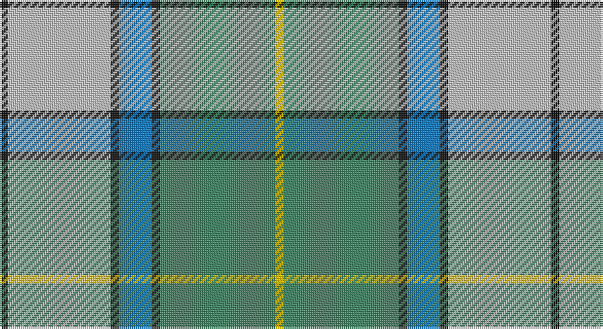

This page is one **sett** — a single exact thread-count. It belongs to the [tartan](/setts/k2lb25k2b8k2g28ly2/)
(the same proportion at any scale), whose colour order is pattern [KWKBKGY](/stripes/kwkbkgy/).

Part of the [Presley of Lonmay](/tartans/presley-of-lonmay/) tartan — the named design grouping this sett with its other cloths.

Sourced from register-of-tartans.  It is a [7 stripe tartan](/stripes/stripes7/).

Original link https://www.tartanregister.gov.uk/tartanDetails.aspx?ref=5383

## Also known as

This cloth is also recorded under:

- Presley of Lonmay #2

2 attestations — the source records this cloth was collapsed from (oldest owns this page)

<ul>
<li>01/01/2004 — Presley of Lonmay (register-of-tartans, <a href="https://www.tartanregister.gov.uk/tartanDetails.aspx?ref=5383">record</a>)</li>
<li>pre 2004 — Presley of Lonmay (Fashion) (tartans-authority, <a href="http://www.tartansauthority.com/tartan-ferret/display/6224/">record</a>)</li>
</ul>

## Register references

External register numbers recorded for this tartan.

- Scottish Register of Tartans: [5383](https://www.tartanregister.gov.uk/tartanDetails.aspx?ref=5383)
- Scottish Tartans Authority (ITI): 6224

## Thread count
K/4 N50 K4 B16 K4 G56 Y/4

One full sett is **268 threads**.

## Palette

Palette: <strong>Tartan Register</strong>
<table><thead><tr><th>Colour</th><th>Threads</th><th>Shade</th><th>Base</th><th>OKLCh</th></tr></thead><tbody><tr><td>K/</td><td style="text-align:right;font-variant-numeric:tabular-nums">4</td><td><code style="background-color:#101010;">#101010</code> <small style="color:#888">#101010</small></td><td>K <code style="background-color:#000000;">#000000</code></td><td><small style="color:#888">oklch(17.3% 0.000 89.9)</small></td></tr><tr><td>N</td><td style="text-align:right;font-variant-numeric:tabular-nums">50</td><td><code style="background-color:#C0C0C0;">#C0C0C0</code> <small style="color:#888">#C0C0C0</small></td><td>W <code style="background-color:#F7F7F7;">#F7F7F7</code></td><td><small style="color:#888">oklch(80.8% 0.000 89.9)</small></td></tr><tr><td>K</td><td style="text-align:right;font-variant-numeric:tabular-nums">4</td><td><code style="background-color:#101010;">#101010</code> <small style="color:#888">#101010</small></td><td>K <code style="background-color:#000000;">#000000</code></td><td><small style="color:#888">oklch(17.3% 0.000 89.9)</small></td></tr><tr><td>B</td><td style="text-align:right;font-variant-numeric:tabular-nums">16</td><td><code style="background-color:#1474B4;">#1474B4</code> <small style="color:#888">#1474B4</small></td><td>B <code style="background-color:#2A418A;">#2A418A</code></td><td><small style="color:#888">oklch(54.0% 0.129 245.1)</small></td></tr><tr><td>K</td><td style="text-align:right;font-variant-numeric:tabular-nums">4</td><td><code style="background-color:#101010;">#101010</code> <small style="color:#888">#101010</small></td><td>K <code style="background-color:#000000;">#000000</code></td><td><small style="color:#888">oklch(17.3% 0.000 89.9)</small></td></tr><tr><td>G</td><td style="text-align:right;font-variant-numeric:tabular-nums">56</td><td><code style="background-color:#408060;">#408060</code> <small style="color:#888">#408060</small></td><td>G <code style="background-color:#006100;">#006100</code></td><td><small style="color:#888">oklch(54.8% 0.084 160.1)</small></td></tr><tr><td>Y/</td><td style="text-align:right;font-variant-numeric:tabular-nums">4</td><td><code style="background-color:#E8C000;">#E8C000</code> <small style="color:#888">#E8C000</small></td><td>Y <code style="background-color:#F2BF00;">#F2BF00</code></td><td><small style="color:#888">oklch(81.9% 0.168 93.7)</small></td></tr></tbody></table>

# Sample pattern

## Compared to the master

This cloth is one sett of its design; the master sett (the exemplar the design is anchored on) is below for comparison.

<figure style="margin:0"><figcaption style="color:#888;font-size:smaller">this sett</figcaption></figure>
<figure style="margin:0"><figcaption style="color:#888;font-size:smaller"><a href="/setts/db17k2m2db17k14lo1w2lo1k4lo1w2lo1k14/">master sett →</a></figcaption></figure>

## Nearest tartans

The nearest existing variants by ΔTartan distance, with this tartan at the top so the swatches line up against it.

ΔTartan

Tartan

Sett

—

<a href="/ttd/edit/#slug=k2lb25k2b8k2g28ly2~x2">Presley of Lonmay</a> <a class="nn-out" href="/variants/s7/k2lb25k2b8k2g28ly2~x2/" title="open its dictionary page">↗</a>

0.95

<a href="/ttd/edit/#slug=k3r1ly1t11g13t5r1ly1~x4&amp;base=k2lb25k2b8k2g28ly2~x2">Snodgrass (Clan)</a> <a class="nn-out" href="/variants/s8/k3r1ly1t11g13t5r1ly1~x4/" title="open its dictionary page">↗</a>

1.20

<a href="/ttd/edit/#slug=t16r1g16w1dy1w8m3~x2&amp;base=k2lb25k2b8k2g28ly2~x2">Chambers, Christopher J (Personal)</a> <a class="nn-out" href="/variants/s7/t16r1g16w1dy1w8m3~x2/" title="open its dictionary page">↗</a>

1.21

<a href="/ttd/edit/#slug=lo2t14k1gi11k2w2g2k1~x4&amp;base=k2lb25k2b8k2g28ly2~x2">Mission</a> <a class="nn-out" href="/variants/s8/lo2t14k1gi11k2w2g2k1~x4/" title="open its dictionary page">↗</a>

1.23

<a href="/ttd/edit/#slug=t13r1g13w1k1w7k3~x2&amp;base=k2lb25k2b8k2g28ly2~x2">Chambers, Christopher J (Personal)</a> <a class="nn-out" href="/variants/s7/t13r1g13w1k1w7k3~x2/" title="open its dictionary page">↗</a>

1.24

<a href="/ttd/edit/#slug=k4lb4k2lb4k2lb22o27ly2r3~x2&amp;base=k2lb25k2b8k2g28ly2~x2">Falkirk (District)</a> <a class="nn-out" href="/variants/s9/k4lb4k2lb4k2lb22o27ly2r3~x2/" title="open its dictionary page">↗</a>

1.25

<a href="/ttd/edit/#slug=w3ly2g8ly2k3ly2n15k1ly2~x4&amp;base=k2lb25k2b8k2g28ly2~x2">MacManus</a> <a class="nn-out" href="/variants/s9/w3ly2g8ly2k3ly2n15k1ly2~x4/" title="open its dictionary page">↗</a>

1.29

<a href="/ttd/edit/#slug=lo2lb14k1g11k2r2gi2k1~x4&amp;base=k2lb25k2b8k2g28ly2~x2">Mission (District)</a> <a class="nn-out" href="/variants/s8/lo2lb14k1g11k2r2gi2k1~x4/" title="open its dictionary page">↗</a>

1.30

<a href="/ttd/edit/#slug=db3g11w11r2g7db22ly2db2~x2&amp;base=k2lb25k2b8k2g28ly2~x2">Bahamas</a> <a class="nn-out" href="/variants/s8/db3g11w11r2g7db22ly2db2~x2/" title="open its dictionary page">↗</a>

1.38

<a href="/ttd/edit/#slug=w3k1r4g20k3b30w4r2~x2&amp;base=k2lb25k2b8k2g28ly2~x2">Scottish Prison Service (Corporate)</a> <a class="nn-out" href="/variants/s8/w3k1r4g20k3b30w4r2~x2/" title="open its dictionary page">↗</a>

1.38

<a href="/ttd/edit/#slug=g3w29g3db3g3db6g13ly3r2~x2&amp;base=k2lb25k2b8k2g28ly2~x2">Nova Scotia, dress</a> <a class="nn-out" href="/variants/s9/g3w29g3db3g3db6g13ly3r2~x2/" title="open its dictionary page">↗</a>

## Neighbour map

Every grey dot is one of 14360 variants placed by the first two principal components of the ΔTartan feature space (44% of its variance). Red is this tartan; blue dots are its nearest — click one to open its page.

<svg viewBox="0 0 640 380" role="img" style="max-width:100%;height:auto;border:1px solid #e0e0e0;border-radius:4px;display:block" xmlns="http://www.w3.org/2000/svg"><image href="/nn/cloud.v1.png" width="640" height="380"/><a href="/variants/s8/k3r1ly1t11g13t5r1ly1~x4/"><circle cx="225.9" cy="163.8" r="4" fill="#3465a4"><title>Snodgrass (Clan)</title></circle></a><a href="/variants/s7/t16r1g16w1dy1w8m3~x2/"><circle cx="170.4" cy="138.1" r="4" fill="#3465a4"><title>Chambers, Christopher J (Personal)</title></circle></a><a href="/variants/s8/lo2t14k1gi11k2w2g2k1~x4/"><circle cx="181.2" cy="137.3" r="4" fill="#3465a4"><title>Mission</title></circle></a><a href="/variants/s7/t13r1g13w1k1w7k3~x2/"><circle cx="138.5" cy="156.9" r="4" fill="#3465a4"><title>Chambers, Christopher J (Personal)</title></circle></a><a href="/variants/s9/k4lb4k2lb4k2lb22o27ly2r3~x2/"><circle cx="225.4" cy="128.2" r="4" fill="#3465a4"><title>Falkirk (District)</title></circle></a><a href="/variants/s9/w3ly2g8ly2k3ly2n15k1ly2~x4/"><circle cx="172.5" cy="141.7" r="4" fill="#3465a4"><title>MacManus</title></circle></a><a href="/variants/s8/lo2lb14k1g11k2r2gi2k1~x4/"><circle cx="163.1" cy="123.5" r="4" fill="#3465a4"><title>Mission (District)</title></circle></a><a href="/variants/s8/db3g11w11r2g7db22ly2db2~x2/"><circle cx="191.6" cy="167.1" r="4" fill="#3465a4"><title>Bahamas</title></circle></a><a href="/variants/s8/w3k1r4g20k3b30w4r2~x2/"><circle cx="251.9" cy="116.2" r="4" fill="#3465a4"><title>Scottish Prison Service (Corporate)</title></circle></a><a href="/variants/s9/g3w29g3db3g3db6g13ly3r2~x2/"><circle cx="209.9" cy="121.1" r="4" fill="#3465a4"><title>Nova Scotia, dress</title></circle></a><circle cx="217.3" cy="154.5" r="5" fill="#c00000"/></svg>

ID: /variants/s7/k2lb25k2b8k2g28ly2~x2/
