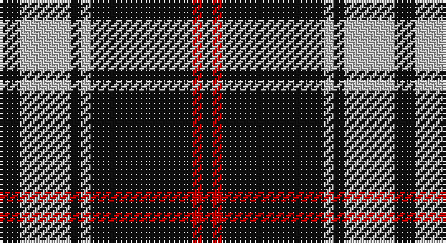

This page is one **sett** — a single exact thread-count. It belongs to the [tartan](/setts/k2lb5k1lb1k10r1k1/)
(the same proportion at any scale), whose colour order is pattern [KRKWKWK](/stripes/krkwkwk/).

Sourced from register-of-tartans.  It is a [7 stripe tartan](/stripes/stripes7/).

Original link https://www.tartanregister.gov.uk/tartanDetails.aspx?ref=2250

2 attestations — the source records this cloth was collapsed from (oldest owns this page)

<ul>
<li>01/01/2002 — Lundy Reform (register-of-tartans, <a href="https://www.tartanregister.gov.uk/tartanDetails.aspx?ref=2250">record</a>)</li>
<li>pre 2002 — Lundy Reform (Fashion) (tartans-authority, <a href="http://www.tartansauthority.com/tartan-ferret/display/5515/">record</a>)</li>
</ul>

## Register references

External register numbers recorded for this tartan.

- Scottish Register of Tartans: [2250](https://www.tartanregister.gov.uk/tartanDetails.aspx?ref=2250)
- Scottish Tartans Authority (ITI): 5515

## Thread count
K/8 N20 K4 N4 K40 R4 K/4

One full sett is **156 threads**.

## Palette

Palette: <strong>Tartan Register</strong>
<table><thead><tr><th>Colour</th><th>Threads</th><th>Shade</th><th>Base</th><th>OKLCh</th></tr></thead><tbody><tr><td>K/</td><td style="text-align:right;font-variant-numeric:tabular-nums">8</td><td><code style="background-color:#101010;">#101010</code> <small style="color:#888">#101010</small></td><td>K <code style="background-color:#000000;">#000000</code></td><td><small style="color:#888">oklch(17.3% 0.000 89.9)</small></td></tr><tr><td>N</td><td style="text-align:right;font-variant-numeric:tabular-nums">20</td><td><code style="background-color:#C0C0C0;">#C0C0C0</code> <small style="color:#888">#C0C0C0</small></td><td>W <code style="background-color:#F7F7F7;">#F7F7F7</code></td><td><small style="color:#888">oklch(80.8% 0.000 89.9)</small></td></tr><tr><td>K</td><td style="text-align:right;font-variant-numeric:tabular-nums">4</td><td><code style="background-color:#101010;">#101010</code> <small style="color:#888">#101010</small></td><td>K <code style="background-color:#000000;">#000000</code></td><td><small style="color:#888">oklch(17.3% 0.000 89.9)</small></td></tr><tr><td>N</td><td style="text-align:right;font-variant-numeric:tabular-nums">4</td><td><code style="background-color:#C0C0C0;">#C0C0C0</code> <small style="color:#888">#C0C0C0</small></td><td>W <code style="background-color:#F7F7F7;">#F7F7F7</code></td><td><small style="color:#888">oklch(80.8% 0.000 89.9)</small></td></tr><tr><td>K</td><td style="text-align:right;font-variant-numeric:tabular-nums">40</td><td><code style="background-color:#101010;">#101010</code> <small style="color:#888">#101010</small></td><td>K <code style="background-color:#000000;">#000000</code></td><td><small style="color:#888">oklch(17.3% 0.000 89.9)</small></td></tr><tr><td>R</td><td style="text-align:right;font-variant-numeric:tabular-nums">4</td><td><code style="background-color:#C80000;">#C80000</code> <small style="color:#888">#C80000</small></td><td>R <code style="background-color:#CC0000;">#CC0000</code></td><td><small style="color:#888">oklch(52.3% 0.215 29.2)</small></td></tr><tr><td>K/</td><td style="text-align:right;font-variant-numeric:tabular-nums">4</td><td><code style="background-color:#101010;">#101010</code> <small style="color:#888">#101010</small></td><td>K <code style="background-color:#000000;">#000000</code></td><td><small style="color:#888">oklch(17.3% 0.000 89.9)</small></td></tr></tbody></table>

# Sample pattern

## Nearest tartans

The nearest existing variants by ΔTartan distance, with this tartan at the top so the swatches line up against it.

ΔTartan

Tartan

Sett

—

<a href="/ttd/edit/#slug=k2lb5k1lb1k10r1k1~x4">Lundy Reform</a> <a class="nn-out" href="/variants/s7/k2lb5k1lb1k10r1k1~x4/" title="open its dictionary page">↗</a>

0.87

<a href="/ttd/edit/#slug=t50k4t12k23lo4k4~x2&amp;base=k2lb5k1lb1k10r1k1~x4">Sligo Irish County Tartan</a> <a class="nn-out" href="/variants/s6/t50k4t12k23lo4k4~x2/" title="open its dictionary page">↗</a>

0.98

<a href="/ttd/edit/#slug=k37w9k3dg9w3~x2&amp;base=k2lb5k1lb1k10r1k1~x4">Glen Coe Trade Tartan</a> <a class="nn-out" href="/variants/s5/k37w9k3dg9w3~x2/" title="open its dictionary page">↗</a>

0.99

<a href="/ttd/edit/#slug=w5k3ly6k5w3k30ly2~x2&amp;base=k2lb5k1lb1k10r1k1~x4">Northern Kentucky University</a> <a class="nn-out" href="/variants/s7/w5k3ly6k5w3k30ly2~x2/" title="open its dictionary page">↗</a>

1.00

<a href="/ttd/edit/#slug=k39o3k3o3k14o28r3~x2&amp;base=k2lb5k1lb1k10r1k1~x4">Moffat (1984)</a> <a class="nn-out" href="/variants/s7/k39o3k3o3k14o28r3~x2/" title="open its dictionary page">↗</a>

1.04

<a href="/ttd/edit/#slug=k37w9k3g9w3~x2&amp;base=k2lb5k1lb1k10r1k1~x4">Glen Coe #1 (Fashion)</a> <a class="nn-out" href="/variants/s5/k37w9k3g9w3~x2/" title="open its dictionary page">↗</a>

1.10

<a href="/ttd/edit/#slug=k1o2k7o11k18ly2k1~x2&amp;base=k2lb5k1lb1k10r1k1~x4">DDB Canada (Fashion)</a> <a class="nn-out" href="/variants/s7/k1o2k7o11k18ly2k1~x2/" title="open its dictionary page">↗</a>

1.13

<a href="/ttd/edit/#slug=k17ly2k2ly2k9lb11k2lb11k20ly2~x2&amp;base=k2lb5k1lb1k10r1k1~x4">Coppa Romana (Corporate)</a> <a class="nn-out" href="/variants/s10/k17ly2k2ly2k9lb11k2lb11k20ly2~x2/" title="open its dictionary page">↗</a>

1.20

<a href="/ttd/edit/#slug=k13o1k1o1k4o10ly1o1~x6&amp;base=k2lb5k1lb1k10r1k1~x4">West Point</a> <a class="nn-out" href="/variants/s8/k13o1k1o1k4o10ly1o1~x6/" title="open its dictionary page">↗</a>

1.22

<a href="/ttd/edit/#slug=k17ly2k2ly2k9w11k2w11k20ly2~x2&amp;base=k2lb5k1lb1k10r1k1~x4">Coppa Romana (Switzerland)</a> <a class="nn-out" href="/variants/s10/k17ly2k2ly2k9w11k2w11k20ly2~x2/" title="open its dictionary page">↗</a>

1.29

<a href="/ttd/edit/#slug=k14r2k4lb3k12r8k1~x2&amp;base=k2lb5k1lb1k10r1k1~x4">Punky Princess (Fashion)</a> <a class="nn-out" href="/variants/s7/k14r2k4lb3k12r8k1~x2/" title="open its dictionary page">↗</a>

## Neighbour map

Every grey dot is one of 14360 variants placed by the first two principal components of the ΔTartan feature space (44% of its variance). Red is this tartan; blue dots are its nearest — click one to open its page.

<svg viewBox="0 0 640 380" role="img" style="max-width:100%;height:auto;border:1px solid #e0e0e0;border-radius:4px;display:block" xmlns="http://www.w3.org/2000/svg"><image href="/nn/cloud.v1.png" width="640" height="380"/><a href="/variants/s6/t50k4t12k23lo4k4~x2/"><circle cx="369.2" cy="198.3" r="4" fill="#3465a4"><title>Sligo Irish County Tartan</title></circle></a><a href="/variants/s5/k37w9k3dg9w3~x2/"><circle cx="372.6" cy="208.0" r="4" fill="#3465a4"><title>Glen Coe Trade Tartan</title></circle></a><a href="/variants/s7/w5k3ly6k5w3k30ly2~x2/"><circle cx="404.3" cy="168.4" r="4" fill="#3465a4"><title>Northern Kentucky University</title></circle></a><a href="/variants/s7/k39o3k3o3k14o28r3~x2/"><circle cx="372.2" cy="198.8" r="4" fill="#3465a4"><title>Moffat (1984)</title></circle></a><a href="/variants/s5/k37w9k3g9w3~x2/"><circle cx="363.1" cy="202.8" r="4" fill="#3465a4"><title>Glen Coe #1 (Fashion)</title></circle></a><a href="/variants/s7/k1o2k7o11k18ly2k1~x2/"><circle cx="394.7" cy="188.2" r="4" fill="#3465a4"><title>DDB Canada (Fashion)</title></circle></a><a href="/variants/s10/k17ly2k2ly2k9lb11k2lb11k20ly2~x2/"><circle cx="326.0" cy="193.5" r="4" fill="#3465a4"><title>Coppa Romana (Corporate)</title></circle></a><a href="/variants/s8/k13o1k1o1k4o10ly1o1~x6/"><circle cx="350.9" cy="183.3" r="4" fill="#3465a4"><title>West Point</title></circle></a><a href="/variants/s10/k17ly2k2ly2k9w11k2w11k20ly2~x2/"><circle cx="322.2" cy="190.3" r="4" fill="#3465a4"><title>Coppa Romana (Switzerland)</title></circle></a><a href="/variants/s7/k14r2k4lb3k12r8k1~x2/"><circle cx="398.0" cy="211.4" r="4" fill="#3465a4"><title>Punky Princess (Fashion)</title></circle></a><circle cx="376.1" cy="196.2" r="5" fill="#c00000"/></svg>

ID: /variants/s7/k2lb5k1lb1k10r1k1~x4/
